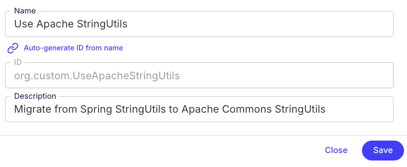
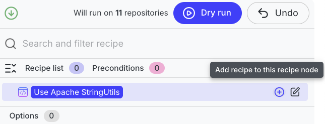
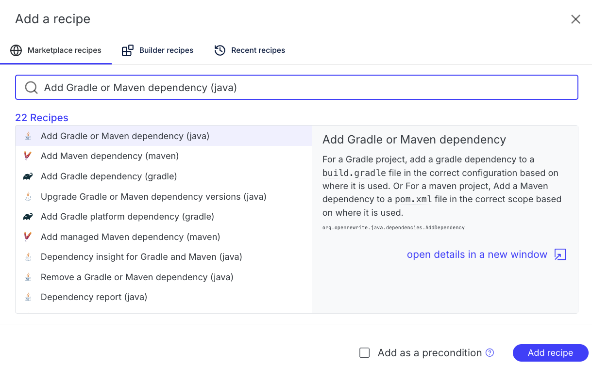
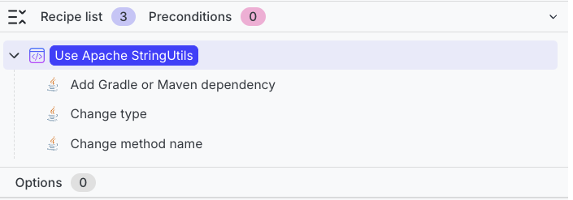
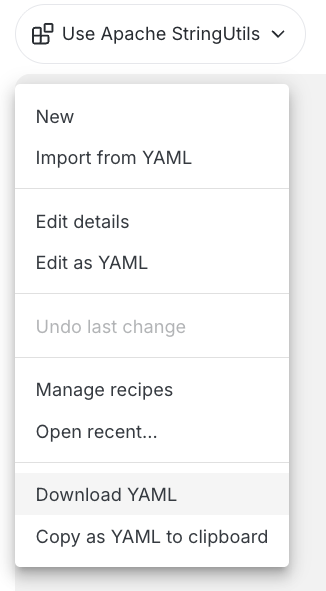

# Module 2: Recipe builder and declarative recipes

In this module, you'll learn how to use the Moderne recipe builder to compose custom recipes and understand the anatomy of declarative YAML recipes.

## Key concepts

### What is a declarative recipe?

A [declarative recipe](https://docs.openrewrite.org/concepts-and-explanations/recipes#declarative-recipes) is a recipe defined in YAML that combines and configures existing recipes. Declarative recipes are powerful because they allow you to:

* Combine multiple recipes into a single, reusable unit
* Configure recipe options for your specific needs
* Create organization-specific migration recipes without writing code

For example, the `org.openrewrite.staticanalysis.CommonStaticAnalysis` recipe you ran in Module 1 is a declarative recipe that composes many smaller static-analysis fix recipes. You can browse its YAML definition in the OpenRewrite recipe source: [CommonStaticAnalysis YAML](https://github.com/openrewrite/rewrite-static-analysis/blob/main/src/main/resources/META-INF/rewrite/static-analysis.yml).

### Anatomy of a YAML recipe

A declarative YAML recipe has the following basic structure:

```yaml
---
type: specs.openrewrite.org/v1beta/recipe
name: com.yourorg.MyRecipe
displayName: My Custom Recipe
description: A recipe that does something useful.
recipeList:
  - org.openrewrite.java.SomeRecipe:
      option1: value1
      option2: value2
  - org.openrewrite.java.AnotherRecipe
```

Key elements:

* **type**: Always `specs.openrewrite.org/v1beta/recipe`
* **name**: Fully-qualified unique name for your recipe
* **displayName**: Human-readable name for your recipe
* **description**: Description of the recipe explaining what it does (must end with a period)
* **recipeList**: The list of recipes to run, with their options

### Recipe builder

The Moderne recipe builder provides a visual interface for creating declarative recipes without writing YAML by hand. You can:

* Search and add recipes from the catalog
* Configure recipe options
* Preview and download the resulting YAML
* Run your custom recipe directly from the builder

## Exercise 2-1: Compose a YAML recipe with the recipe builder

In this exercise, you'll create a custom migration recipe that replaces Spring's `StringUtils` with Apache Commons `StringUtils`.

### Goals for this exercise

* Use the recipe builder to compose a new recipe
* Combine "Add dependency" with "Change type" recipes
* Download the YAML and run it locally with the CLI

### Steps

#### Step 1: Open the recipe builder

1. Navigate to [app.moderne.io](https://app.moderne.io/) and sign in if you haven't already.
2. Make sure the Default organization is still selected.
3. Click on `Builder` in the left navigation.
4. Now click the `+ New recipe` at the bottom of the "Manage my recipes" screen, or if the Builder is already showing a recipe, click the recipe name in the upper left and select `New`.

<figure>

<figcaption>_Recipe builder start screen_</figcaption>
</figure>

#### Step 2: Define your recipe

1. Enter the name `Use Apache StringUtils` for your recipe.
2. The system will auto-generate an ID like `com.yourorg.UseApacheStringUtils`. You can customize this if you want by toggling "Auto-generate ID from name" to "Manually enter ID".
3. Add a description: `Migrate from Spring StringUtils to Apache Commons StringUtils`.
4. Click `Save`.

<figure>

<figcaption>_Recipe builder New Recipe screen_</figcaption>
</figure>

#### Step 3: Add the dependency recipe

First, we need to add the Apache Commons Lang dependency:

1. Mouse over the root node in the recipe list on the right and click the `+` button. The root node should match the display name you entered in the previous step (`Use Apache StringUtils`).

<figure>

<figcaption>_Hovering over the root node shows options to add or edit._</figcaption>
</figure>

2. Search for `Add Gradle or Maven dependency (java)` and select it.
3. Click `Add recipe` in the lower right of the screen.

<figure>

<figcaption>_Select the recipe you want to add_</figcaption>
</figure>

4. Configure the options:
   * **Group ID:** `org.apache.commons`
   * **Artifact ID:** `commons-lang3`
   * **Version:** `3.x`
   * **Only if using:** `org.springframework.util.StringUtils`
   * You can leave all of the other options blank/default.
5. Scroll down and click `Update` to add the configured recipe.

#### Step 4: Add the change type recipe

Now we'll add a recipe to change the import from Spring to Apache:

1. Click the `+` button on the root node again.
2. Now search for `Change type (java)` and select it.
3. Click `Add recipe` in the lower right of the screen.
4. Configure the options:
   * **Old fully-qualified type name:** `org.springframework.util.StringUtils`
   * **New fully-qualified type name:** `org.apache.commons.lang3.StringUtils`
5. Click `Update` to add the recipe.

#### Step 5: Add method name changes (optional)

Spring's `StringUtils` has some methods with different names than Apache's version. Let's add a recipe to handle `trimWhitespace`:

1. Click the `+` button on the root node once again.
2. This time, search for `Change method name (java)`.
3. Click `Add recipe` in the lower right of the screen as before. 
4. Configure the options:
   * **Method pattern:** `org.apache.commons.lang3.StringUtils trimWhitespace(java.lang.String)`
   * **New method name:**: `strip`
5. Click `Update` to add this recipe.

:::info
Notice that the method pattern uses `org.apache.commons.lang3.StringUtils` even though we're changing from Spring's method. This is because recipes run in order, so by the time this recipe runs, the `ChangeType` recipe has already changed the import.
:::

#### Step 6: Preview and download the YAML

1. Your recipe should now have three sub-recipes in the list.

<figure>

<figcaption>_Recipe builder with configured recipes_</figcaption>
</figure>


:::info
If you wanted to run your recipe directly from the builder instead, you could click `Dry Run` at the top of the screen and it would run against the currently selected organization in the platform.
:::

2. Click on the recipe name in the upper left corner.
3. Select `Download YAML` to save the recipe file. Alternatively, you can use `Copy as YAML to clipboard` and paste into a new YAML document on your computer.

<figure>

<figcaption>_Download declarative recipe in YAML format_</figcaption>
</figure>

The downloaded YAML should look similar to this:

```yaml
---
type: specs.openrewrite.org/v1beta/recipe
name: com.yourorg.UseApacheStringUtils
displayName: Use Apache StringUtils
description: Migrate from Spring StringUtils to Apache Commons StringUtils.
recipeList:
  - org.openrewrite.java.dependencies.AddDependency:
      groupId: org.apache.commons
      artifactId: commons-lang3
      version: 3.x
      onlyIfUsing: org.springframework.util.StringUtils
  - org.openrewrite.java.ChangeType:
      oldFullyQualifiedTypeName: org.springframework.util.StringUtils
      newFullyQualifiedTypeName: org.apache.commons.lang3.StringUtils
  - org.openrewrite.java.ChangeMethodName:
      methodPattern: org.apache.commons.lang3.StringUtils trimWhitespace(java.lang.String)
      newMethodName: strip
```

#### Step 7: Install and run with the CLI

To run your custom recipe locally:

1. Copy the downloaded YAML file to the workspace folder you created in the last module.

```bash
# Use the path that you downloaded the yml file to
cp ~/Downloads/Use\ Apache\ StringUtils.yml ~/moderne-workshop/stringutils.yml
```

2. Install the recipe into the CLI:

```bash
mod config recipes yaml install ~/moderne-workshop/stringutils.yml
```

3. Run the recipe against your workspace:

```bash
# If you used a different fully-qualified name for your recipe, make sure to use that here instead
mod run ~/moderne-workshop --recipe com.yourorg.UseApacheStringUtils
```

:::tip
You also need the recipes referenced in your YAML to be available. If you've already synced recipes with `mod config recipes moderne sync`, they should be available.
:::

### Takeaways

* The recipe builder provides a visual way to create declarative recipes
* Recipes in the `recipeList` are executed in order, which matters for chained transformations
* You can download YAML recipes and run them locally with the CLI
* Custom recipes can be shared with your team by distributing the YAML file

## Learn more

* [Recipe builder documentation](../../user-documentation/moderne-platform/how-to-guides/new-recipe-builder.md)
* [Declarative YAML format reference](https://docs.openrewrite.org/reference/yaml-format-reference)
* [Customizing recipes](https://docs.openrewrite.org/running-recipes/customize-recipe)
