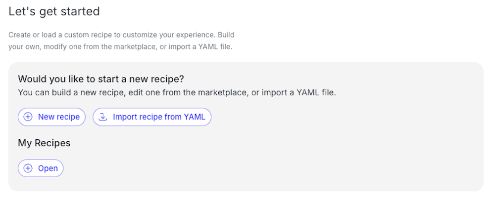
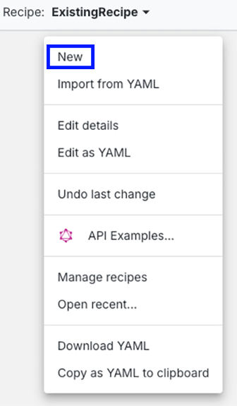
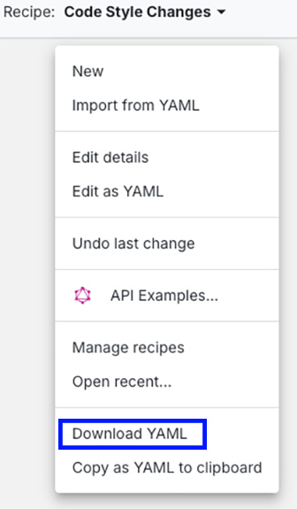

# Module 2: Recipe builder

Once you know what recipes are available and how to run them, you may want to customize what they do. You might want to change the order of steps, remove something you don’t need, or combine several small recipes into one. The recipe builder in Moderne lets you do this without writing any code.

## Exercise 2: Compose a recipe in Moderne with recipe builder

Let's use the recipe builder to create a custom recipe by combining existing steps. This is useful when you want to group together common cleanup tasks or create reusable transformations.

### Goals for this exercise

* Combine multiple existing recipes into a new, custom recipe.
* Run your composed recipe on a codebase.
* Modify or deconstruct a recipe to better fit your needs.

### Steps

1.	In the [Moderne Platform](https://app.moderne.io/builder), open Builder from the left-hand navigation.
2.	Click the `+ New recipe` button.
      <figure>
      
      <figcaption></figcaption>
      </figure>
      * **Note:** If you have created a recipe using Builder before, you may see a previous recipe instead of this `Let's get started` screen. In this case, click the name of the existing recipe in the upper left hand corner and click `New`.
      <figure>
      
      <figcaption></figcaption>
      </figure>
3. Enter the name `Code Style Changes`.
      * By default, the system will auto-generate an ID based on the name you enter. If you want to change this, click on `Auto-generate ID from name` just below the Name field and it will change to `Manually enter ID` and allow you to fill in your own.
      * You may optionally enter a Description to give more details about what this recipe does.
      * Click `Save` once you're done filling out the information.
4.	Now you have the root node for the recipe, but you still need to add the recipes that you want to be a part of your new recipe. Mouse over the root node in the recipe list on the right and click the + button to add a recipe.
      * Search for and add the following recipes by repeating this step for each individual recipe you want to add:
         - Format Java code (`org.openrewrite.java.format.AutoFormat`)
         - Simplify compound statement (`org.openrewrite.staticanalysis.SimplifyCompoundStatement`)
         - Simplify boolean return (`org.openrewrite.staticanalysis.SimplifyBooleanReturn`)
      * Your recipe will autosave after each addition or change.
      * _(Optional)_ Add or explore other recipes.
5.	Once you've added all the recipes you want, you can either run your recipe from the Moderne platform, or download it to run locally using the CLI.
      * To use the platform to run it against the group of repositories under the organizaton you have selected, just click `Dry Run` as you did in the previous module.
      * If you'd instead like to download the recipe to inspect the YAML or run it on a local repository, click the name of the recipe in the upper left hand corner and select `Download YAML`.
      <figure>
      
      <figcaption></figcaption>
      </figure>
6.	Return to the Builder to edit your recipe. Remove one of the steps and run it again to observe the difference.
      * Mouse over the `Format Java code` step in the recipe list and click the trash can icon to delete the step.
7.	Use the Search to find the `Migrate to Java 21` recipe. Instead of doing a dry run, click the `Add to Builder` button then `Add to new recipe`, give it a name, and click `Create new recipe`.
      * Now you can see all of the steps included in this recipe in the recipe list. This gives you a starting point that you can add or remove steps from to customize the recipe for your purposes.

### Takeaways

* You can create new recipes by combining existing ones using the recipe builder.
* Recipes can be edited to remove or reorder steps as needed.
* You can deconstruct composite recipes to better understand or reuse their parts.