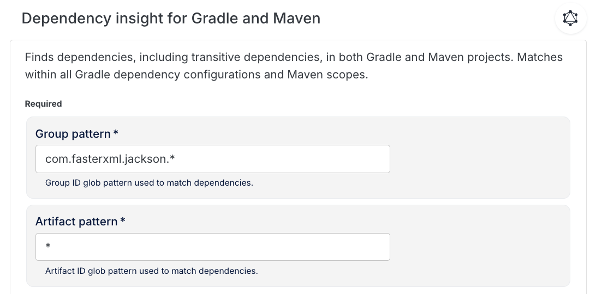
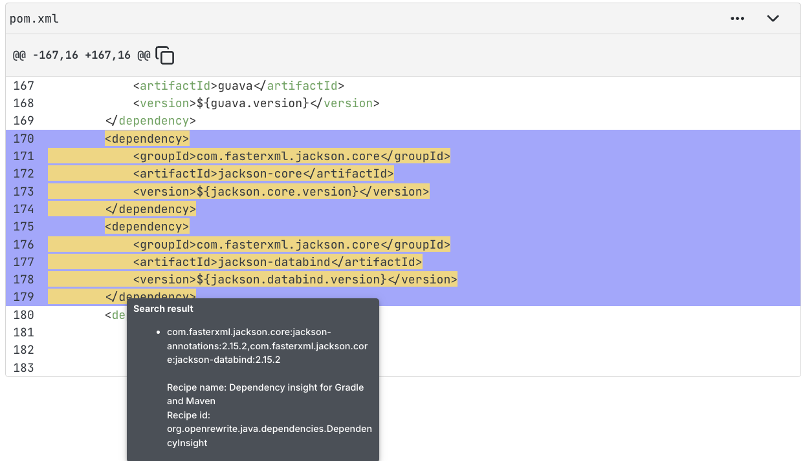
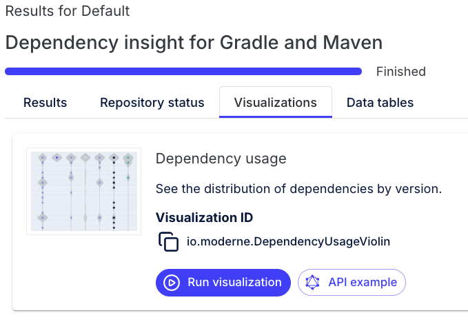
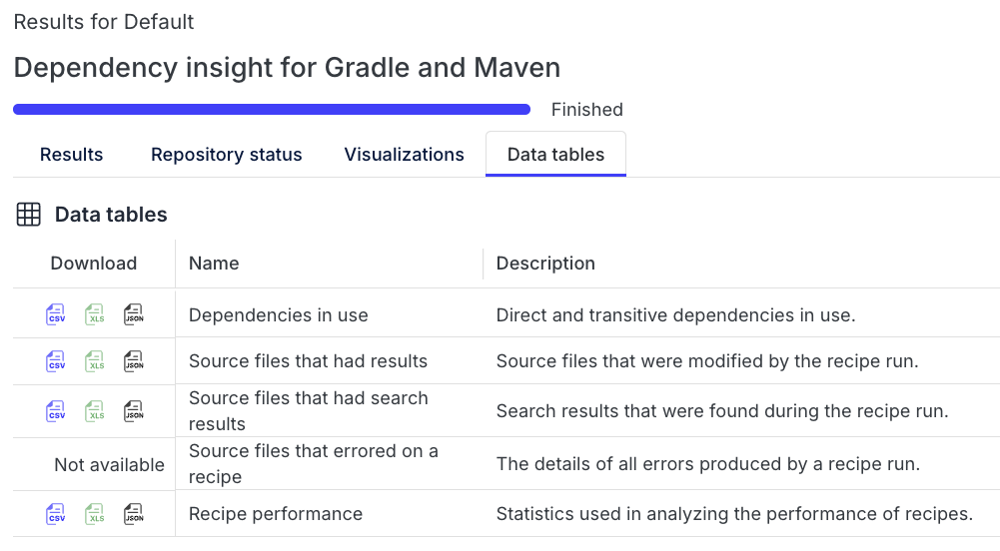

# Module 3: Data tables, search markers, and visualizations

In this module, you'll explore how recipes can do more than transform code. They can also search for patterns, extract insights, and produce rich data outputs. One of the most powerful ideas in OpenRewrite is that these “searches” are **semantic**. Recipes operate on the Lossless Semantic Tree (LST), so searches aren’t limited to text or regex matching. They can match based on types, method signatures, and relationships in the code, even if that information is buried levels deep.

## Key concepts

### Data tables

[Data tables](../../user-documentation/moderne-platform/getting-started/data-tables.md) are structured outputs that recipes can produce alongside (or instead of) code changes. This output comes in the form of tabular data (like a spreadsheet) that can capture insights discovered during recipe execution.

Data tables are particularly useful when you want to:

* Extract attributes or inferences from code
* Generate reports about your codebase
* Analyze patterns across many repositories
* Track metrics like security vulnerabilities or technical debt

Recipes may include **recipe-specific data tables** with a custom set of columns defined by the recipe, but most recipes also include a few data tables by default: 

1. **Recipe performance table**: Provides insights into the recipe's execution (available for all recipes)
2. **Source file table**: Information about changed files (available when changes are made)
3. **Errors table**: Includes details of all errors produced by a recipe run (if there are errors)
4. **Search results table**: Available for any recipe that returns search results (see next section)

### Search result markers

For search recipes, in addition to (or instead of) a data table, recipes may add **search result markers** to matching LST elements so that matches are highlighted directly in diffs. When present, search markers:

* Visually highlight matches in the code diff view
* Allow other recipes to act on the marked elements
* Provide context about why something was marked

In code views, search markers typically appear as `~~>` indicators near the matched code, and the corresponding matches are also listed in the `SearchResults` data table.

### Visualizations

[Visualizations](../../user-documentation/moderne-platform/getting-started/visualizations.md) provide graphical ways to explore the data produced by recipes. They can be:

* Complex diagrams showing relationships between nodes
* Interactive charts for exploring dependencies
* Visual representations for exploring large datasets

Not all recipes produce visualizations, but those that do offer powerful ways to understand your codebase at a glance.

## Exercise 3-1: Run search recipes and export data tables with the CLI

In this exercise, you'll run search-oriented recipes with the CLI and learn how to review results via search markers and exported data tables.

### Goals for this exercise

* Run search recipes with the CLI
* Review search results markers (when present)
* Export recipe data tables with `mod study`

### Steps

#### Step 1: Sync sources and build LSTs

1. Navigate back to your workspace directory:

```bash
cd ~/moderne-workshop
```

2. In the first module, you synced the source code from the `Default` organization and applied some changes to it from a recipe run. Because of that, your LSTs no longer accurately reflect the current code state. To make sure you have the most up-to-date LSTs, run the following command to build them locally:

```bash
mod build .
```

:::info
This may take several minutes to complete. You may want to move on to the next exercise while you wait for this command to complete and come back to this step when it's done.
:::

If you later see a `The latest LST is not up to date` message when running recipes, rebuild your LSTs after updating or changing source code. (Also, if you see that `mod build .` only partially succeeded, that just means that some of the repos failed. You can still move on and complete the exercise since recipes will work fine on the repos that _did_ build successfully.)

:::tip
By default, `mod build` may try to download LSTs from Moderne if they’re available. To force a local build, use `mod build . --no-download`.
:::

#### Step 2: Run a search recipe that produces a report

1. Run a search recipe to find specific method calls:

```bash
mod run . --recipe FindMethods -PmethodPattern="java.util.List add(..)"
```

This is a search-only recipe and should not modify source code.

2. Examine the output and open the fix results diff for any repositories that produced results.
   * If search markers are present, matches will be highlighted in the diff output (for example `~~>`).
   * If the recipe produced data tables, you’ll see suggested `mod study` commands you can run next.

#### Step 3: Export data tables with `mod study`

After running a recipe, the CLI will suggest commands to view data tables:

```bash
⏺ What to do next
    > Click on one of the patch links above to view the changes on a particular repository
    > Run mod study to examine the following data tables produced by this recipe:
          > mod study . --last-recipe-run --data-table MethodCalls
          > mod study . --last-recipe-run --data-table RecipeRunStats
          > mod study . --last-recipe-run --data-table SearchResults
          > mod study . --last-recipe-run --data-table SourcesFileResults
```

1. Export the `MethodCalls` data table:

```bash
mod study . --last-recipe-run --data-table MethodCalls
```

This creates both a CSV and Excel file that lists the method calls found by the recipe. Open and explore either one (or both) for one of the repositories by using ctrl-click (Windows), command-click (Mac), or copying the path. You can use whatever spreadsheet application you prefer (Excel, Google Sheets, etc.).

2. Export `SearchResults` data table:

```bash
mod study . --last-recipe-run --data-table SearchResults
```

This will have similar output to the `MethodCalls` table, but this is a table that is provided whenever search markers are added to the code, regardless of whether the results are also included in a different table (like `MethodCalls`). Open the generated CSV file(s) and compare the search marker highlights in the diff view from the previous step with rows in the exported `SearchResults` file.

### Takeaways

* Search recipes can find code patterns semantically (type-aware), not via text matching
* When present, search markers highlight matches directly in diffs
* Data tables can be exported and analyzed outside the CLI with `mod study`

## Exercise 3-2: Explore data tables and visualizations in the Platform

In this exercise, you'll run recipes in the Moderne Platform and use the `Data Tables` and `Visualizations` views to explore results.

### Goals for this exercise

* Run recipes using the Platform UI
* Download data tables from the Platform
* Explore visualizations when available

### Steps

#### Step 1: Run a recipe and open its results

1. Navigate to [app.moderne.io](https://app.moderne.io/) and sign in if you're not already.
2. Make sure the Default organization is still selected.
3. From the Marketplace, search for and select `Dependency insight for Gradle and Maven`.
4. Configure the options using a broad pattern to get results across many repositories:
   * **Group pattern:** `com.fasterxml.jackson.*`
   * **Artifact pattern:** `*`
   * You can leave all of the other options blank/default.

<figure>

<figcaption>_Configuring the Dependency Insight recipe_</figcaption>
</figure>

5. Click `Dry Run` to kick off the recipe.
6. When it's finished, notice the results don't show a diff with the usual red/green styling, but rather highlight the search results in yellow. The code still includes the markers as you saw in the previous exercise (e.g. `/*~~>*/`), but the UI renders them as highlighted code to make it easier to see and understand. If you mouseover a highlighted portion, you will see some additional detail.

<figure>

<figcaption>_Highlighted search results in the platform_</figcaption>
</figure>

#### Step 2: Explore visualizations and download data tables in the platform

1. From the recipe results page, open the `Visualizations` tab and run the `Dependency usage` visualization.

<figure>

<figcaption>_Click `Run Visualization` to see the violin chart._</figcaption>
</figure>

2. Once it renders, you will see a **violin chart** showing the version distribution for the specified libraries across repositories.
3. Now return to the results screen and open the `Data Tables` tab. Download the `Dependencies in use` table as a CSV or Excel file and open it in your preferred application for deeper analysis. This table is what's driving the underlying data for the visualization you just saw.

<figure>

<figcaption>_Click on CSV or XLS to download the data table in the desired format._</figcaption>
</figure>

#### Step 3: Run a recipe that produces a vulnerability report

1. To see one more kind of visualization, return to the Marketplace and search for the `Find and fix vulnerable dependencies` recipe.
2. Run the recipe and click on the `Visualizations` tab on the results page once it's completed.
3. Run the `Dependency vulnerability profile` visualization. You don't need to provide any options.
4. Once it renders, you will see a stacked bar chart representing dependency vulnerabilities categorized by severity level and fix type. Mouseover any of the bars for more detailed numbers.
5. If you want to explore the corresponding data table as before, download the `Vulnerability report` on the `Data Tables` tab to get the CSV.

### Takeaways

* The Platform makes it easy to review results, download tables, and explore visualizations
* Data tables are the source of “tabular” outputs; visualizations are graphical views of those outputs

## Learn more

* [Getting started with data tables](../../user-documentation/moderne-platform/getting-started/data-tables.md)
* [Getting started with visualizations](../../user-documentation/moderne-platform/getting-started/visualizations.md)
* [Working with data tables in the CLI](../../user-documentation/moderne-cli/getting-started/cli-intro.md#working-with-data-tables)
