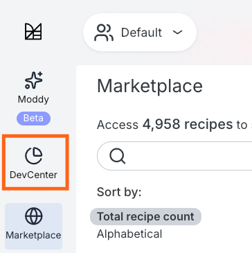

# Module 4: DevCenter

In this module, you'll learn about DevCenter — the mission-control capability for tracking migrations, upgrades, and security issues across an organization's repositories.

## Key concepts

### What is a DevCenter dashboard?

DevCenter is a Moderne capability for generating mission-control dashboards. In the Platform, a DevCenter dashboard may be configured for each organization. In the CLI, you can generate a DevCenter dashboard locally for an organization or whatever set of repositories you have checked out. A DevCenter dashboard provides a high-level view of repository state and allows you to:

* Track progress on upgrades and migrations
* Monitor security vulnerabilities
* See organizational metrics at a glance
* Quickly run recipes to address issues

DevCenter dashboards are also **recipe-based**. The cards you see (upgrades, security fixes, etc.) are backed by recipes, and organizations can configure a DevCenter dashboard by selecting an existing DevCenter recipe to run for that org or [customizing their own](../../administrator-documentation/moderne-platform/how-to-guides/creating-a-devcenter-recipe.md).

### Components of a DevCenter dashboard

A DevCenter dashboard consists of several key sections:

#### Organizational ownership

Shows high-level metrics about your organization:

* Total number of repositories
* Number of active developers (contributors in the last 90 days)
* Lines of code ingested into Moderne

#### Change campaigns

Cards that track specific upgrades or migrations. Each card shows:

* Current adoption status (e.g., "45% of repos on Java 21+")
* Parliament charts that give a visual representation of the status
* A button to run the relevant upgrade or migration recipe

Examples of change campaigns:

* Java version upgrades
* Spring Boot migrations
* Framework version updates

#### Security

Cards that highlight security issues show vulnerability counts by severity and include a button to run recipes that can fix them.

#### Data tables

Each DevCenter dashboard component also offers the ability to download that section's corresponding data table.

### DevCenter in the CLI

The Moderne CLI also supports DevCenter functionality, allowing you to:

* Generate DevCenter dashboards locally
* Run DevCenter recipes against your repositories
* Export results for further analysis

## Exercise 4-1: Explore a DevCenter dashboard

In this exercise, you'll explore a DevCenter dashboard in the Moderne Platform.

### Goals for this exercise

* Navigate a DevCenter dashboard
* Understand DevCenter components

### Steps

#### Step 1: Explore a DevCenter dashboard in the Platform

1. Navigate to [app.moderne.io](https://app.moderne.io/) and sign in if you need to.
2. You can stick with the `Default` organization, or pick another one from the dropdown. (Not all organizations have a DevCenter dashboard configured.)
3. Click on `DevCenter` in the left navigation.

<figure>
  
  <figcaption>_DevCenter navigation link_</figcaption>
</figure>

4. If the organization has a DevCenter dashboard configured, you'll see organizational metrics, change campaign cards, and security information.

<figure>
  
  <figcaption>_DevCenter example for Default organization_</figcaption>
</figure>

#### Step 2: Understand the organizational overview

Look at the top section of the DevCenter:

1. **Repository count**: How many repositories are in this organization
2. **Developer count**: Number of active contributors in the last 90 days
3. **Lines of code**: Total lines of code ingested into Moderne from the repositories in this organization

This gives you a quick snapshot of your organization's codebase.

#### Step 3: Explore change campaigns

Look at the change campaign cards in the middle:

1. Each card represents a specific upgrade or migration goal (e.g., "Move to Java 25")
2. The card shows the current status:
   * Percentage of repositories that meet the target
   * Number of repositories that need updates, by category (e.g. version)
   * Parliament chart showing a visual representation of those numbers, with colors ranging from green to yellow to red based on how far each repository is from meeting the target
3. Mouseover the chart or table to highlight specific categories.
4. Click the `Dry Run` button on a card to run the associated recipe

:::note
If the recipe was recently run, clicking `Dry Run` will take you to the latest results instead of re-running.
:::

#### Step 4: Explore security cards

Look at the security section at the bottom:

1. The security card shows a list of vulnerabilities identified in the DevCenter recipe along with a radar chart indicating how many occurrences of each vulnerability appear in the codebase.
2. Click on a vulnerability in the list or on a section of the radar chart to get more information about the vulnerability and the number of occurrences.
3. Click `Dry Run` to run the security recipe identified in the DevCenter recipe to fix the vulnerabilities.
4. Review the results to see what vulnerabilities were found/fixed.

### Takeaways

* The DevCenter dashboard provides a mission-control view of your organization's code health
* Change campaign cards track progress on upgrades and migrations
* Security cards highlight vulnerabilities that need attention

## Exercise 4-2: Generate a DevCenter dashboard with the CLI

In this exercise, you'll customize a DevCenter recipe and generate a DevCenter dashboard locally.

### Goals for this exercise

* Customize a DevCenter recipe
* Understand what DevCenter recipes do
* Generate a local DevCenter dashboard with the CLI

### Steps

#### Step 1: Install DevCenter starter recipes

DevCenter dashboards are generated from recipe-produced data tables. To get the starter DevCenter recipe locally, install the `rewrite-devcenter` recipe pack:

```bash
mod config recipes jar install io.moderne.recipe:rewrite-devcenter
```

#### Step 2: Create and install a custom DevCenter recipe (YAML)

You can run the DevCenter starter recipe as-is using `mod run . --recipe io.moderne.devcenter.DevCenterStarter`, but you should expect a dashboard similar to what you saw in the Platform. For the CLI workflow, let's customize it to:

  * Track a different library that’s more likely to show up across the Default organization.
  * Remove some of the vulnerabilities from the security list that we might not want to track, and add one that we do.

1. Create a file called `mydevcenter.yml` with the following contents:

<details>
<summary>`mydevcenter.yml` example</summary>

```yaml
type: specs.openrewrite.org/v1beta/recipe
name: com.yourorg.DevCenterWorkshop
displayName: DevCenter
description: >-
  A workshop DevCenter configuration.
  Tracks a Jackson 2.x -> 3.x migration, plus Java/JUnit upgrades and security findings.
recipeList:
  - io.moderne.devcenter.LibraryUpgrade:
      cardName: Migrate to Jackson 3.x
      groupIdPattern: com.fasterxml.jackson.core
      artifactIdPattern: '*'
      version: 3.x
      upgradeRecipe: org.openrewrite.java.jackson.UpgradeJackson_2_3
  - io.moderne.devcenter.JavaVersionUpgrade:
      majorVersion: 25
      upgradeRecipe: org.openrewrite.java.migrate.UpgradeToJava25
  - io.moderne.devcenter.JUnitJupiterUpgrade:
      upgradeRecipe: org.openrewrite.java.testing.junit6.JUnit5to6Migration
  - com.yourorg.SecurityWorkshop
---
type: specs.openrewrite.org/v1beta/recipe
name: com.yourorg.SecurityWorkshop
displayName: Security (Workshop)
description: >-
  A custom security card for this workshop.
  This intentionally swaps out some of the default checks for a smaller, more focused set.
recipeList:
  - org.openrewrite.java.security.OwaspA01
  - org.openrewrite.java.security.OwaspA03
  - org.openrewrite.java.security.OwaspA06
  - org.openrewrite.java.security.ZipSlip
  - org.openrewrite.java.security.SecureTempFileCreation
  - io.moderne.devcenter.ReportAsSecurityIssues:
      fixRecipe: org.openrewrite.java.security.OwaspTopTen
```

</details>

2. Install the recipe YAML into the CLI:

```bash
mod config recipes yaml install mydevcenter.yml
```

#### Step 3: Run the DevCenter recipe

1. Navigate to your workspace and (if needed) rebuild your LSTs for your local source checkouts:

```bash
cd ~/moderne-workshop
mod build .
```

2. Run your custom DevCenter recipe to generate the required data tables:

```bash
mod run . --recipe com.yourorg.DevCenterWorkshop
```

#### Step 4: Generate the DevCenter dashboard HTML

1. Generate the DevCenter dashboard from the last recipe run:

```bash
mod devcenter . --last-recipe-run
```

The CLI will output a path to an HTML file. Open it in your browser to view the DevCenter dashboard.

<details>

<summary>Reference output</summary>

```bash
   ▛▀▀▚▖  ▗▄▟▜
   ▌   ▜▄▟▀  ▐
   ▛▀▀█▀▛▀▀▀▀▜
   ▌▟▀  ▛▀▀▀▀▜
   ▀▀▀▀▀▀▀▀▀▀▀
Moderne CLI 3.54.5

⏺ Reading organization

Found 1 organization containing 11 repositories (1s)
Found recipe run 20260105162438-sMM9s


⏺ Building CSV for upgrades and migrations

▶ Default
    ✓ Data table produced
Done (1s)

⏺ Building CSV for security issues

▶ Default
    ✓ Data table produced
Done (1s)

⏺ Generate DevCenter dashboard

Full DevCenter log

▶ Default
    ✓ Generated dashboard
Done (4s)

DevCenter generated

MOD SUCCEEDED in 5s
```
</details>

Notice there are no `Dry Run` buttons on the local DevCenter dashboard. However, you can still run upgrade recipes individually through the CLI. For example:

```bash
mod run . --recipe UpgradeToJava25
```

### Takeaways

* The CLI can generate DevCenter dashboards locally
* DevCenter is powered by recipes that can search, report, and fix issues

## Take home lab

Now that you've completed this workshop, try using what you've learned. If you got a temporary license from a live training session, you can try it all on your own code:

1. Install the Moderne CLI if you haven't already
2. Connect it to Moderne Platform
3. Run recipes against your own repositories
4. Explore the results and data tables
5. Share your experience in the [OpenRewrite Slack](https://join.slack.com/t/rewriteoss/shared_invite/zt-nj42n3ea-b~62rIHzb3Vo0E1APKCXEA)

## Learn more

* [Getting started with DevCenter](../../user-documentation/moderne-platform/getting-started/dev-center.md)
* [DevCenter configuration guide](../../administrator-documentation/moderne-platform/how-to-guides/creating-a-devcenter-recipe.md)
* [Moderne CLI reference](../../user-documentation/moderne-cli/cli-reference.md)


<!-- commented out until next module is ready
## Next steps

If you're interested in learning how to write your own recipes, check out the [Fundamentals of OpenRewrite recipe development](../fundamentals/workshop-overview.md) workshop.
-->
