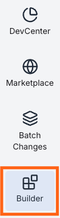
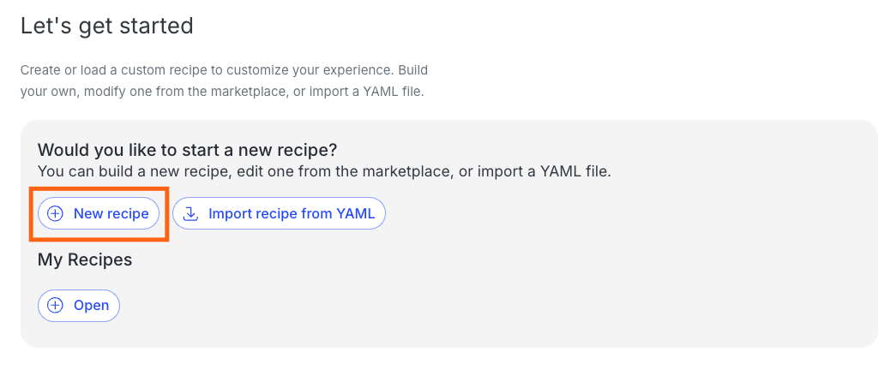
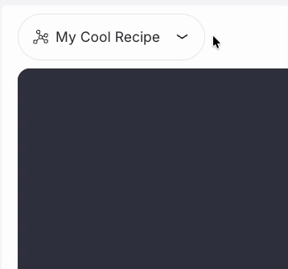
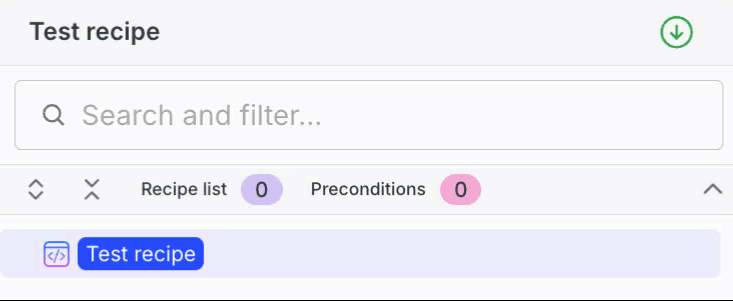

# Module 1: Migration assessment in the Moderne Platform

In this module, you will run a full migration in the Moderne Platform, then use code insight recipes to learn where the biggest risks and blockers are likely to appear. The goal is to start with the end in mind: run the Spring Boot 4 recipe first so you can see the failure modes before investing time in fixes.

## Exercise 1-1: Run the full migration recipe in the Moderne Platform

### Goals for this exercise

* Run the Spring Boot 4 migration recipe across the org
* Inspect failures and identify migration blockers

### Steps

#### Step 1: Open the Moderne Platform

1. Navigate to [app.moderne.io](https://app.moderne.io/) and sign in.
2. Select `Moderne - Training` from the organization dropdown.

<figure>
  
  <figcaption>_'Moderne - Training' org_</figcaption>
</figure>

#### Step 2: Create a migration recipe

1. Click `Builder` in the left navigation.

<figure>
  
  <figcaption>_Builder link_</figcaption>
</figure>

2. Click `+ New recipe` at the bottom of the "Manage my recipes" screen. If the builder already has a recipe open, click the recipe name in the upper left and select `New`.

<figure>
  
  <figcaption>_Welcome modal_</figcaption>
</figure>

<figure>
  
  <figcaption>_New recipe menu_</figcaption>
</figure>

3. Enter the name `Try Spring Boot 4 Upgrade` and save.

<figure>
  
  <figcaption>_New recipe modal_</figcaption>
</figure>

4. Mouse over the root node in the recipe list and click the `+` button.

<figure>
  
  <figcaption>_Add recipes from the recipe list_</figcaption>
</figure>

5. Mouse over the root node in the recipe list and click the `+` button. and now search for `Migrate to Spring Boot 4.0` (`io.moderne.java.spring.boot4.UpgradeSpringBoot_4_0`) and select it.
6. Click `Add recipe`.

<figure>
  
  <figcaption>_Add 'Migrate to Spring Boot 4.0' recipe_</figcaption>
</figure>

7. Click the `+` next to the root node in the recipe list again and search for `Verify compilation` (`io.moderne.compiled.verification.VerifyCompilation`) this time. Click `Add recipe` to add it.

<figure>
  
  <figcaption>_Custom recipe to run Spring Boot migration and then verify compilation_</figcaption>
</figure>

#### Step 3: Run and review the migration

1. Run the recipe against the org by clicking the `Dry Run` button above the recipe list.
2. Open the change tree and click into a few files to review. Notice in particular the failures highlighted in the diffs by yellow squiggly lines.
3. Take a few minutes to review the failures and note missing or incompatible classes and dependencies. 

Common blockers include:

   * Incompatible build tool versions, plugins, or inconsistent configuration
   * Third-party dependencies that are incompatible, no longer exist, or have moved
   * Generated code that is tied to older Java or Spring APIs
   * Dependencies between repositories in this set that need to be built in order

You will likely see a few recurring failure patterns:

* Missing "Q" classes from QueryDSL code generation (for example, `QOrder`, `QInventory`)
* Test compile errors caused by changes in the Spring Boot test API or older JUnit versions
* Missing managed dependency versions caused by a Spring Boot starter being moved, replaced, or some particular functionality being deprecated or removed (for example, `spring-cloud-starter-zipkin` no longer managed by Spring Boot 4)

These are common migration speed bumps. The rest of the workshop is structured to handle them methodically.

<figure>
  
  <figcaption>_One example of an compilation error is caused by the QueryDSL code generator._</figcaption>
</figure>

:::tip
Doing a migration dry run followed by the `Verify compilation` recipe can be a useful assessment step to give you a fast map of likely obstacles and risk areas before you invest in the actual upgrade. 
:::

## Exercise 1-2: Run code insight recipes

### Goals for this exercise

* Identify Java versions and build tooling in use
* Discover current Spring Boot versions across the portfolio
* Find `javax.*` usage hotspots and code generators

### Steps

#### Step 1: Plan a Java migration

1. From the Marketplace, search for and select `Plan a Java version migration` (`org.openrewrite.java.migrate.search.PlanJavaMigration`).
2. Make sure `Moderne - Training` is still selected and click `Dry run` to run the recipe against the org.
3. After the recipe run, click on the `Data tables` tab. Then download and open the `Java version migration plan` data table as a CSV or Excel file.

<figure>
  
  <figcaption>_Download the 'Java version migration plan' data table_</figcaption>
</figure>

:::note
You won't see any diff results when running this recipe. It only generates data tables that you can access from the `Data tables` tab.
:::

This helps you confirm the baseline Java versions and build tooling in use so you know what you are starting from. For this example, you'll notice we're using Java 8 and Maven across the board. 

#### Step 2: Inspect Spring Boot versions

1. From the Marketplace, search for and select `Dependency insight for Gradle and Maven` (`org.openrewrite.java.dependencies.DependencyInsight`).
2. Configure the options:
   - **Group pattern:** `org.springframework.boot`
   - **Artifact pattern:** `spring-boot`
   - **Scope:** `runtime`
3. Click `Dry run` and wait for the recipe run to complete. Now open the `Dependencies in use` data table and download the CSV.
4. On the `Visualizations` tab, run the `Dependency usage visualization.

<figure>
  
  <figcaption>_'Dependency usage' visualization_</figcaption>
</figure>

The data table and visualization give you a distribution view of current Spring Boot versions, which is useful to help you cluster repos into upgrade groups.

#### Step 3: Find `javax.*` usage

While you can run libraries compiled with an older version of Java in newer versions of JVM, the Java runtime has deprecated specific APIs and ultimately removed or refactored those as it has evolved. Perhaps the most prominent example of this is the many `javax.*` internal APIs (including the Java EE APIs) that were ultimately moved out of the JVM and into the Jakarta namespace. When you see high `javax.*` usage, expect more work to move to `jakarta.*` during the Spring Boot 4 upgrade. 

1. From the Marketplace, search for and select `Find types` (`org.openrewrite.java.search.FindTypes`).
2. Configure the option:
   - **Fully qualified type name:** `javax..*`
3. Click `Dry run`.
4. Open the `Type uses` data table and note the top usage hotspots.

You can see that some of these projects use the validation and persistence APIs. This is something to keep an eye on to make sure that migration recipes upgrade to the new packages.

#### Step 4: Locate code generators (QueryDSL)

Code generators like QueryDSL are often the hardest blockers because they can emit code that is tightly coupled to older Java and Spring APIs.

1. From the Marketplace, search for and select `Find Maven plugins` (`org.openrewrite.maven.search.FindPlugin`).
2. Configure the options:
   - **Group ID:** `com.mysema.maven`
   - **Artifact ID:** `apt-maven-plugin`
3. Click `Dry run`.
4. Open the `SourcesFileResults` data table and note which repos use QueryDSL.

You should see four services that are using QueryDSL as part of their persistence layer.

:::tip
Other useful code insight recipes you may want to explore later: [`FindInternalJavaxApis`](https://docs.openrewrite.org/recipes/java/migrate/search/findinternaljavaxapis), [`FindDeprecatedUses`](https://docs.openrewrite.org/recipes/java/search/finddeprecateduses), and [`RelocatedDependencyCheck`](https://docs.openrewrite.org/recipes/java/dependencies/relocateddependencycheck).
:::

## Exercise 1-3: Capture a DevCenter baseline

### Goals for this exercise

* Record the starting point for Java and Spring Boot versions

### Steps

1. Ensure `Moderne - Training` is still selected in the org dropdown.
2. Click `DevCenter` in the left nav.
3. Note the current status of Java and Spring Boot versions.
4. Keep this page handy so you can compare after upgrading each group of repositories.

<figure>
  
  <figcaption>_DevCenter baseline_</figcaption>
</figure>

### Takeaways

* A full migration dry run surfaces real blockers before you start making changes
* Code insight recipes help you quantify Java, Spring Boot, and `javax.*` usage hotspots
* DevCenter gives you a baseline view to compare against after each wave
