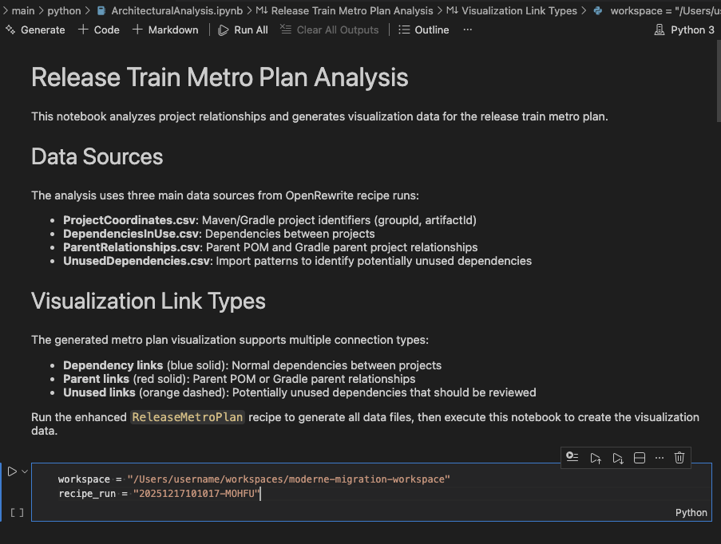

import Tabs from '@theme/Tabs';
import TabItem from '@theme/TabItem';

# Module 2: Wave planning with the Moderne CLI

In this module, you'll move from SaaS-only assessment to CLI-driven analysis so you can map dependencies and pick a safe upgrade order. You will group repositories into “waves” based on those dependencies and upgrade them in order.

For this workshop, each repository is treated as independently released. That constraint mirrors how large organizations manage shared libraries and it forces you to think about sequencing instead of upgrading everything at once. Dependencies matter because downstream repos can only move once their upstream libraries are upgraded and released. 

## Exercise 2-1: Set up your workspace and build LSTs

### Goals for this exercise

* Create a workspace and sync repositories
* Build LSTs for local analysis
* Install the set of recipes required for this workshop

### Steps

#### Step 1: Set environment variables

Choose paths for your workshop and workspace and set the following environment variables so you can better follow along with the commands. If you want to copy commands directly, you can use these example values, but make sure to create the directories first:

```bash
export WORKSHOP=~/projects/moderne-migration-practice
export WORKSPACE=~/workspaces/migration_workshop
export PROJECTS=~/projects
```

:::tip
You might want to keep two shells open: one in `$WORKSHOP` for scripts and one in `$WORKSPACE` for `mod` commands.
:::

#### Step 2: Sync repos and prepare 

1. First, clone the Moderne Migration Practice workshop which contains some helper scripts and metadata about the example projects.

```bash
mkdir -p $PROJECTS
cd $PROJECTS
git clone https://github.com/modernetraining/moderne-migration-practice
```

2. Now you're ready to use the Moderne CLI to clone all of the example projects to your local machine. The workshop repository includes a `repos.csv` file that lists the example repositories. For more information on this file, [check out our repos.csv documentation](../../user-documentation/moderne-cli/references/repos-csv). Feel free to inspect this file to better understand what it contains. The following command will clone all of the listed repositories into your `$WORKSPACE` directory:

```bash
mkdir -p $WORKSPACE
cd $WORKSPACE
mod git sync csv $WORKSPACE $WORKSHOP/repos.csv --with-sources
```

<!-- TODO: Determine if we want to change this command to be  `mod git sync moderne $WORKSPACE --organization "Moderne - Training" --with-sources` instead in order to download the LSTs from the platform. Alternatively, I think we could add the publishUri to our repos.csv file? -->

3. Take a look at the contents of your `$WORKSPACE` folder now. (You can walk through and inspect the directories with `cd` and `ls`, or if you have `tree`, you can see the full structure with `tree -d $WORKSPACE -L 3`.) You should see that you have a directory for the GitHub org (or user) with the repositories inside.

<!-- TODO: If we don't download LSTs from the platform, here's where we need to add a `mod build` step. -->

#### Step 3: Install the recipe set

Use the following command to install the necessary OpenRewrite recipe modules for this workshop:

```bash
mod config recipes jar install \
  io.moderne.recipe:rewrite-spring:0.19.0 \
  org.openrewrite.recipe:rewrite-migrate-java:3.24.0 \
  org.openrewrite.recipe:rewrite-java-dependencies:1.48.0 \
  org.openrewrite:rewrite-java:8.69.0 \
  org.openrewrite:rewrite-maven:8.69.0 \
  io.moderne.recipe:rewrite-devcenter:1.13.1 \
  org.openrewrite.recipe:rewrite-spring:6.21.0 \
  org.openrewrite.recipe:rewrite-testing-frameworks:3.24.0
```

:::info
Installing recipes locally can sometimes take a few minutes, so this list of recipe packages is limited to only the ones required for this workshop. You can find a [list of recipes by module in the OpenRewrite documentation](https://docs.openrewrite.org/reference/all-recipes).
:::

## Exercise 2-2: Generate a dependency-based wave plan

Now that your local environment is ready, it's time to use the rich dependency data from the LSTs to determine a safe upgrade order. The goal is to identify repos with no internal dependencies ("Wave 0"), release them, then move downstream in order.

### Goals for this exercise

* Install the Release-Train-Metro-Plan recipes
* Run a dependency analysis recipe
* Export data tables for wave planning

### Steps

#### Step 1: Install the Release-Train-Metro-Plan recipes

[Merlin’s Release-Train-Metro-Plan project](https://github.com/MBoegers/Release-Train-Metro-Plan) analyzes direct and transitive dependencies to generate a wave map (using a [Jupyter notebook](https://jupyter.org/)). You will use this method to produce a concrete upgrade plan you can follow.

Use the following commands to clone the project (somewhere outside of `$WORKSPACE` such as `$PROJECTS`), build it, and install the recipe artifact locally:

<!-- TODO: Make sure we merge Matt's updates to the Release-Train-Metro-Plan repo that add `pyproject.toml`, etc. -->

```bash
cd $PROJECTS
git clone https://github.com/MBoegers/Release-Train-Metro-Plan.git
cd Release-Train-Metro-Plan
./gradlew clean publishToMavenLocal
mod config recipes jar install dev.mboegie.rewrite:release-train-metro-plan:0.1.0-SNAPSHOT
```

#### Step 2: Extract data from dependency analysis

1. Run the newly-installed recipe on the collection of repositories in your workspace:

<!-- TODO: If the LSTs didn't download from the platform, this is the first place we'd need to make sure we did a `mod build` manually -->

```bash
mod run $WORKSPACE --recipe dev.mboegie.rewrite.releasemetro.ReleaseMetroPlan --parallel
```

2. Retrieve the recipe run ID from this run. You'll need it to generate the report in a following step.

```bash
mod run-history $WORKSPACE
```

<details>
<summary>Reference output</summary>

```text
⏺ Reading organization

Found 1 organization containing 11 repositories (1s)

⏺ Retrieving recipe run history

▶ modernetraining/example-ecom-common@main
    ✓ Recipe runs processed.
▶ modernetraining/example-ecom-customer-service@main
    ✓ Recipe runs processed.
▶ modernetraining/example-ecom-fraud-detection-service@main
    ✓ Recipe runs processed.
▶ modernetraining/example-ecom-inventory-service@main
    ✓ Recipe runs processed.
▶ modernetraining/example-ecom-kyc-service@main
    ✓ Recipe runs processed.
▶ modernetraining/example-ecom-notification-service@main
    ✓ Recipe runs processed.
▶ modernetraining/example-ecom-order-service@main
    ✓ Recipe runs processed.
▶ modernetraining/example-ecom-product-service@main
    ✓ Recipe runs processed.
▶ modernetraining/example-ecom-rest-client@main
    ✓ Recipe runs processed.
▶ modernetraining/example-ecom-risk-score-service@main
    ✓ Recipe runs processed.
▶ modernetraining/example-ecom-security@main
    ✓ Recipe runs processed.
Done (1s)

[1] 20260114165424-VXLMR dev.mboegie.rewrite.releasemetro.ReleaseMetroPlan
      Data tables produced:
          dev.mboegie.rewrite.releasemetro.table.ParentRelationships
          dev.mboegie.rewrite.releasemetro.table.ProjectCoordinates
          org.openrewrite.table.RecipeRunStats
          org.openrewrite.table.SearchResults
          org.openrewrite.table.SourcesFileResults
          dev.mboegie.rewrite.releasemetro.table.UnusedDependencies
          org.openrewrite.maven.table.ExplainDependenciesInUse
          org.openrewrite.maven.table.DependenciesInUse

Found results for 1 recipe run.

⏺ What to do next
    > Run mod study /Users/somebody/workspaces/migration_workshop --recipe-run <RUN-ID> --data-table <DATA-TABLE> to examine the data tables produced by the recipe run.
```
</details>

3. You'll need to export all of the generated data tables in order to build the report using the following commands:

```bash
mod study $WORKSPACE --last-recipe-run --data-table ParentRelationships
mod study $WORKSPACE --last-recipe-run --data-table ProjectCoordinates
mod study $WORKSPACE --last-recipe-run --data-table UnusedDependencies
mod study $WORKSPACE --last-recipe-run --data-table org.openrewrite.maven.table.DependenciesInUse
```

#### Step 3: Generate the wave map

Choose one of the two options below to generate the wave map, depending on what's available in your environment. 

<Tabs groupId="wave-map">
<TabItem value="cli" label="CLI (uv)" default>

This is the easiest option if you have Python 3+ installed and the `uv` CLI available (or can set it up quickly). Make sure you replace `<recipe_run_id>` with the ID you retrieved in the previous step.

```bash
uv venv
source .venv/bin/activate
uv sync
papermill $PROJECTS/Release-Train-Metro-Plan/src/main/python/ArchitecturalAnalysis.ipynb \
  $PROJECTS/Release-Train-Metro-Plan/src/main/python/ArchitecturalAnalysis_out.ipynb \
  -p workspace $WORKSPACE \
  -p recipe_run <recipe_run_id> \
  --progress-bar \
  --inject-paths
```

</TabItem>
<TabItem value="notebook" label="Notebook UI">

Open the notebook in Jupyter (or a Jupyter editor like VS Code), then update the `workspace` and `recipe_run` parameters accordingly based on your workspace path and the recipe run ID from the previous step. Then run the notebook end to end.

<figure>
  
  <figcaption>_The Jupyter notebook open in VS Code. Use the `Run All` button to run the notebook after updating the parameters._</figcaption>
</figure>

</TabItem>
</Tabs>

:::note
If neither option works right now, don't worry. You can skip the rest of this exercise and still continue with the workshop using the wave list shown in the next exercise.
:::

Open the generated output HTML file to view the wave diagram and note the repository order:

```bash
open $PROJECTS/Release-Train-Metro-Plan/src/main/static/metro-plan.html
```

Now that you have a wave plan, you need a way to target a specific wave with recipe runs and releases. There are a few ways to do that:

* Create separate `repos.csv` files per wave and sync each into its own workspace
* Run `mod` commands inside each repository manually (fine for a few repos, painful at scale)
* Use the `repos.csv` organization columns to group repos by wave in a single workspace

You will use the third option in this workshop so you can run both org-wide recipes and wave-specific recipes in a single wave directory from the root folder.

## Exercise 2-3: Organize your workspace by wave

### Goals for this exercise

* Restructure the workspace so waves are separate directories

### Steps

<!-- TODO: If we used `sync moderne` instead of the CSV, we need to change the way this is written -->
1. In the root of your `$WORKSHOP`, compare the wave-aware CSV file (`repos-waves.csv`) to the original CSV you used to sync the repositories (`repos.csv`). Note the addition of the organization fields and the grouping of repositories based on the wave plan from the previous exercise.

2. Sync the repos again, this time using the wave-aware CSV file:

```bash
mod git sync csv $WORKSPACE $WORKSHOP/repos-waves.csv --with-sources
```

3. If prompted to replace the existing organization, type `Y`.
4. Inspect the new structure (using `cd` and `ls` or `tree -d . -L 3` if you have it).

You can now run `mod` commands across the entire workspace or target a specific wave directory like `$WORKSPACE/Wave0`.

## Takeaways

* Dependency data from LSTs helps you define a safe upgrade order
* The Release-Train-Metro-Plan workflow turns data tables into a wave map
* Organizing repos by wave lets you run recipes and releases in controlled batches
