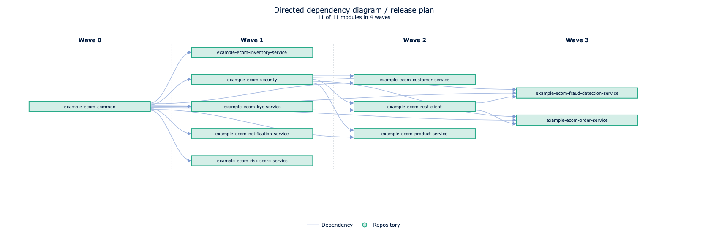

# Module 2: Wave planning

In this module, you'll use the Moderne Platform to analyze dependencies and determine a safe upgrade order, then set up the CLI workspace you need for the build-test-release cycle in later modules. You will run the Release-Train-Metro-Plan recipe on the platform to generate a wave map visualization, then organize your local workspace into wave directories based on the results.

For this workshop, each repository is treated as independently released. That constraint mirrors how large organizations manage shared libraries and it forces you to think about sequencing instead of upgrading everything at once. Dependencies matter because downstream repos can only move once their upstream libraries are upgraded and released.

## Exercise 2-1: Generate a dependency-based wave plan

Use OpenRewrite's rich dependency data to determine a safe upgrade order. The goal is to identify repos with no internal dependencies ("Wave 0"), release them, then move downstream in order.

### Goals for this exercise

* Run a dependency analysis recipe on the Moderne Platform
* Generate a wave map visualization

### Steps

#### Step 1: Run the dependency analysis on the platform

1. Navigate to [app.moderne.io](https://app.moderne.io/) and sign in. Confirm that **Moderne - Training** is selected in the organization dropdown.
2. Click **Marketplace** in the left navigation. Search for and select [`Release Metro Plan`](https://app.moderne.io/recipes/io.moderne.recipe.releasemetro.ReleaseMetroPlan) (`io.moderne.recipe.releasemetro.ReleaseMetroPlan`).
3. Click **Dry Run** to run the recipe against the organization. This analyzes direct and transitive dependencies across all repositories.

#### Step 2: View the wave map

1. After the recipe run completes, click the **Visualizations** tab.
2. Run the **Release Train Metro Map** visualization. This renders an interactive wave diagram showing which repositories can be upgraded independently ("Wave 0") and which depend on earlier waves.
3. Note the repository groupings and upgrade order — you will use this structure in the next exercise to organize your local workspace.

<figure>
  
  <figcaption>_The Release Train Metro Map visualization showing the dependency-based wave plan._</figcaption>
</figure>

## Exercise 2-2: Set up your workspace

Now that you have a wave plan, it's time to set up the CLI workspace you will use for the build-test-release cycle in later modules. You will sync the repositories into wave directories and install the recipe set needed for the rest of the workshop.

### Goals for this exercise

* Create a workspace organized by wave
* Install the set of recipes required for this workshop

### Steps

#### Step 1: Set environment variables

Choose paths for your workshop and workspace and set the following environment variables so you can better follow along with the commands. If you want to copy commands directly, you can use these example values, but make sure to create the directories first:

```bash
export WORKSHOP=~/projects/moderne-migration-practice
export WORKSPACE=~/workspaces/migration-practice-workspace
export PROJECTS=~/projects
```

:::tip
You might want to keep two shells open: one in `$WORKSHOP` for scripts and one in `$WORKSPACE` for `mod` commands.
:::

#### Step 2: Clone the workshop repo and sync repositories

1. Clone the Moderne Migration Practice workshop which contains helper scripts, the wave-aware [repos.csv](../../user-documentation/moderne-cli/references/repos-csv.md) file organized by wave, and metadata about the example projects.

```bash
mkdir -p $PROJECTS
cd $PROJECTS
git clone https://github.com/modernetraining/moderne-migration-practice
```

2. Create a workspace directory and sync the repositories using the wave-aware CSV file. This downloads the source code into wave directories.

```bash
mkdir -p $WORKSPACE
cd $WORKSPACE
mod git sync csv $WORKSPACE $WORKSHOP/repos-waves.csv --with-sources
```

3. Inspect the structure (using `cd` and `ls` or `tree -d . -L 3` if you have it). You should see wave directories (`Wave0`, `Wave1`, etc.) with repositories grouped by their dependency order from the wave plan.

:::note
The `repos-waves.csv` file uses the `repos.csv` organization columns to group repositories by wave. This lets you run `mod` commands across the entire workspace or target a specific wave directory like `$WORKSPACE/Wave0`. For more information, [check out our repos.csv documentation](../../user-documentation/moderne-cli/references/repos-csv.md).
:::

You can now target a specific wave with recipe runs and releases. There are a few ways you could organize repos by wave:

* Run `mod` commands inside each repository manually (fine for a few repos, painful at scale)
* Create separate `repos.csv` files per wave and sync each into its own workspace
* Use the `repos.csv` organization columns to group repos by wave in a single workspace

This workshop uses the third option so you can run both org-wide recipes and wave-specific recipes from the root folder.

#### Step 3: Install the recipe set

Use the following command to install the necessary OpenRewrite recipe modules for this workshop:

```bash
mod config recipes jar install \
  io.moderne.recipe:rewrite-spring \
  org.openrewrite.recipe:rewrite-migrate-java \
  org.openrewrite.recipe:rewrite-java-dependencies \
  org.openrewrite:rewrite-java \
  org.openrewrite:rewrite-maven \
  io.moderne.recipe:rewrite-devcenter \
  org.openrewrite.recipe:rewrite-spring \
  org.openrewrite.recipe:rewrite-testing-frameworks
```

:::info
Installing recipes locally can sometimes take a few minutes, so this list of recipe packages is limited to only the ones required for this workshop. You can find a [list of recipes by module in the OpenRewrite documentation](https://docs.openrewrite.org/reference/all-recipes).
:::

#### Step 4: Build LSTs

Build the LSTs (Lossless Semantic Trees) for all repositories in the workspace. The LST is OpenRewrite's rich code model that recipes use to make accurate, safe changes — you need to build them before you can run any recipes locally.

```bash
mod build $WORKSPACE
```

:::note
This command may take a couple of minutes to run as it builds LSTs for each repository.
:::

## Takeaways

* Dependency data helps you define a safe upgrade order
* The Release-Train-Metro-Plan recipe and visualization in the platform produce a wave map directly
* Organizing repos by wave lets you run recipes and releases in controlled batches
