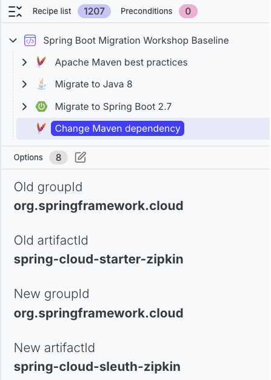
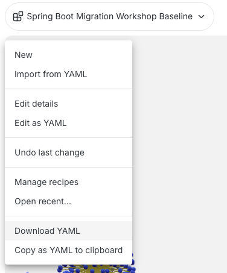

# Module 3: Establish a baseline

In this module, you will normalize the portfolio to a consistent baseline: Maven best practices, Java 8, and Spring Boot 2.7. This ensures the Spring Boot 4 upgrade starts from a stable, repeatable state. Think of this as leveling the terrain so later changes are easier to interpret and less likely to introduce hidden drift between repositories.

## Exercise 3-1: Build a baseline recipe in the Moderne Platform

### Goals for this exercise

* Create a composite recipe for the baseline
* Export the YAML to run in the CLI

### Steps

You saw from the analysis earlier that these projects all use a variety of Spring Boot 2.x versions. It's a good first step to land on Spring Boot 2.7 across the board as a stable baseline with better support for Java 17+, updated testing frameworks, and modern dependency management. The following steps will create a baseline composite recipe that brings all repositories to a known-good configuration, reducing variance so the later Spring Boot 4 upgrade is more predictable. You also know from earlier code insight that these repos use `spring-cloud-starter-zipkin`, which is no longer supported. Before Spring Boot 2.7 complains about that dependency, you will replace it with `spring-cloud-sleuth-zipkin` as part of the same composite recipe.

1. In the Moderne Platform, open the recipe builder and create a new recipe.
2. Toggle off the `Auto-generate ID from name` setting so you can manually enter an ID, then fill in the fields as follows:
   - **Name:** `Spring Boot Migration Workshop Baseline`
   - **ID:** `com.example.ecom.recipe.SpringBootMigrationWorkshopBaseline`

<figure>
  
  <figcaption>_Set the name and ID for your custom recipe_</figcaption>
</figure>

3. Add the following recipes in order:
   - **`Apache Maven best practices`** (`org.openrewrite.maven.BestPractices`)
   - **`Migrate to Java 8`** (`org.openrewrite.java.migrate.UpgradeToJava8`)
   - **`Migrate to Spring Boot 2.7`** (`org.openrewrite.java.spring.boot2.UpgradeSpringBoot_2_7`)
   - **`Change Maven managed dependency groupId, artifactId and optionally the version`** (`org.openrewrite.maven.ChangeDependencyGroupIdAndArtifactId`)
4. Configure the dependency change:
   - **Old groupId:** `org.springframework.cloud`
   - **Old artifactId:** `spring-cloud-starter-zipkin`
   - **New groupId:** `org.springframework.cloud`
   - **New artifactId:** `spring-cloud-sleuth-zipkin

<figure>
  
  <figcaption>_Your custom migration baseline recipe_</figcaption>
</figure>

5. Open the recipe dropdown (top left) and choose `Download YAML`.

<figure>
  
  <figcaption>_Download the recipe as YAML_</figcaption>
</figure>

## Exercise 3-2: Apply the baseline in the CLI

### Goals for this exercise

* Install the baseline recipe locally
* Apply changes across the workspace
* Build, commit, and release

### Steps

You'll use two helper scripts throughout the workshop: `build.sh` to validate that a wave still builds after changes, and `release.sh` to publish a local release so downstream repos can move to the new versions. We'll start using both of these in this exercise.

#### Step 1: Save and install the recipe

Copy the recipe to your `$WORKSHOP` directory and install it locally:

```bash
# If your download location is different, replace with whatever path you used for the YAML file
cp ~/Downloads/Spring\ Boot\ Migration\ Workshop\ Baseline.yml $WORKSHOP/WorkshopBaseline.yml
mod config recipes yaml install $WORKSHOP/WorkshopBaseline.yml
```

#### Step 2: Run the recipe and apply changes

When you run a recipe from the CLI that makes changes, it stores recipe results as a patch without changing your working tree until you're ready to explicitly apply it. In this step, you'll run the recipe and then use `mod git apply` to write the recipe changes into the repos so you can review, test, and commit them.

<!-- TODO: Confirm we don't need to run `mod build` since we should have updated LSTs from the last module. If not, add `mod build` here along with an explanation along the lines of: "Now we can build our first Lossless Semantic Trees (LSTs) so we can run OpenRewrite recipes on the synced repositories. This command may take a few minutes to run as it compiles the projects and builds the LSTs for each project:" --->

```bash
mod run $WORKSPACE --recipe com.example.ecom.recipe.SpringBootMigrationWorkshopBaseline
mod git apply $WORKSPACE --last-recipe-run
```

<details>
<summary>Reference output</summary>

</details>

### Takeaways

* A baseline recipe reduces variance across repositories before major upgrades
* Landing on Spring Boot 2.7 creates a stable stepping stone for Java 17 and Spring Boot 4
* `mod git apply` turns recipe output into working-tree changes you can review and commit

#### Step 3: Build and release

<!-- TODO: Confirm we don't need to do an initial release run since we have the published artifacts? If not, we'll need to add an initial run of `release.sh` and update this explanation. -->

This repository includes some helper scripts to run commands like building, testing, and releasing. Use the `build.sh` script to build and run tests for all the projects, and the `release.sh` script to release your code for downstream dependencies to consume. To publish a release, the script automatically installs the current non-SNAPSHOT version of each repository into your local Maven cache. It will then bump the project's version to the next available minor SNAPSHOT version, ready for you to make more changes. Both scripts build or release all repositories, but they each accept an argument representing a target wave number. So `build.sh 1` will only build the repositories in Wave 1.

You will be using both of these commands going forward after you make changes to the code to simulate the software development lifecycle of building and releasing new versions of these repositories that would usually be handled by your existing process outside of OpenRewrite and Moderne.

1. Run `mod git status` to confirm that the files were indeed modified by the applied patch and are unstaged at this point.

```bash
mod git status $WORKSPACE
```

<details>
<summary>Reference output</summary>


```text
   ▛▀▀▚▖  ▗▄▟▜
   ▌   ▜▄▟▀  ▐
   ▛▀▀█▀▛▀▀▀▀▜
   ▌▟▀  ▛▀▀▀▀▜
   ▀▀▀▀▀▀▀▀▀▀▀
Moderne CLI 3.54.5

⏺ Reading organization

Found 1 organization containing 11 repositories (1s)

⏺ Executing git status

Command output will be written to log

▶ modernetraining/example-ecom-common@main
    Unstaged changes: 1 modified file
▶ modernetraining/example-ecom-customer-service@main
    Unstaged changes: 1 modified file
▶ modernetraining/example-ecom-fraud-detection-service@main
    Unstaged changes: 1 modified file
▶ modernetraining/example-ecom-inventory-service@main
    Unstaged changes: 1 modified file
▶ modernetraining/example-ecom-kyc-service@main
    Unstaged changes: 1 modified file
▶ modernetraining/example-ecom-notification-service@main
    Unstaged changes: 1 modified file
▶ modernetraining/example-ecom-order-service@main
    Unstaged changes: 4 modified files
▶ modernetraining/example-ecom-product-service@main
    Unstaged changes: 1 modified file
▶ modernetraining/example-ecom-rest-client@main
    Unstaged changes: 1 modified file
▶ modernetraining/example-ecom-risk-score-service@main
    Unstaged changes: 1 modified file
▶ modernetraining/example-ecom-security@main
    Unstaged changes: 1 modified file
Done (1s)

Listed status for 11 repositories.
```

</details>

2. Before you commit any code, you'll want to make sure the changes didn't break anything by validating that everything builds successfully. Then, if there are no build errors (there shouldn't be), you can add and commit the code:

```bash
$WORKSHOP/build.sh
mod git add $WORKSPACE --last-recipe-run
mod git commit $WORKSPACE -m "Workshop baseline: Maven, Java 8, Spring Boot 2.7" --last-recipe-run
```

<details>
<summary>Reference output</summary>

```text
Starting build process...
Running Wave 0...
ecom-common built successfully
Running Wave 1...
ecom-security built successfully
inventory-service built successfully
kyc-service built successfully
notification-service built successfully
risk-score-service built successfully
Running Wave 2...
ecom-rest-client built successfully
customer-service built successfully
product-service built successfully
Running Wave 3...
fraud-detection-service built successfully
order-service built successfully
Build complete!
   ▛▀▀▚▖  ▗▄▟▜
   ▌   ▜▄▟▀  ▐
   ▛▀▀█▀▛▀▀▀▀▜
   ▌▟▀  ▛▀▀▀▀▜
   ▀▀▀▀▀▀▀▀▀▀▀
Moderne CLI 3.54.5

⏺ Reading organization

Found 1 organization containing 11 repositories (1s)
Found recipe run 20260115162634-J7PuY


⏺ Executing git add

Command output will be written to log

▶ modernetraining/example-ecom-common@main
    ✓ Added 1 files to index
▶ modernetraining/example-ecom-customer-service@main
    ✓ Added 1 files to index
▶ modernetraining/example-ecom-fraud-detection-service@main
    ✓ Added 1 files to index
▶ modernetraining/example-ecom-inventory-service@main
    ✓ Added 1 files to index
▶ modernetraining/example-ecom-kyc-service@main
    ✓ Added 1 files to index
▶ modernetraining/example-ecom-notification-service@main
    ✓ Added 1 files to index
▶ modernetraining/example-ecom-order-service@main
    ✓ Added 4 files to index
▶ modernetraining/example-ecom-product-service@main
    ✓ Added 1 files to index
▶ modernetraining/example-ecom-rest-client@main
    ✓ Added 1 files to index
▶ modernetraining/example-ecom-risk-score-service@main
    ✓ Added 1 files to index
▶ modernetraining/example-ecom-security@main
    ✓ Added 1 files to index
Done (1s)

Added files for 11 repositories.

⏺ What to do next
    > Run mod git checkout /Users/somebody/workspaces/migration_workshop <branch-name> -b --last-recipe-run to create a new branch for your changes
    > Run mod git commit <path> --last-recipe-run to commit your changes to the current branch

MOD SUCCEEDED in 1s
   ▛▀▀▚▖  ▗▄▟▜
   ▌   ▜▄▟▀  ▐
   ▛▀▀█▀▛▀▀▀▀▜
   ▌▟▀  ▛▀▀▀▀▜
   ▀▀▀▀▀▀▀▀▀▀▀
Moderne CLI 3.54.5

⏺ Reading organization

Found 1 organization containing 11 repositories (1s)
Found recipe run 20260115162634-J7PuY


⏺ Executing git commit

Command output will be written to log

▶ modernetraining/example-ecom-common@main
    ✓ Committed changes.
▶ modernetraining/example-ecom-customer-service@main
    ✓ Committed changes.
▶ modernetraining/example-ecom-fraud-detection-service@main
    ✓ Committed changes.
▶ modernetraining/example-ecom-inventory-service@main
    ✓ Committed changes.
▶ modernetraining/example-ecom-kyc-service@main
    ✓ Committed changes.
▶ modernetraining/example-ecom-notification-service@main
    ✓ Committed changes.
▶ modernetraining/example-ecom-order-service@main
    ✓ Committed changes.
▶ modernetraining/example-ecom-product-service@main
    ✓ Committed changes.
▶ modernetraining/example-ecom-rest-client@main
    ✓ Committed changes.
▶ modernetraining/example-ecom-risk-score-service@main
    ✓ Committed changes.
▶ modernetraining/example-ecom-security@main
    ✓ Committed changes.
Done (1s)

Committed changes for 11 repositories.

⏺ What to do next
    > Run mod git push /Users/somebody/workspaces/migration_workshop --last-recipe-run to push the changes to your remote repository
    > Run mod git push /Users/somebody/workspaces/migration_workshop --last-recipe-run --set-upstream to push and track the changes to your remote repository

MOD SUCCEEDED in 1s
```

</details>

3. Now the the code has been modified and committed, you can run the first release, then rebuild LSTs so the CLI sees the updated code state:

```bash
$WORKSHOP/release.sh
mod build $WORKSPACE
```

:::tip
If you see some build failures, continue anyway. You can still run recipes on the repos that do have valid LSTs.
:::

<details>
<summary>Reference output</summary>

```text
Starting Mass Release...
Running Wave 0...
Starting release process for ecom-common...
  Current: 1.1.0-SNAPSHOT
  Release: 1.1.0
  Next:    1.2.0-SNAPSHOT
  Setting version to 1.1.0...
  Running release build...
  Build successful.
  Setting version to 1.2.0-SNAPSHOT...
  Release process complete for ecom-common. New version: 1.2.0-SNAPSHOT
Running Wave 1...
Starting release process for ecom-security...
  Current: 1.1.0-SNAPSHOT
  Release: 1.1.0
  Next:    1.2.0-SNAPSHOT
  Setting version to 1.1.0...
  Running release build...
  Build successful.
  Setting version to 1.2.0-SNAPSHOT...
  Release process complete for ecom-security. New version: 1.2.0-SNAPSHOT
Starting release process for inventory-service...
  Current: 1.1.0-SNAPSHOT
  Release: 1.1.0
  Next:    1.2.0-SNAPSHOT
  Setting version to 1.1.0...
  Running release build...
  Build successful.
  Setting version to 1.2.0-SNAPSHOT...
  Release process complete for inventory-service. New version: 1.2.0-SNAPSHOT
Starting release process for kyc-service...
  Current: 1.1.0-SNAPSHOT
  Release: 1.1.0
  Next:    1.2.0-SNAPSHOT
  Setting version to 1.1.0...
  Running release build...
  Build successful.
  Setting version to 1.2.0-SNAPSHOT...
  Release process complete for kyc-service. New version: 1.2.0-SNAPSHOT
Starting release process for notification-service...
  Current: 1.1.0-SNAPSHOT
  Release: 1.1.0
  Next:    1.2.0-SNAPSHOT
  Setting version to 1.1.0...
  Running release build...
  Build successful.
  Setting version to 1.2.0-SNAPSHOT...
  Release process complete for notification-service. New version: 1.2.0-SNAPSHOT
Starting release process for risk-score-service...
  Current: 1.1.0-SNAPSHOT
  Release: 1.1.0
  Next:    1.2.0-SNAPSHOT
  Setting version to 1.1.0...
  Running release build...
  Build successful.
  Setting version to 1.2.0-SNAPSHOT...
  Release process complete for risk-score-service. New version: 1.2.0-SNAPSHOT
Running Wave 2...
Starting release process for ecom-rest-client...
  Current: 1.1.0-SNAPSHOT
  Release: 1.1.0
  Next:    1.2.0-SNAPSHOT
  Setting version to 1.1.0...
  Running release build...
  Build successful.
  Setting version to 1.2.0-SNAPSHOT...
  Release process complete for ecom-rest-client. New version: 1.2.0-SNAPSHOT
Starting release process for customer-service...
  Current: 1.1.0-SNAPSHOT
  Release: 1.1.0
  Next:    1.2.0-SNAPSHOT
  Setting version to 1.1.0...
  Running release build...
  Build successful.
  Setting version to 1.2.0-SNAPSHOT...
  Release process complete for customer-service. New version: 1.2.0-SNAPSHOT
Starting release process for product-service...
  Current: 1.1.0-SNAPSHOT
  Release: 1.1.0
  Next:    1.2.0-SNAPSHOT
  Setting version to 1.1.0...
  Running release build...
  Build successful.
  Setting version to 1.2.0-SNAPSHOT...
  Release process complete for product-service. New version: 1.2.0-SNAPSHOT
Running Wave 3...
Starting release process for fraud-detection-service...
  Current: 1.1.0-SNAPSHOT
  Release: 1.1.0
  Next:    1.2.0-SNAPSHOT
  Setting version to 1.1.0...
  Running release build...
  Build successful.
  Setting version to 1.2.0-SNAPSHOT...
  Release process complete for fraud-detection-service. New version: 1.2.0-SNAPSHOT
Starting release process for order-service...
  Current: 1.1.0-SNAPSHOT
  Release: 1.1.0
  Next:    1.2.0-SNAPSHOT
  Setting version to 1.1.0...
  Running release build...
  Build successful.
  Setting version to 1.2.0-SNAPSHOT...
  Release process complete for order-service. New version: 1.2.0-SNAPSHOT
Mass Release Complete!
   ▛▀▀▚▖  ▗▄▟▜
   ▌   ▜▄▟▀  ▐
   ▛▀▀█▀▛▀▀▀▀▜
   ▌▟▀  ▛▀▀▀▀▜
   ▀▀▀▀▀▀▀▀▀▀▀
Moderne CLI 3.54.5

⏺ Reading organization

Found 1 organization containing 11 repositories (1s)

⏺ Building LST(s)

▶ modernetraining/example-ecom-common@main
    Build output will be written to build.log
    > Step 1 - build with Maven
        Selected the 17.0.12-tem JDK for example-ecom-common
    > Step 2 - build resources
    ✓ Built example-ecom-common-20260115165721847-ast.jar
    Cleaned 1 older builds
▶ modernetraining/example-ecom-customer-service@main
    Build output will be written to build.log
    > Step 1 - build with Maven
        Selected the 17.0.12-tem JDK for example-ecom-customer-service
    > Step 2 - build resources
    ✓ Built example-ecom-customer-service-20260115165729938-ast.jar
    Cleaned 1 older builds
▶ modernetraining/example-ecom-fraud-detection-service@main
    Build output will be written to build.log
    > Step 1 - build with Maven
        Selected the 17.0.12-tem JDK for example-ecom-fraud-detection-service
    > Step 2 - build resources
    ✓ Built example-ecom-fraud-detection-service-20260115165736475-ast.jar
    Cleaned 1 older builds
▶ modernetraining/example-ecom-inventory-service@main
    Build output will be written to build.log
    > Step 1 - build with Maven
        Selected the 17.0.12-tem JDK for example-ecom-inventory-service
    > Step 2 - build resources
    ✓ Built example-ecom-inventory-service-20260115165743731-ast.jar
    Cleaned 1 older builds
▶ modernetraining/example-ecom-kyc-service@main
    Build output will be written to build.log
    > Step 1 - build with Maven
        Selected the 17.0.12-tem JDK for example-ecom-kyc-service
    > Step 2 - build resources
    ✓ Built example-ecom-kyc-service-20260115165750292-ast.jar
    Cleaned 1 older builds
▶ modernetraining/example-ecom-notification-service@main
    Build output will be written to build.log
    > Step 1 - build with Maven
        Selected the 17.0.12-tem JDK for example-ecom-notification-service
    > Step 2 - build resources
    ✓ Built example-ecom-notification-service-20260115165756930-ast.jar
    Cleaned 1 older builds
▶ modernetraining/example-ecom-order-service@main
    Build output will be written to build.log
    > Step 1 - build with Maven
        Selected the 17.0.12-tem JDK for example-ecom-order-service
    > Step 2 - build resources
    ✓ Built example-ecom-order-service-20260115165807462-ast.jar
    Cleaned 1 older builds
▶ modernetraining/example-ecom-product-service@main
    Build output will be written to build.log
    > Step 1 - build with Maven
        Selected the 17.0.12-tem JDK for example-ecom-product-service
    > Step 2 - build resources
    ✓ Built example-ecom-product-service-20260115165814437-ast.jar
    Cleaned 1 older builds
▶ modernetraining/example-ecom-rest-client@main
    Build output will be written to build.log
    > Step 1 - build with Maven
        Selected the 17.0.12-tem JDK for example-ecom-rest-client
    > Step 2 - build resources
    ✓ Built example-ecom-rest-client-20260115165820429-ast.jar
    Cleaned 1 older builds
▶ modernetraining/example-ecom-risk-score-service@main
    Build output will be written to build.log
    > Step 1 - build with Maven
        Selected the 17.0.12-tem JDK for example-ecom-risk-score-service
    > Step 2 - build resources
    ✓ Built example-ecom-risk-score-service-20260115165826677-ast.jar
    Cleaned 1 older builds
▶ modernetraining/example-ecom-security@main
    Build output will be written to build.log
    > Step 1 - build with Maven
        Selected the 17.0.12-tem JDK for example-ecom-security
    > Step 2 - build resources
    ✓ Built example-ecom-security-20260115165832143-ast.jar
    Cleaned 1 older builds
Done (1m 16s)

Built 11 repositories.

⏺ What to do next
    > Run mod run /Users/somebody/workspaces/migration_workshop --recipe=<RecipeName>
    > Run mod afterburner /Users/somebody/workspaces/migration_workshop to speed up recipe runs
    > Analyze build results with mod trace builds analyze /Users/somebody/workspaces/migration_workshop --last-build
    > Run mod log builds add /Users/somebody/workspaces/migration_workshop logs.zip --last-build to aggregate build logs

MOD SUCCEEDED in 1m 18s
```

</details>
