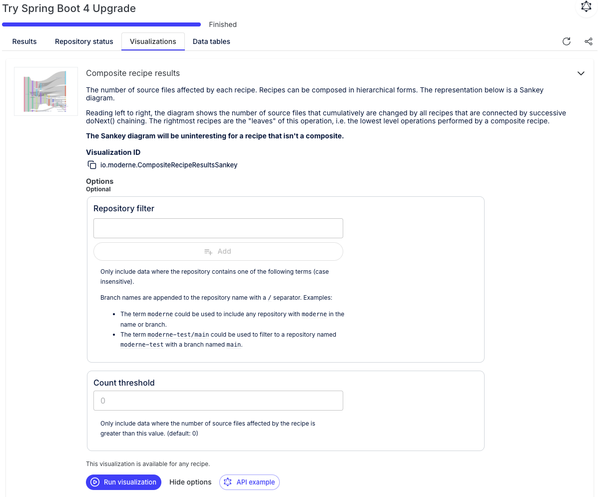

# Module 4: Java 17 upgrade and Spring Boot 4 smoke test

In this module, you will raise the Java baseline to 17 and run a controlled Spring Boot 4 upgrade to identify any remaining blockers before you start wave-by-wave upgrades. The earlier dry run made it clear that Java 17 is a large portion of the change surface, so you will isolate it first by reviewing the failed run and then raising the floor across the org.

## Exercise 4-1: Review the failed Spring Boot 4 run in the Moderne Platform

### Goals for this exercise

* Inspect the failed Spring Boot 4 run in the Moderne Platform
* Use the Composite recipe results visualization to see where the work is concentrated
* Confirm that Java 17 is the largest part of the change surface

### Steps

1. Back in the [Moderne Platform](https://app.moderne.io), relogin if needed, then click `Activity` in the left navigation.
2. Open the failed run of your custom `Try Spring Boot 4 Upgrade` recipe from Module 1 that included [`io.moderne.java.spring.boot4.UpgradeSpringBoot_4_0`](https://docs.openrewrite.org/recipes/java/spring/boot4/upgradespringboot_4_0) and [`io.moderne.compiled.verification.VerifyCompilation`](https://docs.openrewrite.org/recipes/compiled/verification/verifycompilation).
3. Click the `Visualizations` tab and run the `Composite recipe results` visualization.

<figure>
  
  <figcaption>_Click `Run visualization` to view_</figcaption>
</figure>

The `Composite recipe results` view breaks the run down by recipe so you can see which parts of the composite generated changes. The Spring Boot and Spring Framework recipes may still show larger chunks, but Java 17 is the biggest independent migration you can complete (Spring Boot 3 and 4 require Java 17, but a Java 17 upgrade does not require Spring Boot). That makes Java 17 the right first target because it removes a cross-cutting prerequisite and establishes a consistent baseline before tackling Spring Boot fixes in waves.

## Exercise 4-2: Upgrade to Java 17

### Goals for this exercise

* Upgrade all repos to Java 17
* Build and commit the changes

### Steps

#### Step 1: Run the Java 17 recipe

Spring Framework 6+ and Spring Boot 3+ require Java 17 or higher. Upgrading Java first narrows the change surface and makes the Spring Boot upgrade easier to reason about. Run the `Migrate to Java 17` recipe ([`org.openrewrite.java.migrate.UpgradeToJava17`](https://docs.openrewrite.org/recipes/java/migrate/upgradetojava17)) from the command line and apply the changes:

```bash
mod run $WORKSPACE --recipe org.openrewrite.java.migrate.UpgradeToJava17
mod git apply $WORKSPACE --last-recipe-run
```

<!-- TODO: Confirm this step with a clean runthrough. I got no changes here but I think that's because it was using the older code that had the updated Java versions. -->

:::note
Spring Boot 2.7 doesn't support Java 25. If you try `UpgradeToJava25` ([`org.openrewrite.java.migrate.UpgradeToJava25`](https://docs.openrewrite.org/recipes/java/migrate/upgradetojava25)) at this stage, you'll hit compatibility issues. That is expected and a useful reminder to step through intermediate baselines.
:::

#### Step 2: Build and commit

Now that the changes have been applied, commit the code and rebuild your LSTs:

```bash
$WORKSHOP/build.sh
mod git add $WORKSPACE --last-recipe-run
mod git commit $WORKSPACE -m "Upgrade to Java 17" --last-recipe-run
mod build $WORKSPACE
```

<details>
<summary>Reference output</summary>

<!-- TODO: Paste reference output -->

</details>

## Exercise 4-3: Run a Spring Boot 4 smoke test

### Goals for this exercise

* Run the Spring Boot 4 upgrade recipe
* Identify the first wave of blockers
* Restore the workspace to the last known good state

### Steps

Now that your repositories are upgraded to on Java 17, you can run another quick smoke test to see how far the Spring Boot 4 upgrade gets after the baselining work. You still aren't trying to finish the upgrade yet, just looking for the narrower set of specific failures so you can plan the fixes and build the right composite recipe.

#### Step 1: Run the upgrade recipe

In Module 1, you ran the recipe in the platform and used the `Verify compilation` recipe ([`io.moderne.compiled.verification.VerifyCompilation`](https://docs.openrewrite.org/recipes/compiled/verification/verifycompilation)) to check for build failures. Now, you can run the Spring Boot 4 Upgrade recipe ([`io.moderne.java.spring.boot4.UpgradeSpringBoot_4_0`](https://docs.openrewrite.org/recipes/java/spring/boot4/upgradespringboot_4_0)) by itself with the CLI and verify the build directly to isolate any remaining obstacles that may require custom fixes. 

First, run the recipe and apply the changes:

```bash
mod run $WORKSPACE --recipe io.moderne.java.spring.boot4.UpgradeSpringBoot_4_0
mod git apply $WORKSPACE --last-recipe-run
```

<details>
<summary>Reference output</summary>

```text
   ▛▀▀▚▖  ▗▄▟▜
   ▌   ▜▄▟▀  ▐
   ▛▀▀█▀▛▀▀▀▀▜
   ▌▟▀  ▛▀▀▀▀▜
   ▀▀▀▀▀▀▀▀▀▀▀
Moderne CLI 3.55.1

⏺ Reading organization

Found 1 organization containing 11 repositories (1s)

⏺ Running recipe io.moderne.java.spring.boot4.UpgradeSpringBoot_4_0

▶ modernetraining/example-ecom-rest-client@main
    Fix results
    ✓ Recipe run complete
▶ modernetraining/example-ecom-common@main
    Fix results
    ✓ Recipe run complete
▶ modernetraining/example-ecom-security@main
    Fix results
    ✓ Recipe run complete
▶ modernetraining/example-ecom-notification-service@main
    Fix results
    ✓ Recipe run complete
▶ modernetraining/example-ecom-kyc-service@main
    Fix results
    ✓ Recipe run complete
▶ modernetraining/example-ecom-risk-score-service@main
    Fix results
    ✓ Recipe run complete
▶ modernetraining/example-ecom-inventory-service@main
    Fix results
    ✓ Recipe run complete
▶ modernetraining/example-ecom-customer-service@main
    Fix results
    ✓ Recipe run complete
▶ modernetraining/example-ecom-fraud-detection-service@main
    Fix results
    ✓ Recipe run complete
▶ modernetraining/example-ecom-product-service@main
    Fix results
    ✓ Recipe run complete
▶ modernetraining/example-ecom-order-service@main
    Fix results
    ✓ Recipe run complete
Done (25s)

1m 8s saved by using previously built LSTs
3h saved by using recipes

Produced results for 11 repositories.

⏺ What to do next
    > Click on one of the patch links above to view the changes on a particular repository
    > Run mod study to examine the following data tables produced by this recipe:
          > mod study /Users/somebody/workspaces/migration-practice-workspace --last-recipe-run --data-table DependenciesInUse
          > mod study /Users/somebody/workspaces/migration-practice-workspace --last-recipe-run --data-table ExplainDependenciesInUse
          > mod study /Users/somebody/workspaces/migration-practice-workspace --last-recipe-run --data-table RecipeRunStats
          > mod study /Users/somebody/workspaces/migration-practice-workspace --last-recipe-run --data-table SourcesFileResults
    > Run mod git checkout /Users/somebody/workspaces/migration-practice-workspace -b refactor/UpgradeSpringBoot_4_0 --last-recipe-run to prepare a refactor/UpgradeSpringBoot_4_0 branch for applying the changes
    > Run mod git apply /Users/somebody/workspaces/migration-practice-workspace --last-recipe-run to apply the changes
    > Run mod git apply /Users/somebody/workspaces/migration-practice-workspace --recipe-run 20260115171844-15VYV to apply the changes
    > Run mod log runs add /Users/somebody/workspaces/migration-practice-workspace logs.zip --last-recipe-run to aggregate run logs
    > Examine run telemetry

MOD SUCCEEDED in 26s
   ▛▀▀▚▖  ▗▄▟▜
   ▌   ▜▄▟▀  ▐
   ▛▀▀█▀▛▀▀▀▀▜
   ▌▟▀  ▛▀▀▀▀▜
   ▀▀▀▀▀▀▀▀▀▀▀
Moderne CLI 3.55.1

⏺ Reading organization

Found 1 organization containing 11 repositories (1s)
Found recipe run 20260115171844-15VYV


⏺ Executing git apply

Command output will be written to log

▶ modernetraining/example-ecom-common@main
    ✓ Applied patch
▶ modernetraining/example-ecom-customer-service@main
    ✓ Applied patch
▶ modernetraining/example-ecom-fraud-detection-service@main
    ✓ Applied patch
▶ modernetraining/example-ecom-inventory-service@main
    ✓ Applied patch
▶ modernetraining/example-ecom-kyc-service@main
    ✓ Applied patch
▶ modernetraining/example-ecom-notification-service@main
    ✓ Applied patch
▶ modernetraining/example-ecom-order-service@main
    ✓ Applied patch
▶ modernetraining/example-ecom-product-service@main
    ✓ Applied patch
▶ modernetraining/example-ecom-rest-client@main
    ✓ Applied patch
▶ modernetraining/example-ecom-risk-score-service@main
    ✓ Applied patch
▶ modernetraining/example-ecom-security@main
    ✓ Applied patch
Done (1s)

Applied patches to 11 repositories.

⏺ What to do next
    > Run mod git add /Users/somebody/workspaces/migration-practice-workspace --last-recipe-run to add the changes to the index
    > Run mod exec /Users/somebody/workspaces/migration-practice-workspace --last-recipe-run MODERNE_BUILD_TOOL_CHECK to verify the changes locally

MOD SUCCEEDED in 1s
```

</details>

:::tip
You may wish to open the diffs to inspect the changes before applying them. Use ctrl-click (Windows) or cmd-click (Mac) on the `Fix results` links to preview the changes after running the recipe.
:::

#### Step 2: Build wave 0 and wave 1

Now, you can run your build wave by wave. Expect Wave 0 to build cleanly and Wave 1 to fail due to the QueryDSL issues we saw in Module 1.

```bash
$WORKSHOP/build.sh 0
$WORKSHOP/build.sh 1
```

These failures confirm you need a custom recipe to proceed.

#### Step 3: Restore the workspace

Since the build is broken, you don't want to commit the changes. Instead, you can restore all of the repositories to their known good state and validate the builds with the following commands:

```bash
mod exec $WORKSPACE git restore MODERNE_BUILD_TOOL_DIR
$WORKSHOP/build.sh
mod build $WORKSPACE
```

This restores all uncommitted changes from the smoke test and returns to the Java 17 baseline.

## Takeaways

* The composite visualization shows why Java 17 is a prerequisite for Spring Boot 4
* A Java 17 upgrade raises the baseline across the organization before framework changes
* The Spring Boot 4 smoke test exposes blockers without committing to a full upgrade
