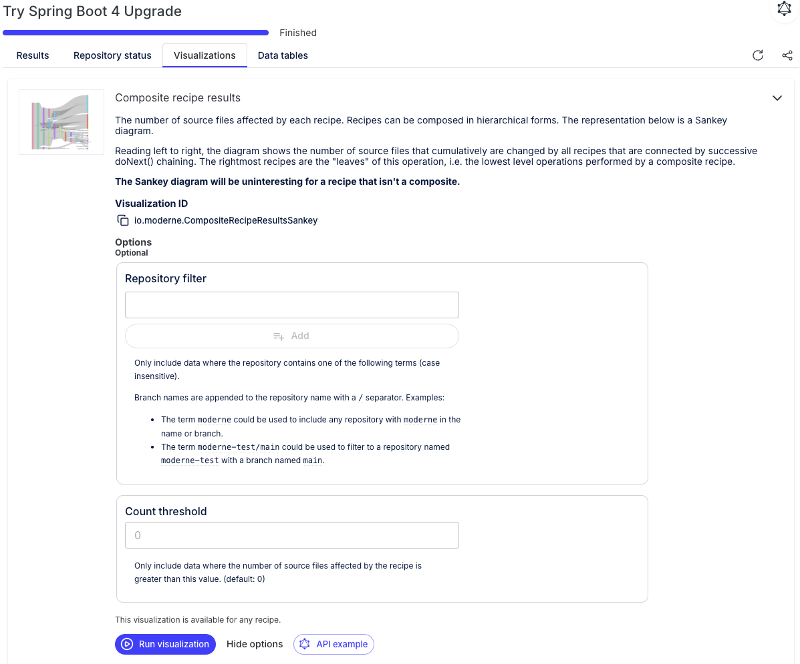

# Module 4: Java 17 upgrade and Spring Boot 4 smoke test

In this module, you will raise the Java baseline to 17 and run a controlled Spring Boot 4 upgrade to identify any remaining blockers before you start wave-by-wave upgrades. The earlier dry run made it clear that Java 17 is a large portion of the change surface, so you will isolate it first by reviewing the failed run and then raising the floor across the org.

## Exercise 4-1: Review the failed Spring Boot 4 run in the Moderne Platform

### Goals for this exercise

* Inspect the failed Spring Boot 4 run in the Moderne Platform
* Use the Composite recipe results visualization to see where the work is concentrated
* Confirm that Java 17 is the largest part of the change surface

### Steps

1. Back in the [Moderne Platform](https://app.moderne.io), relogin if needed, then click **Activity** in the left navigation. The Activity page shows a history of all recipe runs, including their status and results.
2. Open the failed run of your custom `Try Spring Boot 4 Upgrade` recipe from Module 1 that included [`io.moderne.java.spring.boot4.UpgradeSpringBoot_4_0`](https://docs.openrewrite.org/recipes/java/spring/boot4/upgradespringboot_4_0) and [`io.moderne.compiled.verification.VerifyCompilation`](https://docs.openrewrite.org/recipes/compiled/verification/verifycompilation).
3. Click the **Visualizations** tab and run the **Composite recipe results** visualization.

<figure>
  
  <figcaption>_Click **Run visualization** to view_</figcaption>
</figure>

The `Composite recipe results` view breaks the run down by recipe so you can see which parts of the composite generated changes. The Spring Boot and Spring Framework recipes may still show larger chunks, but Java 17 is the biggest independent migration you can complete (Spring Boot 3 and 4 require Java 17, but a Java 17 upgrade does not require Spring Boot). That makes Java 17 the right first target because it removes a cross-cutting prerequisite and establishes a consistent baseline before tackling Spring Boot fixes in waves.

## Exercise 4-2: Upgrade to Java 17

### Goals for this exercise

* Upgrade all repos to Java 17
* Build and commit the changes

### Steps

#### Step 1: Run the Java 17 recipe

Spring Framework 6+ and Spring Boot 3+ require Java 17 or higher. Upgrading Java first narrows the change surface and makes the Spring Boot upgrade easier to reason about. Run the `Migrate to Java 17` recipe ([`org.openrewrite.java.migrate.UpgradeToJava17`](https://docs.openrewrite.org/recipes/java/migrate/upgradetojava17)) from the command line and apply the changes:

```bash
mod run $WORKSPACE --recipe org.openrewrite.java.migrate.UpgradeToJava17
mod git apply $WORKSPACE --last-recipe-run
```

:::note
Spring Boot 2.7 doesn't support Java 25. If you try `UpgradeToJava25` ([`org.openrewrite.java.migrate.UpgradeToJava25`](https://docs.openrewrite.org/recipes/java/migrate/upgradetojava25)) at this stage, you'll hit compatibility issues. That is expected and a useful reminder to step through intermediate baselines.
:::

#### Step 2: Build and commit

Now that the changes have been applied, confirm the build still works, then commit the code, release, and rebuild your LSTs. The release step is important because downstream repos in later waves need to resolve the Java 17 versions of their upstream dependencies:

```bash
$WORKSHOP/build.sh
mod git add $WORKSPACE --last-recipe-run
mod git commit $WORKSPACE -m "Upgrade to Java 17" --last-recipe-run
$WORKSHOP/release.sh
mod build $WORKSPACE
```

<details>
<summary>Reference output</summary>

```
Starting build process...
Running Wave 0...
ecom-common built successfully
Running Wave 1...
ecom-security built successfully
inventory-service built successfully
kyc-service built successfully
notification-service built successfully
risk-score-service built successfully
Running Wave 2...
ecom-rest-client built successfully
customer-service built successfully
product-service built successfully
Running Wave 3...
fraud-detection-service built successfully
order-service built successfully
Build complete!
   ▛▀▀▚▖  ▗▄▟▜
   ▌   ▜▄▟▀  ▐
   ▛▀▀█▀▛▀▀▀▀▜
   ▌▟▀  ▛▀▀▀▀▜
   ▀▀▀▀▀▀▀▀▀▀▀
Moderne CLI 4.1.9

⏺ Reading organization

Found 5 organizations containing 11 repositories (1s)
Found recipe run 20260120132507-FOhoR


⏺ Executing git add

Command output will be written to log

▶ modernetraining/example-ecom-common@main
    ✓ Added 1 files to index
▶ modernetraining/example-ecom-inventory-service@main
    ✓ Added 1 files to index
▶ modernetraining/example-ecom-kyc-service@main
    ✓ Added 1 files to index
▶ modernetraining/example-ecom-notification-service@main
    ✓ Added 1 files to index
▶ modernetraining/example-ecom-risk-score-service@main
    ✓ Added 1 files to index
▶ modernetraining/example-ecom-security@main
    ✓ Added 1 files to index
▶ modernetraining/example-ecom-customer-service@main
    ✓ Added 1 files to index
▶ modernetraining/example-ecom-product-service@main
    ✓ Added 1 files to index
▶ modernetraining/example-ecom-rest-client@main
    ✓ Added 2 files to index
▶ modernetraining/example-ecom-fraud-detection-service@main
    ✓ Added 1 files to index
▶ modernetraining/example-ecom-order-service@main
    ✓ Added 1 files to index
Done (1s)

Added files for 11 repositories.

⏺ What to do next
    > Run mod git checkout /Users/somebody/workspaces/migration-practice-workspace <branch-name> -b --last-recipe-run to create a new branch for your changes
    > Run mod git commit <path> --last-recipe-run to commit your changes to the current branch

MOD SUCCEEDED in 1s
   ▛▀▀▚▖  ▗▄▟▜
   ▌   ▜▄▟▀  ▐
   ▛▀▀█▀▛▀▀▀▀▜
   ▌▟▀  ▛▀▀▀▀▜
   ▀▀▀▀▀▀▀▀▀▀▀
Moderne CLI 4.1.9

⏺ Reading organization

Found 5 organizations containing 11 repositories (1s)
Found recipe run 20260120132507-FOhoR


⏺ Executing git commit

Command output will be written to log

▶ modernetraining/example-ecom-common@main
    ✓ Committed changes.
▶ modernetraining/example-ecom-inventory-service@main
    ✓ Committed changes.
▶ modernetraining/example-ecom-kyc-service@main
    ✓ Committed changes.
▶ modernetraining/example-ecom-notification-service@main
    ✓ Committed changes.
▶ modernetraining/example-ecom-risk-score-service@main
    ✓ Committed changes.
▶ modernetraining/example-ecom-security@main
    ✓ Committed changes.
▶ modernetraining/example-ecom-customer-service@main
    ✓ Committed changes.
▶ modernetraining/example-ecom-product-service@main
    ✓ Committed changes.
▶ modernetraining/example-ecom-rest-client@main
    ✓ Committed changes.
▶ modernetraining/example-ecom-fraud-detection-service@main
    ✓ Committed changes.
▶ modernetraining/example-ecom-order-service@main
    ✓ Committed changes.
Done (1s)

Committed changes for 11 repositories.

⏺ What to do next
    > Run mod git push /Users/somebody/workspaces/migration-practice-workspace --last-recipe-run to push the changes to your remote repository
    > Run mod git push /Users/somebody/workspaces/migration-practice-workspace --last-recipe-run --set-upstream to push and track the changes to your remote repository

MOD SUCCEEDED in 1s
   ▛▀▀▚▖  ▗▄▟▜
   ▌   ▜▄▟▀  ▐
   ▛▀▀█▀▛▀▀▀▀▜
   ▌▟▀  ▛▀▀▀▀▜
   ▀▀▀▀▀▀▀▀▀▀▀
Moderne CLI 4.1.9

⏺ Reading organization

Found 5 organizations containing 11 repositories (1s)

⏺ Building LST(s)

▶ modernetraining/example-ecom-common@main
    Build output will be written to build.log
    > Step 1 - build with Maven
        Selected the 17.0.12-tem JDK for example-ecom-common
    > Step 2 - build resources
    ✓ Built example-ecom-common-20260120140217520-ast.jar
    Cleaned 1 older builds
▶ modernetraining/example-ecom-inventory-service@main
    Build output will be written to build.log
    > Step 1 - build with Maven
        Selected the 17.0.12-tem JDK for example-ecom-inventory-service
    > Step 2 - build resources
    ✓ Built example-ecom-inventory-service-20260120140224927-ast.jar
    Cleaned 1 older builds
▶ modernetraining/example-ecom-kyc-service@main
    Build output will be written to build.log
    > Step 1 - build with Maven
        Selected the 17.0.12-tem JDK for example-ecom-kyc-service
    > Step 2 - build resources
    ✓ Built example-ecom-kyc-service-20260120140231478-ast.jar
    Cleaned 1 older builds
▶ modernetraining/example-ecom-notification-service@main
    Build output will be written to build.log
    > Step 1 - build with Maven
        Selected the 17.0.12-tem JDK for example-ecom-notification-service
    > Step 2 - build resources
    ✓ Built example-ecom-notification-service-20260120140237645-ast.jar
    Cleaned 1 older builds
▶ modernetraining/example-ecom-risk-score-service@main
    Build output will be written to build.log
    > Step 1 - build with Maven
        Selected the 17.0.12-tem JDK for example-ecom-risk-score-service
    > Step 2 - build resources
    ✓ Built example-ecom-risk-score-service-20260120140243778-ast.jar
    Cleaned 1 older builds
▶ modernetraining/example-ecom-security@main
    Build output will be written to build.log
    > Step 1 - build with Maven
        Selected the 17.0.12-tem JDK for example-ecom-security
    > Step 2 - build resources
    ✓ Built example-ecom-security-20260120140249025-ast.jar
    Cleaned 1 older builds
▶ modernetraining/example-ecom-customer-service@main
    Build output will be written to build.log
    > Step 1 - build with Maven
        Selected the 17.0.12-tem JDK for example-ecom-customer-service
    > Step 2 - build resources
    ✓ Built example-ecom-customer-service-20260120140256139-ast.jar
    Cleaned 1 older builds
▶ modernetraining/example-ecom-product-service@main
    Build output will be written to build.log
    > Step 1 - build with Maven
        Selected the 17.0.12-tem JDK for example-ecom-product-service
    > Step 2 - build resources
    ✓ Built example-ecom-product-service-20260120140303753-ast.jar
    Cleaned 1 older builds
▶ modernetraining/example-ecom-rest-client@main
    Build output will be written to build.log
    > Step 1 - build with Maven
        Selected the 17.0.12-tem JDK for example-ecom-rest-client
    > Step 2 - build resources
    ✓ Built example-ecom-rest-client-20260120140309769-ast.jar
    Cleaned 1 older builds
▶ modernetraining/example-ecom-fraud-detection-service@main
    Build output will be written to build.log
    > Step 1 - build with Maven
        Selected the 17.0.12-tem JDK for example-ecom-fraud-detection-service
    > Step 2 - build resources
    ✓ Built example-ecom-fraud-detection-service-20260120140316315-ast.jar
    Cleaned 1 older builds
▶ modernetraining/example-ecom-order-service@main
    Build output will be written to build.log
    > Step 1 - build with Maven
        Selected the 17.0.12-tem JDK for example-ecom-order-service
    > Step 2 - build resources
    ✓ Built example-ecom-order-service-20260120140324334-ast.jar
    Cleaned 1 older builds
Done (1m 14s)

Built 11 repositories.

⏺ What to do next
    > Run mod run /Users/somebody/workspaces/migration-practice-workspace --recipe=<RecipeName>
    > Analyze build results with mod trace builds analyze /Users/somebody/workspaces/migration-practice-workspace --last-build
    > Run mod log builds add /Users/somebody/workspaces/migration-practice-workspace logs.zip --last-build to aggregate build logs

MOD SUCCEEDED in 1m 15s
```

</details>

## Exercise 4-3: Run a Spring Boot 4 smoke test

### Goals for this exercise

* Run the Spring Boot 4 upgrade recipe
* Identify the first wave of blockers
* Restore the workspace to the last known good state

### Steps

Now that your repositories are upgraded to Java 17, you can run another quick smoke test to see how far the Spring Boot 4 upgrade gets after the baselining work. You still aren't trying to finish the upgrade yet, just looking for the narrower set of specific failures so you can plan the fixes and build the right composite recipe.

#### Step 1: Run the upgrade recipe

In Module 1, you ran the recipe in the platform and used the `Verify compilation` recipe ([`io.moderne.compiled.verification.VerifyCompilation`](https://docs.openrewrite.org/recipes/compiled/verification/verifycompilation)) to check for build failures. Now, you can run the Spring Boot 4 Upgrade recipe ([`io.moderne.java.spring.boot4.UpgradeSpringBoot_4_0`](https://docs.openrewrite.org/recipes/java/spring/boot4/upgradespringboot_4_0-moderne-edition)) by itself with the CLI and verify the build directly to isolate any remaining obstacles that may require custom fixes. 

First, run the recipe and apply the changes:

```bash
mod run $WORKSPACE --recipe io.moderne.java.spring.boot4.UpgradeSpringBoot_4_0
mod git apply $WORKSPACE --last-recipe-run
```

:::note
Don't worry if you see warnings about "errors while running the recipe." You'll still be able to move on to the remaining steps.
:::

:::tip
You may wish to open the diffs to inspect the changes before applying them. Use ctrl-click (Windows) or cmd-click (Mac) on the `Fix results` links to preview the changes after running the recipe.
:::

#### Step 2: Build wave 0 and wave 1

Now, you can run your build wave by wave. Expect Wave 0 to build cleanly and Wave 1 to fail due to the QueryDSL issues you saw in Module 1.

```bash
$WORKSHOP/build.sh 0
$WORKSHOP/build.sh 1
```

These failures confirm you need a custom recipe to proceed.

#### Step 3: Restore the workspace

Since the build is broken, you don't want to commit the changes. Instead, you can restore all of the repositories to their known good state and validate the builds with the following commands:

```bash
mod exec $WORKSPACE git restore MODERNE_BUILD_TOOL_DIR
$WORKSHOP/build.sh
mod build $WORKSPACE
```

`MODERNE_BUILD_TOOL_DIR` is a special token that the `mod exec` command expands to the build tool directory (`.`) in each repository. This restores all uncommitted changes from the smoke test and returns to the Java 17 baseline.

## Takeaways

* The composite visualization shows why Java 17 is a prerequisite for Spring Boot 4
* A Java 17 upgrade raises the baseline across the organization before framework changes
* The Spring Boot 4 smoke test exposes blockers without committing to a full upgrade
