# Platform changelog
### UI v12.8.1 (2025/11/05)

- Bug fixes and other improvements.

### UI v12.8.0 (2025/11/05)

- add an admin flag on whether or not to show moddy

### UI v12.7.0 (2025/11/03)

- respect prefers-reduced-motion for topology rotation

### UI v12.6.0 (2025/11/03)

- add new chat button to moddy to start a new chat

### UI v12.5.1 (2025/10/30)

- Bug fixes and other improvements.

### UI v12.5.0 (2025/10/30)

- remove icons from account settings tabs
- add convention-based tenant branding with backward compatibility

### UI v12.4.0 (2025/10/29)

- implement new light theme login UI

### UI v12.3.0 (2025/10/29)

- auto-focus and scroll new string array inputs
- add auto-rotation to topology visualization

### UI v12.2.0 (2025/10/28)

- expandable search input in global navigation
- add topology auto-rotation prototype storybook

### UI v12.1.1 (2025/10/27)

- Bug fixes and other improvements.

### UI v12.1.0 (2025/10/24)

- Bug fixes and other improvements.

### UI v12.0.0 (2025/10/23)

- standardize modal height for add recipe to builder dialog
- implement centralized popover management system
- add neo-design CSS token imports
- add logo support for toml recipes
- apply button state styles to navigation buttons. add white ring to user avatar. fix left nav selection color
- new global nav layout
- add separate buttons to override recipe dialog
- Consolidate Add to Builder Modal UX

### UI v11.114.0 (2025/10/14)

- actions buttons for global nav

### UI v11.113.0 (2025/10/10)

- Bug fixes and other improvements.

### UI v11.112.0 (2025/10/10)

- add global search input
- add global organization selector and updated organization toolbar
- add help menu popover for global navigation

### UI v11.111.1 (2025/10/08)

- Bug fixes and other improvements.

### UI v11.111.0 (2025/10/07)

- add moddy beta when agent llm configuration present

### UI v11.110.1 (2025/10/03)

- Bug fixes and other improvements.

### UI v11.110.0 (2025/10/03)

- Bug fixes and other improvements.

### UI v11.109.1 (2025/10/03)

- Bug fixes and other improvements.

### UI v11.109.0 (2025/09/29)

- add logos for apache, astgrep, azul, diffblue, elastic, joda, kafka, operaton, vulncheck

### UI v11.108.1 (2025/09/26)

- Bug fixes and other improvements.

### UI v11.108.0 (2025/09/26)

- Bug fixes and other improvements.

### UI v11.107.0 (2025/09/25)

- Promote new DevCenter out of beta

### UI v11.106.0 (2025/09/23)

- enable repository table published column
- adds support for OAuth 2.0 webflow for Bitbucket Server

### UI v11.105.0 (2025/09/18)

- improve parliament seat size for smaller orgs
- add tooltips to the parliament chart table

### UI v11.104.9 (2025/09/17)

- Bug fixes and other improvements.

### UI v11.104.7 (2025/09/16)

- Bug fixes and other improvements.

### UI v11.104.6 (2025/09/15)

- Bug fixes and other improvements.

### UI v11.104.5 (2025/09/12)

- Bug fixes and other improvements.

### UI v11.104.4 (2025/09/11)

- Bug fixes and other improvements.

### UI v11.104.3 (2025/09/11)

- Bug fixes and other improvements.

### UI v11.104.2 (2025/09/11)

- Bug fixes and other improvements.

### UI v11.104.1 (2025/09/11)

- Bug fixes and other improvements.

### UI v11.104.0 (2025/09/11)

- add organization refresh button to agents table

### UI v11.103.1 (2025/09/10)

- Bug fixes and other improvements.

### UI v11.103.0 (2025/09/10)

- enable prometheus

### UI v11.102.1 (2025/09/09)

- Bug fixes and other improvements.

### UI v11.102.0 (2025/09/09)

- Bug fixes and other improvements.

### UI v11.101.0 (2025/09/04)

- add hover emphasis of parliament chart tables

### UI v11.100.0 (2025/09/04)

- Bug fixes and other improvements.

### UI v11.99.5 (2025/09/04)

- Bug fixes and other improvements.

### UI v11.99.4 (2025/09/04)

- Bug fixes and other improvements.

### UI v11.99.3 (2025/09/03)

- Bug fixes and other improvements.

### UI v11.99.2 (2025/09/03)

- Bug fixes and other improvements.

### UI v11.99.1 (2025/09/03)

- Bug fixes and other improvements.

### UI v11.99.0 (2025/09/02)

- add copy as YAML to clipboard
- add parliament chart to new devCenter

### UI v11.98.0 (2025/09/01)

- Allow set-secret-env to work with IMDSv2 in AWS


### UI v11.97.0 (2025/08/29)

#### Enhanced Administrative Agents Dashboard

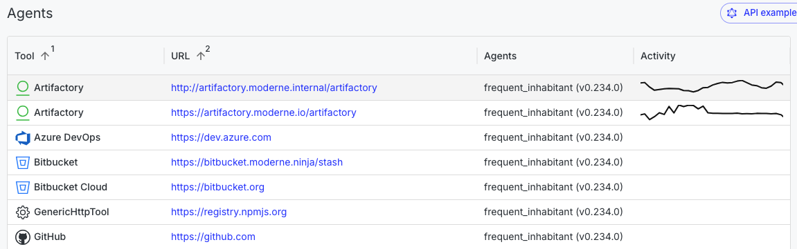

The administrative Agents dashboard now uses a table-based layout that improves how administrators discover and view agent integrations. The new unified view allows filtering by tools,
tenants, and agents, making it faster to locate specific configurations compared to the previous card-based interface.

### UI v11.96.2 (2025/08/28)

- Bug fixes and other improvements.

### UI v11.96.1 (2025/08/27)

- Bug fixes and other improvements.

### UI v11.96.0 (2025/08/27)

- add white background to buttons on DevCenter security cards

### UI v11.95.1 (2025/08/27)

- Bug fixes and other improvements.

### UI v11.95.0 (2025/08/27)

- fetch and override more help if configured

### UI v11.94.3 (2025/08/26)

- Bug fixes and other improvements.

### UI v11.94.2 (2025/08/26)

- Bug fixes and other improvements.

### UI v11.94.1 (2025/08/25)

- centralize text/icon colors in builder color system

### UI v11.94.0 (2025/08/21)

- Bug fixes and other improvements.

### UI v11.93.0 (2025/08/21)

- Bug fixes and other improvements.

### UI v11.92.0 (2025/08/20)

- Bug fixes and other improvements.

### UI v11.91.0 (2025/08/20)

- allow repository table's columns to be resized and persisted in url

### UI v11.90.0 (2025/08/19)

- Bug fixes and other improvements.

### UI v11.89.0 (2025/08/19)

We have made changes to the key bindings and command palette:

- There is no longer a key bindings cheat sheet display when hitting `?`.
  - Instead `?` will now open the command palette which will also display the keybinds available for the page you are on (similar to the cheat sheet)
- The focus global search and command palette bindings are no longer customizable in the account menu
  - `?` as mentioned will now open the command palette
  - `/` will focus the global search
  - Key bindings can still be disabled/enabled via the same place in the account menu
- Many navigation shortcuts were previously one character key binds with no modifier. We have changed this so many now require the `shift` modifier in efforts to prevent unintended navigation.

### UI v11.88.1 (2025/08/15)

- Bug fixes and other improvements.

### UI v11.88.0 (2025/08/15)

- Bug fixes and other improvements.

### UI v11.87.0 (2025/08/14)

- add new custom 404 and 500 pages. Wire into to \_error and Page-error-boundary

### UI v11.86.0 (2025/08/14)

- add search syntax highlighting

### UI v11.85.0 (2025/08/13)

- add search tag syntax hint

### UI v11.84.1 (2025/08/12)

- Bug fixes and other improvements.

### UI v11.84.0 (2025/08/08)

- Bug fixes and other improvements.

### UI v11.83.1 (2025/08/08)

- Bug fixes and other improvements.

### UI v11.83.0 (2025/08/08)

- allow devCenter to be unset on an organization

### UI v11.82.1 (2025/08/06)

- Bug fixes and other improvements.

### UI v11.82.0 (2025/08/05)

- cli download link override

### UI v11.81.0 (2025/08/04)

- add secondary alphabetical sort to run results tree

### UI v11.80.1 (2025/08/02)

- Bug fixes and other improvements.

### UI v11.80.0 (2025/08/01)

- Removed Orphaned organization
  - As part of the migration away from the organization service for managing organization hierarchy, the Orphaned organization (previously available to admins) has been removed. The purpose of the Orphaned organization was to find repositories that had LSTs built for them but were not correctly configured in the organization hierarchy. This functionality is now available through [Lost and Found repositories](../administrator-documentation/moderne-platform/how-to-guides/troubleshooting-lst-issues.md#using-the-lost-and-found-query).
- add ability to set expiration on moderne token

### UI v11.79.1 (2025/08/01)

- Bug fixes and other improvements.

### UI v11.79.0 (2025/07/30)

- persist file exclusions. File exclusions are now included when committing from the result tree

### UI v11.78.6 (2025/07/30)

- Bug fixes and other improvements.

### UI v11.78.5 (2025/07/29)

- Bug fixes and other improvements.

### UI v11.78.4 (2025/07/29)

- Bug fixes and other improvements.

### UI v11.78.3 (2025/07/25)

- Bug fixes and other improvements.

### UI v11.78.2 (2025/07/25)

- Bug fixes and other improvements.

### UI v11.78.1 (2025/07/24)

- Bug fixes and other improvements.

### UI v11.78.0 (2025/07/24)

- add confirmation when about to run on more than 3000 repos

### UI v11.77.0 (2025/07/23)

- add copy command to install recipe to local Moderne CLI

### UI v11.76.3 (2025/07/17)

- Bug fixes and other improvements.

### UI v11.76.2 (2025/07/17)

- Bug fixes and other improvements.

### UI v11.76.1 (2025/07/16)

- Bug fixes and other improvements.

### UI v11.76.0 (2025/07/15)

- Bug fixes and other improvements.

### UI v11.75.0 (2025/07/15)

- shorten organizations in urls

### UI v11.74.1 (2025/07/15)

- Bug fixes and other improvements.

### UI v11.73.1 (2025/07/14)

- Bug fixes and other improvements.

### UI v11.73.0 (2025/07/11)

- Bug fixes and other improvements.

### UI v11.72.0 (2025/07/11)

- Bug fixes and other improvements.

### UI v11.71.0 (2025/07/10)

- Bug fixes and other improvements.

### UI v11.70.1 (2025/07/10)

- Bug fixes and other improvements.

### UI v11.70.0 (2025/07/10)

- Bug fixes and other improvements.

### UI v11.69.0 (2025/07/10)

- Bug fixes and other improvements.

### UI v11.68.2 (2025/07/09)

- Bug fixes and other improvements.

### UI v11.68.1 (2025/07/08)

- Bug fixes and other improvements.

### UI v11.68.0 (2025/07/08)

- Bug fixes and other improvements.

### UI v11.67.2 (2025/07/03)

- Bug fixes and other improvements.

### UI v11.67.1 (2025/07/03)

- Bug fixes and other improvements.

### UI v11.67.0 (2025/07/03)

- Bug fixes and other improvements.

### UI v11.66.0 (2025/07/02)

- remove openai integration

### UI v11.65.0 (2025/06/27)

- Bug fixes and other improvements.

### UI v11.64.1 (2025/06/25)

- Bug fixes and other improvements.

### UI v11.63.0 (2025/06/23)

- Bug fixes and other improvements.

### UI v11.62.0 (2025/06/20)

- Bug fixes and other improvements.

### UI v11.61.0 (2025/06/19)

- Bug fixes and other improvements.

### UI v11.60.0 (2025/06/17)

- Bug fixes and other improvements.

### UI v11.59.0 (2025/06/13)

- Bug fixes and other improvements.

### UI v11.58.0 (2025/06/11)

- exposes the ingested and published at dates for repositories in the repository grid. Displays the last refresh of the grid data

### UI v11.57.0 (2025/06/10)

- Bug fixes and other improvements.

### UI v11.56.0 (2025/06/09)

- devCenter Recipe support

### UI v11.55.3 (2025/06/05)

- Bug fixes and other improvements.

### UI v11.55.2 (2025/06/02)

- Bug fixes and other improvements.

### UI v11.55.1 (2025/05/30)

- Bug fixes and other improvements.

### UI v11.55.0 (2025/05/29)

- Bug fixes and other improvements.

### UI v11.54.0 (2025/05/27)

- Bug fixes and other improvements.

### UI v11.53.2 (2025/05/24)

- Bug fixes and other improvements.

### UI v11.53.1 (2025/05/23)

- Bug fixes and other improvements.

### UI v11.53.0 (2025/05/22)

- add quick search to results tree
- add quick filters to recipe results tree

### UI v11.52.0 (2025/05/17)

- display status icons on results tree
- update builder greeter

### UI v11.51.4 (2025/05/09)

- Bug fixes and other improvements.

### UI v11.51.3 (2025/05/08)

- Bug fixes and other improvements.

### UI v11.51.2 (2025/05/07)

- Bug fixes and other improvements.

### UI v11.51.1 (2025/05/06)

- Bug fixes and other improvements.

### UI v11.51.0 (2025/05/05)

- Bug fixes and other improvements.

### UI v11.50.0 (2025/05/02)

- add new task center

### UI v11.49.0 (2025/04/30)

- refactor moddy subscription to use subscribeToMore

### UI v11.48.0 (2025/04/25)

- Bug fixes and other improvements.

### UI v11.47.1 (2025/04/24)

- Bug fixes and other improvements.

### UI v11.47.0 (2025/04/24)

- Bug fixes and other improvements.

### UI v11.46.1 (2025/04/23)

- Bug fixes and other improvements.

### UI v11.46.0 (2025/04/22)

- Bug fixes and other improvements.

### UI v11.45.1 (2025/04/21)

- Bug fixes and other improvements.

### UI v11.45.0 (2025/04/18)

- Bug fixes and other improvements.

### UI v11.44.0 (2025/04/18)

- Bug fixes and other improvements.

### UI v11.43.2 (2025/04/16)

- Bug fixes and other improvements.

### UI v11.43.1 (2025/04/16)

- Bug fixes and other improvements.

### UI v11.43.0 (2025/04/16)

- Bug fixes and other improvements.

### UI v11.42.3 (2025/04/16)

- Bug fixes and other improvements.

### UI v11.42.2 (2025/04/15)

- Bug fixes and other improvements.

### UI v11.42.1 (2025/04/15)

- Bug fixes and other improvements.

### UI v11.42.0 (2025/04/15)

- Bug fixes and other improvements.

### UI v11.41.0 (2025/04/14)

- change with authorization from list of buttons to grid

### UI v11.40.0 (2025/04/11)

- Bug fixes and other improvements.

### UI v11.39.0 (2025/04/10)

- Bug fixes and other improvements.

### UI v11.38.0 (2025/04/08)

- Bug fixes and other improvements.

### UI v11.37.1 (2025/04/05)

- Bug fixes and other improvements.

### UI v11.37.0 (2025/04/05)

- use instance name on recipe run title

### UI v11.36.0 (2025/04/04)

- add nickname to agent grid
- handle batch change commit display

### UI v11.35.0 (2025/04/04)

- update builder dialogs to be full screen

### UI v11.34.0 (2025/04/03)

- update conversation query to new schema
- stop conversation in progress

### UI v11.33.0 (2025/04/02)

- Bug fixes and other improvements.

### UI v11.32.0 (2025/04/02)

- Bug fixes and other improvements.

### UI v11.31.2 (2025/04/01)

- Bug fixes and other improvements.

### UI v11.31.1 (2025/03/31)

- Bug fixes and other improvements.

### UI v11.31.0 (2025/03/28)

- Add GitLab signin option

### UI v11.30.2 (2025/03/28)

- Bug fixes and other improvements.

### UI v11.30.1 (2025/03/27)

- Bug fixes and other improvements.

### UI v11.30.0 (2025/03/27)

- data table description tool integration

### UI v11.29.2 (2025/03/27)

- Bug fixes and other improvements.

### UI v11.29.1 (2025/03/27)

- Bug fixes and other improvements.

### UI v11.29.0 (2025/03/26)

- Add visual to indicate a recipe is running

### UI v11.28.1 (2025/03/26)

- Bug fixes and other improvements.

### UI v11.28.0 (2025/03/25)

- Bug fixes and other improvements.

### UI v11.27.0 (2025/03/21)

- display org context information with moddy

### UI v11.26.1 (2025/03/20)

- Bug fixes and other improvements.

### UI v11.26.0 (2025/03/20)

- Bug fixes and other improvements.

### UI v11.25.1 (2025/03/20)

- Bug fixes and other improvements.

### UI v11.25.0 (2025/03/19)

- add logo support for dropwizard and biome

### UI v11.24.0 (2025/03/18)

- builder bulk delete

### UI v11.23.0 (2025/03/14)

- add admin status page link to deployment banner

### UI v11.22.0 (2025/03/14)

- add llm logos to agent cards
- increase visibility of results status bar

### UI v11.21.1 (2025/03/12)

- Bug fixes and other improvements.

### UI v11.21.0 (2025/03/11)

- add non-configured state to moddy page
- use Recommended default sorting for recipe run results

### UI v11.20.0 (2025/03/11)

- Bug fixes and other improvements.

### UI v11.19.0 (2025/03/05)

- add drag handle to results view

### UI v11.18.0 (2025/03/04)

- Bug fixes and other improvements.

### UI v11.17.0 (2025/03/04)

- Bug fixes and other improvements.

### UI v11.16.0 (2025/03/03)

- Bug fixes and other improvements.

### UI v11.15.0 (2025/02/28)

- add banner to notifiy user of service disruption

### UI v11.14.4 (2025/02/28)

- Bug fixes and other improvements.

### UI v11.14.3 (2025/02/27)

- Bug fixes and other improvements.

### UI v11.14.2 (2025/02/27)

- Bug fixes and other improvements.

### UI v11.14.1 (2025/02/27)

- Bug fixes and other improvements.

### UI v11.14.0 (2025/02/27)

- add light/dark mode toggle for builder

### UI v11.13.0 (2025/02/26)

- persist audit log grid state to url

### UI v11.12.0 (2025/02/26)

- expose LLM card and configuration for agent LLM configuration

### UI v11.11.0 (2025/02/25)

- Bug fixes and other improvements.

### Agent v0.210.0 (2025/02/22)

As of Moderne Agent v0.210.0, the organizations service configuration has moved from `moderne.agent.organization` to `moderne.agent.organization.service`.

#### Before

```properties
moderne.agent.organization.url=https://my-organizations-service
moderne.agent.organization.updateIntervalSeconds=600
```

#### After

```properties
moderne.agent.organization.service.url=https://my-organizations-service
moderne.agent.organization.service.updateIntervalSeconds=600
```

### UI v11.10.1 (2025/02/22)

- Bug fixes and other improvements.

### UI v11.10.0 (2025/02/21)

- Bug fixes and other improvements.

### UI v11.9.0 (2025/02/20)

- promote new Results v2 to default view

The `Results` tab of a recipe run now renders the new `Results` experience, providing an improved way for users to view and interact with the outcomes of a recipe run.
The former `Results` tab grid view is now available in the `Repository status` tab.
Results tab (New!)


Repository status tab


### UI v11.8.5 (2025/02/20)

- Bug fixes and other improvements.

### UI v11.8.4 (2025/02/19)

- Bug fixes and other improvements.

### UI v11.8.3 (2025/02/19)

- Bug fixes and other improvements.

### UI v11.8.2 (2025/02/19)

- Bug fixes and other improvements.

### UI v11.8.1 (2025/02/17)

- Bug fixes and other improvements.

### UI v11.8.0 (2025/02/14)

- results v2 tab cutover

### UI v11.7.4 (2025/02/14)

- Bug fixes and other improvements.

### UI v11.7.3 (2025/02/14)

- Bug fixes and other improvements.

### UI v11.7.2 (2025/02/13)

- Bug fixes and other improvements.

### UI v11.7.1 (2025/02/12)

- Bug fixes and other improvements.

### UI v11.7.0 (2025/02/12)

- add marketplace sorting

### UI v11.6.2 (2025/02/12)

- Bug fixes and other improvements.

### UI v11.6.1 (2025/02/11)

- Bug fixes and other improvements.

### UI v11.6.0 (2025/02/11)

- Bug fixes and other improvements.

### UI v11.5.3 (2025/02/07)

- Bug fixes and other improvements.

### UI v11.5.2 (2025/02/07)

- Bug fixes and other improvements.

### UI v11.5.1 (2025/02/06)

- Bug fixes and other improvements.

### UI v11.5.0 (2025/02/05)

- add disable topology option
- update checkbox theme
- download datatables directly from visualization run
- show warning when a duplicate recipe is being added

### UI v11.4.0 (2025/02/03)

- Bug fixes and other improvements.

### UI v11.3.0 (2025/02/01)

- add scm organization hierarchy to results. sorting by result count

### UI v11.2.0 (2025/01/30)

- add mass commit controls for results v2. Adds retrieval of all results after run completes.
- search result diff v2

### UI v11.1.1 (2025/01/24)

- Bug fixes and other improvements.

### UI v11.1.0 (2025/01/23)

- add alphabetical list of top-level categories
- add commit job hover card to activity view

### UI v11.0.0 (2025/01/22)

feat/marketplace img tag

### UI v10.182.3 (2025/01/17)

- Bug fixes and other improvements.

### UI v10.182.2 (2025/01/16)

- Bug fixes and other improvements.

### UI v10.182.1 (2025/01/16)

- Bug fixes and other improvements.

### UI v10.182.0 (2025/01/16)

- Bug fixes and other improvements.

### UI v10.181.0 (2025/01/10)

- make org cells links

### UI v10.180.1 (2025/01/06)

- Bug fixes and other improvements.

### UI v10.180.0 (2025/01/04)

- Bug fixes and other improvements.

### UI v10.179.2 (2024/12/27)

- Bug fixes and other improvements.

### UI v10.179.1 (2024/12/24)

- Bug fixes and other improvements.

### UI v10.179.0 (2024/12/24)

- add more category logo support

### UI v10.178.1 (2024/12/23)

- Bug fixes and other improvements.

### UI v10.178.0 (2024/12/23)

When the screen shrinks vertically, vertical scrolling has been replaced with a `More` menu for the left-hand navigation menu.


### UI v10.177.1 (2024/12/23)

- Bug fixes and other improvements.

### UI v10.177.0 (2024/12/21)

- add more logo support

### UI v10.176.1 (2024/12/19)

- Bug fixes and other improvements.

### UI v10.176.0 (2024/12/13)

- Bug fixes and other improvements.

### UI v10.175.0 (2024/12/12)

#### Export audit logs as CSV

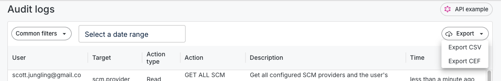

You can now export audit logs as a CSV file in addition to the existing CEF format. The export can be limited to specific range through the date range picker.

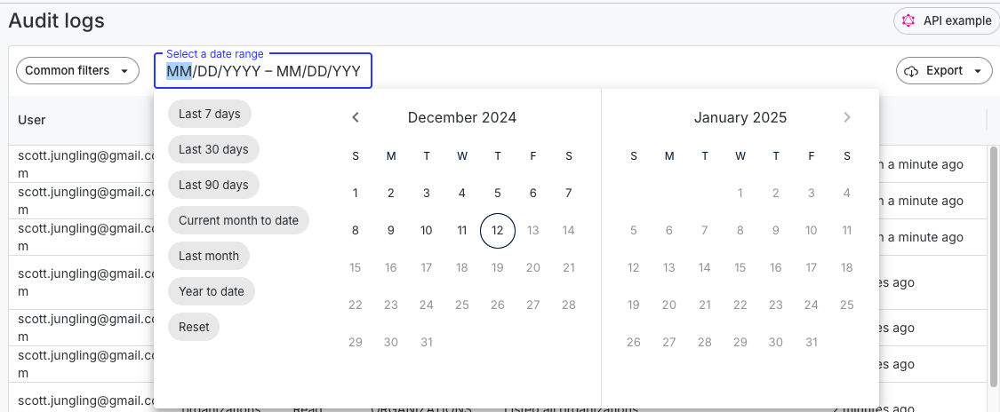

Selecting a date range will also limit the results in the data table.

#### Other

- add status indicators to activity view

### UI v10.174.0 (2024/12/10)

#### Usage report now available

Usage reports are now available across the entire tenant for administrators. In addition, team members can download usage reports for an organization through the DevCenter.

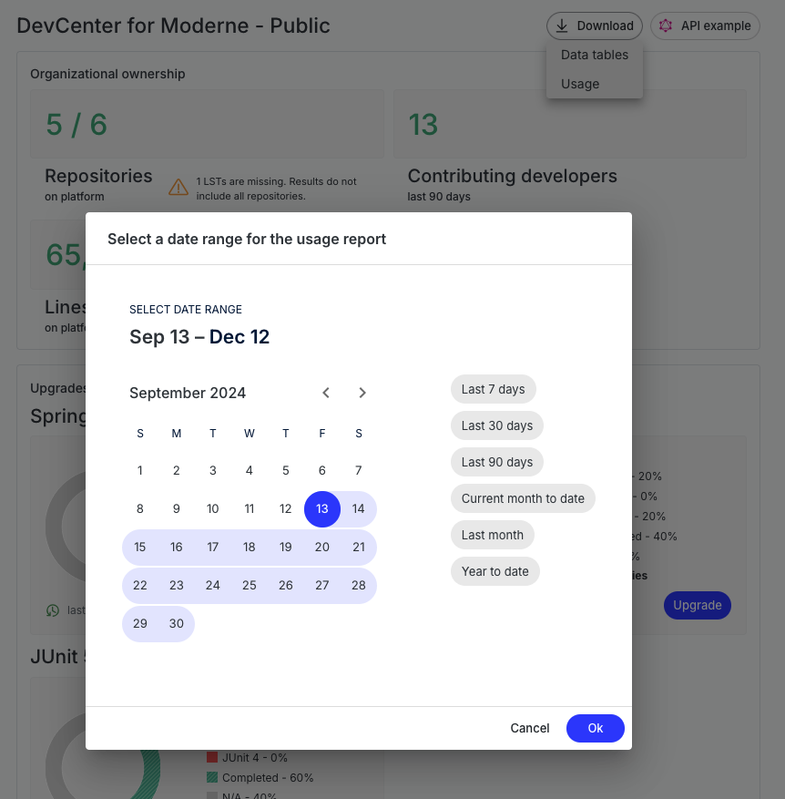

#### Other

- add field syncing to add to builder dialog

### Artifact storage v0.251.0 (2024/12/10)

#### Ingest changes

The way origins are determined has changed. The SaaS now uses `GitRemote.Parser` to determine the origin which means we no longer remove `/scm` at the end of a (possible) origin. This can have impact if you use Bitbucket (DC/Server) and have not correctly configured the origin in the agent.

Please make sure that, in case of Bitbucket, you have configured it as such:

```
...
# note there is no `/scm` at the end, this is not part of the origin.
moderne.agent.bitbucket[0].url=https://bitbucket.moderne.io/stash
...
```

### UI v10.173.1 (2024/12/08)

- Bug fixes and other improvements.

### UI v10.173.0 (2024/12/06)

- Sometimes a recipe run will have results where some repositories have changes but also are marked with status error indicating that the recipe left informational error markers. You can now choose to commit these changes if you would like. When commiting these changes you will see an extra warning:

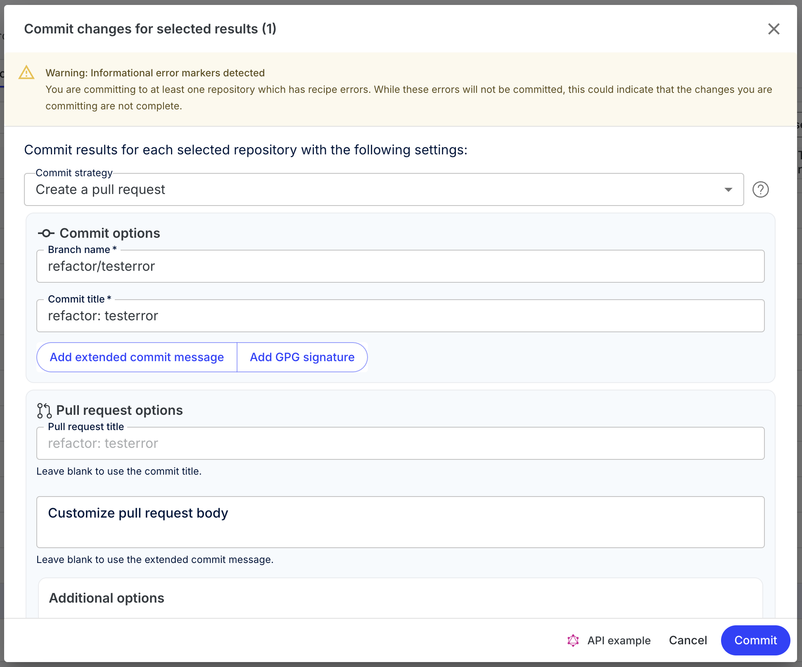

### UI v10.172.0 (2024/12/03)

#### Builder

When editting the recipe details or creating a new recipe there is now field synchronization between the name and id fields that can be toggled off an on:

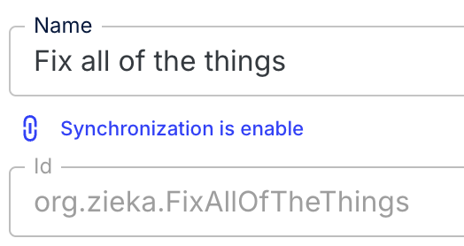

When on you can edit the Name and the last part of the recipe ID will automatically be the Pascal cased version of the Name field.

When toggled off you can edit the fields seperately.

### UI v10.171.0 (2024/11/26)

#### Builder

When searching the recipe tree partial and full matches of the recipe ID are now surfaced.

### UI v10.170.0 (2024/11/25)

#### Visualizations

The header on a visualization page will now include the organization the visualization was run on.

### Agent 0.195.0 (2024/11/21)

- As of Agent version 0.195.0 we are now **no longer publishing new versions to Azure Container Registry**. If you were using Azure Container Registry to pull a Docker image for Moderne Agent, you will need to follow the instructions [here](../administrator-documentation/moderne-platform/how-to-guides/agent-configuration/agent-config.md#step-2-determine-how-you-will-run-the-agent) to build a Dockerfile and publish your own Docker image for the Moderne Agent.
- As of Agent version 0.195.0 we are now **no longer publishing new versions to Azure DevOps**. If you were using Azure DevOps to pull the agent's executable JAR, you will now pull the agent from Maven Central. The link to the latest agent release on Maven Central can be found on our [agent releases page](./agent-releases.md)

### UI v10.169.2 (2024/11/15)

- Bug fixes and other improvements.

### UI v10.169.1 (2024/11/15)

- Bug fixes and other improvements.

### UI v10.169.0 (2024/11/14)

#### Marketplace Fall 2024 update

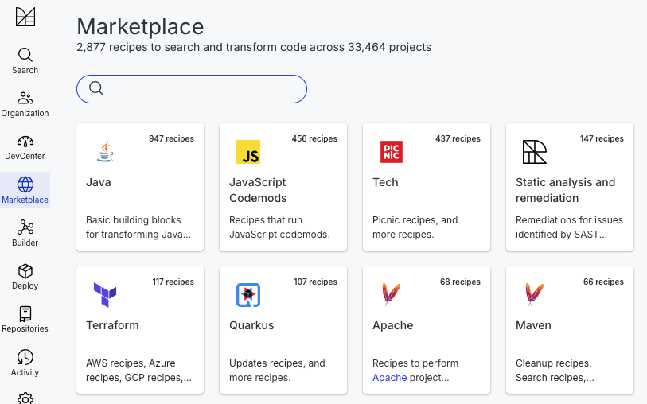

It's the end of the year and the holidays are right around the corner. Sales abound! To celebrate we've given the marketplace a fresh coat of paint. We hope you enjoy the new look and feel.

#### GraphiQL update

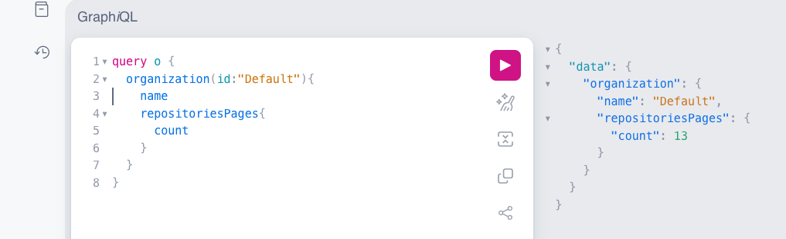

We have also updated our GraphiQL plugin to the latest version.

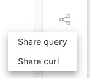

You can still share your queries with others by clicking the share button. This will give you the option to either copy the URL to view the query within the Moderne UI or copy to run via cURL.

- Bug fixes and other improvements.

### UI v10.168.0 (2024/11/12)

- Bug fixes and other improvements.

### UI v10.167.0 (2024/11/11)

#### Builder

When selecting the layout (3D topology or the tree view in the main content pane) the user's last choice will now be persisted.

### UI v10.166.0 (2024/11/05)

- Bug fixes and other improvements.

### UI v10.165.1 (2024/10/31)

- Bug fixes and other improvements.

### UI v10.165.0 (2024/10/30)

- sort recipe run results by `status` and then `totalResults`
- add preconditions to top

### UI v10.164.0 (2024/10/29)

- Bug fixes and other improvements.

### UI v10.163.3 (2024/10/27)

- Bug fixes and other improvements.

### UI v10.163.2 (2024/10/26)

- Bug fixes and other improvements.
  - Includes fixes for builder side panel resizing issues

### UI v10.163.1 (2024/10/25)

- Bug fixes and other improvements.

### UI v10.163.0 (2024/10/25)

- Bug fixes and other improvements.

### UI v10.162.0 (2024/10/23)

- updated keyboard shortcuts for less collisions.  
  Reminder: `Shift` + `?` should get you a list of them:

<figure>
  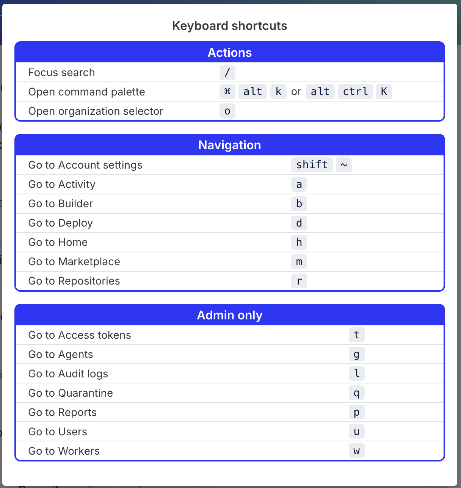
  <figcaption></figcaption>
</figure>

### UI v10.161.0 (2024/10/22)

#### Updated navigation

We've updated our global navigation to help maximize the important content on your screen. We were able to save over 150 pixels of horizontal space through the redesign of the navigation bar.

<figure>
  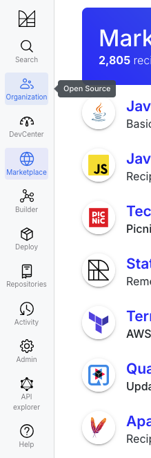
  <figcaption>
    _Tooltip hints provide access to your selected organization_
  </figcaption>
</figure>

- add undo button

### UI v10.160.1 (2024/10/16)

- Bug fixes and other improvements.

### UI v10.160.0 (2024/10/15)

For the public Moderne app we have added a new user integrations settings page:

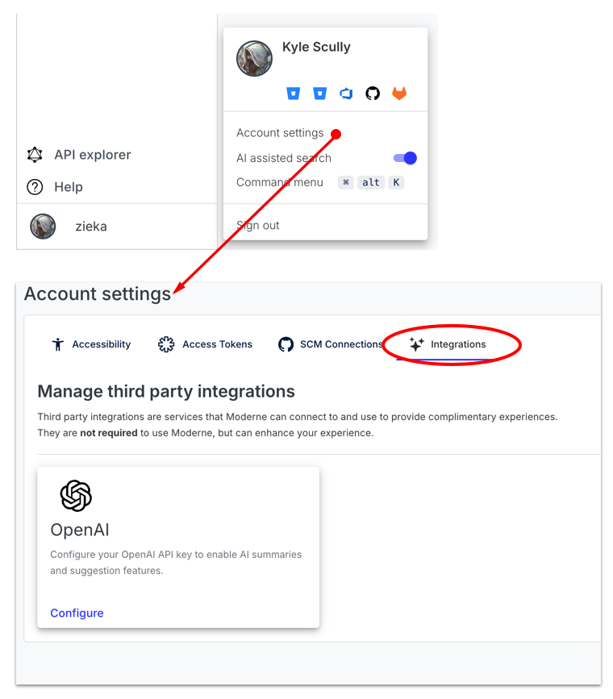

This page will provide individual users the ability to augment their Moderne experience with integration specific features. Any keys used for integrations are only stored on your machine, specific to your browser, and only used on demand when you utilize a feature.

Our first integration allows a user to integrate Moderne with their own OpenAI API account. By setting up an OpenAI API key that has access to `/v1/chat/completions` the following features will be enabled:

**Builder recipe description suggestion**

Descriptions on custom recipes can often be overlooked, briefly filled in, or even skipped. With the push of a button a suggested description based on the custom recipe's yaml will be generated:

<figure>
  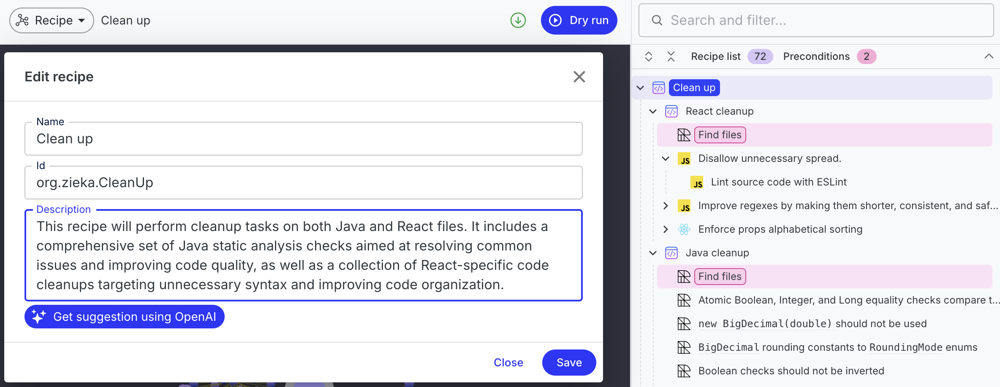
  <figcaption></figcaption>
</figure>

**Recipe run summary**

Often times you may come across marketplace recipes or more often custom recipes that are being run by someone else in your organization that you may not be as familiar with or just want to know more details about. Looking at the summary page after enabling the OpenAI integration will now give you a brief bullet point summary of the intent of the run:

<figure>
  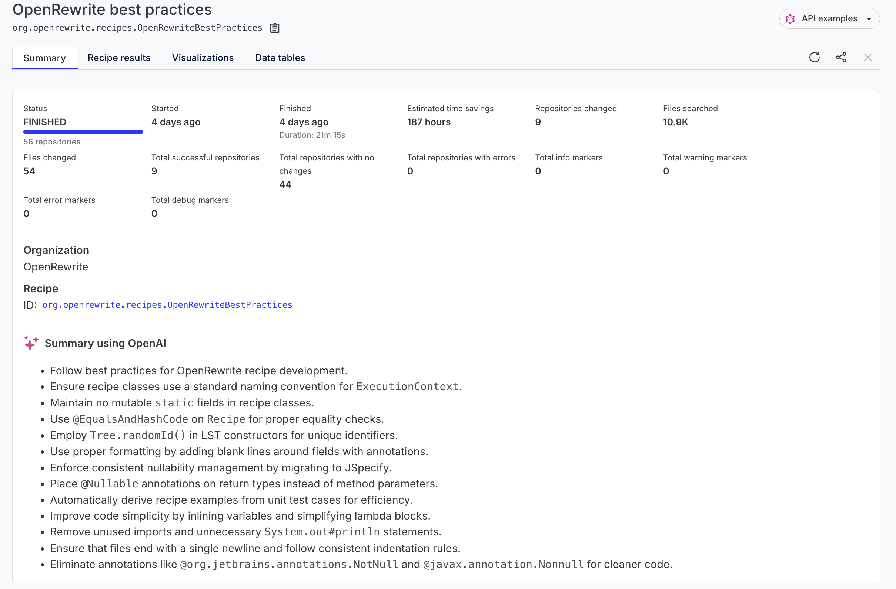
  <figcaption></figcaption>
</figure>

### UI v10.159.0 (2024/10/10)

- Bug fixes and other improvements.

### UI v10.158.0 (2024/10/09)

- Bug fixes and other improvements.

### UI v10.157.2 (2024/10/07)

- Bug fixes and other improvements.

### UI v10.157.1 (2024/10/07)

- Bug fixes and other improvements.

### UI v10.157.0 (2024/10/04)

- allow repository removal from organization from the repositories table

### UI v10.156.0 (2024/09/30)

- Bug fixes and other improvements.

### UI v10.155.0 (2024/09/27)

#### Builder

The builder is dead! Long live the new builder! - As many have known, we have built a new builder that has many advantages over the previous, some big examples include:

- The ability to work on multiple recipes
- The ability to work on recipes without having to navigate multiple pages.
- 3D representation
- An improved 2D tree representation
- Search and filter abilities

During the beta we received lots of feedback from all different types of users that helped us get to this point so first off -- Thank you! As always we continue to welcome feedback as we refine and make improvements to ensure we are creating tools that are impactful for our users.

In this update we have removed the old builder and its navigation links. If you were working on a recipe in the old builder you will be able to find it in the new builder by either the greeter dialog or recipe menu:

<figure>
  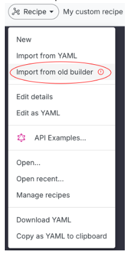
  <figcaption></figcaption>
</figure>

<figure>
  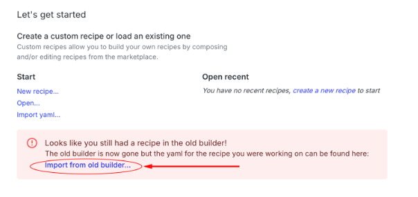
  <figcaption></figcaption>
</figure>

From here you can save your YAML locally or import it into the new builder:

<figure>
  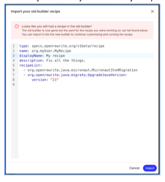
  <figcaption></figcaption>
</figure>

After you import the recipe you will no longer see these messages about an old builder recipe and you will find your recipe in the manage recipes dialog. If for some reason you don't, a backup of it is stored in your browsers local storage under the key `moderne:recipe-builder:backup`

You may be curious about what happens to all the "Add to builder" buttons in the marketplace. They are still there! Though they behave differently now.

Clicking Add to builder button now opens a dialog allowing you to select which recipe you would like to add the recipe to:

<figure>
  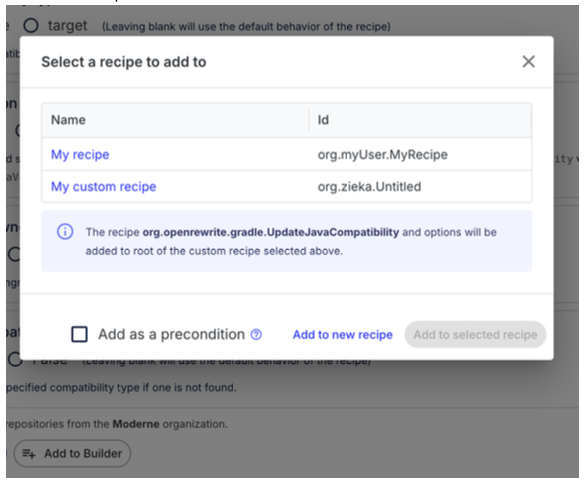
  <figcaption></figcaption>
</figure>

You can also select whether you want to add it as a precondition or not. Also note you can start a new recipe right from this dialog:

<figure>
  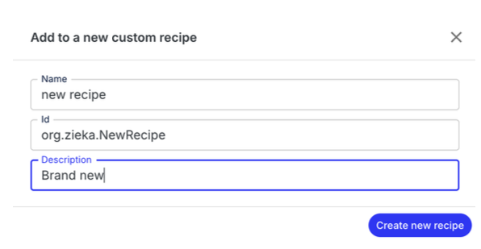
  <figcaption></figcaption>
</figure>

Regardless if you pick an existing recipe or create a new one, the marketplace recipe will be attached with its options to the root node of your selection where you can then drag and drop it to the desired location:

<figure>
  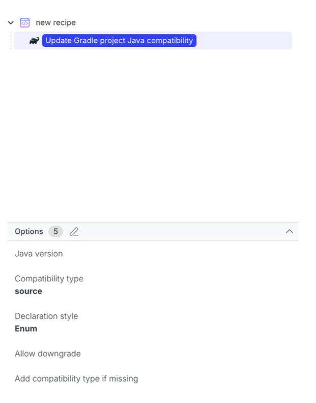
  <figcaption></figcaption>
</figure>

### UI v10.154.0 (2024/09/26)

- add logo support for android, dotnet, gitlab, reactor, scala

### UI v10.153.3 (2024/09/26)

- Bug fixes and other improvements.

### UI v10.153.2 (2024/09/26)

- Bug fixes and other improvements.

### UI v10.153.1 (2024/09/26)

- Bug fixes and other improvements.

### UI v10.153.0 (2024/09/25)

- add ability to download devcenter datatable
- add missing lst message to devcenter

### UI v10.152.0 (2024/09/23)

- update activity view url

### DevCenter v0.253.0 (2024/09/23)

The method for calculating lines of code has changed slightly. We now count raw file lines. This is much quicker (as we can use this information from the LST) and this results better DevCenter performance.

### UI v10.151.0 (2024/09/17)

- Bug fixes and other improvements.

### DevCenter v0.250.0 (2024/09/13)

DevCenter API versioning is introduced to allow admins to configure a new version of DevCenter. Using version `1` allows the use of the DevCenter’s upgrades and migrations section to treat repositories with no results as “N/A” instead of Completed/Compliant.

#### Why are these changes being made?

These changes to the DevCenter provide more visibility to users, specifically for which repos they should care about completing the upgrade/migration, and which ones aren’t important for this upgrade/migration. Imagine an organization cares about the Spring Boot 3 upgrade and has 75 Java repositories (50 on the latest Spring Boot and 25 on older versions) and 25 non-Java repositories. In the current implementation of DevCenter, users would see 50% completed, even though 25 of those repositories don’t even use Java. After this set of changes, users will now see “N/A” for repositories that are not important to the migration.


#### Changes required to use this feature

If you want to use this feature you will have to set the version to `1` and add a new “measure” to your DevCenter configuration. Take a look at [this commit](https://github.com/moderneinc/moderne-organizations/commit/7515890c9f2b7730423db56e26dc7577b1b095f9) in moderne-organizations for an example. If your upgrades and migrations do not include the ones mentioned here and you need help identifying the recipe for the “completed” measure, please feel free to email us at support@moderne.io.

### UI v10.150.0 (2024/09/12)

#### Builder

We have added a recent recipes tab to the recipe finder dialog. Starting now whenever you add a recipe node in the builder or go to a recipe's details page in the marketplace that recipe will be added to your recent recipes list. This list currently will retain the last 25 recipes for quick access:

<figure>
  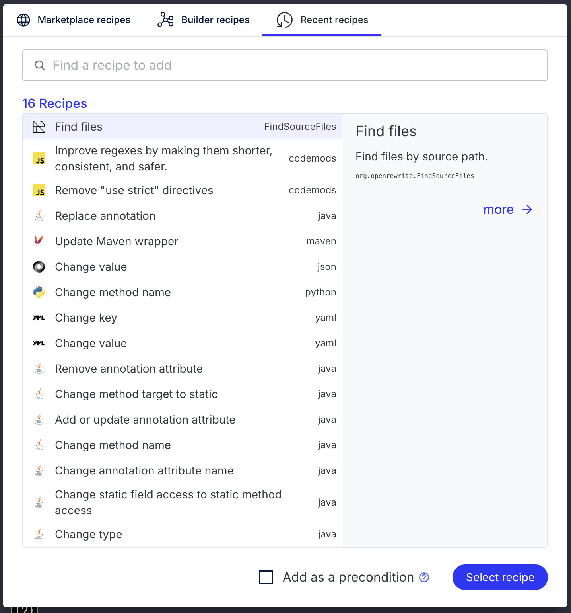
  <figcaption></figcaption>
</figure>

### UI v10.149.0 (2024/09/12)

#### Builder

The speed dial actions on the 3D topology view can get pretty busy especially when the layout and the view is in the sidebar. We have consolidated Add precondition and Add recipe into a single option similar to the tree item controls:

<figure>
  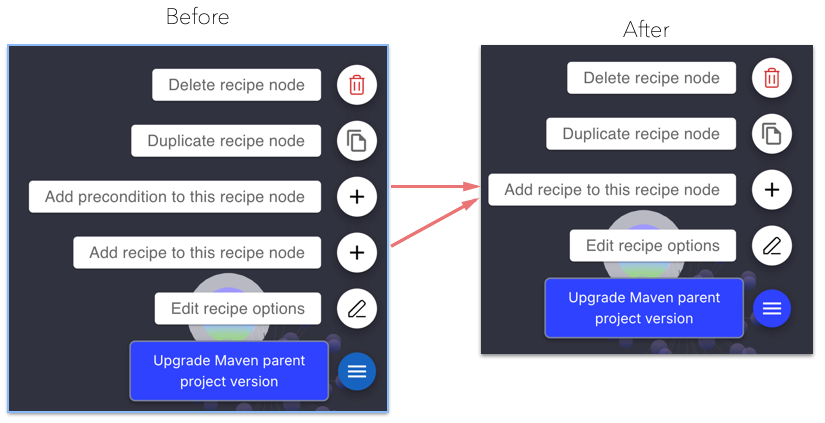
  <figcaption></figcaption>
</figure>

This action will still take you to the recipe finder dialog which will allow you to add the recipe as a precondition by manually checking the precondition checkbox.

### UI v10.148.0 (2024/09/10)

#### Builder

We improved the performance of the recipe tree and dramatically improved the drag and drop behavior to reorder nodes:

<figure>
  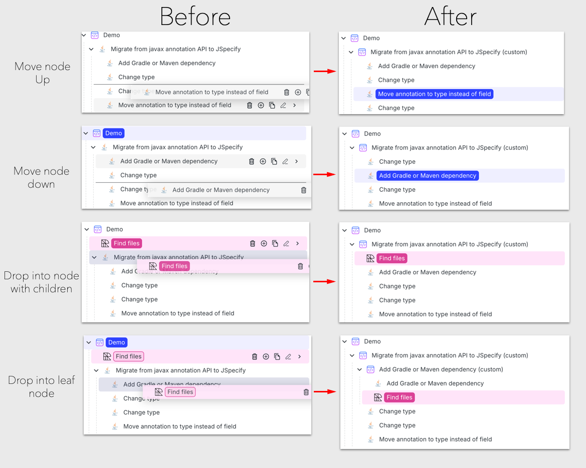
  <figcaption></figcaption>
</figure>

### UI v10.147.0 (2024/09/09)

- add category icons to quick search

### UI v10.146.0 (2024/09/05)

- Bug fixes and other improvements.

### UI v10.145.1 (2024/08/30)

- Bug fixes and other improvements.

### UI v10.145.0 (2024/08/30)

#### Builder

We have added new tabs to the recipe finder dialog that is presented when adding a recipe to the currently selected node. The default tab is _Marketplace recipes_ and provides the same experience users have already become familiar with. There is also a tab for _Builder recipes_ to allow users to select one of their custom recipes:

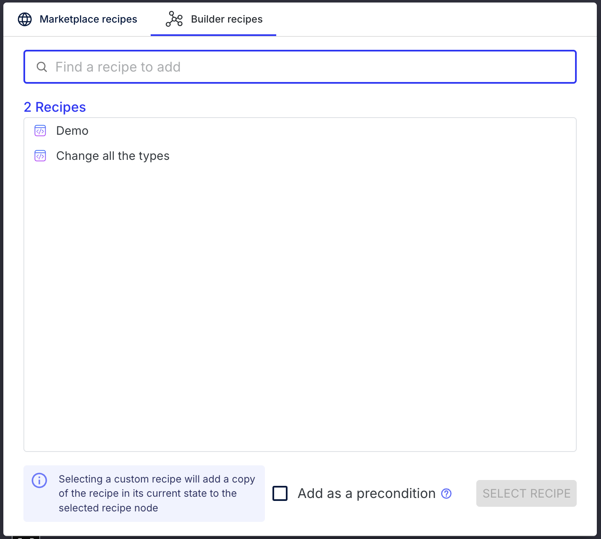

Selecting one will make a copy of the recipe in its current form and add it to the currently selected node similar to selecting one of the marketplace recipes. This including toggling it to be added as a precondition.

### UI v10.144.0 (2024/08/27)

#### Builder

We have added a toggle-able help panel with a color legend and topology control scheme:

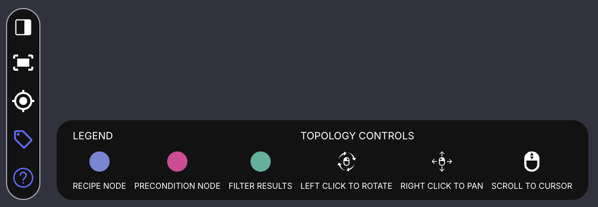

### UI v10.143.0 (2024/08/22)

#### Builder

Previously using the search and filter would allow you to find recipes by name but unfortunately in cases where a recipe is used many times you will get results like this:

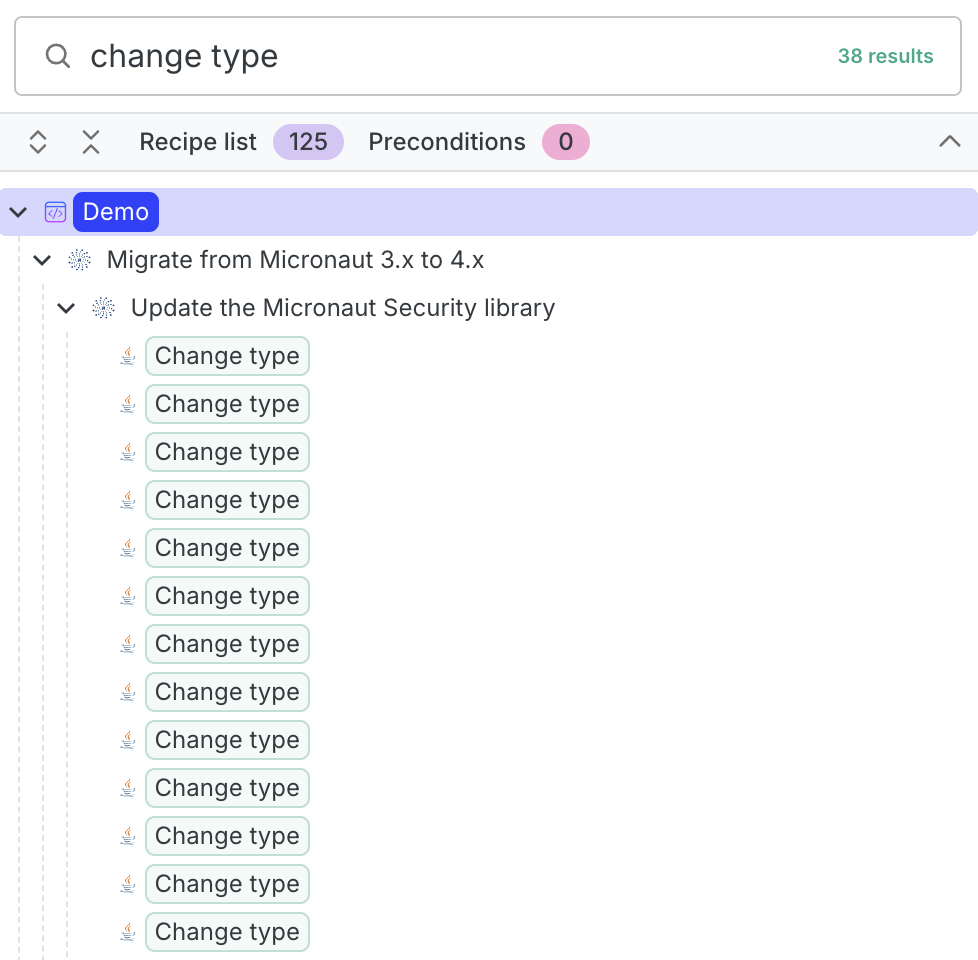

In efforts to address this the search and filter feature is now aware of option input values and will take these into consideration:

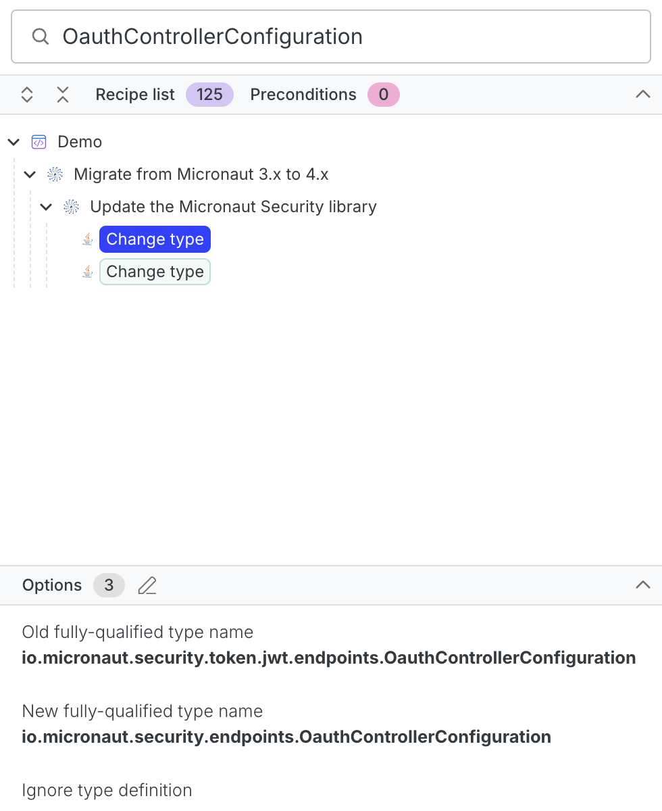

### UI v10.142.0 (2024/08/21)

#### Builder

Often a custom recipe will be composed of a few recipes that are used many times with different options. We have heard feedback that going through the recipe selection dialog becomes tedious for this work. In response we have added a duplicate button that will clone the recipe node as a sibling node. If the recipe duplicated has options then the edit options dialog will open automatically after duplicating:

<figure>
  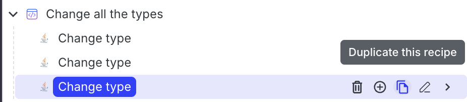
  <figcaption></figcaption>
</figure>

<figure>
  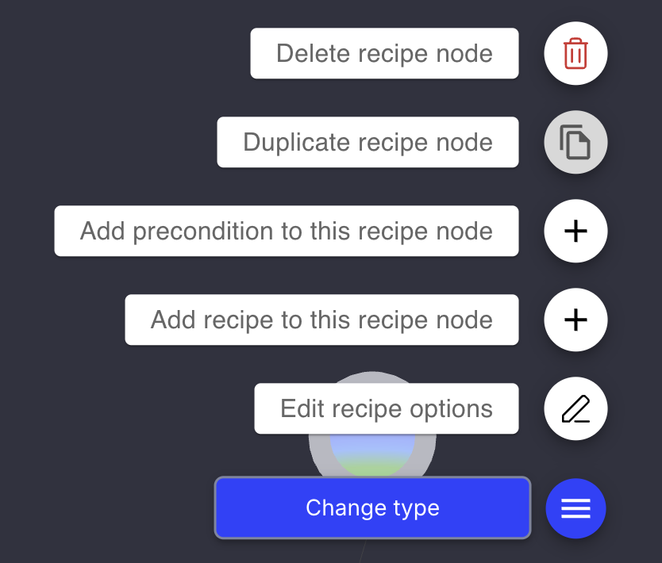
  <figcaption></figcaption>
</figure>

### UI v10.141.0 (2024/08/16)

- handle 401 errors where accessToken is still unexpired

### UI v10.140.0 (2024/08/15)

#### Builder

In efforts to provide more details in dialog we needed more space we have changed the builder dialogs so that they are the width of the main content area and positioned accordingly:

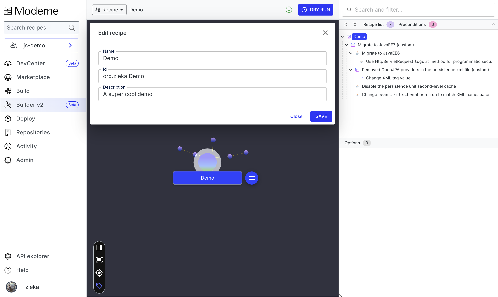

We have improved recipe selector so that the recipe description is visible to give the added context to users when constructing recipes:

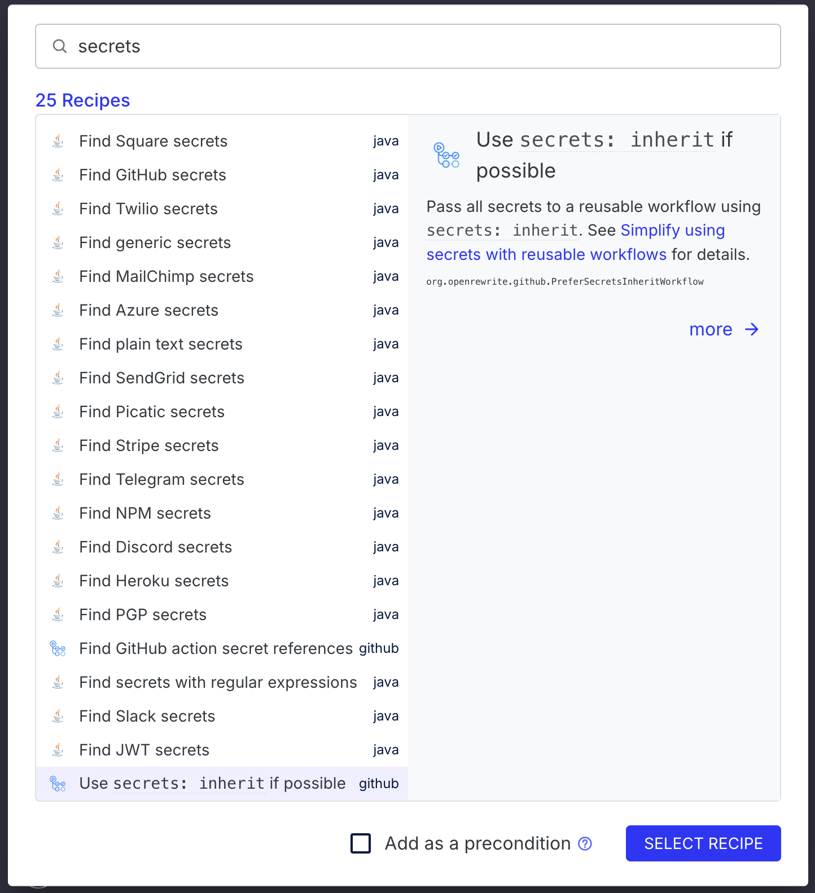

### UI v10.139.2 (2024/08/09)

- Bug fixes and other improvements.

### UI v10.139.1 (2024/08/09)

- Bug fixes and other improvements.

### UI v10.139.0 (2024/08/07)

We have added a new visualization mime type:

`application/vnd.moderne.yamlrecipe+json`

This new mime type allows visualization notebook authors the ability to generate and then provide a base64 encoded yaml recipe as output. The resulting visualization in Moderne will be the yaml recipe rendered in an editor with a recipe dry run button ready for users to use. An example can be found in the [find_methods_ai_generte_yaml.ipynb](https://github.com/moderneinc/moderne-visualizations-misc/blob/main/moderne_visualizations_misc/find_methods_ai_generate_yaml.ipynb) notebook.

### UI v10.138.0 (2024/08/07)

- add new category logos for ff4j, OpenFeature, and Unleash to support the new feature flag recipes

  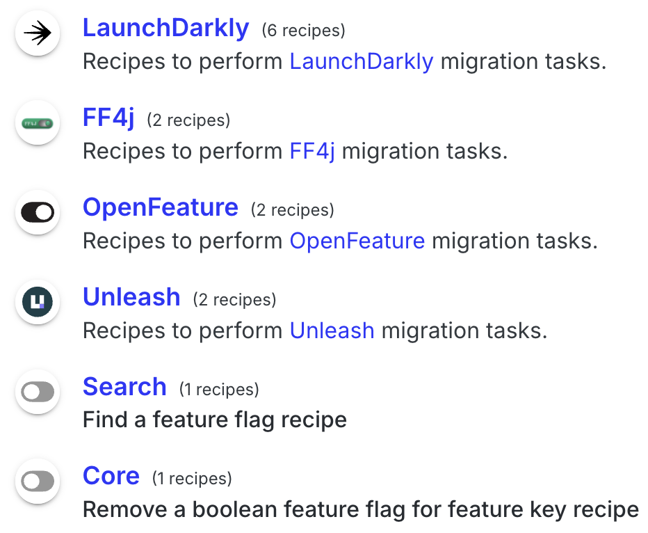

### UI v10.137.0 (2024/08/05)

- Visualizations that use the data tree grid output now have search highlighting built in

<figure>
  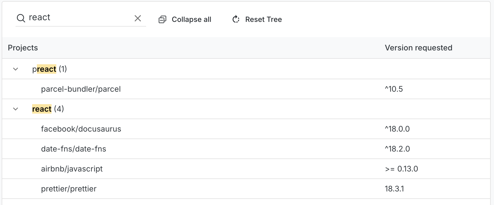
  <figcaption></figcaption>
</figure>

### UI v10.136.0 (2024/08/03)

- Bug fixes and other improvements.

### UI v10.135.0 (2024/08/02)

- Bug fixes and other improvements.

### UI v10.134.0 (2024/08/01)

- add authorization support for Azure DevOps. See how to [setup your agent to connect to Azure DevOps](../administrator-documentation/moderne-platform/how-to-guides/agent-configuration/configure-an-agent-with-azure-devops-services)

<figure>
  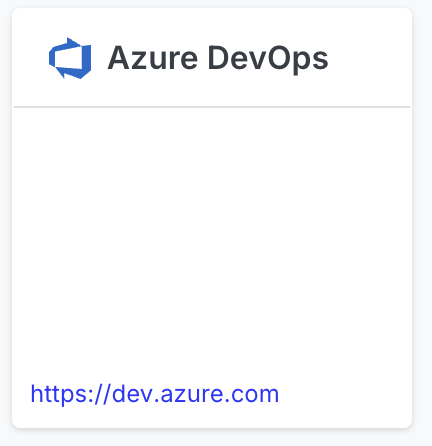
  <figcaption></figcaption>
</figure>

### UI v10.133.0 (2024/07/29)

We have added more quality of life improvements for the new builder:

- add builder keyboard shortcuts

  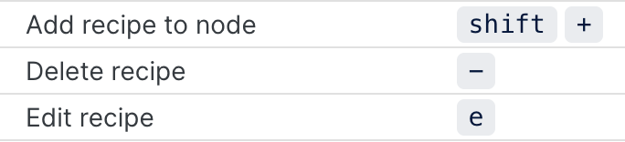

- the speed dial menu previously opened on hover but closed on click which made for a few variations of weird interactions. We have changed the menu so it must be clicked to open and clicked to close making the experience predictable and consistent. The speed dial menu also has a new icon:

  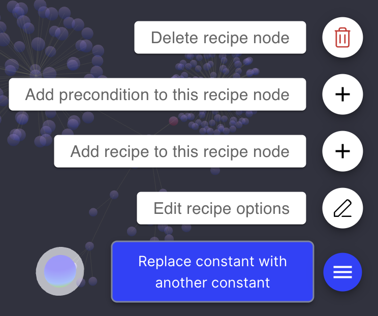

- improve builder options' readability and spacing on larger screens
- Bug fixes and other improvements.

UI v10.132.1 (2024/07/25)

- Bug fixes and other improvements.

### UI v10.132.0 (2024/07/25)

In this release we have made various improvements to the new builder to increase clarity and productivity.

- Since adding controls such as **add**, **edit**, **delete** to the tree view ([v10.124.0](#ui-v101240-20240620)) we found some users enjoy primarily using the tree view to compose recipes so we want to allow users to move this view to the main content window. There is now a new layout swap icon to swap the 3D topology view and the tree view:

<figure>
  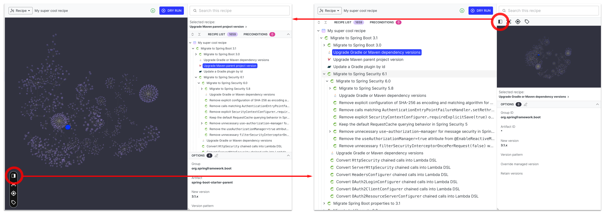
  <figcaption></figcaption>
</figure>

- We received feedback that the options were hard to discover. We have begun to address this by making the options panel auto open when the selected recipe has options and also auto expand to fit more options before having to scroll. Note the options have moved to the lower right now:

  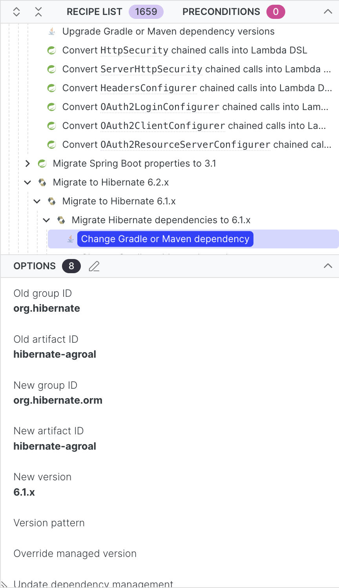

- We found that some users were not aware of the recipe menu and the options available there so we have made the button more visible by adding a label:

  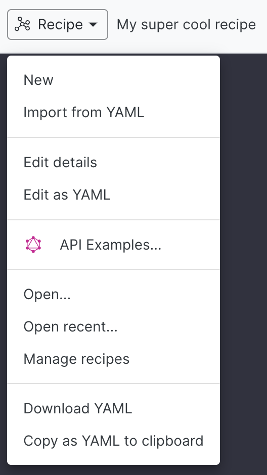

### UI v10.131.0 (2024/07/22)

- improve builder tree font on large displays

### UI v10.130.0 (2024/07/18)

- In the builder there is now a new menu item **Edit as YAML**

  This will open a text editor with the current recipe's yaml to edit:

<figure>
  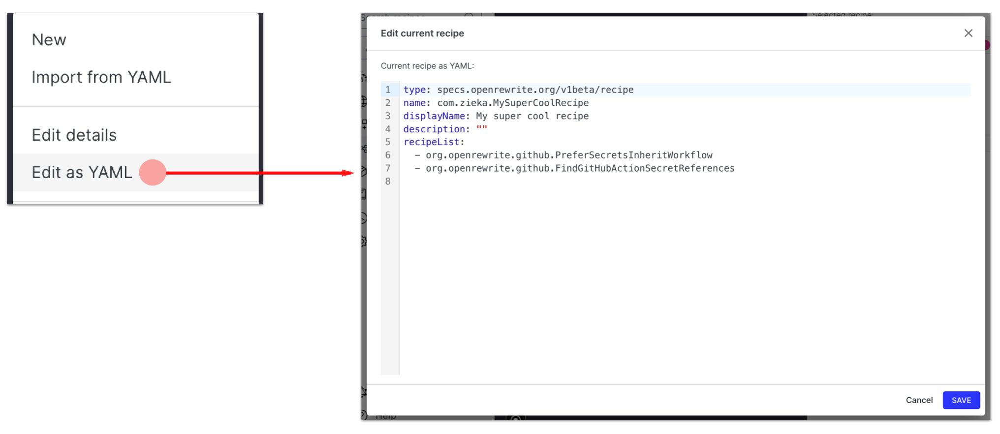
  <figcaption></figcaption>
</figure>

- In the builder you can now edit nest recipe details

### UI v10.129.0 (2024/07/16)

- Bug fixes and other improvements.

### UI v10.128.4 (2024/07/11)

- Bug fixes and other improvements.

### UI v10.128.3 (2024/07/10)

- Bug fixes and other improvements
  - In combination with other backend changes we now expose more data tables when running composite recipes. Find more information on the latest visualization package [here](https://github.com/moderneinc/moderne-visualizations-misc/blob/main/CHANGELOG.md).

### UI v10.128.2 (2024/07/09)

- Bug fixes and other improvements.

### UI v10.128.1 (2024/07/07)

- Bug fixes and other improvements.

### UI v10.128.0 (2024/07/03)

- use animated icon for loading-like statuses

### UI v10.127.0 (2024/06/28)

- Builder improvements:

  - add expand/collapse all buttons:

    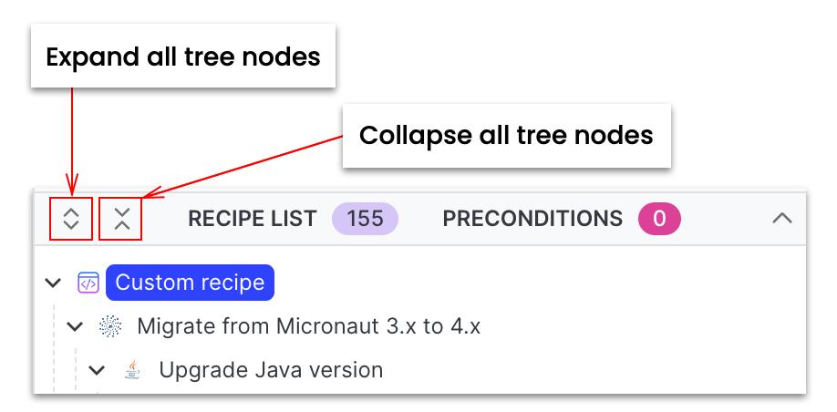

### UI v10.126.1 (2024/06/28)

- Bug fixes and other improvements.

### UI v10.126.0 (2024/06/27)

- Builder improvements:

  - To improve nested precondition clarity we have changed the color of the expanded dashed line when expanding a precondition:

    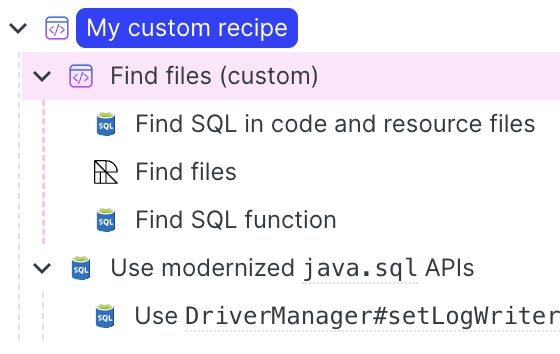

UI v10.125.2 (2024/06/26)

- Bug fixes and other improvements.

### UI v10.125.1 (2024/06/26)

- Bug fixes and other improvements.

### UI v10.125.0 (2024/06/26)

- In order to demonstrate how complete an impact analysis or set of changes is, we have added results for all repositories to the recipe run results, this now includes repositories for which we have no LST ingested into the platform.

<figure>
  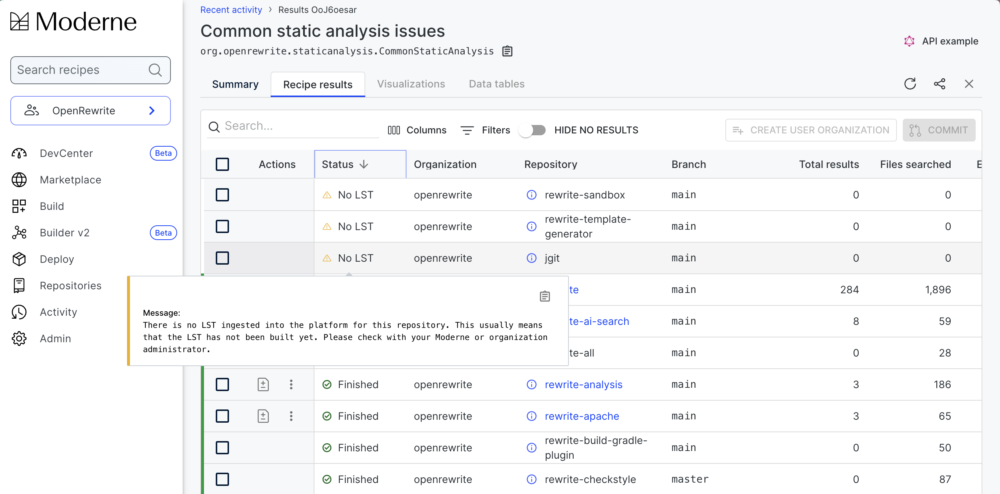
  <figcaption>_Recipe result with No LST ingested_</figcaption>
</figure>

### UI v10.124.1 (2024/06/23)

- Bug fixes and other improvements.

### UI v10.124.0 (2024/06/20)

- We have added dynamic controls to tree items in the tree view of the new builder. These controls will appear when interacting with the tree items:

 <figure>
  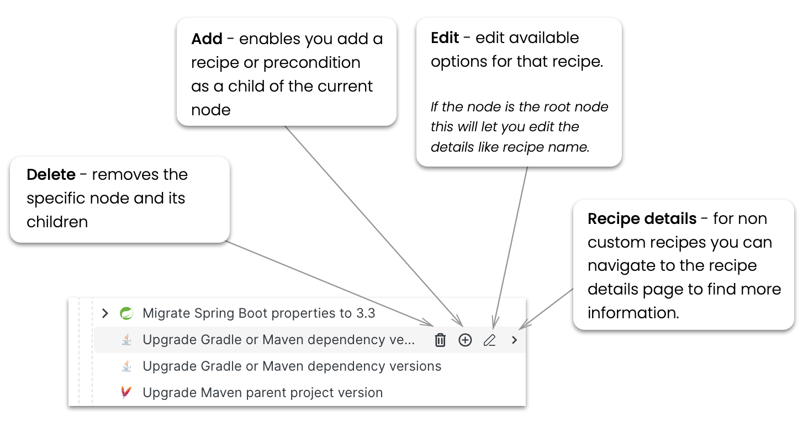
  <figcaption></figcaption>
</figure>

### UI v10.123.0 (2024/06/17)

- add empty state message to builder open dialog

### UI v10.122.0 (2024/06/13)

- Bug fixes and other improvements.

### UI v10.121.2 (2024/06/12)

- Bug fixes and other improvements.

### UI v10.121.0 (2024/06/11)

- In the new builder we have improved the default recipe ID only in private customer tenants. The new default ID will be based off the user's email. Example:
  - `jsmith@superco.com` -> `com.superco.jsmith.Untitled`
  - `j.smith@superco.ai` -> `ai.superco.j_smith.Untitled`
- The new builder now supports adding preconditions to any recipe node.

  Preconditions are recipes that run before the current list of recipes. When a recipe is used as a precondition, any file that it would make a change to is considered to meet the precondition. When more than one recipe is used as a precondition, all of them must make a change to the file for it to be considered to meet the precondition.

  Only when all preconditions are met will the recipes in the recipe list be run.

  _For more information, please see our_ [_preconditions documentation_](../user-documentation/moderne-platform/how-to-guides/preconditions.md)_._

  Preconditions can be added via a new button:

  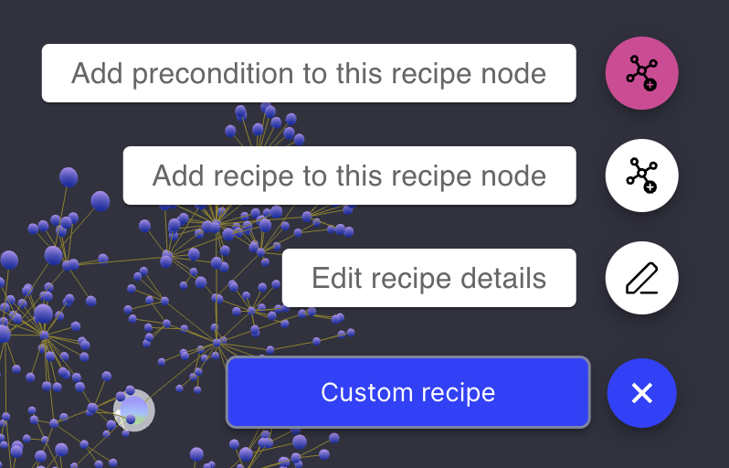

  or when adding a recipe by toggling this check box:

  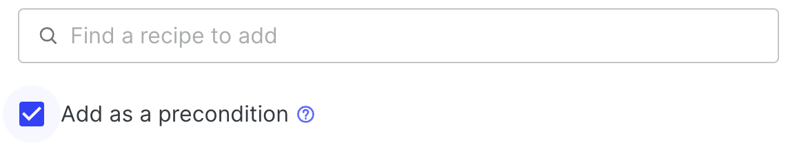

  Preconditions show up as a different color node in the 3D scene and highlighted in the tree view:

<figure>
  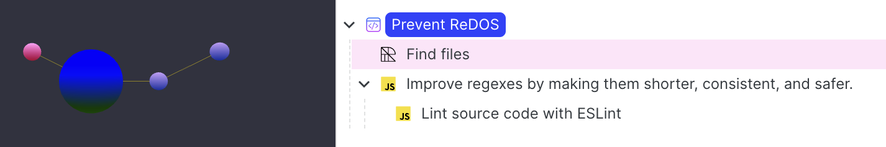
  <figcaption></figcaption>
</figure>

### UI v10.120.0 (2024/06/04)

- include bearer token with share curl from graphql editor

### UI v10.119.0 (2024/06/03)

- When selecting subtrees in the new builder other nodes are now de-emphasized to improve visual clarity of the selection:

<figure>
  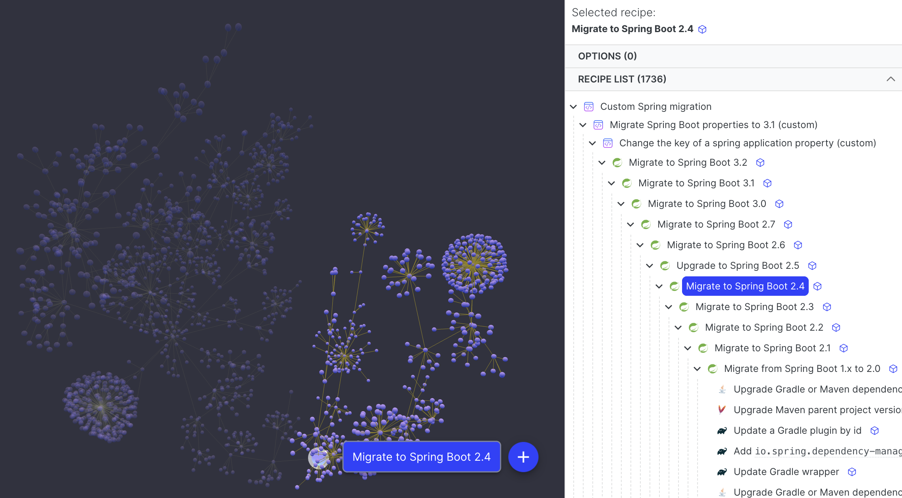
  <figcaption></figcaption>
</figure>

### UI v10.118.0 (2024/05/31)

- add more visual improvements to builder
- add support for quick filter + column filter on organizations repositories grid

### UI v10.117.0 (2024/05/30)

- Grids will now show more context regarding pagination:
  
- In the new builder the tree view has been improved visually to increase clarity and now has a new auto scroll mechanic which should be more consistent than the previous:
  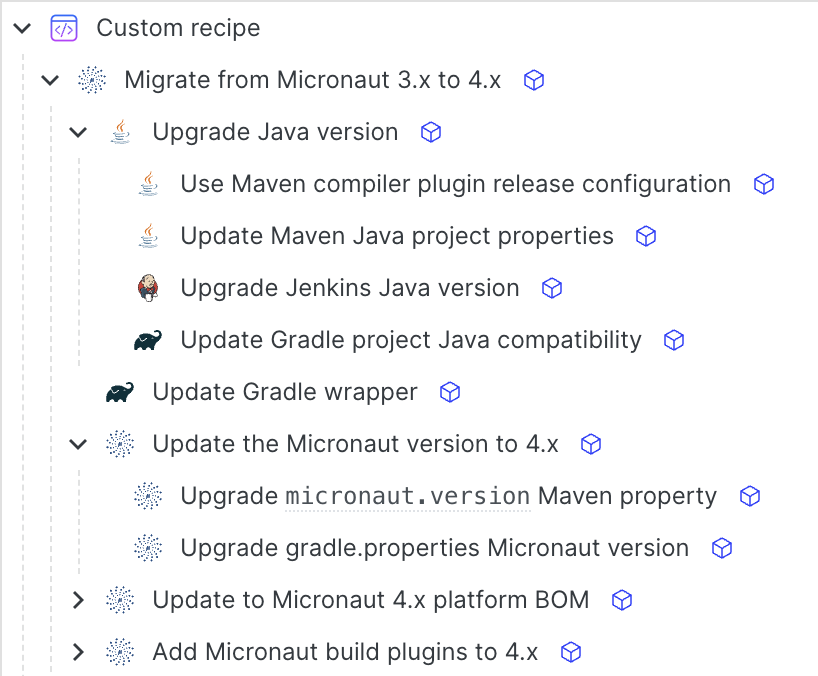
- In the new builder the scene control buttons have been redesigned and relocated to the lower left of the scene:
  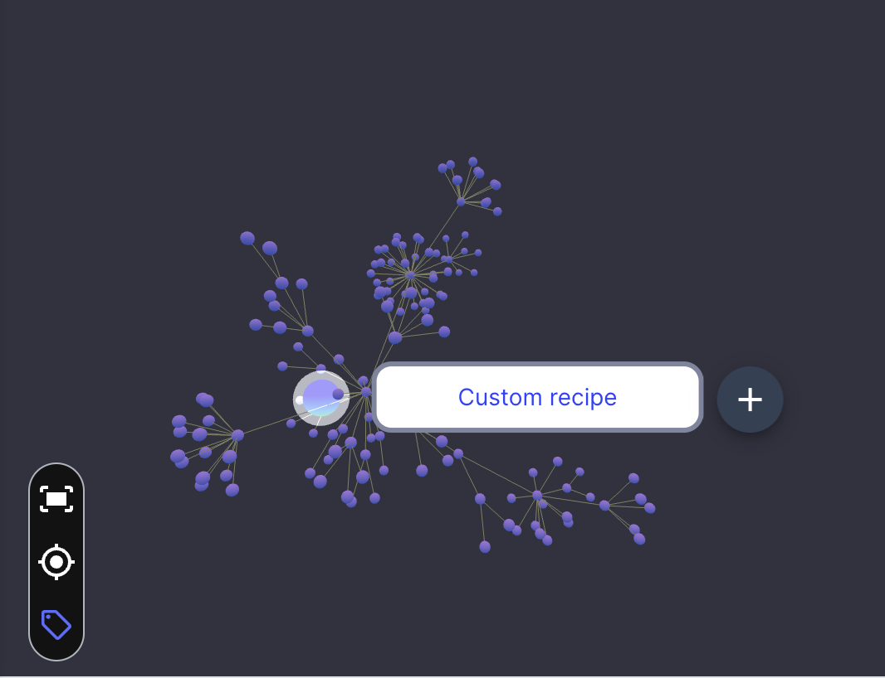

UI v10.116.0 (2024/05/23)

- Bug fixes and other improvements.

### UI v10.115.0 (2024/05/21)

- update various menu styles

### UI v10.114.0 (2024/05/18)

We have added a new move to fit camera control to the new builder. This will automatically move the camera location and angle to fit the whole custom recipe into the scene.

<figure>
  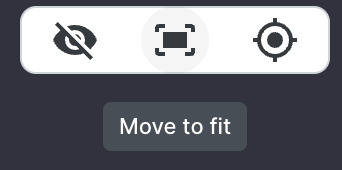
  <figcaption></figcaption>
</figure>

### UI v10.113.0 (2024/05/17)

The new recipe builder now has a new greeting card when no custom recipe is loaded. We hope this will better help newer users start on their recipe authorship journey.

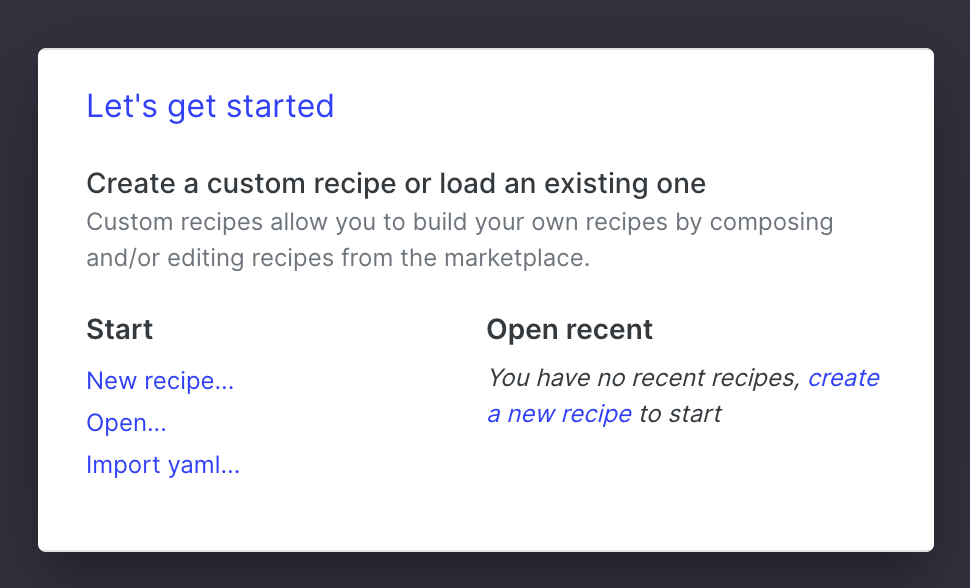

### UI v10.112.1 (2024/05/16)

- Bug fixes and other improvements.

### UI v10.112.0 (2024/05/15)

The new recipe builder now auto saves progress and there is a new indicator to signal when the current work is being saved to your local IndexedDB.

<figure>
  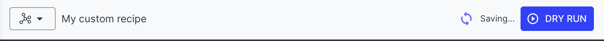
  <figcaption></figcaption>
</figure>

### UI v10.111.1 (2024/05/15)

- Bug fixes and other improvements.

### UI v10.111.0 (2024/05/14)

#### Building recipes in Builder V2

The beta of the new builder has added controls to allow for the construction of recipes. You can now use the new builder to explore and customize the full depth of composed recipes.

<figure>
  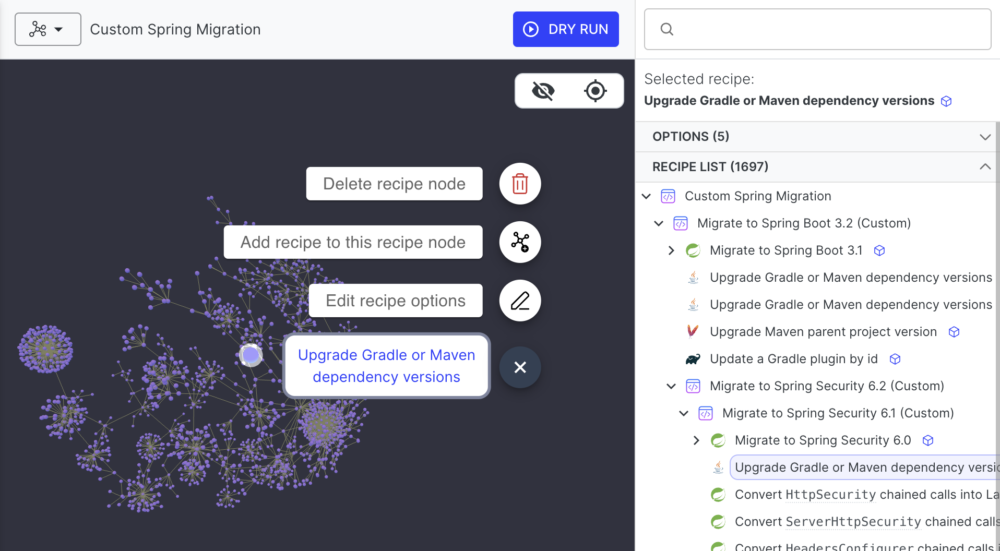
  <figcaption></figcaption>
</figure>

Adding marketplace recipes all happens now within the new Builder experience. This prevents users from having to excessively navigate when composing a custom recipe. Additionally, the new Builder supports importing recipe(s) from Yaml, running custom recipes, and exporting a custom recipe to the necessary Yaml docs. Lastly, you can now save multiple custom recipes.

### UI v10.110.0 (2024/05/09)

- Bug fixes and other improvements.

### UI v10.109.0 (2024/05/08)

- Bug fixes and other improvements.

### UI v10.108.0 (2024/05/07)

- Bug fixes and other improvements.

### UI v10.107.0 (2024/05/03)

- Bug fixes and other improvements.

### UI v10.106.0 (2024/05/02)

- add create and retrieve organizations examples
- allow creating user repositories from the repositories page
- Draft not supported in Bitbucket Cloud helper text

### UI v10.105.0 (2024/04/30)

- Update text for upgrades and migrations

### UI v10.104.0 (2024/04/24)

- add QUEUED_RATE_LIMITED commit status

### UI v10.103.0 (2024/04/23)

- Bug fixes and other improvements.

### UI v10.102.0 (2024/04/20)

- Bug fixes and other improvements.

### UI v10.101.0 (2024/04/18)

- Bug fixes and other improvements.

### UI v10.100.0 (2024/04/16)

- Bug fixes and other improvements.

### UI v10.99.0 (2024/04/12)

- admin users view

### UI v10.98.0 (2024/04/11)

- add Share curl button to graphql explorer to copy graphql request as curl
- add csharp logo support

### UI v10.97.0 (2024/04/08)

- Bug fixes and other improvements.

### UI v10.96.0 (2024/04/04)

- Bug fixes and other improvements.

### UI v10.95.0 (2024/03/29)

- Bug fixes and other improvements.

### UI v10.94.0 (2024/03/29)

- Bug fixes and other improvements.

### UI v10.93.0 (2024/03/29)

- Bug fixes and other improvements.

### UI v10.92.0 (2024/03/28)

- organizations tile with refresh organizations button

### UI v10.91.0 (2024/03/26)

- Bug fixes and other improvements.

### UI v10.90.0 (2024/03/22)

- Bug fixes and other improvements.

### UI v10.89.0 (2024/03/21)

- Bug fixes and other improvements.

### UI v10.88.0 (2024/03/20)

- Bug fixes and other improvements.

### UI v10.87.0 (2024/03/20)

- add more logo support

### UI v10.86.1 (2024/03/18)

- Bug fixes and other improvements.

### UI v10.86.0 (2024/03/15)

- Bug fixes and other improvements.

### UI v10.85.0 (2024/03/15)

- add API example to search page

### UI v10.84.1 (2024/03/14)

- Bug fixes and other improvements.

### UI v10.84.0 (2024/03/12)

- Bug fixes and other improvements.

### UI v10.83.2 (2024/03/12)

- Bug fixes and other improvements.

### UI v10.83.1 (2024/03/12)

- Bug fixes and other improvements.

### UI v10.83.0 (2024/03/12)

- Bug fixes and other improvements.

### UI v10.82.0 (2024/03/11)

- reporting issue to moderne is now an email template

### UI v10.81.0 (2024/03/08)

- Bug fixes and other improvements.

### UI v10.80.0 (2024/03/06)

- Bug fixes and other improvements.

### UI v10.79.0 (2024/03/06)

- display last updated timestamp on upgrade and migration cards
- incorporate organization ids into dev center URL path

### UI v10.78.1 (2024/03/06)

- Bug fixes and other improvements.

### UI v10.78.0 (2024/03/05)

- add api example with options for individual visualizations

### UI v10.77.1 (2024/03/04)

- Bug fixes and other improvements.

### UI v10.77.0 (2024/03/01)

- add ability to download datatables as JSON

### UI v10.76.0 (2024/03/01)

- Bug fixes and other improvements.

### UI v10.75.0 (2024/02/28)

- Bug fixes and other improvements.

### UI v10.74.0 (2024/02/27)

- Bug fixes and other improvements.

### UI v10.73.0 (2024/02/26)

- Bug fixes and other improvements.

### UI v10.72.0 (2024/02/26)

- Bug fixes and other improvements.

### UI v10.71.0 (2024/02/26)

- Bug fixes and other improvements.

### UI v10.70.0 (2024/02/24)

- visualization width now adjusts when window is resized.

### UI v10.69.0 (2024/02/24)

- Bug fixes and other improvements.

### UI v10.68.1 (2024/02/23)

- Bug fixes and other improvements.

### UI v10.68.0 (2024/02/22)

- Bug fixes and other improvements.

### UI v10.67.0 (2024/02/22)

- add more logo support
- add text editor form input

### UI v10.66.0 (2024/02/20)

- add storybook category
- add support for picnic and refaster

### UI v10.65.1 (2024/02/17)

- Bug fixes and other improvements.

### UI v10.65.0 (2024/02/16)

- Bug fixes and other improvements.

### UI v10.64.0 (2024/02/16)

- add jest logo
- add ng and lodash logos

### UI v10.63.0 (2024/02/15)

- Bug fixes and other improvements.

### UI v10.62.0 (2024/02/14)

- add more js catorgy logos

### UI v10.61.0 (2024/02/14)

- add more logo support

### UI v10.60.1 (2024/02/13)

- Bug fixes and other improvements.

### UI v10.60.0 (2024/02/09)

- add user filter for recipe runs

### UI v10.59.0 (2024/02/09)

- Bug fixes and other improvements.

### UI v10.58.0 (2024/02/08)

- Bug fixes and other improvements.

### UI v10.57.0 (2024/02/07)

- add common filters

### UI v10.56.0 (2024/02/06)

- add download dismiss x
- support date range filter

### UI v10.55.0 (2024/02/05)

- add infinite scrolling to audit logs

### UI v10.54.0 (2024/02/04)

- Bug fixes and other improvements.

### UI v10.53.0 (2024/02/02)

- Bug fixes and other improvements.

### UI v10.52.1 (2024/02/02)

- Bug fixes and other improvements.

### UI v10.52.0 (2024/02/01)

- add date range filter

### Organizations GraphQL changes (2024/02/01)

A new query `allOrganizations` has been added to the organizations service schema to allow our customers to define parent organizations that do not contain repositories.

This new schema and implementation **will need to be added** to your organizations service to enable this sort of hierarchy. You can find the latest schema implementation [here](https://github.com/moderneinc/moderne-organizations).

Example hierarchy from our public tenant.

<figure>
  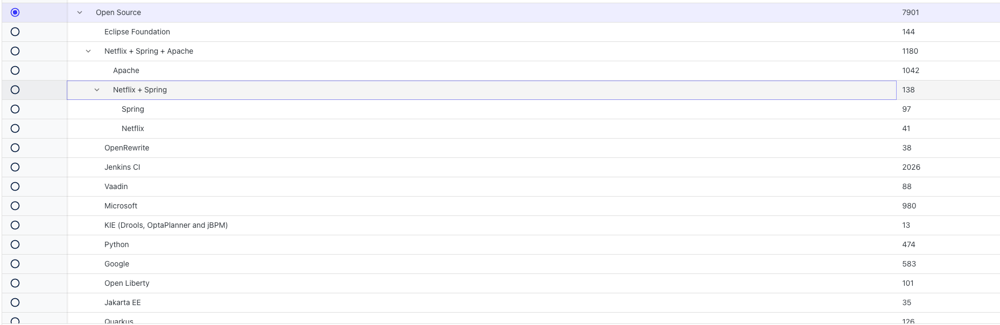
  <figcaption>_Note that `Open Source`,`Netflix + Spring + Apache` and `Netflix + Spring` organizations are parent organizations that are defined without repositories._</figcaption>
</figure>

### UI v10.51.0 (2024/01/31)

- preserve column size, order, and visibility to URL `state` hash on change

### UI v10.50.0 (2024/01/30)

- add copy mod cli command
- add `notContains` operator to Audit Log event columns

### UI v10.49.0 (2024/01/27)

- recipe source and lst source information on agents feat/org dash mock 2

### UI v10.48.0 (2024/01/26)

- make infinite scroll

### UI v10.47.0 (2024/01/26)

- Bug fixes and other improvements.

### UI v10.46.0 (2024/01/25)

- Bug fixes and other improvements.

### UI v10.45.0 (2024/01/24)

- Bug fixes and other improvements.

### UI v10.44.1 (2024/01/23)

- Bug fixes and other improvements.

### UI v10.44.0 (2024/01/22)

- Bug fixes and other improvements.

### UI v10.43.2 (2024/01/22)

- Bug fixes and other improvements.

### UI v10.43.1 (2024/01/19)

- Bug fixes and other improvements.

### UI v10.43.0 (2024/01/19)

- Bug fixes and other improvements.

### UI v10.42.0 (2024/01/18)

- Bug fixes and other improvements.

### UI v10.41.1 (2024/01/16)

- Bug fixes and other improvements.

### UI v10.41.0 (2024/01/15)

- Bug fixes and other improvements.

### UI v10.40.0 (2024/01/12)

- Bug fixes and other improvements.

### UI v10.39.0 (2024/01/10)

- add index url column to deploy table
- add system theme aware login

### UI v10.38.0 (2024/01/09)

- Bug fixes and other improvements.

### UI v10.37.0 (2024/01/08)

We have made changes to how recently viewed activity is discovered. Previously we had 3 different pages for view previous recipes runs, commit jobs, and visualization runs:

<figure>
  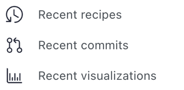
  <figcaption>_Previous recent pages_</figcaption>
</figure>

Each of these pages would show only the individual user's activity.

We are now providing a comprehensive view of these activities in one single Activity page:

<figure>
  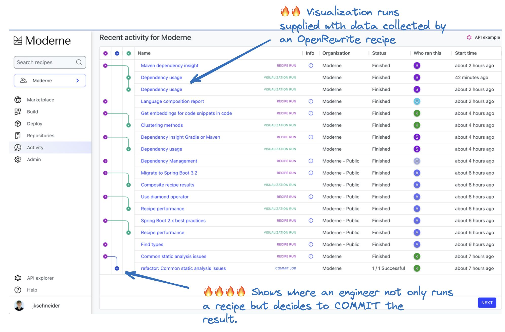
  <figcaption>_The new activity view shows activity across an organization_</figcaption>
</figure>

Here you can see **the most recent activities performed on the selected Organization**. This view will improve how users and teams collaborate. For more information see our [activity view docs](../user-documentation/moderne-platform/getting-started/activity-view).

### UI v10.36.0 (2024/01/06)

- allow downloads to continue while navigating around the app.

### UI v10.35.2 (2024/01/05)

- Bug fixes and other improvements.

### UI v10.35.1 (2024/01/04)

- Bug fixes and other improvements.

### UI v10.35.0 (2024/01/03)

- Bug fixes and other improvements.

### UI v10.34.1 (2024/01/02)

- Bug fixes and other improvements.

### UI v10.34.0 (2023/12/29)

- Bug fixes and other improvements.

### UI v10.33.0 (2023/12/29)

- expose git provenance and operating system information on repository details

### UI v10.32.1 (2023/12/28)

- Bug fixes and other improvements.

### UI v10.32.0 (2023/12/27)

- add search tips for ai search when enabled.
- add reload current recipes with latest version to examples. Show caret with API examples

### UI v10.31.0 (2023/12/22)

- remove need for keycloak logout screen

### UI v10.30.0 (2023/12/20)

We updated the login screen to improve visibility:

Previous:

<figure>
  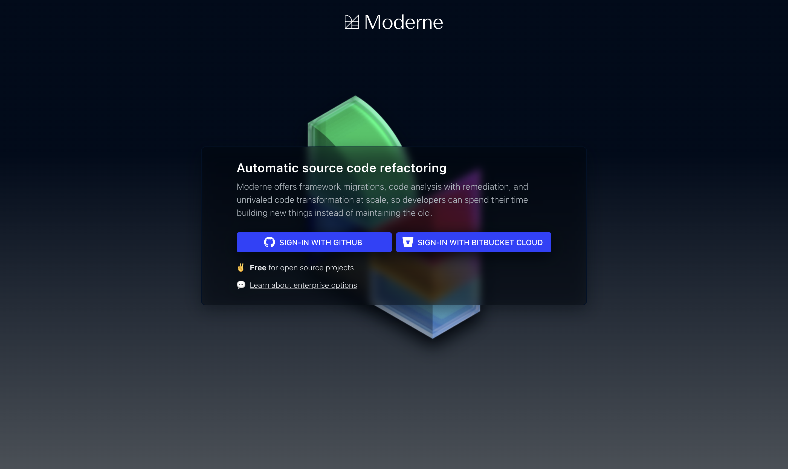
  <figcaption></figcaption>
</figure>

New:

<figure>
  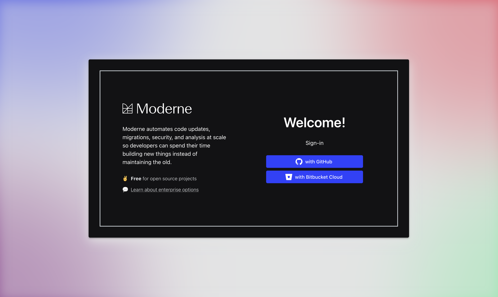
  <figcaption></figcaption>
</figure>

### UI v10.29.0 (2023/12/18)

- Bug fixes and other improvements.

### UI v10.28.1 (2023/12/15)

- Bug fixes and other improvements.

### UI v10.28.0 (2023/12/15)

- Add tile to agents page for PyPi configuration
- add loading indication when paginating audit logs.

### UI v10.27.0 (2023/12/14)

- user organizations

### UI v10.26.0 (2023/12/14)

- enable AI assisted search by default
- add mergeability column to the commit job table

### UI v10.25.0 (2023/12/13)

- Bug fixes and other improvements.

### UI v10.24.2 (2023/12/12)

- Bug fixes and other improvements.

### UI v10.24.1 (2023/12/09)

- Bug fixes and other improvements.

### UI v10.24.0 (2023/12/08)

#### Recipe builder layout changes

On the heels of adding support for preconditions, it was time to give the _Recipe Builder_ a little update to the layout.

<figure>
  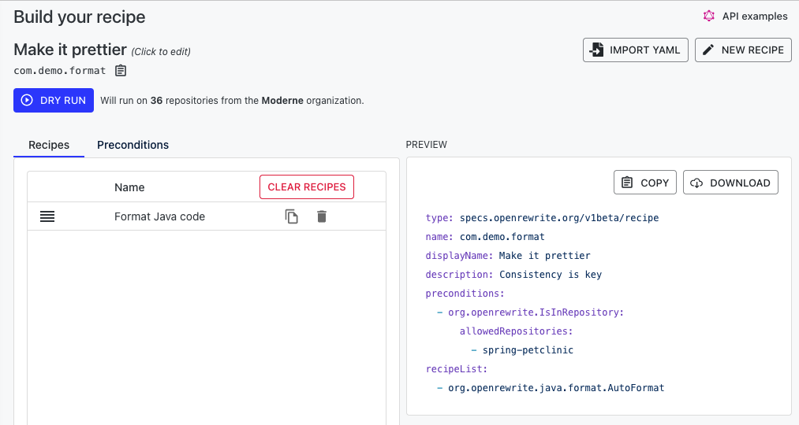
  <figcaption>_Recipes and Preconditions are now displayed in a grid to optimize content display on screen._</figcaption>
</figure>

<figure>
  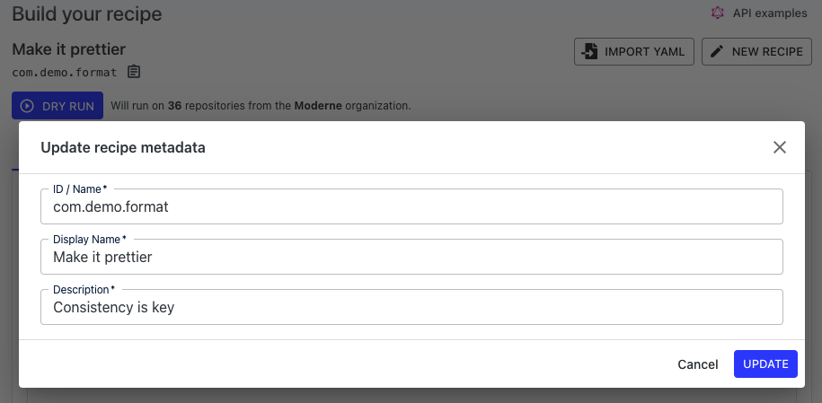
  <figcaption>_Editing your custom recipe metadata has been moved into a dialog to prioritize the recipes and YAML._</figcaption>
</figure>

<figure>
  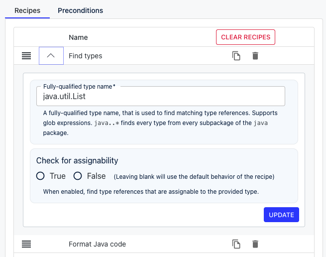
  <figcaption>_Updating recipe options are now accessible through expanding the row details panel._</figcaption>
</figure>

### UI v10.23.0 (2023/12/08)

- Bug fixes and other improvements.

### UI v10.22.1 (2023/12/06)

- Bug fixes and other improvements.

### UI v10.22.0 (2023/12/06)

#### Recipe preconditions

Through the _Recipe Builder_ customers can now define _precondition_ recipes that will run ahead of the recipe lists. The recipe list will only be run on repositories that included results from the _precondition._

<figure>
  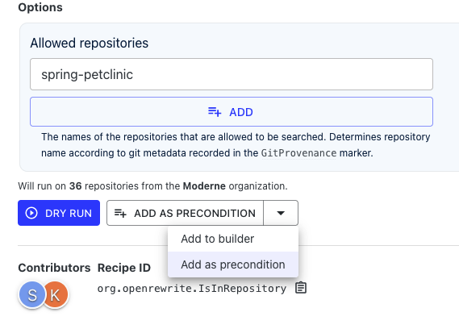
  <figcaption>_To add a precondition recipe to your custom recipe, you can use the `Add as precondition` button._</figcaption>
</figure>

Once a precondition has been added, it will appear as a new tab on the _Recipe Builder_ page

<figure>
  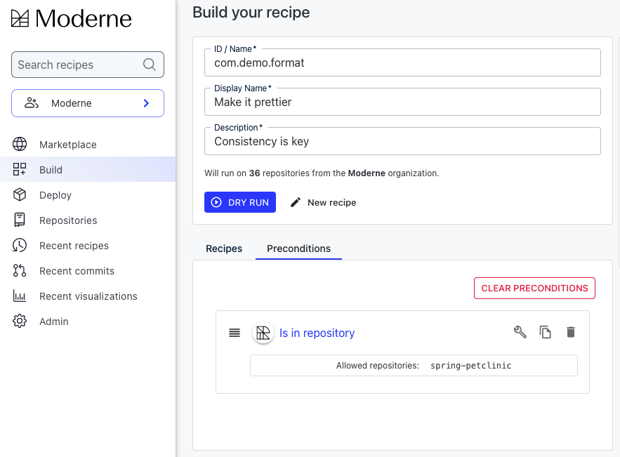
  <figcaption></figcaption>
</figure>

- add icon support for processing status

### UI v10.21.1 (2023/12/04)

- Bug fixes and other improvements.

### UI v10.21.0 (2023/12/02)

- preserve the recipe options used when navigating back

### UI v10.20.0 (2023/12/01)

- Bug fixes and other improvements.

### UI v10.19.0 (2023/11/30)

- add visualization id for easy reference
- add tooltip to queue position column cells to help understand the workers' queues

### UI v10.18.0 (2023/11/30)

We have added category logo support for the new LaunchDarkly recipes (`rewrite-launchdarkly`)

<figure>
  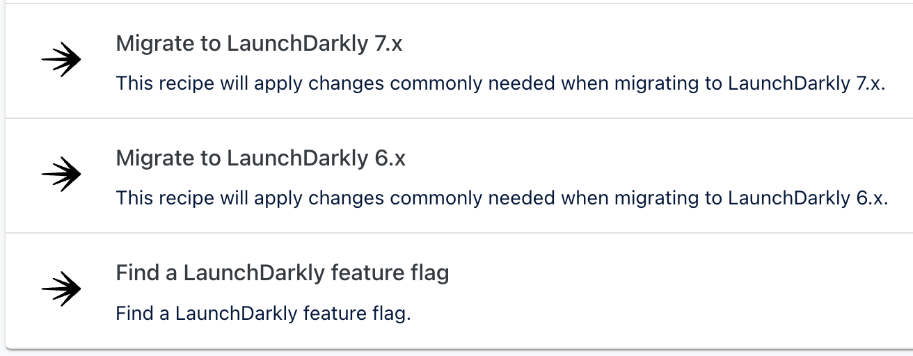
  <figcaption></figcaption>
</figure>

### UI v10.17.0 (2023/11/28)

We added a hint to the search results popover with the intention of increasing users awareness of the ability to quickly navigate to recipes (up/down then enter) or to the full page search results (enter) with keyboard navigation alone.

<figure>
  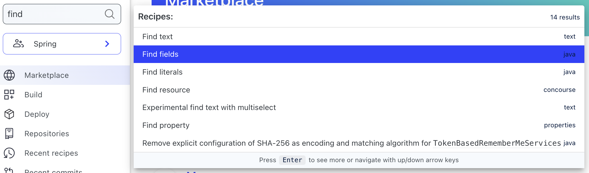
  <figcaption></figcaption>
</figure>

### UI v10.16.4 (2023/11/23)

- Bug fixes and other improvements.

### UI v10.16.3 (2023/11/22)

- Bug fixes and other improvements.

### UI v10.16.2 (2023/11/21)

- Bug fixes and other improvements.

### UI v10.16.1 (2023/11/21)

- Bug fixes and other improvements.

### UI v10.16.0 (2023/11/21)

- Bug fixes and other improvements.

### UI v10.15.2 (2023/11/20)

- Bug fixes and other improvements.

### UI v10.15.1 (2023/11/20)

- Bug fixes and other improvements.

### UI v10.15.0 (2023/11/20)

- add opt-in for AI search

### UI v10.14.0 (2023/11/18)

- add for new line support

### UI v10.13.1 (2023/11/18)

- Bug fixes and other improvements.

### UI v10.13.0 (2023/11/17)

- use datatable name for download file

### UI v10.12.0 (2023/11/16)

#### Recipe details fall clean-up

We have improved the organization and layout of recipe details to make better use of space and prioritize the presentation of running recipes.

<figure>
  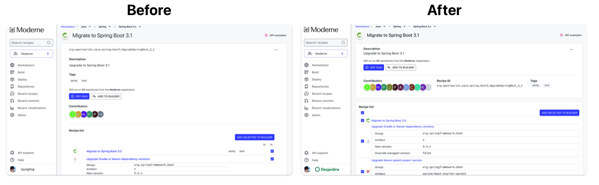
  <figcaption></figcaption>
</figure>

- Bug fixes and other improvements.

### UI v10.11.0 (2023/11/16)

- visualization marketplace

### UI v10.10.0 (2023/11/15)

- add percentage of completion to actively running recipes

### UI v10.9.2 (2023/11/15)

- Bug fixes and other improvements.

### UI v10.9.1 (2023/11/13)

- Bug fixes and other improvements.

### UI v10.9.0 (2023/11/10)

- use radio control for organization selection

### UI v10.8.0 (2023/11/10)

- link to recipe from recipe run results summary
- async repo details

### UI v10.0.0 (2023/11/02)

<figure>
  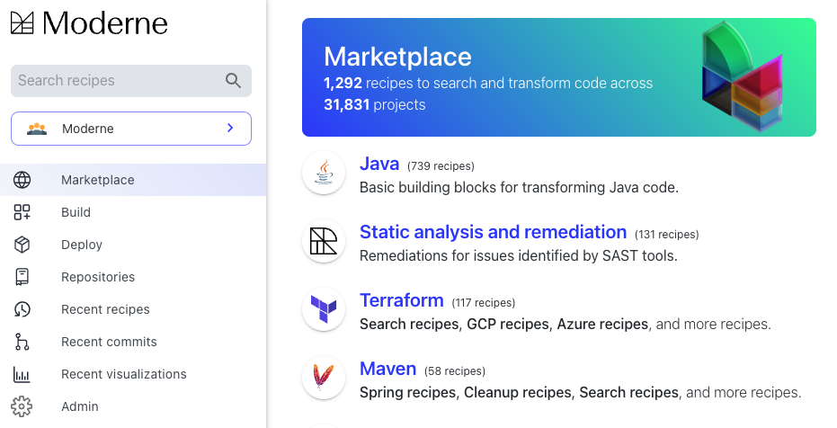
  <figcaption>_so fresh and so clean_</figcaption>
</figure>

**We have a new look!**

We started to encounter pain points with our previous design:

- Navigation was split across the top bar and sidebar
- Long organization / repository group titles could be truncated

Unified Sidebar Navigation: All navigation elements are now consolidated into a single, intuitive sidebar, simplifying the user experience and reducing the cognitive load.

Elimination of Top Bar: Removing the top navigation bar frees up valuable screen real estate, allowing for more content to be displayed and making it easier for users to focus on their work.

### UI v9.177.0 (2023/10/30)

- determine ability to deploy artifacts based on new ACL

### UI v9.176.1 (2023/10/24)

- Bug fixes and other improvements.

### UI v9.176.0 (2023/10/24)

feat/add-yielded-state

### UI v9.175.0 (2023/10/20)

- add support for showing skipped connectivity

### UI v9.174.0 (2023/10/19)

**New left navigation icons**

We have plans to overhaul the iconography to create better visual consistency and clarity.

This journey begins this version with a rework of the left navigation icons:

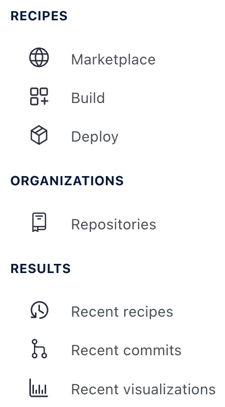

### UI v9.173.0 (2023/10/17)

- Bug fixes and other improvements.

### UI v9.172.0 (2023/10/12)

- Bug fixes and other improvements.

### UI v9.171.2 (2023/10/12)

- Bug fixes and other improvements.

### UI v9.171.1 (2023/10/11)

- Bug fixes and other improvements.

### Agent v0.150.0 (2023/10/11)

- Tool connectivity validation on startup. Now when Agent starts it tests the connectivity of each tool configured (maven, artifactory, SCM provider). If connectivity fails for any configured tool, the Agent will fail to start and the logs will display which configuration failed to connect.

  ```log
  ***************************
  APPLICATION FAILED TO START
  ***************************

  Description:

  Binding to target org.springframework.boot.context.properties.bind.BindException: Failed to bind properties under 'moderne.agent' to io.moderne.agent.config.AgentConfiguration failed:

      Property: moderne.agent.bitbucket[0]
      Value: "BitbucketConfiguration(url=https://bitbucket.test/stash, alternateUrls=[ssh://bitbucket.moderne.nin:7999], ssh=null, skipSsl=false, valid=false)",
      Reason: Connection verification errored with connection timed out: bitbucket.test/143.244.220.150:443;
      nested exception is io.netty.channel.ConnectTimeoutException: connection timed out: bitbucket.test/143.244.220.150:443
          Verify configuration url and credentials.
  ```

### UI v9.171.0 (2023/10/10)

- show connection status of each tool in agents view

### UI v9.170.3 (2023/10/07)

- Bug fixes and other improvements.

### UI v9.170.2 (2023/10/07)

- Bug fixes and other improvements.

### UI v9.170.1 (2023/10/06)

- Bug fixes and other improvements.

### UI v9.170.0 (2023/10/05)

- add `organizationId` to commit job tables

### UI v9.169.0 (2023/10/04)

- add homebrew installation option for mod-cli

### UI v9.168.0 (2023/10/04)

- change marketplace banner

#### Optimizing recipe results and commit jobs

To improve the number of recipe results and commit jobs that can be viewed on the screen at a glance, we've re-organized the display of summary information about recipe runs and commit jobs into their own tab.

<figure>
  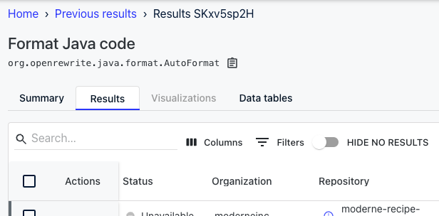
  <figcaption></figcaption>
</figure>

<figure>
  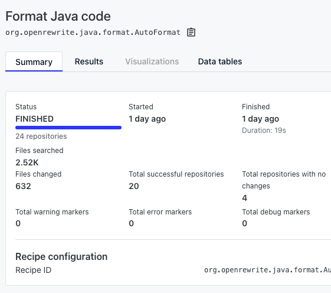
  <figcaption></figcaption>
</figure>

<figure>
  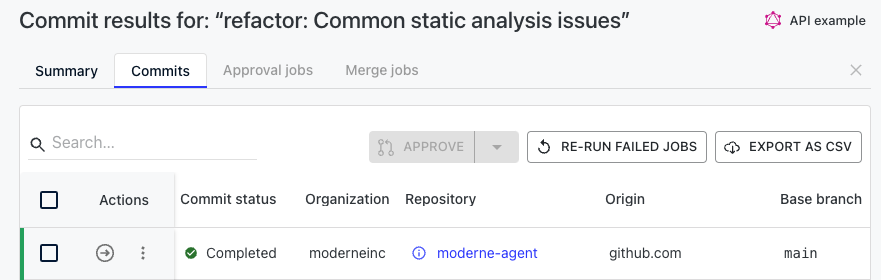
  <figcaption>_New `Summary` tab on Commit job details page_</figcaption>
</figure>

<figure>
  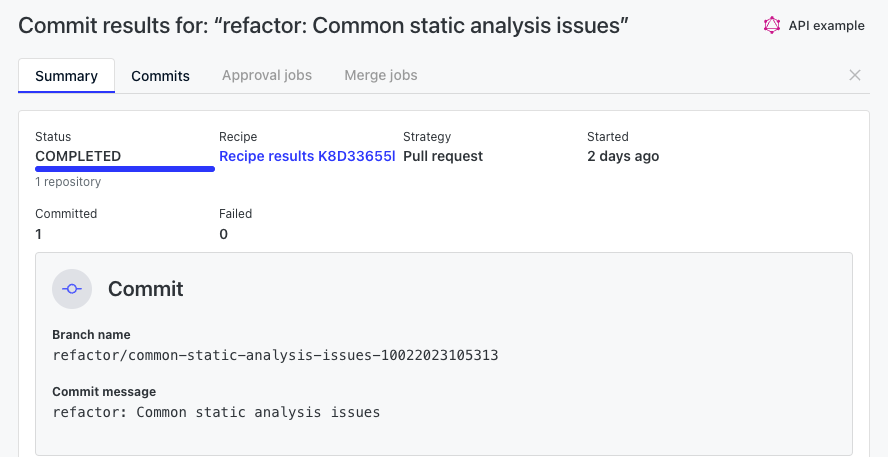
  <figcaption>_Commit job `Summary` tab example_</figcaption>
</figure>

### UI v9.167.1 (2023/10/03)

- Bug fixes and other improvements.

### UI v9.167.0 (2023/10/02)

- add mass close pull requests

### UI v9.166.0 (2023/09/27)

- download patch with patch download task.

### UI v9.165.2 (2023/09/26)

- Bug fixes and other improvements.

### UI v9.165.1 (2023/09/26)

- Bug fixes and other improvements.

### UI v9.165.0 (2023/09/26)

- Bug fixes and other improvements.

### UI v9.164.0 (2023/09/26)

- Bug fixes and other improvements.

### UI v9.163.1 (2023/09/26)

- Bug fixes and other improvements.

### UI v9.163.0 (2023/09/26)

- download cli from staging
- add recipe hover card to recent runs grid

### UI v9.162.0 (2023/09/23)

- Bug fixes and other improvements.

### UI v9.159.0 (2023/09/15)

- Bug fixes and other improvements.

### UI v9.158.3 (2023/09/14)

- Bug fixes and other improvements.

### UI v9.158.2 (2023/09/14)

- Bug fixes and other improvements.

### UI v9.158.1 (2023/09/14)

- Bug fixes and other improvements.

### UI v9.158.0 (2023/09/13)

- add tree data grid visualiztion support feat/merge commit
- add categories api example

### UI v9.157.0 (2023/09/12)

- add more notifications

### UI v9.156.0 (2023/09/11)

- add approve to the row-level actions on commit jobs
- add download notifications
- pull request status on commit jobs
- add notifications for artifact deploys

### UI v9.155.0 (2023/09/07)

- toggling datetime elements now changes default user setting

### UI v9.154.0 (2023/09/06)

- add recipe run priority to recent recipe run grid
- approve pull requests

### UI v9.153.0 (2023/09/02)

- Bug fixes and other improvements.

### UI v9.152.1 (2023/09/01)

- Bug fixes and other improvements.

### UI v9.152.0 (2023/08/31)

- replay visualizations with predefined prior options
- add date selector support for recipe input options

### UI v9.151.2 (2023/08/29)

- Bug fixes and other improvements.

### UI v9.151.1 (2023/08/29)

- Bug fixes and other improvements.

### UI v9.151.0 (2023/08/28)

- increase diff page size to `20` and selectively render large diffs
- include api url in graph sharing

### UI v9.150.0 (2023/08/25)

- Bug fixes and other improvements.

### UI v9.149.0 (2023/08/24)

- Bug fixes and other improvements.

### UI v9.148.0 (2023/08/24)

- add auto merge strategy option for github & gitlab
- add Share query option for graphql operations

### UI v9.147.0 (2023/08/23)

#### Tabs, tabs, tabs, tabs, yeah!

We've done a little tidying up on the recipe run result page. _**Visualizations**_ and _**Data tables**_ can now be accessed from the tabs at the top of the page. You'll find these tabs are also accessible from the respective pages for _Visualizations_ and _Data tables._

<figure>
  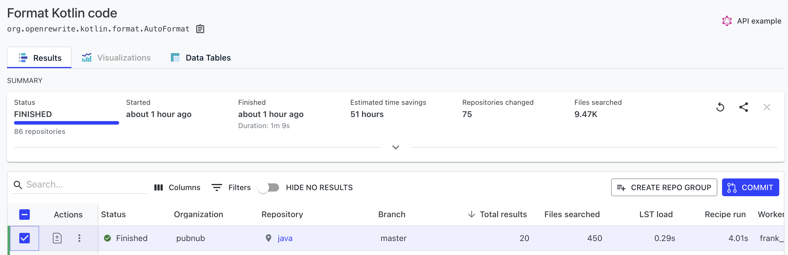
  <figcaption></figcaption>
</figure>

#### Add dropdown options to share button

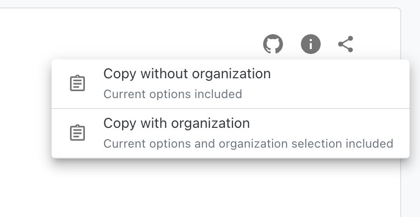

When sharing a recipe from the recipes details, you can now select whether or not to include your current organizations.

### UI v9.146.0 (2023/08/22)

- add sharing option to visualizations that produce data tables

#### Organization ID to the recent runs table

Now you can see which Organization a visualization was run on from the _Recent visualizations_ table.

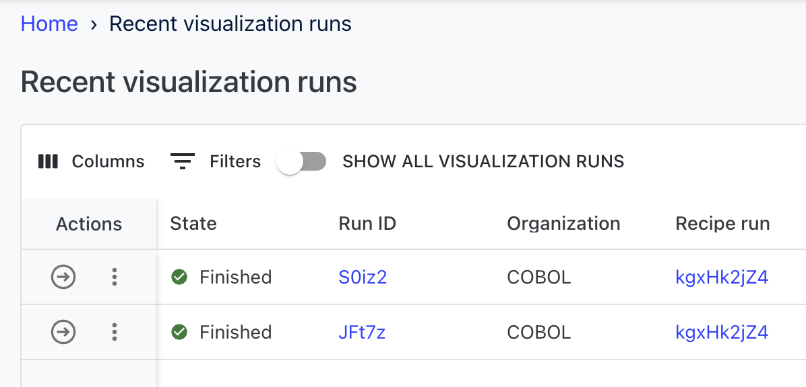

### UI v9.145.0 (2023/08/22)

- show options used

### UI v9.144.0 (2023/08/18)

#### View the CLI version.

Now you can see the latest version number of the CLI before downloading.

<figure>
  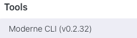
  <figcaption></figcaption>
</figure>

#### Organization and group selector improvements

<figure>
  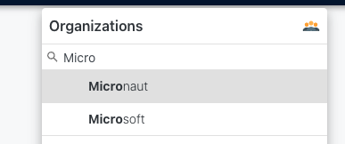
  <figcaption></figcaption>
</figure>

- Highlighted search terms
- More flexible width and word wrapping when organization names are long.

### UI v9.143.0 (2023/08/16)

#### Dynamic forms for recipe options

We now support dynamic form fields for `List` or `string[]` options. Recipes that take a list of strings now have a new editor interface to improve the usability.

<figure>
  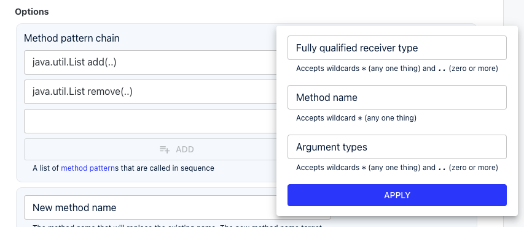
  <figcaption></figcaption>
</figure>

### UI v9.142.0 (2023/08/15)

- Bug fixes and other improvements.

### UI v9.141.0 (2023/08/15)

- Bug fixes and other improvements.

### UI v9.140.0 (2023/08/15)

- support visualization parameters

### UI v9.139.1 (2023/08/15)

- Bug fixes and other improvements.

### UI v9.139.0 (2023/08/11)

Pan/zoom controls and download options are now available for Visualizations.

- 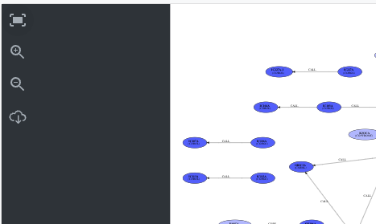

### UI v9.138.0 (2023/08/10)

- add pagination support to visualization run repositories
- tooltip on results toolbar and disable commit option on Find only results.

### UI v9.137.0 (2023/08/08)

- recent visualizations

### UI v9.136.1 (2023/08/08)

- Bug fixes and other improvements.

### UI v9.136.0 (2023/08/08)

- Bug fixes and other improvements.

### UI v9.135.0 (2023/08/04)

- Bug fixes and other improvements.

### UI v9.134.0 (2023/08/04)

- add back to top action

### UI v9.133.2 (2023/08/04)

- Bug fixes and other improvements.

### UI v9.133.1 (2023/08/04)

- Bug fixes and other improvements.

### UI v9.133.0 (2023/08/04)

- Bug fixes and other improvements.

### UI v9.132.0 (2023/08/03)

- add recent visualization screen

### UI v9.131.0 (2023/08/02)

- indicate when data is missing on visualization

### UI v9.130.2 (2023/08/02)

- Bug fixes and other improvements.

### UI v9.130.1 (2023/08/02)

- Bug fixes and other improvements.

### UI v9.130.0 (2023/08/02)

- Bug fixes and other improvements.

### UI v9.129.0 (2023/08/01)

- cancel visualization run

### UI v9.128.0 (2023/08/01)

- data grid for visualization repositories.

### UI v9.127.0 (2023/07/31)

- Bug fixes and other improvements.

### UI v9.126.0 (2023/07/29)

- Bug fixes and other improvements.

### UI v9.125.0 (2023/07/28)

- add recipe run link in footer.
- recipe run visualization
- add available visualization for recipe runs
- operationalize visualizations

### UI v9.124.1 (2023/07/27)

- Bug fixes and other improvements.

### UI v9.124.0 (2023/07/27)

- add share option to rerun recipe items
- add support for multiple select recipe options
- add export paginated data grid

### UI v9.123.0 (2023/07/26)

- Bug fixes and other improvements.

### UI v9.122.0 (2023/07/26)

- add loading indicator for yaml from run id

### UI v9.121.0 (2023/07/24)

- Bug fixes and other improvements.

### UI v9.120.0 (2023/07/18)

- sort recipe results by worker

### UI v9.119.1 (2023/07/14)

- Bug fixes and other improvements.

### UI v9.119.0 (2023/07/14)

- Bug fixes and other improvements.

### UI v9.118.1 (2023/07/14)

- Bug fixes and other improvements.

### UI v9.118.0 (2023/07/12)

- Bug fixes and other improvements.

### UI v9.117.0 (2023/07/10)

- Bug fixes and other improvements.

### UI v9.116.0 (2023/07/07)

- add welcome banner to marketplace

### UI v9.115.0 (2023/07/07)

- remove home page and strengths tab

### UI v9.114.3 (2023/07/06)

- Bug fixes and other improvements.

### UI v9.114.2 (2023/07/05)

- Bug fixes and other improvements.

### UI v9.114.1 (2023/07/04)

- Bug fixes and other improvements.

### UI v9.114.0 (2023/07/04)

- Bug fixes and other improvements.

### UI v9.113.0 (2023/07/03)

- Bug fixes and other improvements.

### UI v9.112.1 (2023/07/01)

- add dependency resolution time and worker name to recipe run summary

### UI v9.112.0 (2023/06/29)

- Bug fixes and other improvements.

### UI v9.111.1 (2023/06/29)

- Bug fixes and other improvements.

### UI v9.111.0 (2023/06/28)

- Bug fixes and other improvements.

### UI v9.110.0 (2023/06/28)

- Bug fixes and other improvements.

### UI v9.109.0 (2023/06/27)

- Bug fixes and other improvements.

### UI v9.108.0 (2023/06/22)

- Bug fixes and other improvements.

### UI v9.107.1 (2023/06/21)

- Bug fixes and other improvements.

### UI v9.107.0 (2023/06/20)

- Bug fixes and other improvements.

### UI v9.106.5 (2023/06/20)

- Bug fixes and other improvements.

### UI v9.106.4 (2023/06/19)

- Bug fixes and other improvements.

### UI v9.106.3 (2023/06/19)

- Bug fixes and other improvements.

### UI v9.106.2 (2023/06/19)

- Bug fixes and other improvements.

### UI v9.106.1 (2023/06/19)

- Bug fixes and other improvements.

### UI v9.106.0 (2023/06/18)

- Bug fixes and other improvements.

### UI v9.105.2 (2023/06/17)

- Bug fixes and other improvements.

### UI v9.105.1 (2023/06/17)

- Bug fixes and other improvements.

### UI v9.105.0 (2023/06/16)

- Bug fixes and other improvements.

### UI v9.104.1 (2023/06/15)

- Bug fixes and other improvements.

### UI v9.104.0 (2023/06/15)

- Bug fixes and other improvements.

### UI v9.103.0 (2023/06/12)

- render skeleton when loading more results.
- set sort model with default sorting so it is clear what sorting is being applied by default.

### UI v9.102.1 (2023/06/09)

- Bug fixes and other improvements.

### UI v9.102.0 (2023/06/07)

- add bitbucket cloud authentication option for `public.*`

### UI v9.101.0 (2023/06/06)

- leverage notebook description provided by service

### UI v9.100.0 (2023/06/05)

- add javascript logo

### UI v9.99.1 (2023/06/02)

- Bug fixes and other improvements.

### UI v9.99.0 (2023/06/01)

- Bug fixes and other improvements.

### UI v9.98.0 (2023/05/30)

- add support for multiple auth providers through keycloak on multitenant

### UI v9.97.1 (2023/05/26)

- Bug fixes and other improvements.

### UI v9.97.0 (2023/05/25)

- prompt for confirmation when canceling recipe runs

### UI v9.96.2 (2023/05/25)

- Bug fixes and other improvements.

### UI v9.96.1 (2023/05/23)

- Bug fixes and other improvements.

### UI v9.96.0 (2023/05/19)

- add in support for downloading data-tables from visualizations where available

### UI v9.95.0 (2023/05/17)

- Bug fixes and other improvements.

### UI v9.94.0 (2023/05/16)

- Bug fixes and other improvements.

### UI v9.93.0 (2023/05/16)

- Bug fixes and other improvements.

### UI v9.92.2 (2023/05/11)

- Bug fixes and other improvements.

### UI v9.92.1 (2023/05/10)

- Bug fixes and other improvements.

### UI v9.92.0 (2023/05/10)

- Bug fixes and other improvements.

### UI v9.91.0 (2023/05/08)

- add jupyter output cell renderer

### UI v9.90.0 (2023/05/05)

- add support for `startAuth=true` QSP to initiate flow

### UI v9.89.2 (2023/05/03)

- Bug fixes and other improvements.

### UI v9.89.1 (2023/05/02)

- Bug fixes and other improvements.

### UI v9.89.0 (2023/05/01)

- Changes to how _Repository Groups_ are stored in your browser to resolve an issue where having multiple tabs open at the same time was causing newly created _Repository Groups_ to vanish as a result of a mismatch in state that was not synced between tabs.

### UI v9.88.2 (2023/05/01)

- Bug fixes and other improvements.

### UI v9.88.1 (2023/04/30)

- Bug fixes and other improvements.

### UI v9.88.0 (2023/04/28)

- Bug fixes and other improvements.

### UI v9.87.1 (2023/04/28)

- Bug fixes and other improvements.

### UI v9.87.0 (2023/04/26)

- Bug fixes and other improvements.

### UI v9.86.1 (2023/04/26)

- Bug fixes and other improvements.

### UI v9.86.0 (2023/04/25)

- Bug fixes and other improvements.

### UI v9.85.0 (2023/04/24)

- add progress bar to commit job summary

### UI v9.84.0 (2023/04/21)

#### Date time format preference added

In Account menu > Accessibility there is now an option for Date time format that will allow you to choose between `Relative time`, `Local time`, and `UTC time`.

<figure>
  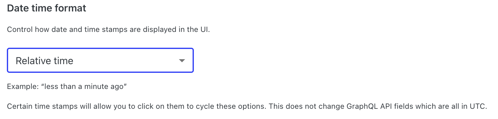
  <figcaption></figcaption>
</figure>

Date time stamps can also be changed by simply clicking on them to cycle through the formats:

<figure>
  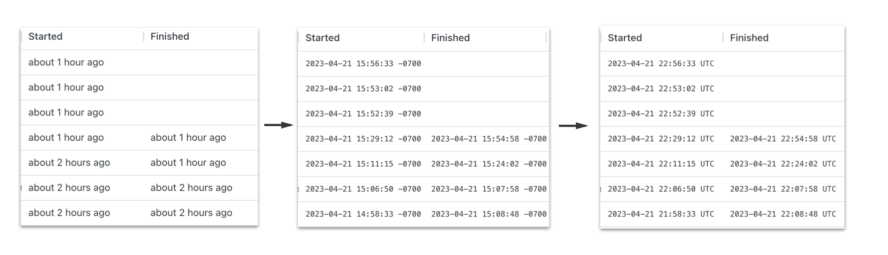
  <figcaption></figcaption>
</figure>

#### Replay YAML recipes

Custom yaml recipe runs can now be replayed. Now hitting replay on a custom recipe run summary will link to a new `/recipes/builder/[runId]` page. This page is similar to the `/recipes/builder` page however it will reflect the yaml recipe that was run making it possible to replay custom yaml recipe runs. This will also not disrupt your personal custom recipe.

<figure>
  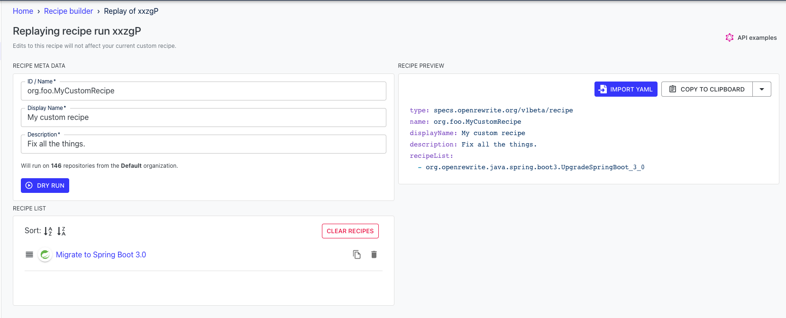
  <figcaption></figcaption>
</figure>

#### Admin agent version notice

Admin users will now see a notice that can be dismissed whenever there is a new agent version available:

<figure>
  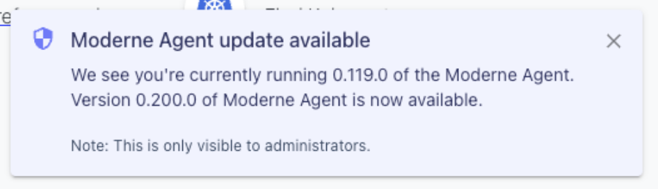
  <figcaption></figcaption>
</figure>

#### Additional changes

- add link to replay recipe to commit message and PR body
- display finished time for recipe runs and run history
- add import repository group support
- add axonframework logo
- add python logo
- adds api recipe run examples to yaml recipe builder
- various visual improvements

### UI v9.83.0 (2023/04/19)

#### Replaying recipes with organizations

If a recipe was run using an _Organization_ instead of a _Repository group_, you can now quickly click to replay the recipe using either the _Organization_ that was originally used or your currently selected _Organization / Repository group._

<figure>
  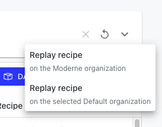
  <figcaption></figcaption>
</figure>

These items will take you back to the recipe details page where you can copy the URL and share.

#### Filtering audit logs

Audit logs can now be filtered across multiple columns and/or values.

<figure>
  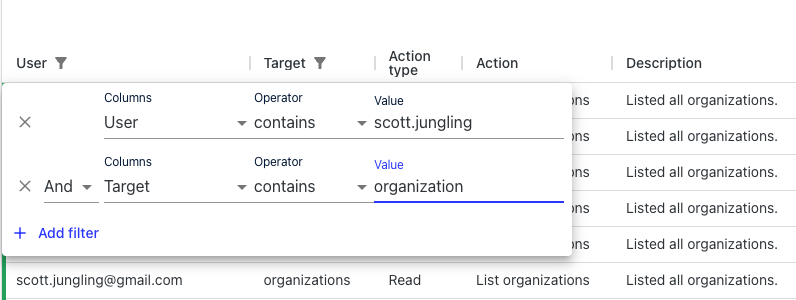
  <figcaption></figcaption>
</figure>

- Add confirmation before creating a new recipe builder
- Add support for quarantining and un-quarantining multiple repositories at a time

### UI v9.82.0 (2023/04/17)

We've completed a change to move over queries for _Organizations_ and _Repositories_ to use a new paginated query to improve the performance of filtering and selecting repositories. As apart of this change we've changed how _Repository groups_ are managed. Previously we had a transfer list that customers could use to handle selection. With this recent version, we've moved to a filterable data grid of repositories.

<figure>
  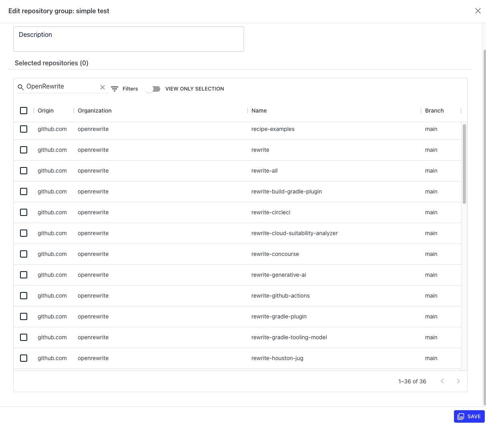
  <figcaption></figcaption>
</figure>

### UI v9.81.1 (2023/04/14)

- Bug fixes and other improvements.

### UI v9.81.0 (2023/04/14)

- Bug fixes and other improvements.

### UI v9.80.3 (2023/04/12)

- Bug fixes and other improvements.

### UI v9.80.2 (2023/04/10)

- Bug fixes and other improvements.

### UI v9.80.1 (2023/04/01)

- Bug fixes and other improvements.

### UI v9.80.0 (2023/03/31)

- add API examples for generating and downloading admin reports

### UI v9.79.0 (2023/03/31)

- add support for downloading `.tar.gz` and `.zip` version of the cli

### UI v9.78.1 (2023/03/28)

- Fix issue where associated Agents were not showing on the Artifactory integration details table in the administrative _Agents_ screen.

### UI v9.78.0 (2023/03/28)

- add copy resulting lines to hunks
- Resolved bug that was setting all recipe runs from the UI to _Low_ priority. Recipe runs now use _Normal_ priority.

### UI v9.77.0 (2023/03/27)

- add more confirmation dialogues
- add ability to disable keyboard shortcuts

### UI v9.76.1 (2023/03/24)

- Bug fixes and other improvements.

### UI v9.76.0 (2023/03/24)

- add option for running recipes with low priority
- add filter to organzation and repository group selector menu

### UI v9.75.0 (2023/03/24)

- add administrative reports page to download usage reports

### UI v9.74.1 (2023/03/23)

- Bug fixes and other improvements.

### UI v9.74.0 (2023/03/23)

#### Recipe results

The _Data Tables_ button is now ever present on the page along side the familiar _Commit_ option. As a note the button will be disabled until a _Recipe run_ has completed.

<figure>
  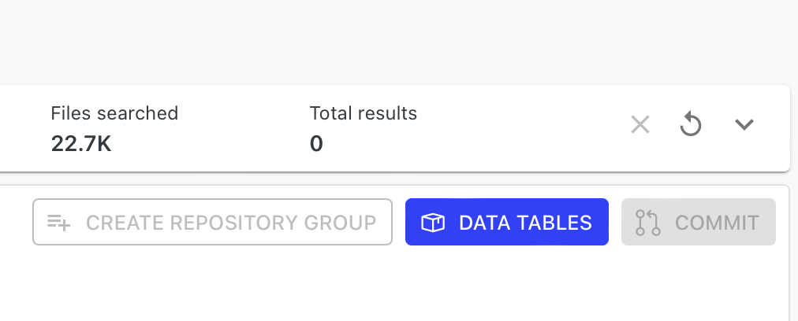
  <figcaption></figcaption>
</figure>

_API examples_ button has been pulled up from a collapsable portion of the summary and into a more familiar and consistant place on the page.

<figure>
  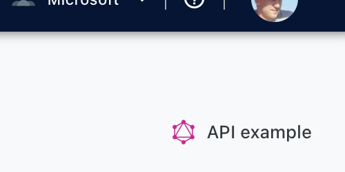
  <figcaption></figcaption>
</figure>

The _Replay_ _recipe_ and _Cancel run_ buttons have been consolidated into one location on the screen in part to make room for the _Api example_ button.

<figure>
  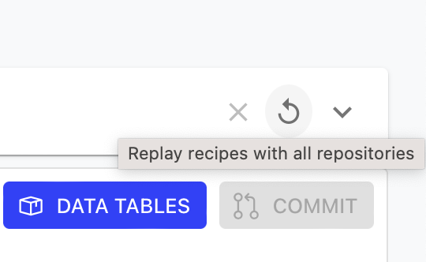
  <figcaption></figcaption>
</figure>

#### Repository details

We've cleaned up the _Repository details_ screen to align with page titles on other pages as well as making the _API examples_ consistently located.

<figure>
  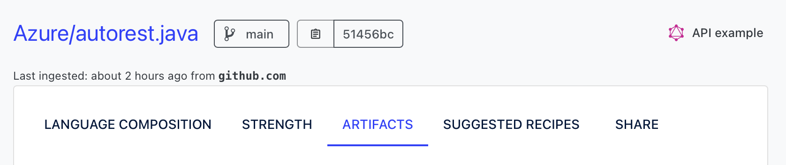
  <figcaption></figcaption>
</figure>

_Language composition_ chart now contains more colors to help distinguish various languages.

<figure>
  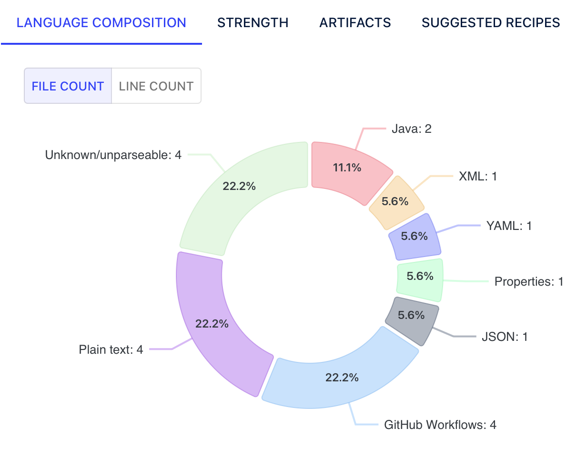
  <figcaption></figcaption>
</figure>

#### Moderne CLI

Now you can download a Zip archive of Moderne CLI tools.

<figure>
  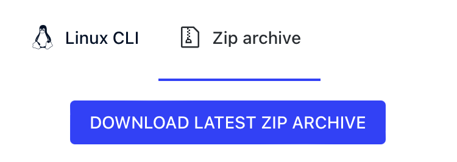
  <figcaption></figcaption>
</figure>

#### Organizations

Users will not be prompted for confirmation before removing repository.

<figure>
  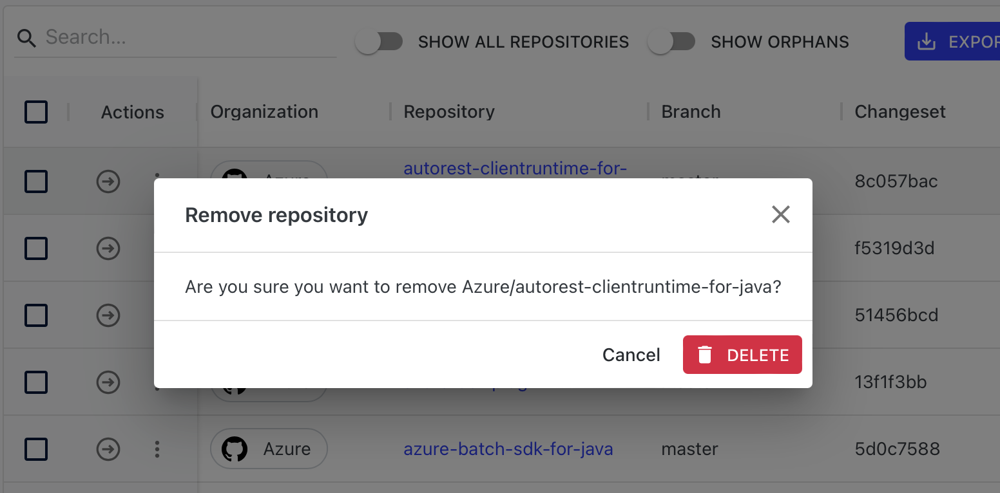
  <figcaption></figcaption>
</figure>

### UI v9.73.0 (2023/03/20)

- use totalRepositoriesInProgress from graphql

### UI v9.71.0 (2023/03/15)

- We have changed the name "Catalog" to "Marketplace" and given it a new icon. We hope the use of the word "Marketplace" reflects the community aspect of "Recipe" development.
  
- Recipes can now have `maintainers` associated with them. This has been added to the graphQL API and the UI will render them in a special contributor's section on the recipe details page if present:

  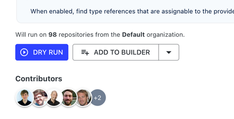

### UI v9.70.0 (2023/03/15)

- We have added operating system detection to custom tailor the user experience. The first place to use this is the CLI download dialogue which now will default the instruction set selected based on your operating system. This should reduce the confusion on what instruction to use.
- Various bug fixes and improvements

### UI v9.69.0 (2023/03/13)

### API Examples

We improved how we surface GraphQL API examples to make it easier to include multiple types of calls on a single page in one location where it's consistent to find

<figure>
  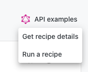
  <figcaption></figcaption>
</figure>

### UI v9.68.0 (2023/03/09)

- Try CLI `curl` example now uses URL from API Gateway
- Various bug fixes

### UI v9.67.0 (2023/03/09)

- Recipe results table now supports sorting by the four different marker count columns: info, debug, warn, and error.
- Recipe artifacts can now only be updated by those with the administrative rights within the UI.
- Various bug fixes.

### UI v9.66.0 (2023/03/08)

Now you can download the Moderne CLI from your SaaS Instance.

#### Recipe builder

We've rearranged a few of the buttons to make some actions clearer to the customer. _New Recipe_ took the place of the _Import YAML_ button, which was moved to the YAML preview. _New Recipe_ will reset the state for the Recipe builder so you can start on your new endeavors.

<figure>
  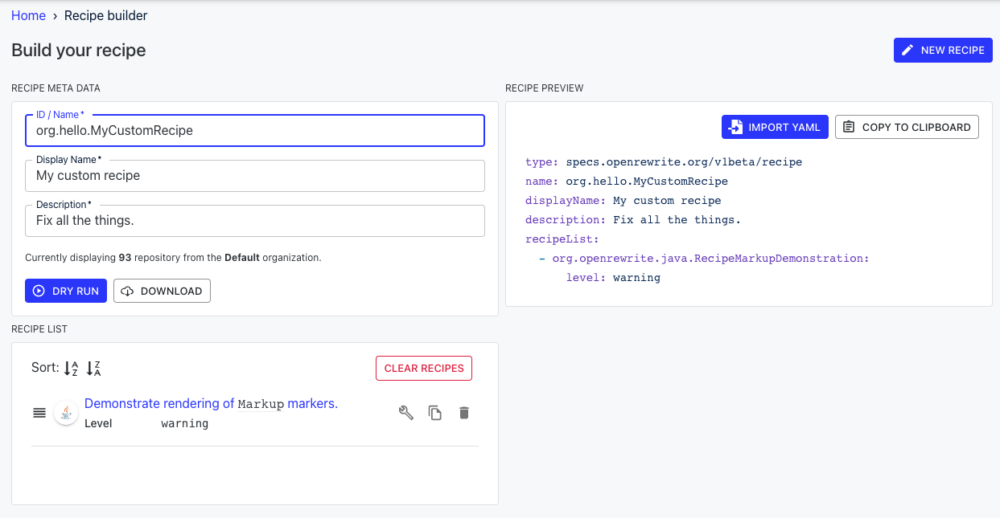
  <figcaption></figcaption>
</figure>

#### Recipe refresh

Spring is right around the corner and we've been doing a little bit of cleaning to make the recipe page cleaner and more consistent with the rest of the site.

<figure>
  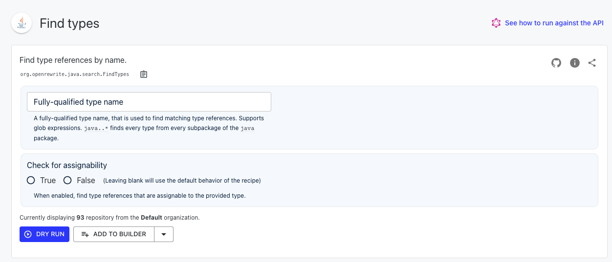
  <figcaption></figcaption>
</figure>

#### Download the Moderne CLI

Go to the _Help_ menu → _Try Moderne CLI_

<figure>
  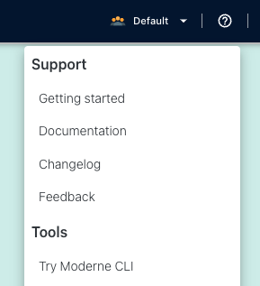
  <figcaption></figcaption>
</figure>

<figure>
  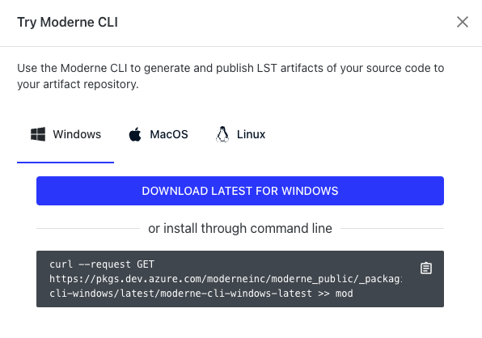
  <figcaption></figcaption>
</figure>

### UI v9.65.0 (2023/03/03)

In our continual efforts to integrate the new organizations service we have redesigned the top navigation bar. You will now find plenty of space for displaying longer organization and repository group names as well as improvements to all drop downs menus.

<figure>
  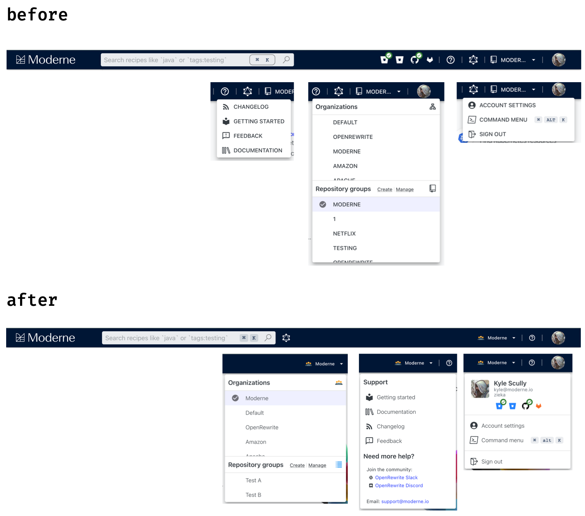
  <figcaption></figcaption>
</figure>

Notably, source management control connections have been moved into a new profile section in the avatar dropdown. Additionally, the redesigned top navigation bar is more accommodating of smaller device screens.

### UI v9.64.0 (2023/03/02)

Up until now repository groups have been stored in the users' localStorage on their browser. If users had large amounts of groups with large lists of repositories they would approach the limits of their localStorage (typically 5-10 Mb).

We have now switch to using IndexedDB for this purpose which will not run into these same thresholds and provides faster reads and writes for large objects.

### UI v9.63.0 (2023/02/27)

The interactive origin icon now includes links:

<figure>
  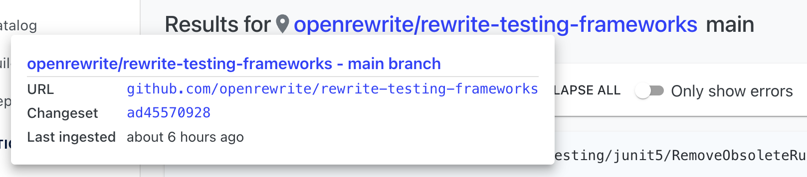
  <figcaption></figcaption>
</figure>

We added some quality of life changes on various forms to have focus be automatically brought to the first field, for example when adding or editing a repository group.

### UI v9.62.0 (2023/02/24)

Improve support for organizations defined in the organization service.

### UI v9.61.0 (2023/02/24)

We have added the ability to see repository origin details from the diff page via the interactive origin icon:


GitHub links on recipe details for OpenRewrite recipes ([v9.35.0](#recipe-source-links)) previously linked to a search interface to find the origin on GitHub. These have now been updated with direct links to the source.

### UI v9.60.0 (2023/02/23)

All file downloads have been standardized to use our async download manager for a more consistent experience.

### UI v9.59.0 (2023/02/23)

Add more support for organization as we shift focus on the new organization service:

- UI will now use commit options defined by the organization service
- Recipe runs in the UI and GraphQL can now use organization ID

We have also added recipe IDs to the list of recipes in the catalog to save time for those seeking them by preventing the need to drill down into each individual recipe details page.

### UI v9.58.0 (2023/02/16)

Optimize the UI's use of GraphQL queries.

### UI v9.57.0 (2023/02/15)

Added more data table driven Jupyter lite notebooks. Currently supported:

- org.openrewrite.maven.table.DependenciesInUse:
  - dependency-usage-violin.ipynb
  - dependency-usage.ipynb
- org.openrewrite.table.ParseFailures:
  - parse-failures.ipynb
- org.openrewrite.table.RecipeRunStats:
  - recipe-visit-all-performance.ipynb
  - recipe-visitor-performance.ipynb
- org.openrewrite.table.SourcesFileResults:
  - composite-recipe-results.ipynb

### UI v9.56.0 (2023/02/14)

Repository Groups has been refreshed. The global menu will now separate Organizations that are defined by either the Moderne Agent or your implementation of the Moderne Organization service and _Repository groups_ that are locally curated collections of repositories.

<figure>
  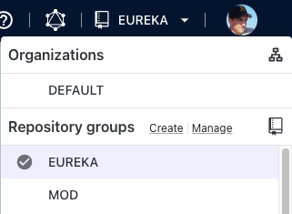
  <figcaption></figcaption>
</figure>

We've also added some visual touches to better group icons in the top navigation as well as providing you with a quick visual cue of the current selection.

### UI v9.51.0 (2023/02/01)

A new option has been added to the Pull Request form to allow or disallow the reopening of closed pull requests.

<figure>
  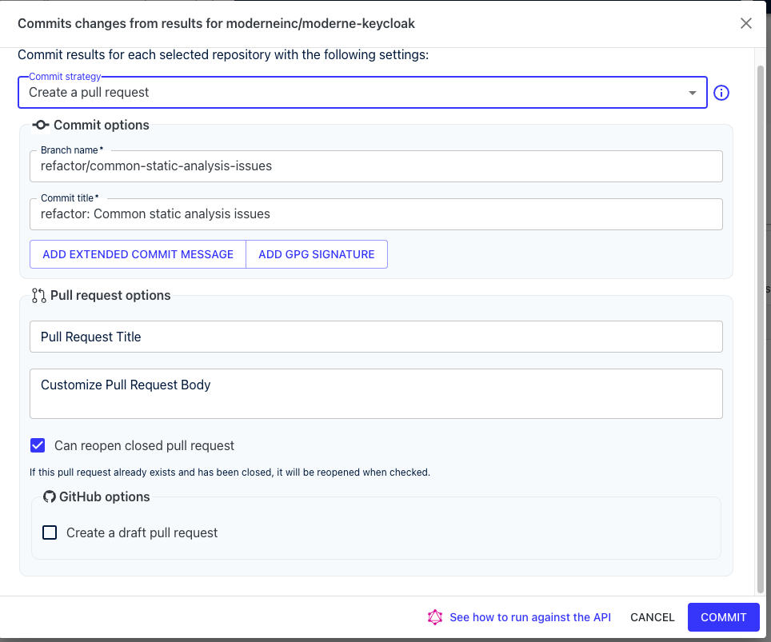
  <figcaption></figcaption>
</figure>

`See how to run against the API` link has been added to the commit form as well. This will show the GraphQL for the action.

<figure>
  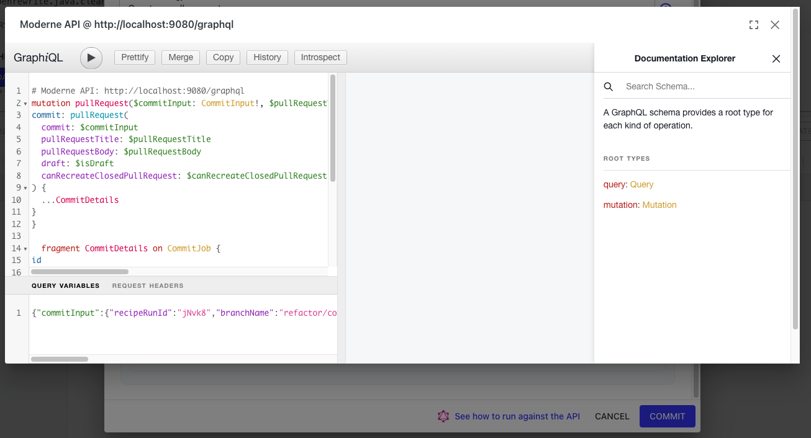
  <figcaption></figcaption>
</figure>

### UI v9.46.0 (2023/01/21)

Data tables: Recipes can now emit tabular data according to a schema that they define.

<figure>
  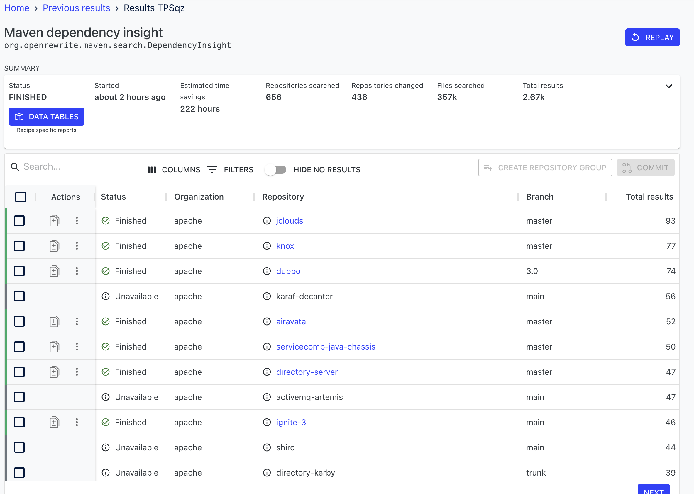
  <figcaption></figcaption>
</figure>

<figure>
  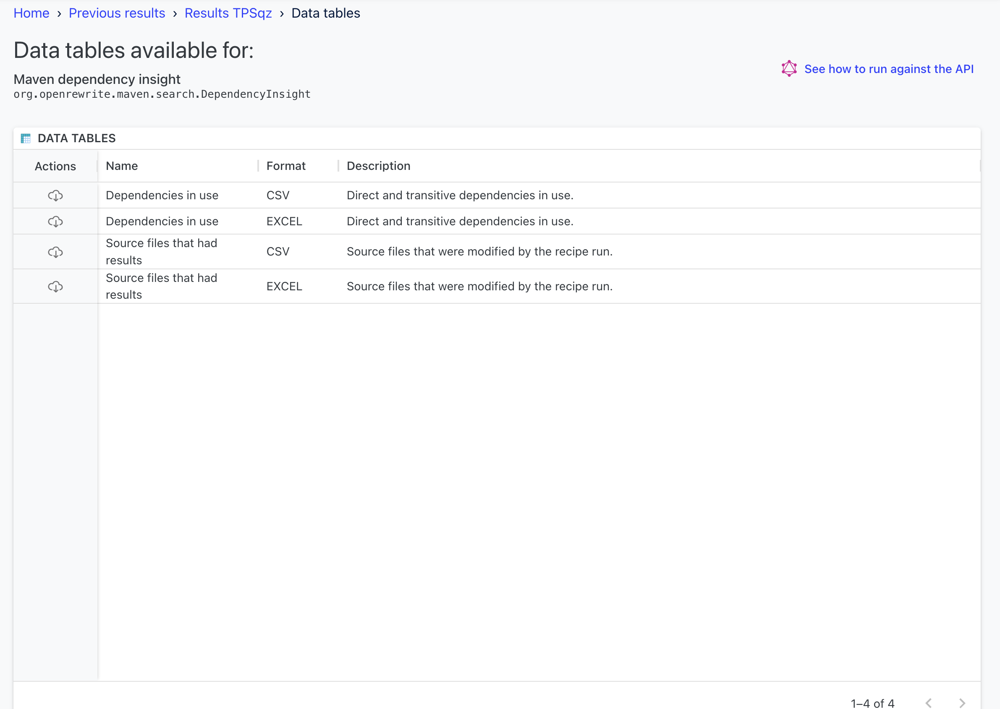
  <figcaption></figcaption>
</figure>

### UI v9.44.0 (2023/01/21)

#### Repository quick view

Hover over the info icon to quickly view more information including the commit that the artifact was generated from and when it was ingested into the platform.

<figure>
  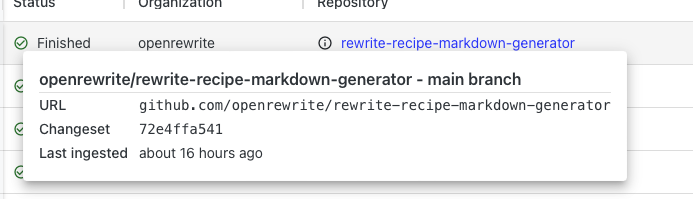
  <figcaption></figcaption>
</figure>

### UI v9.41.0 (2023/01/17)

#### Removal of the default repository group `All`

Moderne SaaS no longer provides a default named repository group called `All` that represents all ingested repositories. Customers can define their own named repository group through Agent to provide this functionality. See the example below.

```json
{
  "All": {
    "name": "All",
    "repositories": null
  },
  "Default": {
    "name": "Default",
    "repositories": [...]
  }
}
```

### UI v9.39.0 (2023/01/11)

#### Actions moved to left

Actions for grids are now presented on the left-hand side of the table.

<figure>
  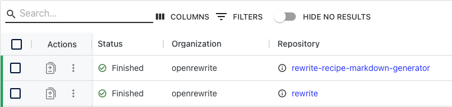
  <figcaption></figcaption>
</figure>

### UI v9.37.0 (2023/01/10)

#### Bitbucket Cloud support

Repositories hosted on Bitbucket Cloud are now supported. This [requires additional configuration through your agent](../administrator-documentation/moderne-platform/how-to-guides/agent-configuration/configure-bitbucket-cloud-to-agent.md#prerequisites).

<figure>
  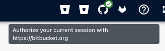
  <figcaption></figcaption>
</figure>

### UI v9.35.0 (2022/12/30)

#### Admin token management

We have added the ability for admins to view and revoke Moderne personal access tokens of any user. There is now a new Access tokens page under the admin navigations:

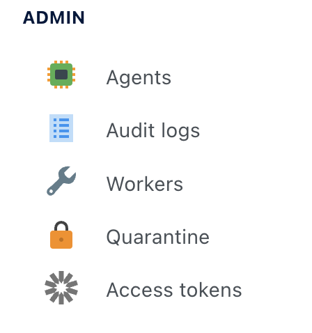

#### Improved keyboard shortcuts

While addressing some keyboard shortcuts that were reported to conflict with certain browsers we overhauled the keyboard shortcuts to primarily use single key commands and added more. These commands will not fire if the focus of the browser is in a text input or any control like field. Additionally, we have provided a new short cut cheat sheet that is activated with `shift`+`?`

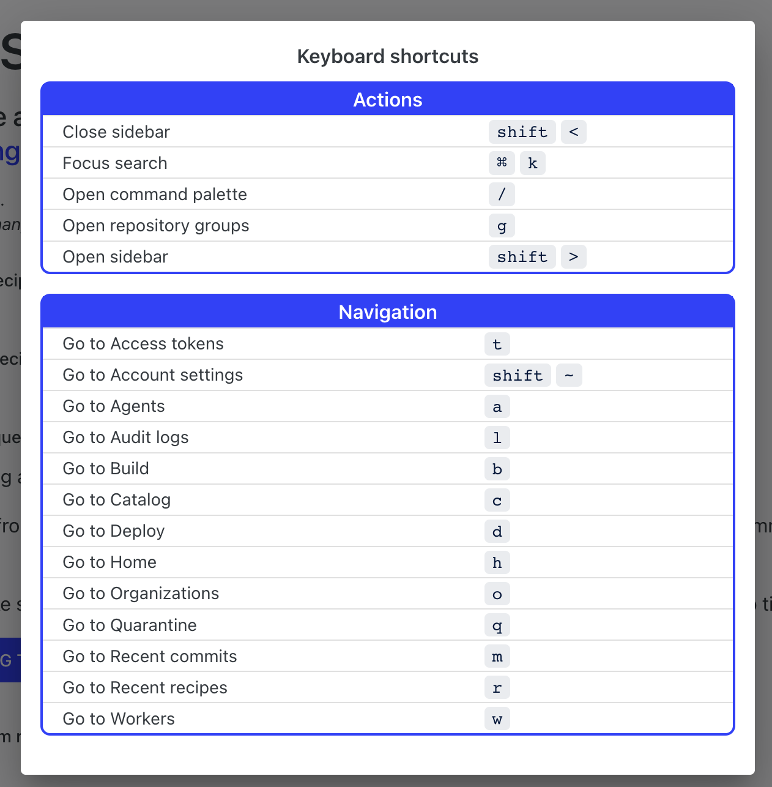

#### Recipe source links

We want to improve users and recipe authors' experience finding source code for a particular recipe. We have added on the recipe details pages a link on OpenRewrite recipes that will use a specialized GitHub search query to find the source. We have plans to expand this functionality in the future.

<figure>
  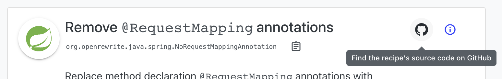
  <figcaption></figcaption>
</figure>

### UI v9.31.0 (2022/12/16)

#### Support for adding applicability tests to builder recipes

The "Add to builder" button now has an additional drop-down to support adding the current recipe to the builder as an applicability test.

These tests currently come in two variants:

- `singleSource` - The custom recipe will _**only be run on those source files**_ that would have been changed by _**all**_ `singleSource` test recipes.
- `anySource` - The custom recipe will run on _**all**_ _**source files**_ if there would have been a change from all `anySource` tests. Not all `anySource` tests have to change the _**same**_ file; as long as there would be one change from each test then the custom recipe would be run.

<figure>
  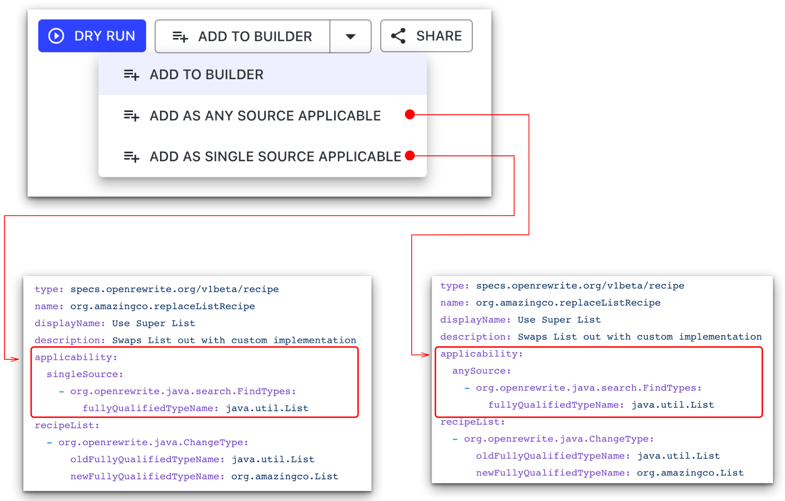
  <figcaption>_For more information on applicability test see the [OpenRewrite documentation](https://docs.openrewrite.org/authoring-recipes/recipe-conventions-and-best-practices#use-applicability-tests)_</figcaption>
</figure>

### UI v9.29.0 (2022/12/14)

#### Show error when recipe no longer exists

<figure>
  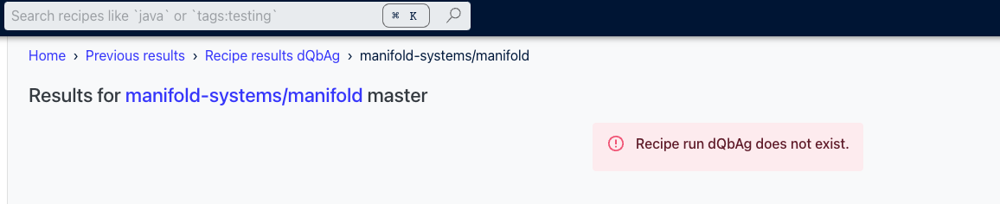
  <figcaption></figcaption>
</figure>

### UI v9.28.0 (2022/12/10)

#### Origin and base branch added to commit results table

<figure>
  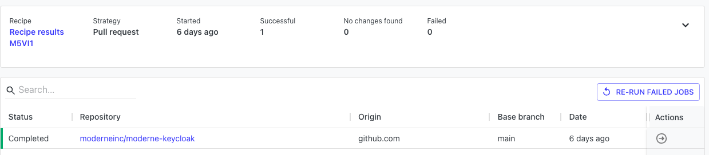
  <figcaption></figcaption>
</figure>

### UI v9.26.0 (2022/12/09)

#### Patch and commit are now disabled if there are no results to commit

<figure>
  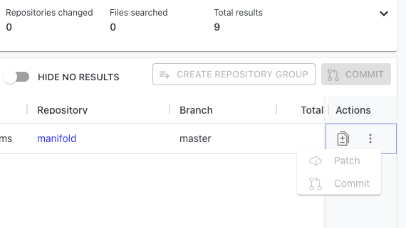
  <figcaption></figcaption>
</figure>

### UI v9.25.0 (2022/12/08)

#### Add error details to errors in diffs

An Error card shows the code where the error was discovered, the error message, and now a new section called details that will show any extra details like stack traces. Additionally, the copy button in the upper right of the card now copies all sections as a string of Markdown to your copy buffer.

<figure>
  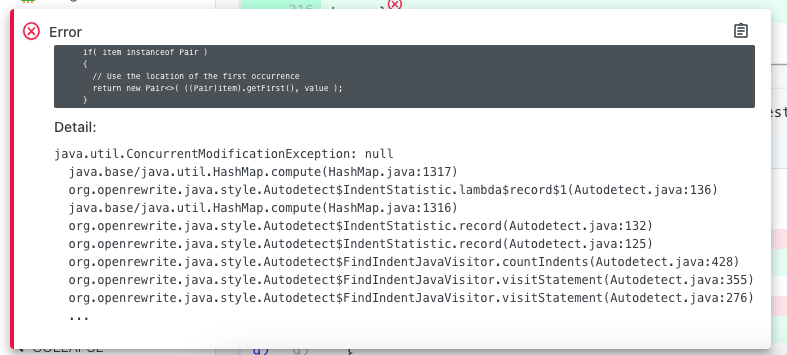
  <figcaption></figcaption>
</figure>

### UI v9.24.0 (2022/12/02)

#### Create a new repository group from existing

<figure>
  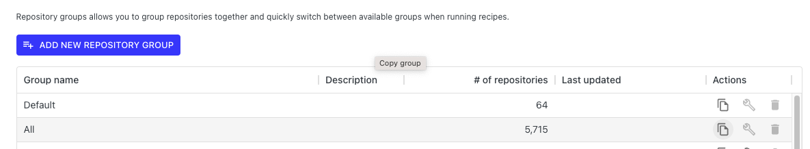
  <figcaption></figcaption>
</figure>

#### Add see how to run GraphQL to more locations

This has been added to the following pages:

- recent commits
- commit jobs
- organizations
- workers
- quarantine

<figure>
  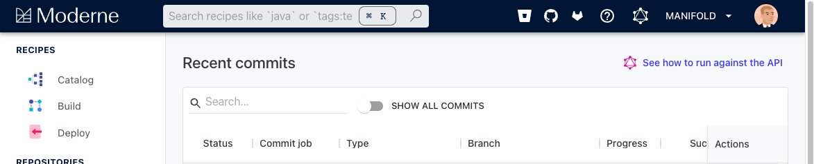
  <figcaption></figcaption>
</figure>

### UI v9.23.0 (2022/11/30)

#### Ignore whitespace changes

You can now hide whitespace changes from diffs via the _Settings_ menu

<figure>
  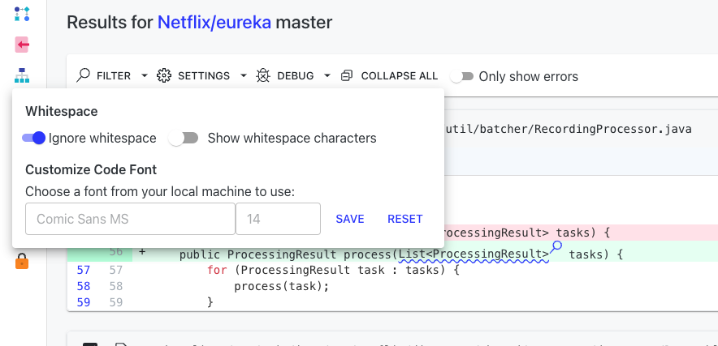
  <figcaption></figcaption>
</figure>

### UI v9.21.0 (2022/11/18)

#### Viewing result diffs

Now it's even easier to filter down the result set to only those diffs that include errors from the result diff menu bar.

<figure>
  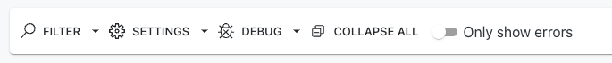
  <figcaption></figcaption>
</figure>

### UI v9.15.0 (2022/11/03)

#### Status page

We have added a status page `/status` that displays a general summary of the site's health.

<figure>
  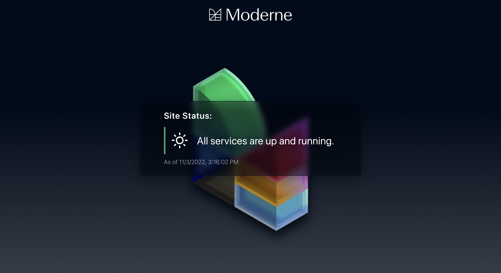
  <figcaption></figcaption>
</figure>

#### Enhanced marker info

Recipe run results summary view now has the option to view the number of markers returned for each repository.

<figure>
  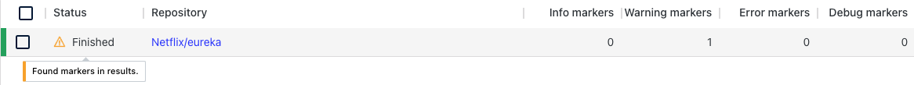
  <figcaption></figcaption>
</figure>

This can also be viewed in the extended summary.

<figure>
  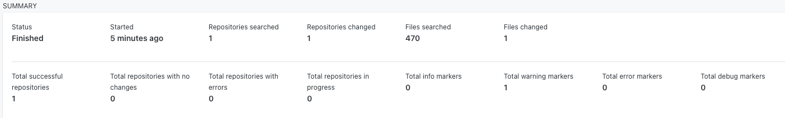
  <figcaption></figcaption>
</figure>

### UI v9.14.0 (2022/11/02)

#### Named repository groups

Previously repository selection was performed at recipe run time. Now users will create named repository groups that will drive what repositories recipes are run against and what repositories are shown on the Organizations page. The group in use will be visible in the header. Groups can also be created from the repositories of a recipe run. There is also a `All` group by default that is all the repositories of the tenant. The named groups are initially stored in the browser's local storage.

**Running a recipe**

<figure>
  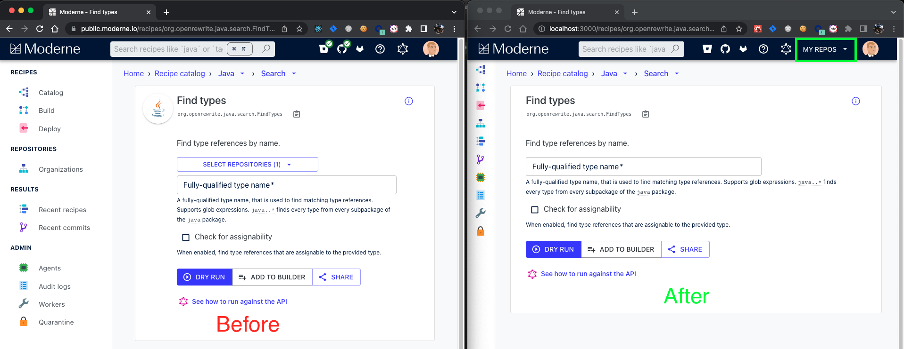
  <figcaption></figcaption>
</figure>

**Repository group menu**

<figure>
  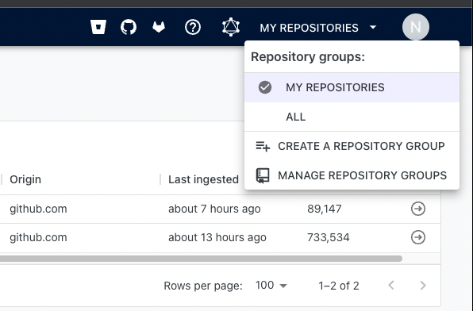
  <figcaption></figcaption>
</figure>

From this menu, users can change their selection, create a new grouping, or navigate to the management page for all their groups.

**Repository group creation**

<figure>
  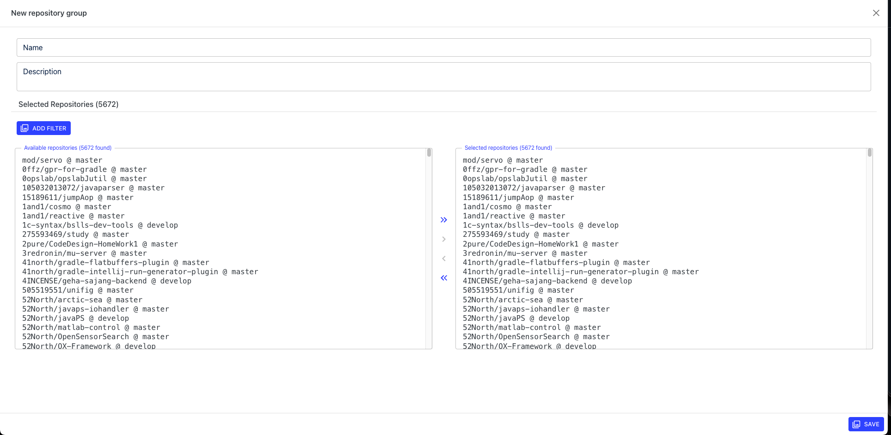
  <figcaption></figcaption>
</figure>

**Organization view filtered**

<figure>
  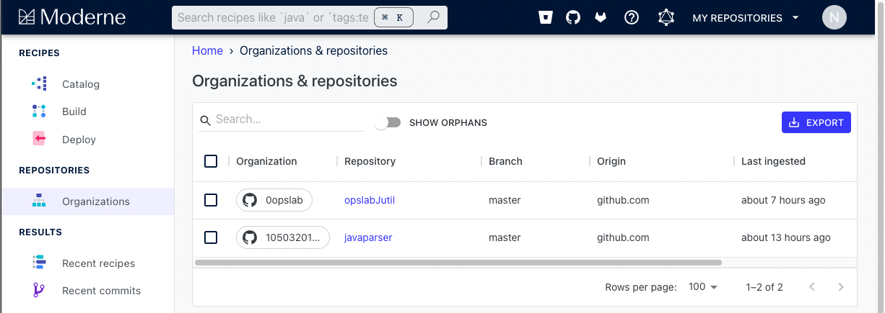
  <figcaption></figcaption>
</figure>

As shown above, only repositories defined in the user's repository group are displayed.

**Recipe run group creation**

<figure>
  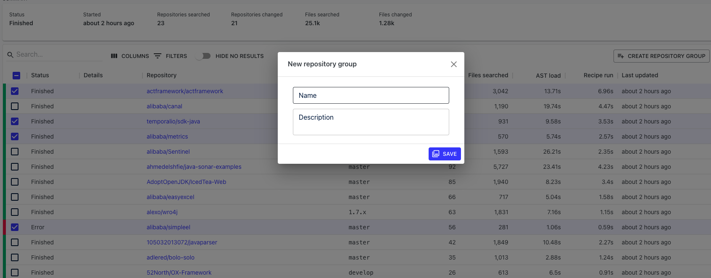
  <figcaption></figcaption>
</figure>

New groups can be created from the selected rows of a recipe run.

### UI v9.11.0 (2022/10/24)

#### Only show error hunks

In addition to using Moderne for running recipes, it is also common to use the built-in debugging tools for recipe development.

<figure>
  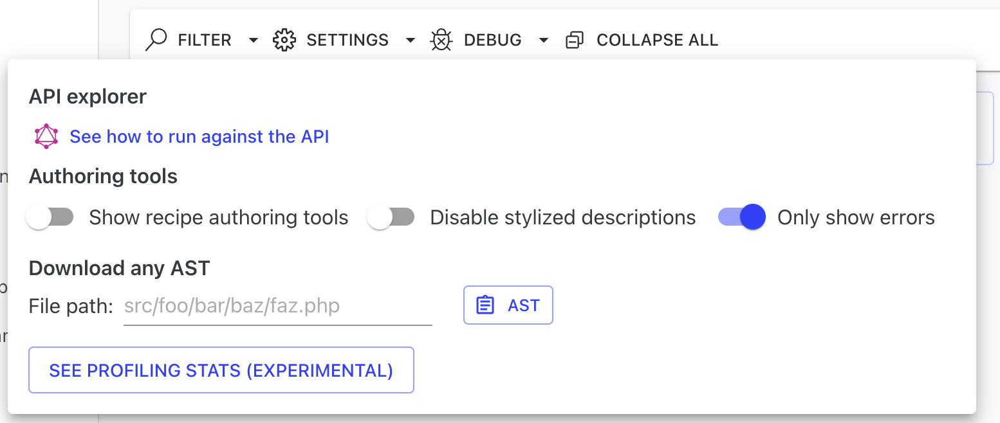
  <figcaption></figcaption>
</figure>

Previously, the `Only show errors` a toggle would limit diffs to only those containing errors. For large files with multiple hunks of changes, this behavior still required recipe authors to manually search for the errors that surfaced.

We have changed this behavior so that `Only show errors` will now cause only the hunks with errors to render.

### UI v9.8.0

#### Commit job status

Previously the _Recent Commit Job_ page only reported the overall status of job completion. We now surface the number of successful, failed, or jobs with no changes.

<figure>
  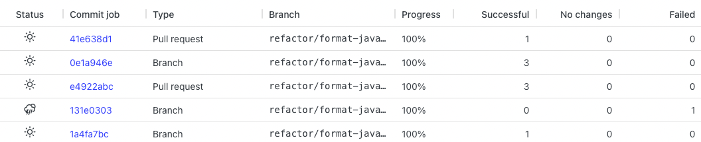
  <figcaption></figcaption>
</figure>

### UI v9.7.0

#### More markers!

We have increased the types of markers we annotate and surface in the diff view of the UI. Previously the new markers will now render as squiggly lines with an icon. If there are additional details, it will allow you to click in to see those details:

<figure>
  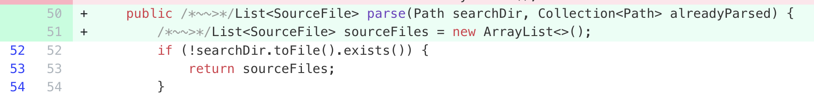
  <figcaption></figcaption>
</figure>

<figure>
  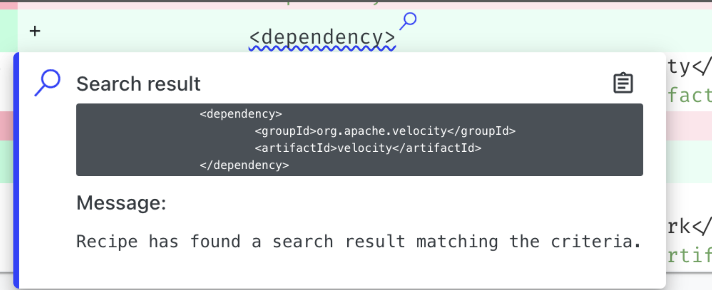
  <figcaption></figcaption>
</figure>

In addition to search markers, we will render info/debug, warnings, and errors in a similar way:

<figure>
  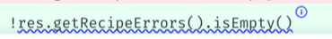
  <figcaption></figcaption>
</figure>

<figure>
  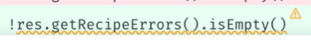
  <figcaption></figcaption>
</figure>

<figure>
  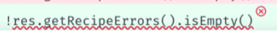
  <figcaption></figcaption>
</figure>

### UI v9.5.0

#### Improved recipe deployment

Deploying recipe artifacts now has an improved asynchronous experience. We've added the recipe artifact state and last deployment time to increase the visibility around the freshness of a recipe artifact. Notable changes to the Moderne Platform

<figure>
  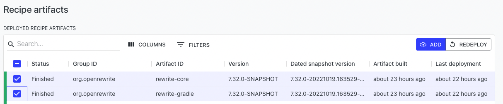
  <figcaption>_View recipe artifact state and last deployment time._</figcaption>
</figure>

### UI v9.4.0

#### Moderne update notice

<figure>
  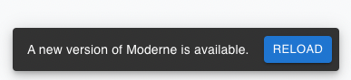
  <figcaption>_If there is a Moderne update in the middle of your browser session, you should now see a prompt to refresh your page to ensure you have the latest version available._</figcaption>
</figure>
