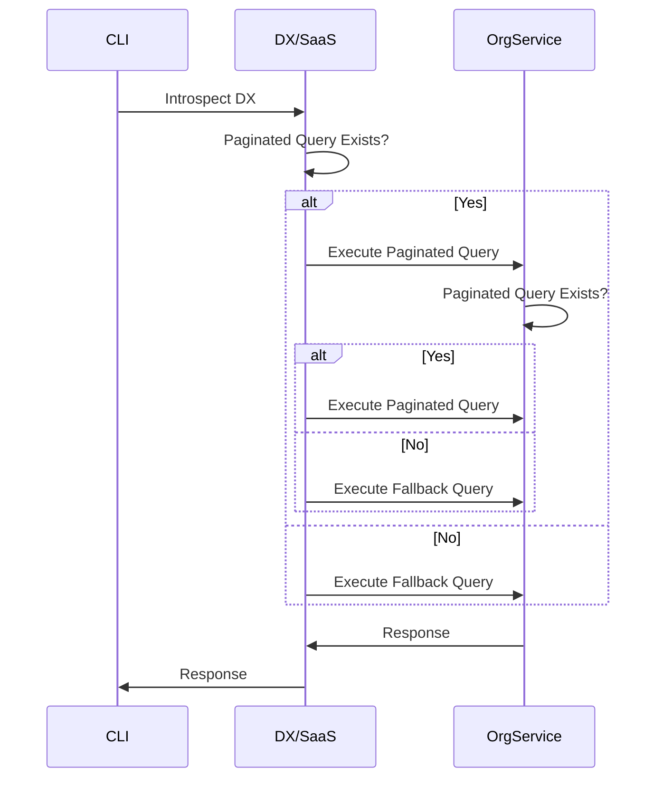

# CLI / DX changelog

### CLI v3.32.0 (2025/02/07)

#### What's Changed
* Add duration to timeout exception message
* Prevent more unwanted Gradle tasks to run
* Enable JSON formatting auto-detection
* Prevent NPE on nullable tools when reporting build outcome
* Build projects where some configurations fail to resolve
* Add inclusions into the Gradle plugin
* Apply Remote files


### CLI / DX v3.31.2 (2025/01/29)

#### What's Changed
* Skip the Maven Dependency Plugin's goals by default.
* Add clearer side label and description to auto-generated docs
* Do not overwrite valid license.key when running recipes on unhosted repos
* Skip recording metrics for known build errors to avoid skewing ingest success rates
* Fixes issue with `mod build` for classes with `lombok.Generated`. **If you were affected by this problem, you will need to rebuild all affected LSTs.**


### CLI / DX v3.31.1 (2025/01/27)

#### What's Changed CLI
* Log warning and continue building when failing to calculate maven dependency resolution times
#### What's Changed DX
* N/A


### CLI / DX v3.31.0 (2025/01/24)

#### What's Changed
* Do not run `install.sh` or `mod help` when publishing
* Follow symlinks when discovering projects
* Ensure native image adds rewrite-javascript-remoting-server resources
* Use `mod git push -u` to set upstream branch
* Support TOML parsing in native image
* Add npm build step and related config commands for node based projects


### CLI / DX v3.30.0 (2025/01/21)

#### What's Changed CLI
* Migrate JS build on generic remoting API
* Add support for offline temporary CLI licenses
#### What's Changed DX
* Add support for offline temporary CLI licenses


### CLI / DX v3.29.5 (2025/01/17)

#### What's Changed
* Parse `**/*.jsonnet` as PlainText
* Clarify afterburner command
* Handle nullable response from `retrieveData()`
* Delete daemon port file if daemon shuts down/dies


### CLI / DX v3.29.4 (2025/01/16)

#### What's Changed CLI
* Remove duplicate timer


### CLI / DX v3.29.3 (2025/01/16)

#### What's Changed CLI
* Update with rewrite 8.43.2 which includes [this fix](https://github.com/openrewrite/rewrite/commit/2586748a25b90b3d7f272a8f06bf80ea4628550e) for system property precedence in Maven property substitutions
* When running in parallel default to using one fewer core than is available when called by IDE


### CLI / DX v3.29.2 (2025/01/15)

#### What's Changed CLI
* Measure maven dependency resolution without using the Maven Invoker plugin
* Remove `ProgressBar#step()` from `Tasks#forEach()` handlers
* Add `--parallel` option to DevCenter run to be able to tweak the cores used
* Improve description for parallel flag


### CLI / DX v3.29.1 (2025/01/14)

#### What's Changed CLI
* Flag error on outcome failure
* Correct command output field index when detecting bazel tool version
* Use /bin/zsh for mac native install since we write to ~/.zshrc
* Add python and node versions to build activity log
#### What's Changed DX
*  N/A


### CLI / DX v3.29.0 (2025/01/13)

#### What's Changed
* Parallelization of recipe runs, installation, etc. More details in this [deck](https://docs.google.com/presentation/d/1K8-kJX4hkpA0eBtNbn4XTkZG9OA9dXbX/edit?usp=sharing&ouid=108669801108622792389&rtpof=true&sd=true)
* Mod study excel output: freeze top row, correctly converts numerics
* Support parallel task progress bar tracking, and enable it for `mod run`
* Progress indicator: Updates to color coding to improve readability
* Support Java detection for multiline `.sdkmanrc`
* Add `build.tool.family` CLI metric
* Fix for `ZipException: invalid entry size`
* Add `maxFragmentWeight` to `scm.properties` to determine if an LST fragment might be too big to load into memory.
* Add `TomlParser`
* Also resolve snapshots from `s01.oss.sonatype.org`

### CLI / DX v3.28.0 (2024/12/31)

#### What's Changed CLI
* OpenRewrite [v8.42.4](https://github.com/openrewrite/rewrite/releases/tag/v8.42.4)
* rewrite-python [v1.27.5](https://github.com/openrewrite/rewrite-python/releases/tag/v1.27.5)

### CLI / DX v3.27.9 (2024/12/30)

#### What's Changed CLI
* Rewrite-JavaScript [v0.26.0](https://github.com/openrewrite/rewrite-javascript/releases/tag/v0.26.0)

### CLI / DX v3.27.8 (2024/12/27)

#### What's Changed CLI
* OpenRewrite [v8.42.3](https://github.com/openrewrite/rewrite/releases/tag/v8.42.3)
* Rewrite-JavaScript [v0.25.4](https://github.com/openrewrite/rewrite-javascript/releases/tag/v0.25.4)

### CLI / DX v3.27.7 (2024/12/24)

#### What's Changed CLI
* Rework logic after seeing metadata only failures


### CLI / DX v3.27.7 (2024/12/24)

#### What's Changed CLI
* Rework logic after seeing metadata only failures


### CLI / DX v3.27.6 (2024/12/23)

#### What's Changed CLI
* Show commands as deprecated when run and in the docs
* Installing new recipe no longer returns the old version in some cases
* Detect Java version from `.sdkmanrc` files
* Detect more common recipe jars when installing
* Do not read SNAPSHOT versions from `.moderne/cli/maven-cache`
* Suggest next steps when recipe not found
* fix issues around missing mod configuration
* Color repositories based on LST availability
* On mod build, correctly set the path for partitioned repositories


### CLI / DX v3.27.5 (2024/12/19)

#### What's Changed CLI
* Allow `git clone csv` to work with `--metadata-only`
* Allow .NET builds in directories with Gradle, Maven or Bazel build scripts
* Pass the dependency resolution time using the properties files


### CLI / DX v3.27.4 (2024/12/13)

#### What's Changed
* Add scss, save, config extensions to plain text parsing list


### CLI / DX v3.27.3 (2024/12/12)

#### What's Changed CLI
* Add libspec and robot files to plaintext masks
* On clone, only build url for configured clone protocol


### CLI / DX v3.27.2 (2024/12/11)

#### What's Changed CLI
* Revert "Consider alternative urls when retrieving latest builds"
* Download resources to "~/.moderne/cli/rewrite-classpath"
* Use `git.properties` alternateUri field when parsing `GitRemote`
* Generate uri using `GitRemote`
#### What's Changed DX
* Add default ssh alternate url if only https is configured


### CLI / DX v3.27.0 (2024/12/05)

#### What's Changed CLI
* Upgrade to [OpenRewrite v8.41.2](https://github.com/openrewrite/rewrite/releases/tag/v8.41.2) and associated plugin versions
#### What's Changed DX
* Consider alternative urls when retrieving latest builds


### CLI / DX v3.27.0 (2024/12/05)

#### What's Changed CLI
* Upgrade to [OpenRewrite v8.41.2](https://github.com/openrewrite/rewrite/releases/tag/v8.41.2) and associated plugin versions
#### What's Changed DX
* Consider alternative urls when retrieving latest builds


### CLI / DX v3.26.9 (2024/12/03)

#### What's Changed CLI
* Drop trailing empty `env:` from native GitHub Actions
* Filter out DevCenter recipe runs with null files with results count
#### What's Changed DX
* N/A


### CLI / DX v3.26.8 (2024/12/03)

#### What's Changed
* Record dependency resolution time for Gradle and Maven builds
* Fallback to `python` when `python3` is not available
* Enable completion from `install.sh` by default


### CLI / DX v3.26.7 (2024/11/29)

#### What's Changed CLI
* Pick up [OpenRewrite v8.41.1](https://github.com/openrewrite/rewrite/releases/tag/v8.41.1) and associated plugins

### CLI / DX v3.26.6 (2024/11/26)

#### What's Changed CLI
* Fix `NPE` in `mod study`
* Correct logic error when detecting bazel version that required both bazel and bazelisk be installed
* Continue to list projects through JSON despite partial failure
* Do not log stack trace when recipes fail to sync when `dotnet` is not installed
* Gradle 8.10 supports Java 23
* Register `JS` types for reflection in native image
* Suggest a branch name related to recipe name
#### What's Changed DX
* Exclude older groovy


### CLI / DX v3.26.6 (2024/11/26)

#### What's Changed CLI
* Fix `NPE` in `mod study`
* Correct logic error when detecting bazel version that required both bazel and bazelisk be installed
* Continue to list projects through JSON despite partial failure
* Do not log stack trace when recipes fail to sync when `dotnet` is not installed
* Gradle 8.10 supports Java 23
* Register `JS` types for reflection in native image
* Suggest a branch name related to recipe name
#### What's Changed DX
* Exclude older groovy


### CLI / DX v3.26.5 (2024/11/20)

#### What's Changed
* Gitignore `buildSrc/.kotlin` over nebula release plugin complaints
* Use `worker-large-ssd` for Linux native image build
* Handle empty data table gracefully in `mod study`
* Use OS-specific casing for PATH environment variable for CLI subprocesses


### CLI / DX v3.26.4 (2024/11/19)

#### What's Changed CLI
* Add option to install recipes from NPM
* Add suggestion to install .NET SDK when failing to sync nuget recipes
* Adding dependency resolution time to the generated excel file from "mod log runs"
* Suppress JvmGcMetrics warnings from micrometer when native images do not support GC notifications
* Do not overwrite recipe sync log when installing nuget recipes
* Stop updating CLI version in mass-ingest-example Dockerfile


### CLI / DX v3.26.3 (2024/11/18)

#### What's Changed CLI
* Fix error caused by `mod config recipes moderne sync` for NuPkg packages
* Prevent NPE on unmatched arguments
* Address performance degradation when running `mod config recipes moderne sync`
* Log error details when unable to read from CSV
* Improve performance of `mod study`
#### What's Changed DX
* Fix NPE when generating devcenter where no security results exist
* Only display devcenter cards where data is available


### CLI / DX v3.26.2 (2024/11/14)

#### What's Changed CLI
* Handle preferred versions in TOML for Android version detection


### CLI / DX v3.26.1 (2024/11/12)

#### What's Changed CLI
* Remove `rewrite-kotlin` dependency 
#### What's Changed DX
* N/A


### CLI / DX v3.26.0 (2024/11/12)

#### What's Changed
- send notification to ops-alerts when native image build fails on a release.
* Allow deletion of YAML recipes using file name
* Update with latest changes in JS/TS, Python, and C# parsers.


### CLI / DX v3.25.6 (2024/11/08)

#### What's Changed CLI
* Allow deletion of YAML recipes using file name
#### What's Changed DX
* N/A


### CLI / DX v3.25.5 (2024/11/06)

#### What's Changed CLI
* Add missing `org.openrewrite.kotlin.style.Autodetect` class to CLI classpath
#### What's Changed DX
* N/A


### CLI / DX v3.25.4 (2024/11/05)

#### What's Changed CLI
* `mod config organizations show` now shows all organizations. The query was setting after to "0" and was omitting the first organization listed.
#### What's Changed DX
* The `organizationsPages` query now shows counts correctly for all organizations.


### CLI / DX v3.25.3 (2024/11/04)

#### What's Changed CLI
N/A
#### What's Changed DX
* Include child organizations when fetching organizations the user has access to.


### CLI / DX v3.25.2 (2024/11/01)

#### What's Changed
* Include gradle build tools that fail validation in order to record tool versions in build activity log
* Latest OpenRewrite patch release to allow multiple `SearchResult`s on the same element.


### CLI / DX v3.25.1 (2024/11/01)

#### What's Changed CLI
* Consistently set a timeout per job, not step
* Revert "Align ~/.rewrite/classpath to ~/.moderne/cli/rewrite-classpath in the CLI"
#### What's Changed DX
* N/A


### CLI / DX v3.25.0 (2024/10/31)

#### What's Changed
* Store a persistent copy of the organizations locally to avoid doing a full sync on restart
* Align ~/.rewrite/classpath to ~/.moderne/cli/rewrite-classpath in the CLI


### CLI / DX v3.24.9 (2024/10/29)

#### What's Changed
* Recognize NO_COLOR environment variable to disable colored text output
* adopt new remoting components


### CLI / DX v3.24.8 (2024/10/25)

#### What's Changed CLI
- Upgrade to rewrite-maven-plugin 5.34.1, which removes a limit on file traversal depth when parsing code in deeply-nested maven projects
#### What's Changed DX
* Update doc path for cli-dx changelog markdown
* Add admin artifact diagnostics to DX


### CLI / DX v3.24.7 (2024/10/24)

#### What's Changed CLI

* Update aspects.bzl to not build LSTs for transitive dependencies of Bazel targets 

#### What's Changed DX

* Reduce the time it take to perform an organization sync when connected to organization service

### CLI / DX v3.24.6 (2024/10/23)

#### What's Changed CLI

* Ensure Python remote parser logs errors to build log
* fix reporting telemetry of javascript build steps
* Release a parallel stable major.minor version

#### What's Changed DX

* Support bearer tokens for DX artifactory authentication

### CLI / DX v3.24.5 (2024/10/20)

#### What's Changed

* Detect gradle script execution errors due to Windows line endings and provide a fix suggestion
* Merge `/META-INF/services` files for fat-jar distribution

### CLI / DX v3.24.3 (2024/10/17)

#### What's Changed

* Suppress lucene vulnerability
* pin lucene to v9
* use jspecify
* change groovy namespace from codehaus to apache to fix project compiliation error
* Allow for DX application to start
* Clean up doc generation for Docusaurus
* add required remoting codecs dependencies for python/js buildsteps

### CLI / DX v3.24.2 (2024/10/10)

#### What's Changed

* Remove checkstyle dependency as it now shaded and package-relocated within rewrite-java.

### CLI / DX v3.24.1 (2024/10/10)

#### What's Changed

* Improve print idempotence report in native CLI
* Handle double slash in publish URL

### CLI / DX v3.24.0 (2024/10/09)

#### What's Changed

* Support building C# repos in native CLI
* Adding auto detection for gradle and groovy

### CLI / DX v3.23.0 (2024/10/07)

#### What's Changed CLI

* Update with rewrite 8.37.0
* Don't fail if `dotnet` not found on Windows

### CLI / DX v3.22.6 (2024/10/06)

#### What's Changed CLI

* Fix CLI IDE debug code path on Windows.

### CLI / DX v3.22.5 (2024/10/04)

#### What's Changed DX

* Add the missing rewrite-remote dependency that prevented startup.

### CLI / DX v3.22.4 (2024/10/04)

#### What's Changed CLI

* Add JavaScript build step
* Register `H2MvStorePomCache` class for GraalVM in order to serialize maven metadata cache keys
* Improve performance of metric aggregation

### CLI / DX v3.22.3 (2024/10/03)

#### What's Changed CLI

* Migrate onto latest rewrite-remoting api
* Continue java runtime detection even if java executable cannot be found on PATH
* Supporting building moderne-cli on Windows ARM
* Removing the newly set CLI classpath

### CLI / DX v3.22.2 (2024/10/01)

#### What's Changed CLI

* Upgrade rewrite-polyglot to `1.14.1` which fixes `OmniParser` throwing an exception when presented with a source file type it doesn't have a parser for
* Hide stacktrace on failing recipe install

### CLI / DX v3.22.1 (2024/10/01)

#### What's Changed CLI
* Allow empty option displayname
* Use paginated query for organizations if available when fetching organizations



Action Required:

When the CLI is configured with DX or the SaaS the `organizationPages` query will now be used to retrieve organization if available. The implementation of `organizationPages` query will check if the organization service also has an `organizationsPages` query and retrieve its data from the organization service through this query.  

Please ensure your organization service is updated to support this new `organizationPages` query. This query is designed to efficiently handle larger lists of organizations and repositories. We recommend planning for migration to this new query in your organization service, as the existing organizations query is deprecated and will be removed in the future. Sync your organization implementation with the latest [reference implementation](https://github.com/moderneinc/moderne-organizations). The pagination support was added in this [commit](https://github.com/moderneinc/moderne-organizations/commit/127600abe6cec60b51d06a63f9801b6c116b650d).

#### What's Changed DX
* We’ve introduced a new query `organizationsPages` for paginated organization data and deprecated the organizations query.
```graphql
    @deprecated(reason: "use `organizationsPages` in stead")
    organizations(
        id: ID!
    ): Organization!

    organizationsPages(
        after: String
        first: Int = 100
    ): OrganizationConnection!
```

Key Changes:
- `organizations` query deprecated: This query is deprecated in favor of the new paginated query.
- New `organizationsPages` query: Provides a paginated list of organizations with parameters:
    - `after`: A cursor to fetch subsequent pages.
    - `first`: The maximum number of organizations to return (default: 100).

Action Required:

When DX is integrated with the organization service, it will now utilize the new `organizationsPages` paginated query to request organization data. Please ensure your organization service is updated to support this new `organizationPages` query. This query is designed to efficiently handle larger lists of organizations and repositories. We recommend planning for migration to this new query in your organization service, as the existing organizations query is deprecated and will be removed in the future. Sync your organization implementation with the latest [reference implementation](https://github.com/moderneinc/moderne-organizations). The pagination support was added in this [commit](https://github.com/moderneinc/moderne-organizations/commit/127600abe6cec60b51d06a63f9801b6c116b650d).

### CLI / DX v3.20.14 (2024/10/01)

#### What's Changed CLI

* backport orphaned repositories

### CLI / DX v3.22.0 (2024/09/30)

#### What's Changed CLI

* Enhance`mod config recipes moderne sync` to install C# recipes
* Update to rewrite-polyglot 1.14.0 which fixes missing type attribution in code parsed from Bazel builds
* Only save on at least partial success
* When recipes use the classpathFromResources mechanism use default location \~/.moderne/cli/rewrite-classpath instead of \~/rewrite/classpath

### CLI / DX v3.21.2 (2024/09/27)

#### What's Changed

* Adding partition name to study output
* When building Bazel LSTs, include the full classpath in the build log.

### CLI / DX v3.21.1 (2024/09/26)

#### What's Changed

* Display error in the dev center data table when any recipe errors out
* Add user provided dotnets to list of installed

### CLI / DX v3.21.0 (2024/09/25)

#### What's Changed CLI

* Add `no-maven-central` and `no-nuget-org` to `mod config features`
* Deprecate `mod config recipes artifacts default-repositories` - replaced by the new commands.

### CLI / DX v3.20.12 (2024/09/24)

#### What's Changed

* Disable maven central during recipe run if `mod config recipes artifacts default-repositories` is disabled
* When mod monitor fails to start, provide additional information to understand why it could not start
* Parse .NET .props and .sln files as PlainText to ensure recipes can be run on them

### CLI / DX v3.20.12 (2024/09/24)

#### What's Changed

* Disable maven central during recipe run if `mod config recipes artifacts default-repositories` is disabled
* When mod monitor fails to start, provide additional information to understand why it could not start
* Parse .NET .props and .sln files as PlainText to ensure recipes can be run on them

### CLI / DX v3.20.11 (2024/09/20)

#### What's Changed CLI

* Update rewrite-gradle-plugin version to 6.23.3 to get [a fix](https://github.com/openrewrite/rewrite-gradle-plugin/commit/98c7cd75bfaae0efddb9ac9e69f6e10937b39660) for freestanding gradle scripts missing `GradleProject` markers
* Configure reflection for classes required for native CLI binaries running `mod study`

### CLI / DX v3.20.10 (2024/09/19)

#### What's Changed CLI

* Keep track of which directories a given build step has claimed, and prevent subsequent build steps from also trying to build those directories

### CLI / DX v3.20.9 (2024/09/17)

#### What's Changed CLI

* Simplify RemoteRecipe execution. Rework NuGet Recipes loading. Adopt new API

### CLI / DX v3.20.8 (2024/09/13)

#### What's Changed

* Correctly set executable after `MODERNE_BUILD_TOOL_COMPILE` substitution
* Report failure when `mod exec` commands exit with error codes
* Suggest trust-store configuration on `mod config moderne edit` SSL failures

### CLI / DX v3.20.7 (2024/09/12)

#### What's Changed CLI

* Adapt to changes in [rewrite-maven-plugin v5.40.2](https://github.com/openrewrite/rewrite-maven-plugin/releases/tag/v5.40.2)
* Continue downloading artifacts when encountering individual errors during `mod config recipes moderne sync`

### CLI / DX v3.20.6 (2024/09/12)

#### What's Changed CLI

* Shutdown dotnet process on any exception

### CLI / DX v3.20.5 (2024/09/11)

#### What's Changed CLI

* Exclude Checkstyle's transitive dependencies. We don't use them but they were getting flagged by security scanners and bloating the size of the CLI binary

### CLI / DX v3.20.4 (2024/09/11)

#### What's Changed CLI

* Correct pluralization in mod config scm moderne sync output
* Remove lucene sneaking in via modcsharp
* Add timout propagation to dotnet server

### CLI / DX v3.20.3 (2024/09/10)

#### What's Changed CLI

* Update with moderne-recipe-loading-commons 1.0.5 which resolves the classloading issue when running recipes that reference MavenExecutionContextView, such as the DependencyResolutionDiagnostic recipe
* Prevent mod exec hang when --output flag is not supplied
* Group properties in one block when executing `mod config moderne show`

### CLI / DX v3.20.2 (2024/09/10)

#### What's Changed CLI

* Prevent mod exec hang when --output flag is not supplied
* Group properties in one block when executing `mod config moderne show`

### CLI / DX v3.20.1 (2024/09/10)

#### What's Changed CLI

* Update Gradle wrapper to 8.10.1
* Register `Moderne$ScmToolConfiguration` in the native image to allow deserialization This fixes a deserialization issue in the native version when using `mod config scm moderne sync`

### CLI / DX v3.20.0 (2024/09/09)

#### What's Changed CLI

* Update with rewrite-gradle-plugin 6.23.1, which allows Gradle dependency upgrade recipes to operate successfully on Gradle script plugins
* Extract AGP versions from libs.versions.toml \[libraries] definitions
* Disable CLI progress output when detecting JDK for `scm.properties`

### CLI / DX v3.19.5 (2024/09/09)

#### What's Changed CLI

* Do not print `@null` for default branch
* Add integration of dotnet remoting server with execution log
* Downgrade netty-bom to avoid using 4.2.0.Alpha\*
* Add `mod config scm moderne sync` command

### CLI / DX v3.19.4 (2024/09/05)

#### What's Changed CLI

* Migrate to JSpecify
* Save active socket and close before terminating the server

### CLI / DX v3.19.3 (2024/09/05)

#### What's Changed CLI

* Add support for parsing source sets defined using the Android Gradle plugin
* Right align the number of recipes in `mod config recipes list` and show total

#### What's Changed DX

Nothing

### CLI / DX v3.19.2 (2024/09/04)

#### What's Changed CLI

* \--json option of mod study is parsed properly again

### CLI / DX v3.19.1 (2024/09/04)

#### What's Changed CLI

* Separate python into its own build step
* Use `pip` to install Python packages required by `python` build step
* Auto adjust row height in Excel exports
* Extract JDK version constraints from android plugin versions

#### What's Changed DX

* Case insensitive repository handling in DX
* Case insensitive SCM type configuration in DX

### CLI / DX v3.19.0 (2024/09/02)

#### What's Changed CLI

* mod study now has --csv option to output datatable in csv format
* Parse Python using `PythonParser` in native build step
* Add `mod config scm *` commands to add/remove SCM configurations `mod config scm gitlab` and `mod config scm bitbucket` have been deprecated and existing configurations are automatically migrated.

#### What's Changed DX

* Add support for alternate URLs for private SCMs to allow for better origin matching for different protocols/port combinations

### CLI / DX v3.18.8 (2024/08/27)

#### What's Changed CLI

* Add dotnet recipes installation and running

### CLI / DX v3.18.7 (2024/08/26)

#### What's Changed CLI

* Add csharp dependency for recipe running
* Add missing org.openrewrite:rewrite-csharp breaking `mod build`

### CLI / DX v3.18.6 (2024/08/26)

#### What's Changed CLI

* Enable autodetection of styles for C#
* Migrate to new TCP Socket usage in a Dotnet remoting mechanism
* Fix compilation errors related to remoting API changes

### CLI / DX v3.18.5 (2024/08/25)

#### What's Changed CLI

* Properly shutdown dotnet remote server when build times out This solves an issue where a build would not recover after a timeout.

### CLI / DX v3.18.4 (2024/08/24)

#### What's Changed CLI

* report unidentified build steps as `Unknown` to ensure reporting
* Disable the `dotnet build` until it can be operationalized step.
* Use dotnet build timeout during the parse & lst write steps

#### What's Changed DX

* Update ingested repos periodically when using CSV source This fixes an issue where when using `repos.csv` as an organization source new LSTs were not exposed on GraphQL

### CLI / DX v3.18.3 (2024/08/23)

#### What's Changed CLI

* Remove duplicate parameter for sync command `path` and `organizationPath`

#### What's Changed DX

* Fix GraphQl schema inspection issue where `RecipeSearchConnection` does not match `Recipe` node type
* Fix `Invalid destruction signature` in `MVStoreConfig` @pstreef

### CLI / DX v3.18.2 (2024/08/21)

#### What's Changed CLI

* Fix mod git clone moderne description

#### What's Changed DX

* Do not close in memory store for each read/write operation. This fixes an issue where repositories would not show up as having LSTs when using `moderne.dx.storage.enabled=false`

### CLI / DX v3.18.1 (2024/08/21)

#### What's Changed

* Add support for recipes that have list type options

### CLI / DX v3.18.0 (2024/08/20)

#### What's Changed CLI

* Allow `mod git sync moderne` to convert a metadata clone to a full clone

This requires a slight change to how `mod git sync moderne` is used. Previously we would keep the same type (metadata or full) clone as the original clone command. Now, to keep a clone as a metadata only type when using `mod git sync moderne` you have to supply the `--metadata(-only)` option. If the option is not supplied the clone will become a full clone if it is not already. Switching from a full clone to a metadata only clone is not supported.

* Add milliseconds to LST jar name to avoid collisions
* Add publish LST partial success handling
* Replace default compliant with N/A in DevCenter
* Fix `link(path)` not working for relative paths not starting with `./`

#### What's Changed in DX

Nothing

### CLI / DX v3.17.2 (2024/08/19)

#### What's Changed in CLI

* Add `mod config run timeout` subcommand to configure recipe run timeouts
* Idempotent publish of LSTs
* Add `--last-recipe-run` to `mod run` for repeated runs

#### What's Changed in DX

Nothing

### CLI / DX v3.17.1 (2024/08/15)

#### What's Changed in CLI

* Update JacksonXML dependency to 2.17.2
* Increase recipe run execution timeout

#### What's Changed in DX

Nothing

### CLI / DX v3.17.0 (2024/08/14)

#### What's Changed in CLi

* Support `--host_jvm_args` for Bazel
* Add `mod config build bazel arguments` for Bazel
* Avoid organizations API queries with Azure DevOps types to DX instances that do not support them
* `mod git status` command

#### What's Changed in DX

* Close MvStore DB after each use and retry when opening

### CLI / DX v3.16.5 (2024/08/13)

#### What's Changed CLI

* Add DotnetServer.zip to included resources for native build
* `mod build` improvements for DotNet
* Remove javax.servlet and jakarta.servlet over license flagging

### CLI / DX v3.16.4 (2024/08/12)

#### What's Changed

* Use `to_list()` on `kt_provider.transitive_compile_time_jars`

### CLI / DX v3.16.3 (2024/08/09)

#### What's Changed CLI

#### # Bug fixes

* Use `DotNet` as LST provenance for C# projects

#### What's Changed DX

Nothing

### CLI / DX v3.16.2 (2024/08/08)

#### What's Changed CLI

#### # Bug fixes:

* use alternate url if the url origin is unknown and alternateUrl has a known origin
* Use the configured SCM origins when doing metadata only clone

#### # Features

* Permit cloning CSV with no branch

#### What's Changed DX

Nothing

### CLI / DX v3.16.1 (2024/08/08)

#### What's Changed CLI

* Upgrade jackson to 2.17.2
* Study supports partitions
* Add `mod git clone moderne` support for Azure DevOps repositories

#### What's Changed DX

* SCM support for Azure DevOps Services

### CLI / DX v3.16.0 (2024/08/07)

#### What's Changed CLI

* Defensively code Bazel aspect to allow for empty sources/classpath in Kotlin rules
* Bazel query enhanced to use json output to get list of jvm rules
* Exclude lucene coming in from `org.openrewrite.tools:h2database`
* Remove `Connected with provider of type [org.slf4j.nop.NOPServiceProvider]` output
* add rewrite-kotlin dependency and migrate to rewrite-remote-csharp api improvements
* Use JavaSourceSet.build variation which does not use Classgraph, which should improve parsing performance

#### What's Changed DX

* Dependency version upgrades

### CLI / DX v3.15.0 (2024/08/06)

#### What's Changed CLI

* Use `GitRemote` to determine origin/path and organization parsed from the clone url

### CLI / DX v3.14.3 (2024/08/06)

#### What's Changed CLI

* Share timeout configuration when calling bazel info.
* Install multiple Yaml recipes at once for WM
* parameters no longer quoted together
* A JDK must have a java compiler
* fix it tests
* Cli should not stop subsequent publishing on bad jar file contents.
* Implement new interface method
* Register class GitRemote with GraalVM
* use tool version from build step if not available in buildTools

### CLI / DX v3.14.2 (2024/08/01)

#### What's Changed CLI

* use `apiHost` for `curl` examples on exceptions involving GraphQL
* Fix expected repo count when cloning in DxCliIntegrationTests
* Pass base64 encoded inclusion as String
* Cache git provenance

### CLI / DX v3.14.1 (2024/07/31)

#### What's Changed CLI

* add mod csharp as implementation for all cases
* Pick up latest rewrite to no longer generate duplicate files

### CLI / DX v3.14.0 (2024/07/30)

#### What's Changed CLI

**Significant Changes**

* Always clone with org structure
* Parse C# projects

**What Else Has Changed**

* Fix build step exclusion of prior build step outputs
* Add next steps for git commands
* Prevent NPE when response body is null
* Include description of the expected argument format in timeout edit commands.
* Extend clone timeout to 10m
* Exclude .moderne directories from git.properties assertions
