# What's changed in SaaS v2

Moderne SaaS v2 brings substantial changes across the platform: more scalable recipe execution, support for more languages, new ways track activity, etc. This doc walks through what's new, what's faster, and what's changed compared to SaaS v1.

## New features

### Changelog

:::info
This feature can be enabled/disabled upon request. Please reach out to your account representative if you wish to use it.
:::

You can now view all code changes across your organization in one place. The Moderne Changelog tracks pull requests, commits, and activity across every repository — so you no longer need to jump between tools to understand what's happening.

<figure>
  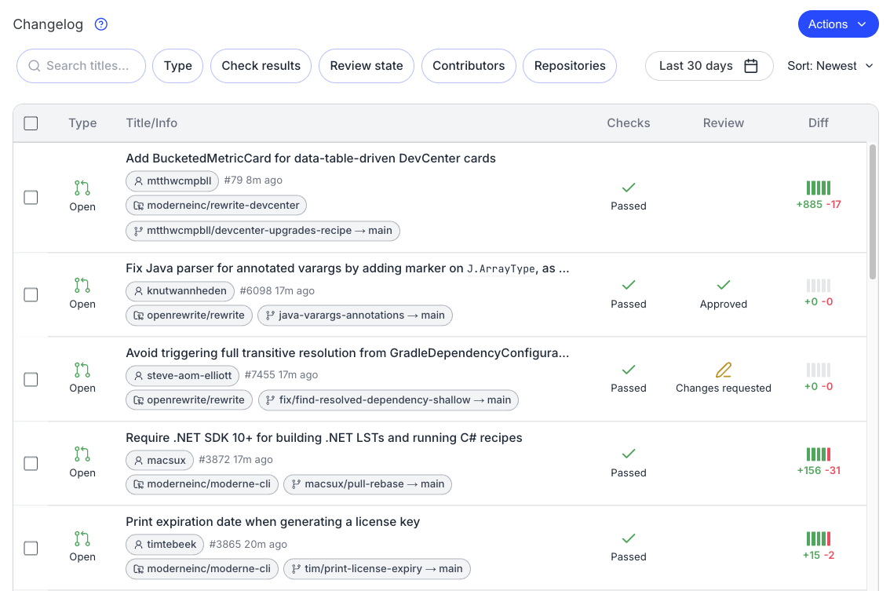
  <figcaption>_The Changelog brings PR and commit activity from across your organization into one view._</figcaption>
</figure>

### Atlas status pages

[Atlas](https://github.com/Netflix/atlas) status pages surface significantly more insight into what's happening across the platform, making it easier to monitor service health and pinpoint issues when they arise.

<figure>
  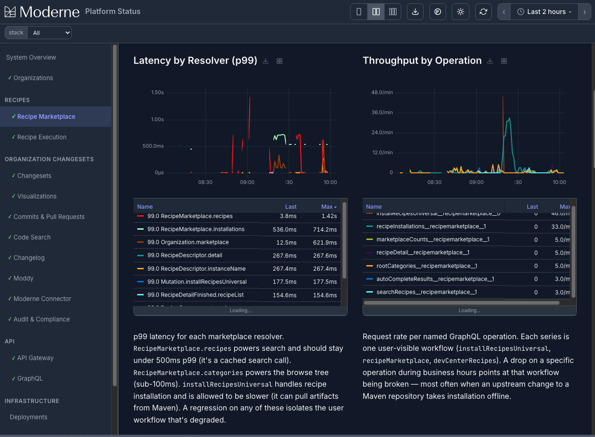
  <figcaption>_Atlas status pages give you a clearer view into platform health and ongoing issues._</figcaption>
</figure>

You can access this page by clicking on **?** icon in the top-right of the SaaS and then selecting **Status**:

<figure>
  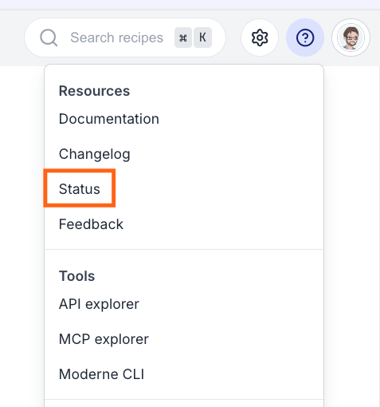
  <figcaption>_Status page link._</figcaption>
</figure>

### Continuous profiling across the platform

:::info
This feature can be enabled/disabled upon request. Please reach out to your account representative if you wish to use it.
:::

SaaS v2 ships with [Pyroscope-based](https://grafana.com/oss/pyroscope/) continuous profiling for every microservice in the platform — authorization, organization, the recipe worker, Moddy, the marketplace, and more. You can inspect CPU usage, memory allocation, mutex contention, and blocking time as flamegraphs, making it much easier to track down performance regressions wherever they live in the stack. When a recipe is running slowly, profiling the `modernecli` application can pinpoint exactly which code path is responsible.

<figure>
  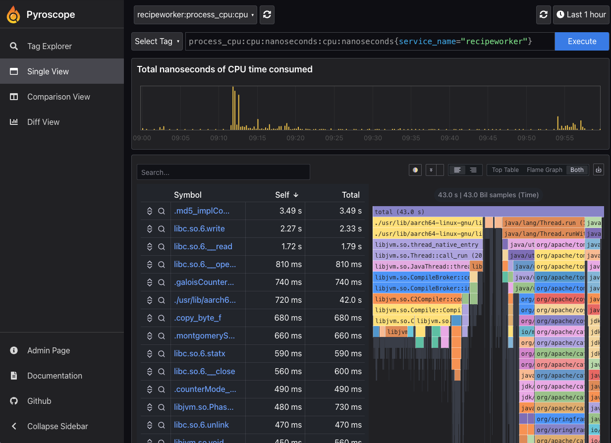
  <figcaption>_Pyroscope exposes CPU, memory, mutex, and blocking profiles for every microservice in SaaS v2._</figcaption>
</figure>

To enable profiling, you'll need to be an admin. Then click on the gear icon in the top-right and select **Settings**. You should then see a profiling enable button. Please note that performance may decrease while profiling is enabled.

<figure>
  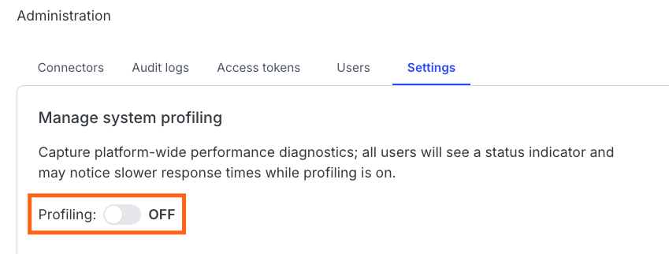
  <figcaption>_You can turn profiling on/off in admin settings._</figcaption>
</figure>

### Native recipes in more languages

SaaS v2 can run native recipes written in more languages now. These include JavaScript, TypeScript, Python, C#, and Go.

<figure>
  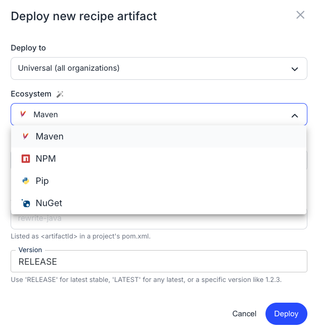
  <figcaption>_Native recipes can now be authored in JavaScript, TypeScript, Python, C#, Go, and Scala._</figcaption>
</figure>

### Customizable marketplaces

Marketplaces can now be configured differently for different organizations, allowing you to create mini sandbox environments for testing specific recipes within a subset of your org. The marketplace UI has also been redesigned based on customer feedback.

<figure>
  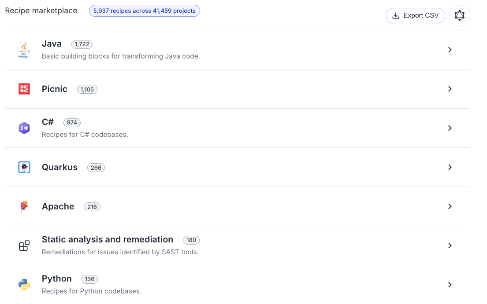
  <figcaption>_The redesigned marketplace can be tailored per organization for sandboxed recipe testing._</figcaption>
</figure>

## Performance improvements

### Recipe scalability

Recipes can now run against substantially larger organizations than before. As part of this work, data tables that previously could not be generated due to the number of repositories involved can now be produced reliably.

### Moddy works in restricted environments

Previously, Moddy did not work in locked-down environments because it relied on server-sent events. Moddy now polls for updates instead, so it works in restricted environments where server-sent events are blocked.

### Faster builder for large recipes

The recipe builder has been improved in two ways:

* Referential de-duping for pre-packaged recipes reduces redundant text while keeping descriptions accurate.
* Builds are substantially faster for larger recipes.

## Functional changes

### Moderne Agent renamed to Moderne Connector

The Moderne Agent has been renamed to the Moderne Connector to avoid confusion with AI agents. Configuration has also been reorganized to more clearly separate settings per microservice and functional component.

### Redesigned org viewer

The org viewer has been redesigned based on customer feedback:

* The org selector now shows how many repositories are in each org.
* Search is more visually clear and provides more context about what you're searching for.
* You can search for a parent org and quickly navigate to its child orgs.

<figure>
  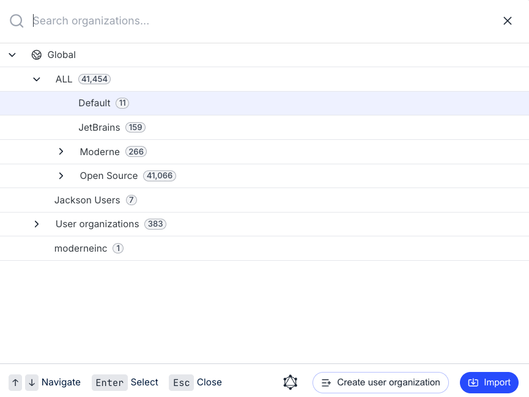
  <figcaption>_The org viewer shows repository counts and lets you quickly navigate between parent and child orgs._</figcaption>
</figure>

<figure>
  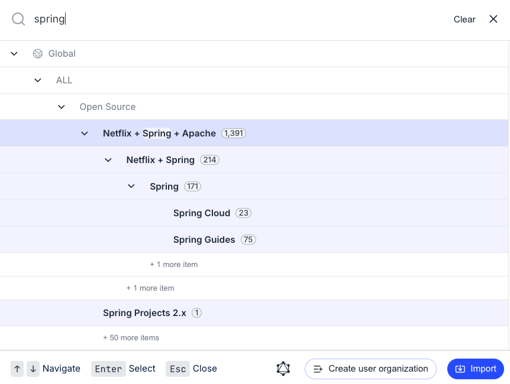
  <figcaption>_Search improvements let you see more context on the org you're searching for.._</figcaption>
</figure>

### Global org

There is now a global org that encompasses every organization, including user orgs. This makes it easier to run recipes and view activity at the highest level of your org hierarchy.

### Updated deploy page

The deploy page has been substantially updated:

* You can now deploy recipes from ecosystems like pip and NuGet, which was not previously supported.
* The **Add artifact** modal has smart defaults and clearer ecosystem-specific syntax, making it easier to understand what to enter for each ecosystem. 
  * For instance, if you wanted to deploy an NPM artifact, the version dropdown would let you specify a specific version or use the latest/next tag - with descriptions of what each did. In contrast, if you tried to deploy a Pip artifact, the version dropdown would not include a "next" tag as that doesn't apply to Pip artifacts.

<figure>
  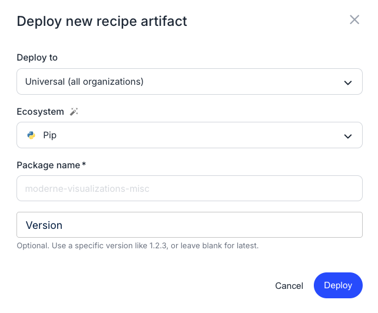
  <figcaption>_The Add artifact modal now supports pip, NuGet, and other ecosystems, with smart defaults for each._</figcaption>
</figure>

### Audit log changes

The audit log UI has been removed. Audit logs are now available only as a CSV or CEF download.

### Activity view surfaces data tables

The activity view has been expanded to include data tables. If someone in your organization has already generated a data table, you can find it in the activity view instead of regenerating it yourself.

<figure>
  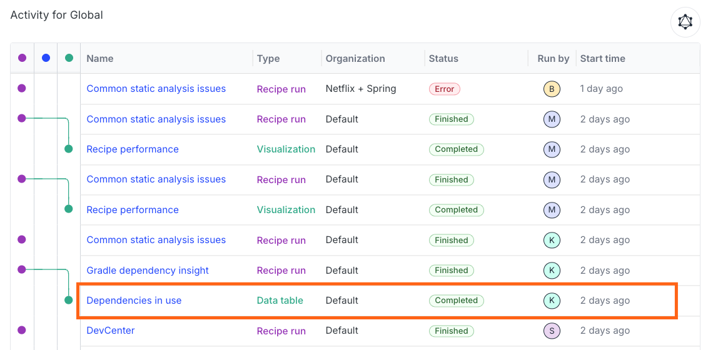
  <figcaption>_Data tables now appear directly in the activity view, so you can find previously generated tables without rerunning the recipe._</figcaption>
</figure>

### Failed repositories now appear in results

Previously, if a repository failed during a recipe run, it did not appear in the results view — you had to check the status tab to see why it was missing. Failed repositories are now included in the results view and clearly labeled as failures.

<figure>
  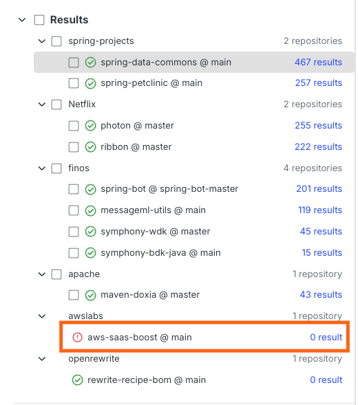
  <figcaption>_Failed repositories now appear in the results view, clearly labeled instead of being hidden in a separate status tab._</figcaption>
</figure>

### Recipe results persist between deployments

Recipe results, data tables, and visualizations now persist between deployments. Previously, they were wiped on every deployment; now they stick around, giving you context into what happened over a longer period of time.
