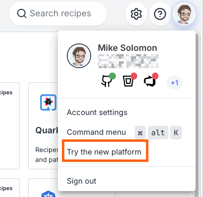

# Migrating to SaaS v2

This guide is for administrators migrating their Moderne tenant from SaaS v1 to v2. It covers what's renamed, what's split apart, what's new, and what to verify before fully cutting over. It is a companion to the [What's changed in SaaS v2](./saas-v2-changes.md) doc and does not repeat the feature overview there.

If you only have time to read three things, read them in this order:

1. [What has changed in the Connector](#what-has-changed-in-the-connector)
2. [LST sources vs. recipe sources](#lst-sources-vs-recipe-sources)
3. [Migration checklists](#pre-cutover-checklist)

## What has changed in the Connector

The Moderne Agent has been renamed to the **Moderne Connector**. Beyond the rename, configuration has been reorganized to more clearly separate settings per microservice and functional component. Practically, there are three categories of change to expect on your side:

1. **Property prefix renames.** Most `moderne.agent.*` properties have moved to a new prefix (`moderne.connector.*`, `moderne.scm.*`, `moderne.organization.*`, or `moderne.recipe.marketplace.*`), depending on the area they configure.
2. **Two new endpoints.** The API gateway path has moved from `/rsocket` to `/connector`, and there is a new `status.<tenant>.moderne.io` subdomain for Atlas dashboards.
3. **A few behavior changes.** You can no longer use a single Maven configuration as both an LST and recipe source; they require separate configs now.

For the full property-by-property mapping, see the [SaaS v2 property mapping reference](./saas-v2-property-mapping.md).

### Which artifact do I pull?

Pull `io.moderne:connector` instead of `io.moderne:moderne-agent`. Everything else about how you deploy your Docker image is the same: same arguments shape, same ports, same proxy patterns.

### Do I need a new token?

Yes. You'll need a new Connector token (your Moderne contact will send it privately) and you'll need to define a new `moderne.connector.crypto.symmetricKey` value. Your existing API access tokens, recipe run activity, commits, user orgs, and audit logs will be migrated for you. For more information, see [What gets migrated and when](#what-gets-migrated-and-when) below.

## Configuring the Connector

### Pointing the Connector at the API gateway

The property name and URL have changed. You'll need to update them accordingly:

* **Property name**: `moderne.agent.apiGatewayRsocketUri` → `moderne.connector.apiGatewayRsocketUri`
* **URL**: `https://api.<tenant>.moderne.io/rsocket` → `https://api.<tenant>.moderne.io/connector`

If you leave the `/rsocket` path in place, the Connector will fail to connect. As of Connector `0.148.100` you'll see an explicit `ERROR`-level message when this URI returns 404.

:::info[I didn't provide an org structure or a `repos.csv` to my Agent before, do I have to provide it now?]
Yes. You will have to provide a `repos.csv` that lists all of your repositories.

This `repos.csv` is not required to contain org structure. If you didn't provide org structure before, you can just provide the `repos-lock.csv` from your Artifactory/Nexus repository or S3 bucket and SaaS v2 will ingest all of your LSTs.
:::

### LST sources vs. recipe sources

In v1, a single `moderne.agent.maven[{index}]*` block could serve both purposes via the `astSource` and `recipeSource` flags. In v2 these are **two separate property trees**:

| Purpose                            | v1                                                         | v2                                                               |
|:-----------------------------------|:-----------------------------------------------------------|:-----------------------------------------------------------------|
| Sources Moderne polls for LSTs     | `moderne.agent.maven[{index}].*` with `astSource: true`    | `moderne.organization.sources.<type>[N].poll.maven[{index}].uri` |
| Sources for the recipe marketplace | `moderne.agent.maven[{index}].*` with `recipeSource: true` | `moderne.recipe.marketplace.repositories.maven[{index}].uri`     |

For LST sources, the `<type>[N]` segment matches whichever org structure source contains your `repos.csv`. For example, if you set `moderne.organization.sources.http[0]` to an Artifactory URL, the poll setting becomes `moderne.organization.sources.http[0].poll.artifactory[0].uri` (plus `lstQueryFilters`).

The v1 variables for LST and recipe sources are **not backwards-compatible**. Leaving them in place will produce the error `No recipe artifact store configured and default repositories are disabled. Recipe resolution is not possible with this configuration.` when you try to deploy a recipe. You must define both blocks explicitly under their new prefixes.

If you proxied these connections, the proxy host and port are configured under the same new prefix (e.g., `moderne.recipe.marketplace.repositories.maven[0].proxy.host`).

### SCM (GitHub, GitLab, Bitbucket) configuration

The SCM property prefix has changed from `moderne.agent.<scm>.*` to `moderne.scm.<scm>.*`. For example, GitHub proxy settings have moved like this:

| v1                                         | v2                                       |
|:-------------------------------------------|:-----------------------------------------|
| `moderne.agent.github[{index}].proxy.host` | `moderne.scm.github[{index}].proxy.host` |
| `moderne.agent.github[{index}].proxy.port` | `moderne.scm.github[{index}].proxy.port` |

:::warning
Properties under `moderne.agent.github[0]` and `moderne.scm.github[0]` are treated as **two separate entries**. If you mix prefixes (some properties under `moderne.agent.github[{index}].*`, others under `moderne.scm.github[{index}].*`), the proxy host/port from one block will not be applied to the other. Move everything to the new prefix at once.
:::

:::note
`moderne.agent.github[{index}].skipValidateConnectivity: false` can be dropped entirely.
:::

### Other tool proxies (Artifactory, Nexus, Maven, Gradle plugin telemetry)

All HTTP-based tools still take `proxy.host` and `proxy.port` properties, but they have moved to the new prefix that matches their function (`moderne.connector.*`, `moderne.recipe.marketplace.*`, `moderne.scm.*`, or `moderne.organization.sources.*`). If in doubt, ask in your shared channel before changing production configs.

## URLs, endpoints, and DNS

### GraphQL endpoint URL

The GraphQL endpoint URL has changed:

| v1                                 | v2                                        |
|:-----------------------------------|:------------------------------------------|
| `https://api.<tenant>.moderne.io/` | `https://api.<tenant>.moderne.io/graphql` |

The full v2 API spec is published in the [GraphQL API reference](../user-documentation/moderne-platform/references/graphql-api-reference.md).

While your tenant is in "migration mode" (meaning v1 and v2 are both available), you'll need to provide the header `X-Moderne-Platform-Version: v2` to make requests against the SaaS v2 API.

### What happened to `/admin/status` and `/api/status`

Both have been removed. Status information now lives at `https://status.<tenant>.moderne.io` (Atlas dashboards). See [What DNS do I need open](#what-dns-do-i-need-open) for what your network team needs to allow.

### Other URL path changes

**Renamed:**

* `/admin/agents` (and all provider sub-pages) → `/admin/connectors`
* `/devcenter/{organization}/configure` → `/devcenter/configure?organizationId={organization}`
* `/results/{recipeRunId}` → `/results/{organization}/{recipeRunId}`. Results are now org-scoped; the same applies to data tables, repositories, and visualization sub-pages.

**Removed (no direct replacement):**

* `/admin/status`: moved to `status.<tenant>.moderne.io`
* `/status`
* `/admin/reports`
* `/batch-changes`: folded into the Activity view

**Newly added:**

* `/admin/settings`
* `/changelog`
* `/mcp`: new MCP explorer

If your internal docs, bookmarks, or automation hit any of the renamed or removed paths, update them as part of cutover.

### What DNS do I need open?

In addition to your existing tenant domains, your network team may need to allow `status.<tenant>.moderne.io`.

:::tip
If the page is reachable in incognito but slow or broken in a normal browser session, clear cookies and local cache; we've seen stale auth cookies cause this.
:::

## Recipes in non-Java languages

SaaS v2 supports recipes packaged for pip, NuGet, and NPM in addition to Maven. If you want to stand up coverage for those ecosystems as part of the migration, see [Configure a Connector with recipe marketplace repositories](../administrator-documentation/moderne-platform/how-to-guides/connector-configuration/configure-recipe-marketplace-repositories.md) for the list of recommended packages and how to register each registry as a marketplace repository.

## Keeping recipe modules up to date

In SaaS v1, Moderne updated your installed recipe modules to their latest published versions as part of our weekly platform maintenance. **In SaaS v2, this no longer happens automatically - keeping recipe modules up to date is now your responsibility.** Your marketplace continues to serve whatever module versions are currently installed until you redeploy them.

To make this easy to operationalize, Moderne provides a sample [auto-redeploy-recipes automation](https://github.com/moderneinc/saas-templates/tree/main/auto-redeploy-recipes). It re-installs every recipe bundle registered in your tenant's universal marketplace, so any bundle installed with a moving version selector (such as Maven's `latest.release`) picks up the newest artifact published to your internal artifact repository. You can schedule it as a nightly cron job or a GitHub Actions workflow.

:::tip
For the "pick up the newest version" behavior to work, install your recipe bundles with a moving version selector (for example, `latest.release` or `latest.integration` for Maven, or `LATEST` for pip and Go). Bundles pinned to a concrete version are simply re-resolved to the same version. See the [automation's README](https://github.com/moderneinc/saas-templates/tree/main/auto-redeploy-recipes) for the full list of requirements, configuration variables, and scheduling examples.
:::

## DevCenter

In SaaS v1, the DevCenter Organizational ownership cards (**Repositories**, **Contributing developers**, and **Lines of code**) were populated automatically from your ingested LSTs each time the DevCenter ran. In SaaS v2, the **Contributing developers** and **Lines of code** cards are produced by two recipes that must be part of your DevCenter recipe: `io.moderne.devcenter.FindOrganizationStatistics` and `org.openrewrite.search.FindCommitters`. See [Organizational ownership recipes](../administrator-documentation/moderne-platform/how-to-guides/creating-a-devcenter-recipe.md#organizational-ownership-recipes) for the details.

If your DevCenter recipe does not include both, those two cards stay empty in v2, even though the **Repositories** card still works. Add both recipes to the `recipeList` of your DevCenter recipe, redeploy the recipe artifact, and re-run the DevCenter. The default [DevCenterStarter recipe](https://github.com/moderneinc/rewrite-devcenter/blob/main/src/main/resources/META-INF/rewrite/devcenter-starter.yml) already includes them.

## What gets migrated and when

Moderne migrates the following automatically, in a single pass scheduled just before your full v1 to v2 cutover:

* API access tokens
* Recipe run activity (history of what ran, but **not** the results themselves)
* Commits
* User organizations
* Audit logs

Recipe results, data tables, and visualizations from v1 do **not** carry over. Going forward in v2, results persist across deployments (see [What's changed in SaaS v2](./saas-v2-changes.md)).

## Monitoring during and after migration

The Prometheus endpoint on the Connector is still available; your existing scrape config keeps working. In addition, SaaS v2 ships Atlas dashboards at `status.<tenant>.moderne.io`, described in [What's changed in SaaS v2](./saas-v2-changes.md#atlas-status-pages).

:::info[I see "Failed to enrich RepoKey..." in Connector logs]
This typically means `repos-lock.csv` still references an LST that has been purged from S3, usually because a repo failed to build and hasn't been re-published since. It is logged at `WARN`, not `ERROR`, because it is not fatal. See [Troubleshooting LST issues](../administrator-documentation/moderne-platform/how-to-guides/troubleshooting-lst-issues.md#failed-to-enrich-repokey-after-lst-purge) for the full diagnosis.
:::

## Running v1 and v2 side-by-side (the "soak" phase)

Between Connector cutover and the final DNS flip, your tenant runs in **coexistence mode**: v1 is still the customer-facing front door, but v2 is reachable through it for clients that opt in. This is where you can test v2 before fully transitioning.

### Directing traffic at v2 while v1 is still the front door

There are three opt-in paths through your existing tenant hostnames. You don't need new DNS or new URLs.

| Traffic                                                 | How to land on v2                                                                                             |
|:--------------------------------------------------------|:--------------------------------------------------------------------------------------------------------------|
| API requests (`api.<tenant>.moderne.io`)                | Send header `X-Moderne-Platform-Version: v2` on the request.                                                  |
| Browser / UI sessions (`<tenant>.moderne.io`)           | Open the account menu (your avatar, top-right) and select **Try the new platform**.                           |
| Connector traffic (`api.<tenant>.moderne.io/connector`) | **Automatic.** The `/connector` path always routes to v2 once Moderne wires up coexistence. No header needed. |

Selecting **Try the new platform** pins your browser session to v2 and reloads the platform. The same menu then reads **Switch to the legacy platform** to take you back to v1. The entry appears once Moderne has placed your tenant in coexistence mode.

When you click on the **Try the new platform** button, a `moderne-version=v2` cookie scoped to `.<tenant>.moderne.io` will be set. This ensure that all calls to `api.<tenant>.moderne.io` carry it, too. Browsers only auto-send cookies (not custom headers), which is why the cookie, rather than a header, is what keeps you on v2.

To pin a scripted or non-UI client, set that cookie directly. Clearing it (or selecting **Switch to the legacy platform**) returns to you v1.

### How long does the soak phase last?

We aim for 2–3 weeks. Typical activities during soak: re-run a handful of representative recipes on v2, validate your marketplace shows the recipes you expect, confirm `/admin/connectors` shows all sources green, and exercise any API automation against v2 by adding the header.

## Cutover and after

### What actually happens at cutover

Moderne flips the DNS `NS` record for `<tenant>.moderne.io` from the v1 zone to the v2 zone. From that moment, all traffic (public DNS, API, UI) lands on v2 directly. The `NS` record uses a 30-second TTL, so propagation is fast, and Moderne typically runs a cutover inside a maintenance window so rollback is clean if something needs to back out.

There is **no customer-side DNS change**. Your team continues to use the same tenant URLs.

### Will users be signed out at cutover?

Keycloak's user database is migrated from v1 to v2 as part of the cutover sequence, and existing sessions may need to re-authenticate. Existing API tokens will be migrated and continue to work; they do not need to be re-issued.

### AWS PrivateLink customers

If you reach Moderne over AWS PrivateLink, the endpoint-service swap is scheduled **separately** from cutover and requires coordination on your side. The sequence:

1. **Through coexistence and cutover, nothing changes.** Your traffic enters via your existing VPC endpoint that targets v1's endpoint service, which keeps working all the way through the `NS` flip (the flip only affects public DNS).
2. **Before v1 is torn down,** Moderne provisions a new endpoint service on the v2 side and shares the new endpoint service ARN with you.
3. **On your side,** you create a new VPC endpoint pointing at the v2 endpoint service. Both endpoints can run concurrently.
4. **Cut your internal DNS / configuration** over to the new endpoint and validate with real traffic.
5. **Delete the old v1-pointing endpoint** once you're satisfied.
6. **Moderne tears down v1** after you confirm.

Only you can create, swap, and delete endpoints in your own account, so this needs a scheduled window. Auto-accept (`acceptance_required=false`) is mirrored on the v2 endpoint service so the operational experience matches what you have today.

If your organization uses Azure PrivateLink, the same model applies with Azure Private Link Service in place of AWS. Flag it to Moderne if so.

## Pre-deployment checklist

Run through this before declaring v2 production-ready in your environment. Each item maps to a specific failure mode seen during real customer cutovers.

:::note
You can tick items off as you go, but selections are not persisted across page reloads.
:::

### Connector deployment

* [ ] Use `io.moderne:connector` (not `io.moderne:moderne-agent`) moving forward.
* [ ] `moderne.connector.apiGatewayRsocketUri` ends in `/connector`, not `/rsocket`.
* [ ] `moderne.connector.token` (newly provided by Moderne) is set.
* [ ] No `moderne.agent.*` properties remain alongside their `moderne.connector.*` / `moderne.scm.*` / `moderne.organization.*` / `moderne.recipe.marketplace.*` replacements. Mixed prefixes are treated as separate entries and silently drop settings (such as proxy settings).

### Org structure source

See [Configuring organizations hierarchy](../administrator-documentation/moderne-platform/how-to-guides/connector-configuration/configure-organizations-hierarchy.md) for setup details.

* [ ] `repos.csv` defines an organizational hierarchy (at least one `org` column). This is required by the Connector; a single `ALL` organization is a fine starting point.
* [ ] `repos.csv` is uploaded to the **root** of the bucket or repo you publish LSTs to.
* [ ] `repos-lock.csv` is being produced and updated by your `mod publish` runs.
* [ ] `MODERNE_ORGANIZATION_SOURCES_S3_0_URI` (or `..._HTTP_0_URI`) points at the `repos-lock.csv` file, not the original `repos.csv` file.

### Recipe sources

* [ ] LST poll sources are configured under `moderne.organization.sources.{http|file|s3}[0].poll.{maven|artifactory}[0].*`.
* [ ] Recipe marketplace sources are configured under `moderne.recipe.marketplace.repositories.maven[0].*` (and the `npm`/`nuget`/`pip` equivalents if you use them).
* [ ] Deploying a Maven, NPM, PyPI, or NuGet recipe in the v2 UI succeeds.

### SCM

* [ ] All SCM properties use the `moderne.scm.*` prefix (no leftover `moderne.agent.<scm>.*`).
* [ ] In the v2 UI, the SCM icon for each provider is green on `/admin/connectors`.

## During deployment

### Network and DNS

* [ ] `status.<tenant>.moderne.io` resolves and is reachable from anywhere your team accesses Moderne.
* [ ] Your Prometheus scraper still hits the Connector's `/prometheus` endpoint successfully.

## Pre-cutover checklist

Run these with v1 still serving as your front door, using the header, cookie, and path opt-ins from [Running v1 and v2 side-by-side](#running-v1-and-v2-side-by-side-the-soak-phase) above.

* [ ] An API call to `api.<tenant>.moderne.io/graphql` with `X-Moderne-Platform-Version: v2` is served by v2.
* [ ] Update and test any existing automations you've previously configured.
* [ ] Set up recipe module redeploy automation. Moderne no longer refreshes recipe module versions for you in v2; see [Keeping recipe modules up to date](#keeping-recipe-modules-up-to-date).
* [ ] `/admin/connectors` shows your SCM configuration and source recipe / LST repositories.
* [ ] Marketplace lists the recipes you expect (including non-Java recipes if applicable).
* [ ] Repositories view shows the orgs and repos you expect.
* [ ] Run a small recipe against a small org end-to-end. This single test exercises LST fetch, recipe execution, SCM result presentation, and marketplace resolution. By far the most efficient smoke test.
* [ ] If you use DevCenter, confirm your DevCenter recipe includes the two org-statistics recipes required in v2 (see [DevCenter](#devcenter)) and redeploy it, then configure and load it at `/devcenter/configure?organizationId={org}`.
* [ ] Update internal bookmarks, runbooks, and any automation that references removed or renamed URLs (`/admin/status`, `/admin/agents`, `/batch-changes`, the bare GraphQL endpoint).
* [ ] Coordinate the final user-data migration window with your Moderne contact. Tokens, activity, commits, orgs, and audit logs will be migrated then.

## Cutover day coordination

* [ ] AWS PrivateLink customers: the v2 endpoint service swap is **not** done at cutover. Schedule that separately with Moderne after cutover and before v1 teardown.
* [ ] Plan for users to potentially re-authenticate after cutover (Keycloak DB migrates as part of the flip). API tokens carry over and do not need to be re-issued.
* [ ] Confirm a maintenance window with Moderne for the `NS` flip; rollback is fast (30s TTL) but a window keeps the experience clean.

## New v2 configuration options

In addition to the renamed properties from v1, SaaS v2 introduces a few optional configuration areas with no v1 equivalent. None are required to complete the migration; they enable new v2 features you may want to opt into:

* **Login screen customization** — custom login text and links (`moderne.ui.loginText`, `moderne.ui.loginLinks[N]`). See [UI customization variables](../administrator-documentation/moderne-platform/how-to-guides/connector-configuration/connector-variables.md#ui-customization-variables).
* **Connector working storage** — filesystem location for the Connector's working state (`moderne.connector.storage.permanentDir`). Mount a persistent volume here to survive Connector restarts. See [Storage variables](../administrator-documentation/moderne-platform/how-to-guides/connector-configuration/connector-variables.md#storage-variables).
* **Changelog feature** — SCM credentials and origins for posting Changelog updates (`moderne.changelog.<scm>.*`). See [Changelog variables](../administrator-documentation/moderne-platform/how-to-guides/connector-configuration/connector-variables.md#changelog-variables).

## Migration aid

To help generate v2 configuration from your existing v1 configuration, start the Connector once with your existing `moderne.agent.*` config and `moderne.connector.write-migrated-config=true` (default `true`):

| Property                                               | What it does                                                                                     |
|:-------------------------------------------------------|:-------------------------------------------------------------------------------------------------|
| `moderne.connector.write-migrated-config=true`         | On startup, write `moderne.yml` with the migrated canonical form of every `moderne.agent.*` key. |
| `moderne.connector.migrated-config-path=./moderne.yml` | Output path for the above.                                                                       |

Every rewrite is logged as `Config migration: <old> -> <new>`, and the resulting `moderne.yml` is adoptable as-is.

## Where to get help

If you hit something not covered here, open a scoped thread in your shared Moderne support channel (one issue per thread). For the broader product changes outside the Connector, see [What's changed in SaaS v2](./saas-v2-changes.md).
