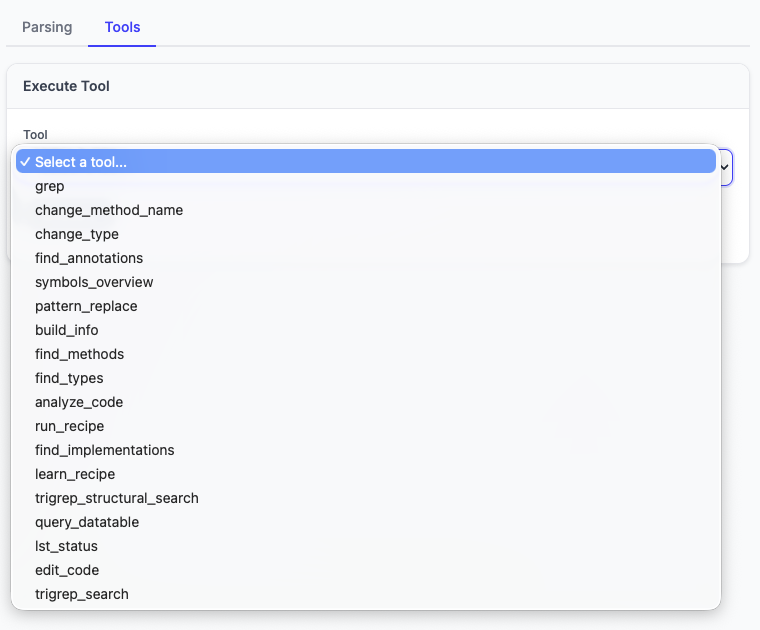

# Moderne MCP server

The Moderne CLI includes a [Model Context Protocol (MCP)](https://modelcontextprotocol.io/) server that gives AI coding agents tools for semantic code search, navigation, and refactoring. While [skills](../skills.md) teach agents *how* to work with recipes, the MCP server gives agents direct access to these tools, backed by OpenRewrite's [Lossless Semantic Tree (LST)](../../../administrator-documentation/moderne-platform/references/lossless-semantic-trees.md) and [Moderne Trigrep](../trigrep.md).

## Why use the Moderne MCP server

AI coding agents are limited to the tools bundled with them (typically just text search and file reading). These tools work at the text level and miss the **semantic** structure of code.

The Moderne MCP server gives agents:

* **Indexed code search** that returns results in milliseconds regardless of repository size
* **Semantic navigation** that understands types, methods, annotations, and inheritance hierarchies
* **Codebase-wide refactoring** that updates all references atomically, like an IDE rename
* **Recipe execution** that runs OpenRewrite recipes directly from the agent conversation
* **Structural matching** that finds code patterns spanning multiple tokens or lines

Because these tools are backed by a semantic model of your code, they understand it the way a compiler does - rather than text like a traditional tool would.

## How it works

The MCP server **must be started from within a git repository**. If the working directory is not part of a git repository, the server will exit immediately and none of the tools will be available.

When the MCP server starts, it builds two things in the background:

1. **[Moderne Trigrep](../trigrep.md)**: a pre-computed trigram index that enables sub-second text search across the entire repository. This powers the `trigrep_search` and `trigrep_structural_search` tools.
2. **[LSTs (Lossless Semantic Trees)](../../../administrator-documentation/moderne-platform/references/lossless-semantic-trees.md)**: a type-attributed tree representation of your source code that enables semantic tools like `find_types`, `find_methods`, `change_type`, and recipe execution.

Tools become available progressively as each build completes. You can check their progress with the `build_status` and `lst_status` tools.

## Available tools

The MCP server exposes the following tools:

### Indexed search

| Tool                        | Description                                                                                                                                                                                                                                                                                      |
|-----------------------------|--------------------------------------------------------------------------------------------------------------------------------------------------------------------------------------------------------------------------------------------------------------------------------------------------|
| `trigrep_search`            | Searches the codebase using a pre-built trigram index. Faster than grep/ripgrep because it uses indexed search, returning results in milliseconds regardless of repo size. Supports plain text, regex, and filters (`lang:`, `file:`).                                                           |
| `trigrep_structural_search` | Searches using [Comby](https://comby.dev/) structural matching over the trigram index. Use this when you need to find code patterns that span multiple tokens or lines, such as method signatures, call patterns, or control flow. Uses `:[hole]` placeholders that respect balanced delimiters. |
| `grep`                      | Linear file-content search using ripgrep or the system grep binary. No index required, so it is available before the trigram index finishes building. Prefer `trigrep_search` once the index is ready.                                                                                           |

### Semantic search

| Tool                   | Description                                                                                                                                                                                  |
|------------------------|----------------------------------------------------------------------------------------------------------------------------------------------------------------------------------------------|
| `find_types`           | Finds all references to a type across the codebase, including imports, field types, method parameters, return types, type casts, instanceof checks, annotations, and generic type arguments. |
| `find_methods`         | Finds all invocations of a method across the codebase. Uses AspectJ-style method patterns to match method calls.                                                                             |
| `find_annotations`     | Finds all usages of an annotation across the codebase, including on classes, methods, fields, parameters, and more.                                                                          |
| `find_implementations` | Finds all classes that implement an interface or extend a class, including indirect implementations through the entire type hierarchy.                                                       |
| `symbols_overview`     | Lists all symbols (classes, interfaces, enums, methods, constructors, fields) in a specific file or across the entire codebase.                                                              |

### Editing code

| Tool                 | Description                                                                                                                                                                                                                                                             |
|----------------------|-------------------------------------------------------------------------------------------------------------------------------------------------------------------------------------------------------------------------------------------------------------------------|
| `change_type`        | Renames or moves a type across the entire codebase. Updates all imports, references, declarations, and usages, equivalent to an IDE's "rename type" refactoring applied across the whole repository.                                                                    |
| `change_method_name` | Renames a method across the entire codebase. Updates all call sites, declarations, and references, equivalent to an IDE's "rename method" refactoring applied across the whole repository.                                                                              |
| `pattern_replace`    | Compiles and runs a [Refaster template](https://docs.openrewrite.org/concepts-and-explanations/recipes#refaster-template-recipes) to make mechanical code changes across the entire codebase. Provide a Java class with `@BeforeTemplate` and `@AfterTemplate` methods. |

### Working with recipes

| Tool              | Description                                                                                                                              |
|-------------------|------------------------------------------------------------------------------------------------------------------------------------------|
| `search_recipes`  | Searches available OpenRewrite recipes by natural-language query. Returns a paginated list of matching recipe names ranked by relevance. |
| `learn_recipe`    | Retrieves full details for a specific recipe, including its description, configurable options, and data table schemas.                   |
| `run_recipe`      | Runs an OpenRewrite recipe on the repository. Recipes perform automated code analysis, refactoring, migration, and formatting.           |
| `query_datatable` | Executes SQL against data table results from a recipe run. Lazily loads results into DuckDB for querying.                                |

### Checking status

| Tool           | Description                                                                                                                         |
|----------------|-------------------------------------------------------------------------------------------------------------------------------------|
| `build_info`   | Reports the build tool, compile command, and test command for the repository. Detects Gradle, Maven, Bazel, npm, and .NET projects. |
| `build_status` | Reports the status of the trigram search index. Shows whether the search tools will return useful results.                          |
| `lst_status`   | Reports the status of the LST build. Shows build state, source file count, and pending incremental changes.                         |

<figure>
  
  <figcaption>_The tool browser showing all available MCP tools_</figcaption>
</figure>

## Skills vs MCP

Skills and the MCP server are complementary:

|                         | Skills                                                    | MCP server                                              |
|-------------------------|-----------------------------------------------------------|---------------------------------------------------------|
| **What they provide**   | Workflow guidance and domain knowledge                    | Semantic code search, navigation, and refactoring tools |
| **How agents use them** | Read as instructions/prompts                              | Call as tools during conversation                       |
| **When they help**      | Creating recipes, analyzing impact, building working sets | Searching, navigating, and refactoring code             |
| **Requires LST build**  | No                                                        | Yes (for semantic tools)                                |

For the best experience, install both. Skills teach agents the recipe development workflow, while the MCP server gives them the tools to execute that workflow effectively.

## Next steps

* [Install the MCP server](./getting-started.md) for your AI coding agent
* [Set up the tool browser](./tool-browser.md) to monitor builds and test tools
* [Review the security architecture](./security.md) for compliance and IT review
* [Install skills for AI coding agents](../skills.md)
* [Learn about Moderne Prethink](../prethink.md) for giving agents pre-resolved codebase context
