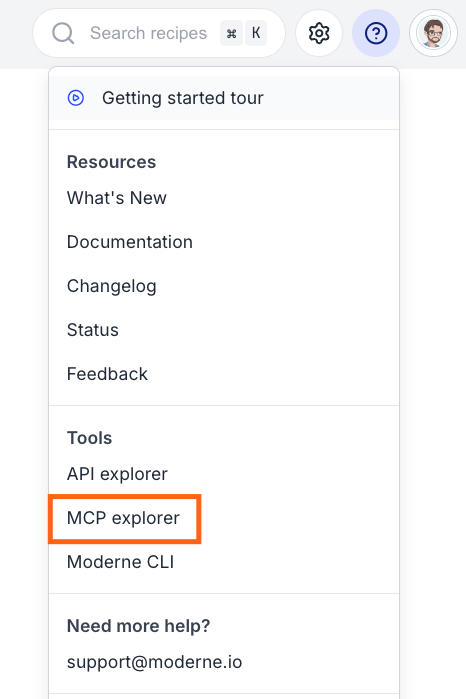
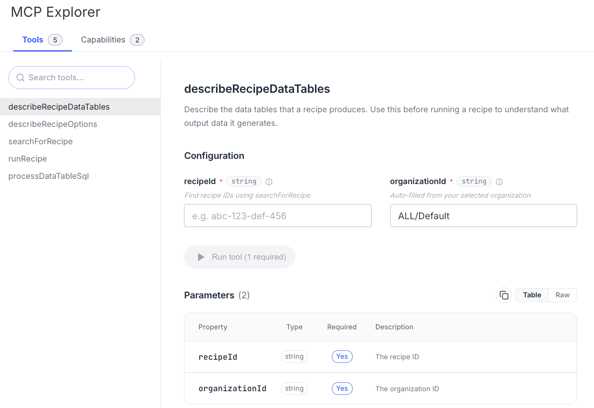

import Tabs from '@theme/Tabs';
import TabItem from '@theme/TabItem';

# Remote Moderne MCP server

The Moderne Platform hosts a remote [Model Context Protocol (MCP)](https://modelcontextprotocol.io/) server that gives AI coding agents access to your platform's recipes and recipe results. Unlike the [local MCP server](./overview.md), which runs on your workstation and operates on repositories you have checked out, the remote server runs on the platform and operates on the repositories already ingested into your tenant.

This page covers when to use the remote server, how to connect your coding agents to it, how to try it out via the MCP explorer, how it authenticates and scopes access, and the [tools it provides](#available-tools).

## Local vs remote

Moderne offers two MCP servers, and they complement each other:

|                         | Local MCP server                                                     | Remote MCP server                                              |
|-------------------------|----------------------------------------------------------------------|----------------------------------------------------------------|
| **Where it runs**       | On your workstation, as a subprocess of your coding agent            | On the Moderne Platform                                        |
| **What it operates on** | Repositories checked out locally                                     | Repositories ingested into your tenant, scoped by organization |
| **Setup**               | [`mod config agent-tools install`](./getting-started.md)             | Point your agent at a URL with an access token (below)         |
| **Transport**           | stdio (local subprocess)                                             | Streamable HTTP (remote)                                       |
| **Best for**            | Semantic search, navigation, and refactoring of code you are editing | Running recipes and analyzing results at an organization scale |

For semantic code intelligence on the repository in front of you, use the local server. To run recipes and explore their results across an entire organization without checking the repositories out, use the remote server.

## Before you begin

In order to authenticate with the Moderne MCP server, you will need to use a Moderne personal access token. The remote MCP server authenticates with the same token you would use for the [Moderne API](../../moderne-platform/how-to-guides/accessing-the-moderne-api.md), so if you already have one, you can reuse it. Otherwise, you can [create a new access token](../../moderne-platform/how-to-guides/create-api-access-tokens.md).

The token carries the same permissions as your account, so an agent that uses it can only act on the organizations and repositories you can already access.

## Connecting your agent

Your coding agent can't use Moderne's recipes or results until it knows the remote server exists. Connecting it registers the server's tools with the agent, so you can ask, in plain language, to find a recipe, run it across an organization, and explore the results - without leaving your editor or opening the platform. You only need to do this once per agent; afterwards, the tools are available in every session.

Whichever agent you use, register the remote server as a streamable HTTP MCP server at `https://api.<tenant>.moderne.io/mcp` with two headers:

* `Authorization: Bearer <your-moderne-access-token>`
* `X-Moderne-Platform-Version: v2`
  * _This is required while you have SaaS v1 running in parallel with SaaS v2._

:::info
Don't forget to replace `<tenant>` with your tenant's subdomain.

If you want to connect to the public Moderne instance, please use the following URL: `https://api.app.moderne.io/mcp`.
:::

<Tabs groupId="agent">
<TabItem value="claude-code" label="Claude Code">

```bash
claude mcp add --scope user --transport http modernesaasv2 https://api.<tenant>.moderne.io/mcp \
  --header "Authorization: Bearer <your-moderne-access-token>" \
  --header "X-Moderne-Platform-Version: v2"
```

Verify the connection with `claude mcp list`, or run `/mcp` inside a session to see the server and its tools.

</TabItem>
<TabItem value="gemini-cli" label="Gemini CLI">

```bash
gemini mcp add --transport http -s user modernesaasv2 https://api.<tenant>.moderne.io/mcp \
  -H "Authorization: Bearer <your-moderne-access-token>" \
  -H "X-Moderne-Platform-Version: v2"
```

Verify the connection with `gemini mcp list`.

</TabItem>
<TabItem value="copilot-cli" label="GitHub Copilot CLI">

```bash
copilot mcp add --transport http \
  --header "Authorization: Bearer <your-moderne-access-token>" \
  --header "X-Moderne-Platform-Version: v2" \
  modernesaasv2 https://api.<tenant>.moderne.io/mcp
```

Verify the connection with `copilot mcp list`.

</TabItem>
</Tabs>

:::tip
Any coding agent that supports remote MCP servers with custom request headers can connect using the same URL and the two headers above. The configuration steps vary by client, so consult your agent's MCP documentation for the exact syntax.
:::

## Example prompts

Once your agent is connected, you don't need to explicitly call the tools by name. Instead, you can describe what you want in plain language. The agent will then pick the right Moderne tool and fill in its parameters. You can mention Moderne in your request to help nudge the agent towards these tools, though. Below are some example prompts of how to interact with your agent:

* "Find me a recipe to upgrade my repositories to the latest version of Spring Boot."
* "What options does that recipe take, and what data tables does it produce?"
* "Use the Moderne MCP to find all the places the `java.util.List` type is used across the Default organization."
* "Run the unused-imports cleanup recipe across my cool cats organization, then tell me which repositories changed the most."

Because most tools run against an organization, the agent may ask which one to use when you haven't named it. See [choosing an organization](#choosing-an-organization) for how to identify yours.

## Trying it in the MCP explorer

If you want to browse the available tools or test a call without configuring an agent, use the MCP explorer built into the Moderne Platform. Click the help icon (**?**) in the top-right corner and select **MCP explorer** under **Tools**:

<figure style={{maxWidth: '400px', margin: '0 auto'}}>
  
  <figcaption>_Opening the MCP explorer from the help menu_</figcaption>
</figure>

The explorer lists the server's tools and lets you fill in each tool's parameters and run it, with the response shown inline. It is the quickest way to confirm your account can reach the server and to see what each tool returns:

<figure style={{maxWidth: '600px', margin: '0 auto'}}>
  
  <figcaption>_Browsing and running tools in the MCP explorer_</figcaption>
</figure>

## Choosing an organization

Repositories are ingested into your tenant, and an organization is a grouping of those repositories defined in the platform (the same repository can belong to more than one). Most of the remote tools run against a single organization, which you choose by passing an `organizationId` parameter. In the MCP explorer, this is filled in automatically from the organization you have selected in the platform. A headless agent has no selected organization, so you will need to tell it which one to use.

You can identify an organization by its ID, its path (for example, `ALL/Default`), or its name (for example, `My Test Organization`). You can find these in the organization selector in the platform, or by querying the `organizations` field of the [Moderne API](../../moderne-platform/how-to-guides/accessing-the-moderne-api.md).

:::note
Recipe runs are not allowed against the root organization (`ALL`). Pass a specific sub-organization to `runRecipe`.
:::

## Available tools

| Tool                       | Description                                                                                                                        |
|----------------------------|------------------------------------------------------------------------------------------------------------------------------------|
| `searchForRecipe`          | Searches the platform's recipe catalog via a natural-language query and returns the matching recipes for an organization.          |
| `describeRecipeOptions`    | Returns the configurable options a specific recipe accepts. Use it before running a recipe to understand what parameters it takes. |
| `describeRecipeDataTables` | Returns the data tables a specific recipe produces. Use it before running a recipe to understand what output it generates.         |
| `runRecipe`                | Runs a recipe across an organization's repositories and returns a preview of the resulting data tables.                            |
| `processDataTableSql`      | Runs SQL against the data tables produced by a recipe run, identified by its run ID.                                               |

A typical flow is to find a recipe with `searchForRecipe`, inspect it with `describeRecipeOptions` and `describeRecipeDataTables`, run it with `runRecipe`, and then query the results with `processDataTableSql`. A recipe run can take a little time, so your agent waits for it to finish before returning the results.

For the exact input schema of each tool, including its required and optional parameters, open the tool in the [MCP explorer](#trying-it-in-the-mcp-explorer).

## Security

The remote MCP server has the same security posture as the [Moderne API](../../moderne-platform/how-to-guides/accessing-the-moderne-api.md). It is served from the same host as the GraphQL API, authenticates with the same personal access tokens, and enforces the same access scoping:

* **Authentication**: every request from outside the platform requires a valid Moderne personal access token. There is no anonymous access.
* **Identity**: the server derives your identity from your token. An agent cannot impersonate another user, because any caller-supplied identity is ignored and replaced with the verified token identity.
* **Authorization**: your token carries your account's permissions, so an agent can only search, run recipes, and read results for organizations and repositories you can already access.

Because it reuses the API's authentication and authorization, permitting the remote MCP server does not grant any access beyond what a user with a personal access token already has.

## Next steps

* [Set up the local MCP server](./overview.md) for semantic code intelligence on your workstation.
