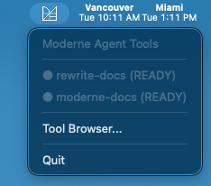
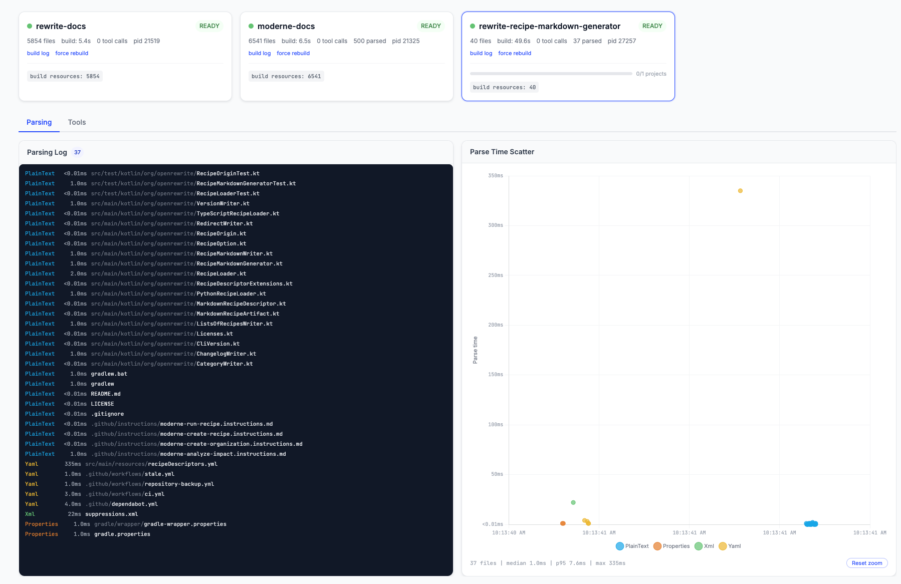

# Tool browser

The Moderne CLI includes an optional tool browser, a browser-based dashboard for monitoring LST builds and exploring available tools. To enable it:

```bash
mod config features agent-tools tray --enabled
```

Once enabled, the MCP server launches a system tray icon when an agent starts. Click it to see the status of your projects, then click **Tool Browser...** to open the dashboard.

<figure>
  
  <figcaption>_The system tray icon showing project status_</figcaption>
</figure>

The dashboard shows:

* **Project cards** with build status, file counts, and tool call metrics
* **Build logs** with parse timing details
* **Tool execution** for testing tools directly from the browser

<figure>
  
  <figcaption>_The tool browser dashboard with project status cards_</figcaption>
</figure>

<figure>
  
  <figcaption>_Build logs and parse timing details for a selected project_</figcaption>
</figure>
