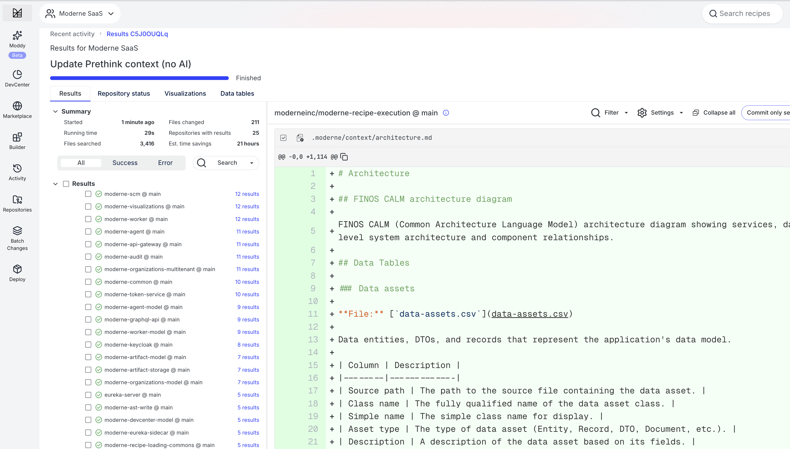
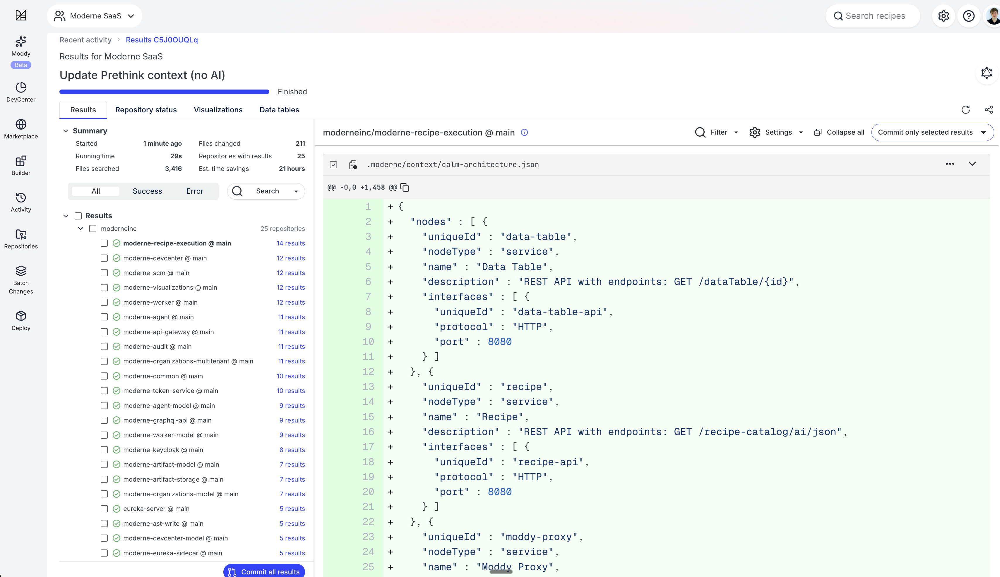
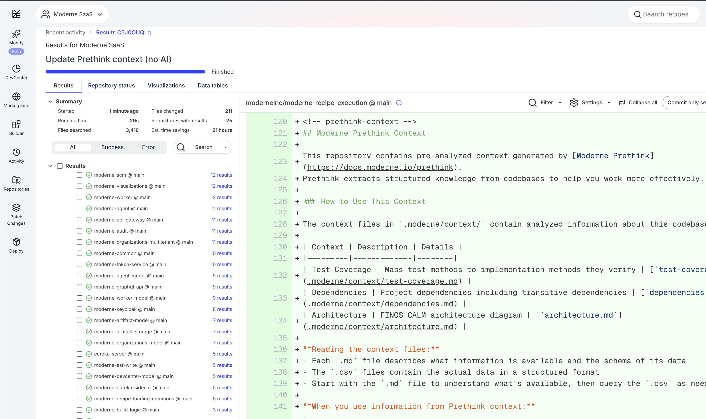

# Moderne Prethink recipes

Moderne Prethink recipes generate structured context that gives AI coding agents a clear, accurate understanding of your entire codebase. Instead of forcing AI agents to infer your architecture from raw code, Prethink provides pre-resolved knowledge about service endpoints, dependencies, test coverage, and more.

## Why use Prethink

AI coding agents like Claude Code, Cursor, and GitHub Copilot struggle with enterprise codebases due to:

* **Token limits** that prevent them from fitting your entire codebase into context
* **Shallow code understanding** that forces them to infer types, dependencies, and cross-repository relationships from raw text (often resulting in hallucinations)
* **Repetitive context building** that wastes tokens re-describing code structure on every interaction

These aren't faults of the models themselves - they're data problems. When working with vast enterprise codebases, AI models don't have the semantic context needed to be comprehensive, accurate, and efficient.

Prethink solves these problems by generating verified, structured context that AI agents can reason over directly. This means faster responses, lower costs, and more accurate results.

## What Prethink provides

Moderne Prethink delivers pre-resolved, verified knowledge that AI agents can reason over directly:

* **Architectural patterns**: Service endpoints, database connections, external service calls, and messaging patterns
* **Code quality metrics**: Per-method, per-class, and per-package quality measurements that act as direct feedback to coding agents about what code needs refactoring
* **Code smell detection**: Composite-threshold detection of God Class, Feature Envy, and Data Class patterns - which are common issues that AI coding agents tend to introduce
* **Test coverage and quality**: Test-to-implementation mappings, untested method risk rankings, and test quality issue detection (flaky tests, silent failures, ghost tests)
* **Resolved dependency graphs**: Complete dependency trees, including transitive dependencies
* **Known vulnerabilities**: Security issues identified across your repositories
* **Declared migration targets**: Your organization's upgrade and modernization goals
* **Deterministic recipes**: Structured transformations that can be applied reliably

With Prethink:

* Code structure is documented, not guessed
* Relationships between services are already mapped
* Quality problems are identified with metric evidence, not guessed from code patterns
* Your goals and constraints are part of the context
* AI reasons over facts instead of reconstructing them

## How Prethink works

Prethink is delivered as a set of OpenRewrite recipes that generate multi-repo, trusted context for AI agents. When you run Prethink recipes against your codebase, they produce structured outputs that capture context, including:

* **Code data tables**: Deep insights only discoverable using Moderne's Lossless Semantic Tree (LST) code model
* **Dependency inventory**: Complete picture of libraries including transitive dependencies
* **Knowledge graph** (optional): System-level map of how components, dependencies, and behaviors connect
* **CALM-formatted artifacts**: Architecture diagrams with nodes and relationships that can be visualized with [CALM](https://calm.finos.org/)-compatible tools

These outputs can be continuously updated as your codebase evolves by re-running Prethink recipes. This ensures your AI agents always have current, accurate context.

## Code quality as agent feedback

One of Prethink's most valuable capabilities is generating code quality metrics that serve as direct feedback to your AI coding agents. Rather than posting metrics to dashboards for human review, Prethink materializes quality data as structured files in your repository that agents read before and after writing code.

This matters because AI coding agents tend to introduce specific anti-patterns. For example, agents frequently create God Classes by stuffing related logic into a single large class, and Feature Envy by writing methods that primarily access another object's data rather than their own. Prethink detects these patterns and surfaces them as actionable context.

Prethink computes quality metrics at three levels:

* **Method-level**: Complexity measurements (cyclomatic, cognitive, nesting depth, ABC metric, Halstead measures) that identify methods needing refactoring or additional test coverage
* **Class-level**: Cohesion and coupling measurements (WMC, LCOM4, TCC, CBO, Maintainability Index) that tell agents when a class should be split or restructured
* **Package-level**: Architectural stability metrics (coupling, instability, abstractness, dependency cycle detection) that surface structural decay

Beyond metrics, Prethink detects **code smells** — God Class, Feature Envy, and Data Class — using composite metric thresholds. Each detection includes a severity rating and the metric evidence that triggered it, so your agents can prioritize refactoring.

Prethink also analyzes test health. **Test gap analysis** ranks untested methods by a risk score combining complexity with how many other methods depend on them. **Test quality analysis** detects issues in existing tests across Java and Node.js/TypeScript — flaky patterns, unmocked external calls, silent failures, fragile test data, ghost tests, overly broad mocks, and test code smells.

Please check out our [blog on code quality metrics that AI coding agents can actually use](https://www.moderne.ai/blog/code-quality-metrics-that-ai-coding-agents-can-actually-use) for a deep dive into why these metrics matter for AI-generated code. You can also explore quality data through [interactive visualizations](../moderne-platform/getting-started/visualizations.md#prethink-code-quality-visualizations) on the Moderne Platform, including an executive dashboard, coupling/cohesion matrices, and method risk radar charts.

## Recipe modules

Prethink is distributed as two complementary modules:

| Module                                    | Description                                                                                                                                           |
|-------------------------------------------|-------------------------------------------------------------------------------------------------------------------------------------------------------|
| `io.moderne.recipe:rewrite-prethink`      | A pre-configured module with out-of-the-box discovery for Spring MVC, JAX-RS, JPA, Kafka, and more. Includes LLM integrations for code comprehension. |
| `org.openrewrite.recipe:rewrite-prethink` | Open-source building blocks for custom Prethink recipes. Use this when you have custom frameworks or want full control over context generation.       |

### What the Moderne module discovers

The `io.moderne.recipe:rewrite-prethink` module provides out-of-the-box discovery for common frameworks:

**Java/JVM:**

* **Service endpoint discovery**: Spring MVC, JAX-RS, Micronaut, Quarkus, GraphQL (Spring GraphQL, Netflix DGS), gRPC, WebSocket
* **Database connection discovery**: JPA, Spring Data, JDBC, MyBatis
* **External service call discovery**: RestTemplate, WebClient, Feign, Apache HttpClient, OkHttp, JAX-RS clients
* **Messaging pattern discovery**: Kafka, RabbitMQ, JMS, Spring Cloud Stream, AWS SQS
* **Security configuration discovery**: Spring Security, CORS, OAuth2
* **Service component discovery**: @Service, @Component, @Named annotations
* **Data asset discovery**: JPA entities, Java records, DTOs
* **Scheduled task discovery**: @Scheduled, Quartz, EJB Timer

**Node.js/TypeScript:**

* **Service endpoint discovery**: Express, Fastify, NestJS
* **Database connection discovery**: Mongoose, Prisma, TypeORM
* **External service call discovery**: axios, fetch, got, superagent
* **Messaging pattern discovery**: KafkaJS, amqplib, Bull/BullMQ
* **Security configuration discovery**: cors, helmet, passport, JWT middleware
* **Test coverage discovery**: Jest, Mocha, Vitest
* **Test quality analysis**: Flaky patterns, unmocked calls, fragile data, ghost tests, code smells
* **Project metadata**: package.json extraction

**Python:**

* **Service endpoint discovery**: Django, FastAPI, Flask
* **Database connection discovery**: SQLAlchemy, Django ORM
* **Test coverage discovery**: pytest, unittest
* **Project metadata**: setup.py, pyproject.toml extraction

**Cross-language:**

* **Code quality metrics**: Per-method complexity (cyclomatic, cognitive, ABC, Halstead), per-class cohesion and coupling (WMC, LCOM4, TCC, CBO), per-package stability and dependency cycles
* **Code smell detection**: God Class, Feature Envy, and Data Class using composite metric thresholds
* **Test gap analysis**: Untested methods ranked by risk score combining complexity and architectural centrality
* **Coding convention extraction**: Naming patterns, import organization, documentation patterns
* **Dependency usage extraction**: Which types from external libraries are actually used in the code
* **Error handling pattern extraction**: Exception types, handling strategies, logging frameworks
* **LLM integrations**: Code comprehension at the method and class level, test summary generation
* **Architecture visualization**: CALM architecture diagrams and Mermaid architecture diagrams

### What the OpenRewrite module provides

The `org.openrewrite.recipe:rewrite-prethink` module provides the building blocks for generating Prethink context:

* **ExportContext**: Exports data tables as CSV files to your repository
* **UpdateAgentConfig**: Updates AI agent configuration files with context references
* **UpdateGitignore**: Updates `.gitignore` to allow committing `.moderne/context/` while ignoring other `.moderne/` files
* **UpdatePrethinkContext**: Orchestrates context generation from pre-populated data tables
* **CALM architecture generation**: Produces CALM-formatted architecture diagrams

This module provides the infrastructure but expects you to supply your own recipes for discovering CALM entities and producing the context you want to save.

## Available recipes

### Update Prethink context (with AI)

Generates Moderne Prethink context files with AI-generated code comprehension, test coverage mapping, dependency inventory, and FINOS CALM architecture diagrams. Maps tests to implementation methods and optionally generates AI summaries of what each test verifies when an LLM provider is configured.

* **Recipe:** [`io.moderne.prethink.UpdatePrethinkContextStarter`](https://app.moderne.io/recipes/io.moderne.prethink.UpdatePrethinkContextStarter)
* **Module:** `io.moderne.recipe:rewrite-prethink`

#### Options

| Option              | Description                                                                  | Example                               |
|---------------------|------------------------------------------------------------------------------|---------------------------------------|
| `provider`          | LLM provider for generating summaries                                        | `openai`, `gemini`, `poolside`        |
| `apiKey`            | API key for the LLM provider                                                 | `ps-...`                              |
| `model`             | Model name to use                                                            | `Malibu-v2.20251021`                  |
| `baseUrl`           | Custom base URL for the provider                                             | `https://divers.poolsi.de/openai/v1/` |
| `requestsPerMinute` | Rate limit for LLM requests                                                  | `60`                                  |
| `targetConfigFile`  | Which agent config file to update (updates all found files if not specified) | `CLAUDE.md`                           |

### Update Prethink context (no AI)

Generates Moderne Prethink context files with architectural discovery, test coverage mapping, dependency inventory, and FINOS CALM architecture diagrams. This recipe does not require an LLM provider - use the [Update Prethink context (with AI) recipe](#update-prethink-context-with-ai) if you want AI-generated code comprehension and test summaries.

* **Recipe:** [`io.moderne.prethink.UpdatePrethinkContextNoAiStarter`](https://app.moderne.io/recipes/io.moderne.prethink.UpdatePrethinkContextNoAiStarter)
* **Module:** `io.moderne.recipe:rewrite-prethink`

This recipe includes the same architectural discovery, test coverage mapping, dependency inventory, and CALM architecture generation as the AI version, but skips AI-generated code comprehension. Instead, it estimates token usage for methods so you can evaluate AI costs before enabling comprehension.

#### Options

| Option             | Description                                                                                                                                                                                 | Example     |
|--------------------|---------------------------------------------------------------------------------------------------------------------------------------------------------------------------------------------|-------------|
| `targetConfigFile` | Which agent config file to update. If not specified and no agent config files exist, will create a `CLAUDE.md`. If at least one agent config file exists, it will update each one it finds. | `CLAUDE.md` |

### Update Prethink context (base recipe)

Generates a FINOS CALM architecture diagram and updates agent configuration files. This recipe expects CALM-related data tables (ServiceEndpoints, DatabaseConnections, ExternalServiceCalls, MessagingConnections, etc.) to be populated by other recipes in a composite.

* **Recipe:** [`org.openrewrite.prethink.UpdatePrethinkContext`](https://app.moderne.io/recipes/org.openrewrite.prethink.UpdatePrethinkContext)
* **Module:** `org.openrewrite.recipe:rewrite-prethink`

Use this recipe when building custom Prethink configurations with your own discovery recipes. This recipe has no configurable options.

### Supporting recipes

The OpenRewrite module also provides these building blocks:

| Recipe                                       | Description                                                                                                                                                |
|----------------------------------------------|------------------------------------------------------------------------------------------------------------------------------------------------------------|
| `org.openrewrite.prethink.ExportContext`     | Exports data tables to CSV files in `.moderne/context/` with markdown documentation describing the schema.                                                 |
| `org.openrewrite.prethink.UpdateAgentConfig` | Creates or updates agent configuration files (`AGENTS.md`, `CLAUDE.md`, `.cursorrules`, `.github/copilot-instructions.md`) to reference generated context. |
| `org.openrewrite.prethink.UpdateGitignore`   | Updates `.gitignore` to allow committing `.moderne/context/` while ignoring other files in `.moderne/`.                                                    |

## Creating custom Prethink recipes

If the built-in recipes don't meet your needs, you can create custom Prethink recipes. This is useful when you have custom frameworks, proprietary patterns, or want full control over what context is generated.

### Customizing the starter recipes

The starter recipes (`UpdatePrethinkContextStarter` and `UpdatePrethinkContextNoAiStarter`) are composite recipes that bundle all of the [Moderne module's discovery and analysis capabilities](#what-the-moderne-module-discovers) into a single recipe you can run out of the box.

You can customize what Prethink generates by creating your own Prethink recipe. Check out the recipe definition below for a starting point of what the base Prethink recipe looks like. From there, you can wrap it in a new recipe to add custom discovery, or you could copy and modify it to remove built-in recipes you don't need.

<details>
<summary>UpdatePrethinkContextNoAiStarter recipe definition</summary>

:::tip
This recipe is continuously updated with new discoveries and analysis. To view the latest version, check out [the recipe on the Moderne Platform](https://app.moderne.io/recipes/io.moderne.prethink.UpdatePrethinkContextNoAiStarter). The YAML below is a snapshot and may not reflect the most recent changes.
:::

```yaml
type: specs.openrewrite.org/v1beta/recipe
name: io.moderne.prethink.UpdatePrethinkContextNoAiStarter
displayName: Update Prethink context (no AI)
description: >-
  Generate Moderne Prethink context files with architectural discovery,
  code quality metrics, test coverage mapping, dependency inventory,
  and FINOS CALM architecture diagrams. This recipe does not require
  an LLM provider.
recipeList:
  # Phase 1: Architectural Discovery
  - io.moderne.prethink.FindProjectMetadata
  - io.moderne.prethink.FindNodeProjectMetadata
  - io.moderne.prethink.FindPythonProjectMetadata
  - io.moderne.prethink.FindServiceEndpoints
  - io.moderne.prethink.FindNestJSEndpoints
  - io.moderne.prethink.FindExpressEndpoints
  - io.moderne.prethink.FindDjangoEndpoints
  - io.moderne.prethink.FindFastAPIEndpoints
  - io.moderne.prethink.FindFlaskEndpoints
  - io.moderne.prethink.FindGraphQLEndpoints
  - io.moderne.prethink.FindGrpcServices
  - io.moderne.prethink.FindWebSocketEndpoints
  - io.moderne.prethink.FindDatabaseConnections
  - io.moderne.prethink.FindTypeORMEntities
  - io.moderne.prethink.FindMongooseSchemas
  - io.moderne.prethink.FindPrismaUsage
  - io.moderne.prethink.FindSQLAlchemyModels
  - io.moderne.prethink.FindExternalServiceCalls
  - io.moderne.prethink.FindNodeHttpClients
  - io.moderne.prethink.FindMessagingConnections
  - io.moderne.prethink.FindNodeMessaging
  - io.moderne.prethink.FindServerConfiguration
  - io.moderne.prethink.FindDataAssets
  - io.moderne.prethink.FindDeploymentArtifacts
  - io.moderne.prethink.FindSecurityConfiguration
  - io.moderne.prethink.FindNodeSecurityConfig
  - io.moderne.prethink.FindServiceComponents
  - io.moderne.prethink.FindScheduledTasks
  - io.moderne.prethink.ExtractCodingConventions
  - io.moderne.prethink.ExtractErrorPatterns
  - io.moderne.prethink.FindNodeErrorPatterns
  - io.moderne.prethink.ExtractDependencyUsage

  # Context exports
  - org.openrewrite.prethink.ExportContext:
      displayName: Project Identity
      shortDescription: Build system coordinates, names, and module structure
      longDescription: >-
        Project-level identification for each build module including artifact ID,
        group ID, version, display name, and description.
      dataTables:
        - org.openrewrite.prethink.table.ProjectMetadata
  - org.openrewrite.prethink.ExportContext:
      displayName: Coding Conventions
      shortDescription: Naming patterns, import organization, and coding style
      longDescription: >-
        Detected coding conventions including naming patterns, import organization,
        and documentation coverage.
      dataTables:
        - org.openrewrite.prethink.table.CodingConventions
  - org.openrewrite.prethink.ExportContext:
      displayName: Error Handling
      shortDescription: Exception handling strategies and logging patterns
      longDescription: >-
        Error handling patterns detected in the codebase including try-catch usage,
        exception types, and handling strategies.
      dataTables:
        - org.openrewrite.prethink.table.ErrorHandlingPatterns
  - org.openrewrite.prethink.ExportContext:
      displayName: Library Usage
      shortDescription: How external libraries and frameworks are used
      longDescription: >-
        Patterns of how external libraries are used throughout the codebase.
      dataTables:
        - org.openrewrite.prethink.table.DependencyUsage
  - org.openrewrite.prethink.ExportContext:
      displayName: Scheduled Tasks
      shortDescription: Scheduled tasks, cron jobs, and background processing
      longDescription: >-
        Scheduled tasks and background jobs detected in the application.
      dataTables:
        - io.moderne.prethink.table.ScheduledTasks

  # Phase 1.5: Relationship Discovery
  - io.moderne.prethink.calm.FindCalmRelationships

  # Phase 2: Code Quality Metrics
  - io.moderne.prethink.quality.FindMethodComplexity
  - org.openrewrite.prethink.ExportContext:
      displayName: Method Quality Metrics
      shortDescription: Per-method complexity and quality measurements
      longDescription: >-
        Per-method code quality metrics including cyclomatic complexity, cognitive
        complexity, nesting depth, ABC metric, and Halstead measures.
      dataTables:
        - io.moderne.prethink.table.MethodQualityMetrics
  - io.moderne.prethink.quality.FindClassMetrics
  - org.openrewrite.prethink.ExportContext:
      displayName: Class Quality Metrics
      shortDescription: Per-class cohesion, coupling, and complexity measurements
      longDescription: >-
        Per-class code quality metrics including WMC, LCOM4, TCC, CBO,
        and Maintainability Index.
      dataTables:
        - io.moderne.prethink.table.ClassQualityMetrics
  - io.moderne.prethink.quality.FindPackageMetrics
  - org.openrewrite.prethink.ExportContext:
      displayName: Package Quality Metrics
      shortDescription: Per-package coupling, stability, and dependency cycle analysis
      longDescription: >-
        Per-package architectural metrics including afferent/efferent coupling,
        instability, abstractness, and dependency cycle detection.
      dataTables:
        - io.moderne.prethink.table.PackageQualityMetrics
  - io.moderne.prethink.quality.FindCodeSmells
  - org.openrewrite.prethink.ExportContext:
      displayName: Code Smells
      shortDescription: Detected design problems with severity and evidence
      longDescription: >-
        Code smells detected using composite metric thresholds including
        God Class, Feature Envy, and Data Class.
      dataTables:
        - io.moderne.prethink.table.CodeSmells

  # Phase 2.5: Token Estimation (no AI)
  - io.moderne.prethink.ComprehendCodeTokenCounter
  - org.openrewrite.prethink.ExportContext:
      displayName: Token Estimates
      shortDescription: Estimated input tokens for method comprehension
      longDescription: >-
        Estimated input token counts that would be sent to an LLM for method
        comprehension.
      dataTables:
        - io.moderne.prethink.table.MethodDescriptions

  # Phase 3: Test Coverage & Dependencies
  - io.moderne.prethink.FindNodeTestCoverage
  - io.moderne.prethink.FindPythonTestCoverage
  - io.moderne.prethink.FindTestCoverage
  - org.openrewrite.prethink.ExportContext:
      displayName: Test Coverage
      shortDescription: Maps test methods to implementation methods they verify
      longDescription: >-
        Maps test methods to the implementation methods they exercise.
      dataTables:
        - io.moderne.prethink.table.TestMapping
  - io.moderne.prethink.testing.coverage.FindTestGaps
  - org.openrewrite.prethink.ExportContext:
      displayName: Test Gaps
      shortDescription: Public non-trivial methods lacking test coverage
      longDescription: >-
        Public non-trivial methods with no test coverage, ranked by risk score.
      dataTables:
        - io.moderne.prethink.table.TestGaps

  # Phase 3.5: Test Quality Analysis
  - io.moderne.prethink.testing.quality.FindFlakyTestPatterns
  - io.moderne.prethink.testing.quality.FindNodeFlakyTestPatterns
  - io.moderne.prethink.testing.quality.FindUnmockedExternalCalls
  - io.moderne.prethink.testing.quality.FindNodeUnmockedExternalCalls
  - io.moderne.prethink.testing.quality.FindSilentTestFailures
  - io.moderne.prethink.testing.quality.FindFragileTestData
  - io.moderne.prethink.testing.quality.FindNodeFragileTestData
  - io.moderne.prethink.testing.quality.FindGhostTests
  - io.moderne.prethink.testing.quality.FindNodeGhostTests
  - io.moderne.prethink.testing.quality.FindOverlyBroadMocks
  - io.moderne.prethink.testing.quality.FindTestCodeSmells
  - io.moderne.prethink.testing.quality.FindNodeTestCodeSmells
  - org.openrewrite.prethink.ExportContext:
      displayName: Test Quality
      shortDescription: Test quality issues that may cause flakiness or silent failures
      longDescription: >-
        Issues found in test code that may cause flakiness, silent failures,
        or maintenance burden.
      dataTables:
        - io.moderne.prethink.table.TestQualityIssues

  # Dependencies
  - org.openrewrite.java.dependencies.DependencyList:
      scope: TestRuntime
      includeTransitive: true
      validateResolvable: false
  - org.openrewrite.prethink.ExportContext:
      displayName: Dependencies
      shortDescription: Project dependencies including transitive dependencies
      longDescription: >-
        Complete dependency tree including transitive dependencies.
      dataTables:
        - org.openrewrite.java.dependencies.table.DependencyListReport
  - org.openrewrite.javascript.search.DependencyInsight:
      namePattern: "*"
  - org.openrewrite.prethink.ExportContext:
      displayName: Node.js Dependencies
      shortDescription: npm package dependencies with versions, scopes, and licenses
      longDescription: >-
        Node.js package dependencies from package.json including resolved versions
        and dependency scopes.
      dataTables:
        - org.openrewrite.javascript.table.NodeDependenciesInUse

  # Phase 4: CALM Architecture & Agent Configuration
  - org.openrewrite.prethink.UpdatePrethinkContext
  - io.moderne.prethink.calm.GenerateCalmMermaidDiagram
```

</details>

For example, if you want to add custom discovery on top of the starter, you could wrap it in your own recipe. Here's what that might look like if you wanted to extract service relationships from proprietary configuration or property files:

```yaml
type: specs.openrewrite.org/v1beta/recipe
name: com.example.prethink.ExtendedPrethink
displayName: Extended Prethink context
description: >-
  Extends the standard Prethink starter with custom discovery
  for internal frameworks and configuration files.
recipeList:
  # Include everything from the standard starter
  - io.moderne.prethink.UpdatePrethinkContextNoAiStarter

  # Add custom discovery for your proprietary patterns
  - com.example.discovery.FindPropertyFileRelationships
  - com.example.discovery.FindInternalFrameworkEndpoints

  # Export custom data tables
  - org.openrewrite.prethink.ExportContext:
      displayName: Property File Relationships
      shortDescription: Service relationships from property files
      longDescription: >-
        Relationships between services extracted from internal
        property files that are not detected by standard discovery.
      dataTables:
        - com.example.table.PropertyFileRelationships
```

### Setting up a recipe repository

If you want full control over what discovery runs, you can build a Prethink recipe from scratch using either the Moderne or OpenRewrite module. To get started:

1. Create a new recipe repository using either the [rewrite-recipe-starter](https://github.com/moderneinc/rewrite-recipe-starter) or your own internal recipe starter template.

2. Add a dependency on the Prethink modules in your `build.gradle`:

```groovy
dependencies {
    // For pre-configured discovery (recommended)
    implementation("io.moderne.recipe:rewrite-prethink:latest.release")

    // Or for building blocks only
    implementation("org.openrewrite.recipe:rewrite-prethink:latest.release")
}
```

The Moderne module includes all recipes from the OpenRewrite module plus framework-specific discovery and LLM integrations.

### Recipe examples

#### Complete Prethink configuration

This example runs all discovery phases and generates comprehensive context:

```yaml
type: specs.openrewrite.org/v1beta/recipe
name: com.example.prethink.UpdatePrethinkContext
displayName: Update Prethink context
description: >-
  Generates comprehensive Prethink context for AI agents including
  service endpoints, dependencies, test coverage, and architecture.
recipeList:
  # Phase 1: Architectural Discovery
  - io.moderne.prethink.calm.FindProjectMetadata
  - io.moderne.prethink.calm.FindServiceEndpoints
  - io.moderne.prethink.calm.FindDatabaseConnections
  - io.moderne.prethink.calm.FindExternalServiceCalls
  - io.moderne.prethink.calm.FindMessagingConnections
  - io.moderne.prethink.calm.FindServerConfiguration
  - io.moderne.prethink.calm.FindSecurityConfiguration
  - io.moderne.prethink.calm.FindDeploymentArtifacts
  - io.moderne.prethink.calm.FindDataAssets
  - io.moderne.prethink.calm.FindServiceComponents
  - io.moderne.prethink.calm.FindCalmRelationships

  # Phase 2: Code Analysis
  - io.moderne.prethink.ExtractCodingConventions
  - io.moderne.prethink.ExtractDependencyUsage
  - io.moderne.prethink.ExtractErrorPatterns

  # Phase 3: Test Coverage
  - io.moderne.prethink.FindTestCoverage

  # Phase 4: Context Generation
  - io.moderne.prethink.calm.GenerateCalmArchitecture
  - io.moderne.prethink.calm.GenerateCalmMermaidDiagram
  - org.openrewrite.prethink.UpdateAgentConfig
```

#### Minimal Prethink configuration

If you only need basic service endpoint discovery:

```yaml
type: specs.openrewrite.org/v1beta/recipe
name: com.example.prethink.MinimalPrethink
displayName: Minimal Prethink context
description: >-
  Generates basic Prethink context with service endpoints only.
recipeList:
  - io.moderne.prethink.calm.FindProjectMetadata
  - io.moderne.prethink.calm.FindServiceEndpoints
  - org.openrewrite.prethink.ExportContext:
      displayName: Service Endpoints
      shortDescription: REST and HTTP endpoints
      dataTables:
        - io.moderne.prethink.table.ServiceEndpoints
  - org.openrewrite.prethink.UpdateAgentConfig
```

#### Prethink with AI summaries

To enable AI-generated summaries, configure the LLM provider:

```yaml
type: specs.openrewrite.org/v1beta/recipe
name: com.example.prethink.PrethinkWithAI
displayName: Prethink context with AI summaries
description: >-
  Generates Prethink context with AI-enhanced test summaries.
recipeList:
  - io.moderne.prethink.calm.FindProjectMetadata
  - io.moderne.prethink.calm.FindServiceEndpoints
  - io.moderne.prethink.FindTestCoverage:
      provider: poolside
  - io.moderne.prethink.calm.GenerateCalmArchitecture
  - org.openrewrite.prethink.UpdateAgentConfig
```

#### Custom discovery with OpenRewrite module

When using the OpenRewrite module, you provide your own discovery recipes:

```yaml
type: specs.openrewrite.org/v1beta/recipe
name: com.example.prethink.CustomPrethink
displayName: Custom Prethink context
description: >-
  Generates Prethink context using custom discovery recipes.
recipeList:
  # Your custom discovery recipe that populates a data table
  - com.example.discovery.FindCustomEndpoints

  # Export the custom data table to CSV
  - org.openrewrite.prethink.ExportContext:
      displayName: Custom Endpoints
      shortDescription: Custom framework endpoints
      longDescription: >-
        Endpoints discovered from our internal framework.
      dataTables:
        - com.example.table.CustomEndpoints

  # Update agent configuration files
  - org.openrewrite.prethink.UpdateAgentConfig
```

Your custom discovery recipe would implement the logic to find architectural elements specific to your frameworks and populate a data table. See the [OpenRewrite recipe development documentation](https://docs.openrewrite.org/authoring-recipes) for guidance on creating custom recipes.

:::tip
Recipes do not have to be in the same file or even the same module. You can compose Prethink recipes by referencing recipes from other modules.
:::

### Data tables

Prethink recipes populate several data tables that capture different aspects of your codebase:

| Data table                 | Description                                                                                              |
|----------------------------|----------------------------------------------------------------------------------------------------------|
| `ServiceEndpoints`         | REST/HTTP endpoints with HTTP methods, paths, and framework info                                         |
| `DatabaseConnections`      | JPA entities, repositories, JDBC connections, and Node.js ORM models                                     |
| `ExternalServiceCalls`     | Outbound HTTP calls to external services                                                                 |
| `MessagingConnections`     | Kafka, RabbitMQ, JMS, and other messaging patterns                                                       |
| `SecurityConfiguration`    | Spring Security, CORS, OAuth2, and Node.js security middleware                                           |
| `ServerConfiguration`      | Port, SSL, and context path settings                                                                     |
| `DeploymentArtifacts`      | Dockerfile, Kubernetes, and docker-compose files                                                         |
| `DataAssets`               | Entities, records, and DTOs                                                                              |
| `ProjectMetadata`          | Artifact ID, group ID, and project name                                                                  |
| `ServiceComponents`        | Service layer components (@Service, @Component, @Named)                                                  |
| `ScheduledTasks`           | Scheduled tasks, cron jobs, and background processing                                                    |
| `CodingConventions`        | Naming patterns, import organization, and documentation conventions                                      |
| `DependencyUsage`          | External library dependencies and how they are used in the codebase                                      |
| `ErrorHandlingPatterns`    | Error/exception handling patterns, strategies, and logging frameworks                                    |
| `MethodQualityMetrics`     | Per-method cyclomatic complexity, cognitive complexity, nesting depth, ABC metric, and Halstead measures |
| `ClassQualityMetrics`      | Per-class WMC, LCOM4, TCC, CBO, and Maintainability Index                                                |
| `PackageQualityMetrics`    | Per-package afferent/efferent coupling, instability, abstractness, and dependency cycles                 |
| `CodeSmells`               | God Class, Feature Envy, and Data Class detection with severity and metric evidence                      |
| `TestMapping`              | Mapping of test methods to implementation methods                                                        |
| `TestGaps`                 | Untested public methods ranked by risk score (complexity x centrality)                                   |
| `TestQualityIssues`        | Flaky patterns, unmocked calls, silent failures, ghost tests, and code smells in tests                   |
| `CalmRelationships`        | Method call graph for discovering relationships between architectural entities                           |
| `ContextRegistry`          | Registry of available context files for coding agents                                                    |
| `SourceSetLanguageSummary` | Language versions, file counts, and build tools per source set                                           |
| `ClassDescriptions`        | AI-generated class descriptions (with AI recipe)                                                         |
| `MethodDescriptions`       | AI-generated method descriptions (with AI recipe)                                                        |

For the full schema definitions, see the data table source code in [openrewrite/rewrite-prethink](https://github.com/openrewrite/rewrite-prethink/tree/main/src/main/java/org/openrewrite/prethink/table) and [moderneinc/rewrite-prethink](https://github.com/moderneinc/rewrite-prethink/tree/main/src/main/java/io/moderne/prethink/table).

## What Prethink generates

After running a Prethink recipe, you'll find generated files in the `.moderne/context/` directory (there will be a `.moderne` directory created inside of each repository):

```
.moderne/context/
├── calm-architecture.json
├── class-descriptions.csv
├── class-descriptions.md
├── class-quality-metrics.csv
├── class-quality-metrics.md
├── code-smells.csv
├── code-smells.md
├── coding-conventions.csv
├── coding-conventions.md
├── database-connections.csv
├── database-connections.md
├── dependencies.csv
├── dependencies.md
├── dependency-usage.csv
├── dependency-usage.md
├── error-handling.csv
├── error-handling.md
├── method-descriptions.csv
├── method-descriptions.md
├── method-quality-metrics.csv
├── method-quality-metrics.md
├── package-quality-metrics.csv
├── package-quality-metrics.md
├── service-endpoints.csv
├── service-endpoints.md
├── test-gaps.csv
├── test-gaps.md
├── test-mapping.csv
├── test-mapping.md
├── test-quality.csv
├── test-quality.md
└── architecture-diagram.md
```

* **CSV files** contain structured data that AI agents can parse directly
* **Markdown files** describe the context and schema for human and agent readability
* **CALM architecture JSON** can be visualized with [CALM](https://calm.finos.org/)-compatible tools
* **Mermaid architecture diagram** can be rendered by GitHub, GitLab, and other platforms

### Context export

The context export component saves structured data tables as files in your repository. This allows any AI agent to access resolved knowledge about your codebase without needing to parse and understand the code itself.

Each exported context file is accompanied by a markdown file that describes what the data contains and how to interpret it. This helps AI agents understand the schema and meaning of the data without additional prompting.

<figure>
  
  <figcaption>_A markdown file describing the CALM architecture context_</figcaption>
</figure>

### Code comprehension

The optional code comprehension component uses Moderne's LST analysis combined with your bring-your-own LLM to build a knowledge graph. This graph captures how software components, dependencies, and behaviors relate at a system level. Descriptions are cached based on SHA-256 checksums of the source code, so re-running Prethink only generates descriptions for code that has changed.

### Architecture visualization

Prethink can export architecture information in CALM format, providing nodes and relationships that describe your system's structure. These can be visualized with CALM-compatible tools or consumed directly by AI agents for architectural reasoning. Prethink also generates a Mermaid architecture diagram in markdown format for easy rendering in GitHub, GitLab, and other platforms that support Mermaid.

<figure>
  
  <figcaption>_A generated CALM architecture diagram showing services and their relationships_</figcaption>
</figure>

## How agents discover Prethink context

When Prethink runs, it updates the agent configuration files in your repository (such as `AGENTS.md`, `CLAUDE.md`, `.cursorrules`, or `.github/copilot-instructions.md`) to point AI agents to the generated context. This enables progressive discovery where agents first learn about the available context and then read the relevant files as needed.

<figure>
  
  <figcaption>_An updated CLAUDE.md file pointing agents to Prethink context_</figcaption>
</figure>

The agent configuration includes a table of available context types with descriptions and file paths, along with instructions on how to use the context effectively. This means agents can immediately start reasoning over pre-resolved facts about your codebase.

## Incremental Prethink via MCP

When using the [Moderne MCP server](./mcp/overview.md), AI coding agents can use the `run_recipe` tool to run Prethink recipes and incrementally regenerate context as they edit code. Rather than treating Prethink as a one-time setup step, agents can re-run Prethink after making changes to get updated quality metrics, test gap analysis, and code smell detection reflecting their modifications.

This creates a feedback loop: the agent writes code, regenerates Prethink context, reads the updated quality metrics, and refactors based on what it finds. For example, if an agent introduces a God Class while implementing a feature, the next Prethink run surfaces it immediately so the agent can split the class before moving on.

## Next steps

* [Run Prethink recipes on the Moderne Platform](../moderne-platform/getting-started/prethink.md)
* [Generate Prethink context with the CLI](../moderne-cli/how-to-guides/cli-prethink.md)
* [Explore Prethink code quality visualizations](../moderne-platform/getting-started/visualizations.md#prethink-code-quality-visualizations) for dashboards including executive summaries, coupling/cohesion matrices, and method risk radar charts
* [Read our blog on code quality metrics that AI coding agents can actually use](https://www.moderne.ai/blog/code-quality-metrics-that-ai-coding-agents-can-actually-use) for a deep dive into why these metrics matter for AI-generated code