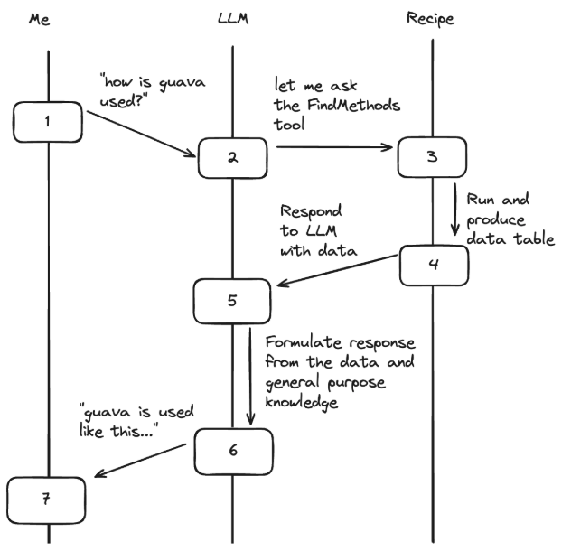
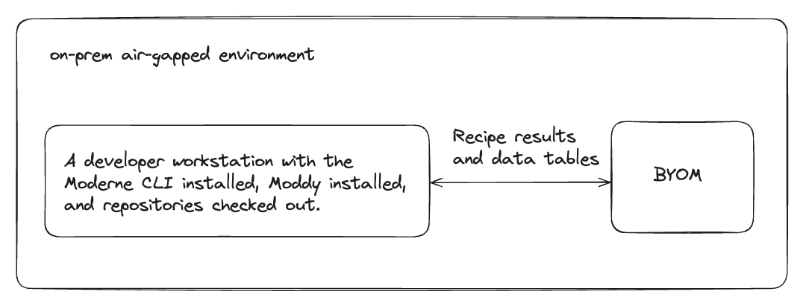

# Moddy data privacy and models

To help you understand how Moddy handles security and privacy, this doc will explain how data flows when you use Moddy Desktop or Moddy Platform. We will also answer common questions about which models are used and how your data is handled.

## How data flows

Moddy uses a bring-your-own-model (BYOM) approach, which means you choose the AI model. All traffic to the model is routed via an on-prem agent (not to be confused with an AI agent). Any generative model is supported with this approach.

<figure>
  
  <figcaption>_The flow of data from you to the LLM to an OpenRewrite recipe._</figcaption>
</figure>

<figure>
  
  <figcaption>_What an air-gapped environment might look like._</figcaption>
</figure>

## Frequently asked questions

### What models do you use and how are they trained?

Moddy does not include its own model. You configure your own. We currently support:

* Anthropic (Claude)
* OpenAI (GPT)
* Google (Gemini)
* Mistral

Models deployed to your on-prem environment can also be supported.

### What data does Moddy send to the models?

Recipe results and data tables.

### What data is sent to Moderne?

None. We employ a bring-your-own-model (BYOM) configuration. Moddy reaches out to your model and no data is passed to Moderne.
