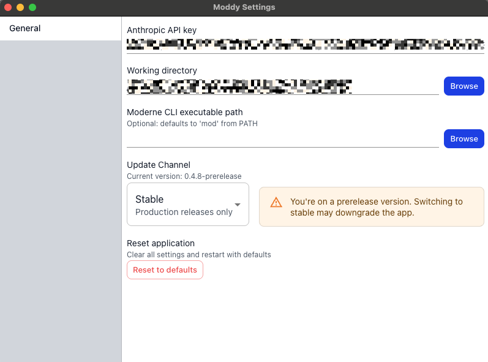

import Tabs from '@theme/Tabs';
import TabItem from '@theme/TabItem';

# Getting started with Moddy Desktop

Moddy is a multi-repo AI agent (**currently in a restricted beta**) that combines natural language with the accuracy and scalability of Moderne and OpenRewrite. With it, you can analyze and modify large and complex codebases. For instance, you could ask it questions like, "How do I use Apache Commons?" or "Help me upgrade to Spring Boot 3.5," and it would search for the appropriate OpenRewrite recipes and then execute them for you.

In this guide, we'll walk you through everything you need to get started with Moddy Desktop – from installation to your first conversation.

## Prerequisites

Moddy Desktop requires the Moderne CLI to be installed and configured with at least one repository with LSTs built.

### Quick start

Follow these steps to set up your environment:

1. **Install the Moderne CLI**: See the [CLI installation guide](../moderne-cli/getting-started/cli-intro.md) for instructions.

2. **Sync repositories**: Choose one approach to sync your repositories:

   From Moderne platform:

   ```bash
   mod git sync moderne /path/to/workdir --organization <ORG_NAME>
   ```

   From CSV file:

   ```bash
   mod git sync csv /path/to/workdir /path/to/repos.csv
   ```

   See the [git sync documentation](../moderne-cli/cli-reference.md#mod-git-sync) for more details.

3. **Build LSTs**: Run the following command in your working directory to create LSTs for your repositories:

   ```bash
   mod build
   ```

   See the [build documentation](../moderne-cli/cli-reference.md#mod-build) for more details.

4. **Sync recipe catalog**: Run the following command to download available recipes:

   ```bash
   mod config recipes moderne sync
   ```

   See the [recipes documentation](../moderne-cli/cli-reference.md#mod-config-recipes-moderne-sync) for more details.

5. **Get an API key**: You will need an API key from one of the supported model providers during Moddy Desktop's initial setup:
   * [Anthropic](https://console.anthropic.com/)
   * [OpenAI](https://platform.openai.com/api-keys)
   * [Google AI Studio (Gemini)](https://aistudio.google.com/app/apikey)

:::tip
Use the same directory for CLI operations and as Moddy Desktop's working directory to ensure Moddy can access your LSTs and repositories.
:::

## Installation

We support installing Moddy Desktop via Homebrew (MacOS) or Chocolatey (Windows):

<Tabs>
<TabItem value="homebrew" label="Homebrew (MacOS)">

```bash
brew install --cask moderneinc/moderne/moddy-desktop
```

</TabItem>

<TabItem value="chocolatey" label="Chocolatey (Windows)">

```bash
choco install moddy-desktop --prerelease
```
</TabItem>
</Tabs>

## Using Moddy Desktop

### Initial configuration

When you first launch Moddy, you will be prompted to fill in an API key from your chosen model provider (Anthropic, OpenAI, or Gemini) and to provide a working directory. The working directory should be the directory that contains all of the repositories you wish to ask questions about or run recipes against. You can change this after the fact as desired.

<figure>
  
  <figcaption>_The initialization screen in Moddy Desktop._</figcaption>
</figure>

### Components

Once you've configured a key and working directory, you will be taken to a page where you can ask a question or provide Moddy instructions:

<figure>
  
  <figcaption></figcaption>
</figure>

#### Thread history

In the top-left corner, you will see a thread icon. When clicked, this will let you see all previous conversations (if any exist). You can click on one to continue that conversation or you can delete them if you decide you no longer want them to exist.

<figure>
  
  <figcaption></figcaption>
</figure>

#### Settings

From the application menu, click on settings to be taken to a settings menu where you can change the API key, select a different working directory, or point to a different location for the Moderne CLI.

<figure>
  
  <figcaption></figcaption>
</figure>

<figure>
  
  <figcaption></figcaption>
</figure>

## Advanced features

Once you're comfortable using Moddy Desktop, you can explore advanced integration options.

### MCP integration

Connect Moddy to MCP-compatible tools like Claude Code to interact with your codebase through external AI agents.

Learn more about [connecting to Moddy via MCP](./moddy-mcp-integration.md).