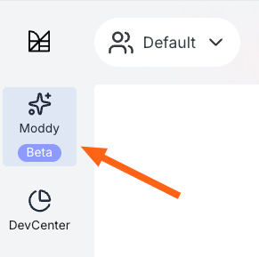
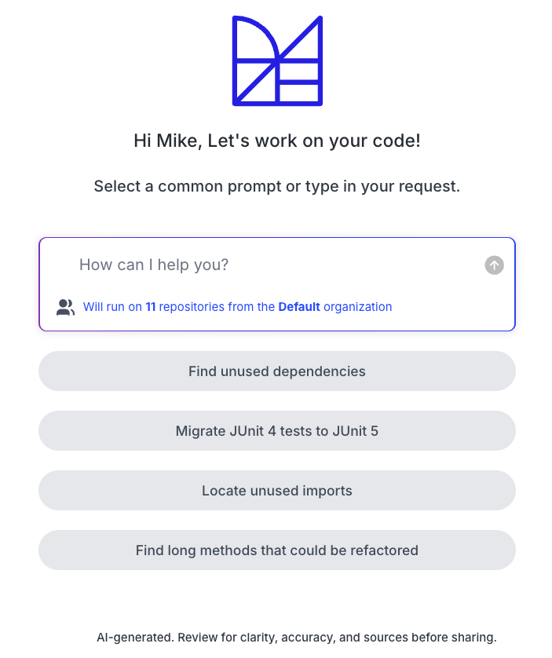

import ReactPlayer from 'react-player';

# Getting started with Moddy

Moddy is a multi-repo AI agent (**currently in a restricted beta**) that combines natural language with the accuracy and scalability of Moderne and OpenRewrite. With it, you can analyze and modify large and complex codebases. For instance, you could ask it questions like, "How do I use Apache Commons?" or "Help me upgrade to Spring Boot 3.5," and it would search for the appropriate OpenRewrite recipes and then execute them for you.

Moddy runs inside the Moderne Platform, allowing you to run Moddy requests at scale across thousands of repositories and organizations. We also offer [Moddy Desktop](./moddy-desktop.md) which is a standalone version that runs on your local machine – allowing you to quickly run it against your local repositories or connect to other tools such as Claude Code through an MCP connection.

In this guide, we'll walk you through everything you need to know to get started with Moddy in the Moderne Platform.

<ReactPlayer className="reactPlayer" url='https://www.youtube.com/watch?v=0XiUaUbUOcU' controls="true" />

## Prerequisites

* Access to the Moderne Platform.
* Moddy [already being configured in your tenant](../../administrator-documentation/moderne-platform/how-to-guides/agent-configuration/configure-an-agent-with-llm-for-moddy.md) by an admin.
* Repositories ingested into the Moderne Platform.

## Where to access Moddy

To access Moddy in the Moderne Platform, click on the Moddy button in the sidebar:

<figure>
  
  <figcaption></figcaption>
</figure>

This will take you to the chat window where you can ask it a variety of useful questions about your code. You can also see what repositories it will evaluate as part of your questions.

<figure style={{maxWidth: '400px', margin: '0 auto'}}>
  
  <figcaption></figcaption>
</figure>

## Data privacy and models

For information about how data flows in Moddy and what models are used, see the [Moddy data privacy and models](./moddy-data-privacy.md) documentation.
