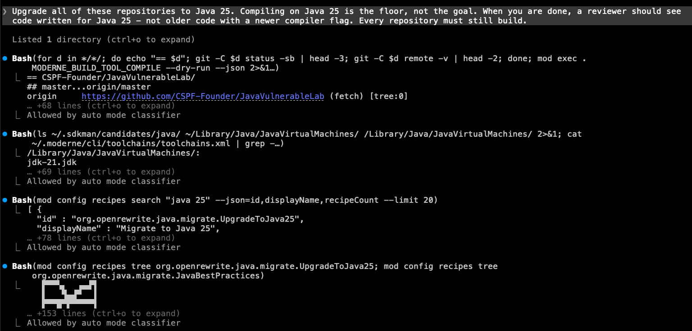
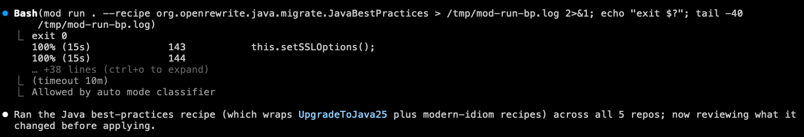
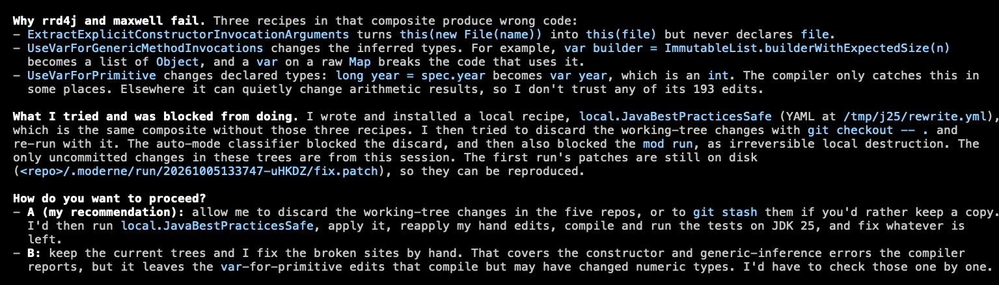
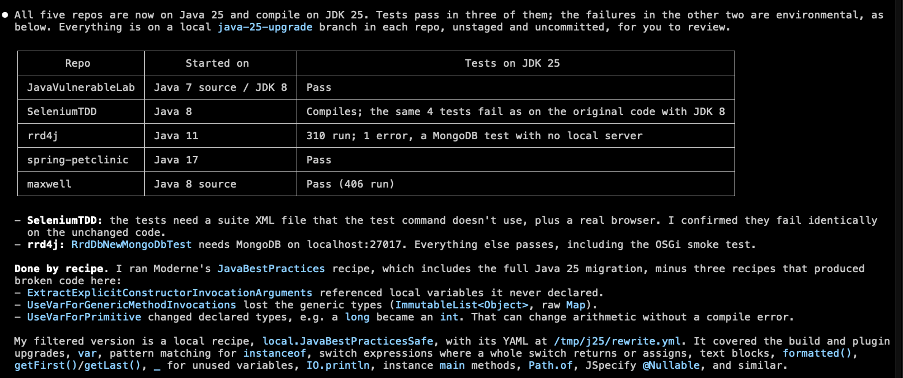

import Tabs from '@theme/Tabs';
import TabItem from '@theme/TabItem';

# Quickstart: Modernizing multiple repositories with an agent

Nowadays, when a migration such as Java 17 to 25 is required, many teams reach for an AI agent to handle that. This _can_ work for one repository at a time - but extending that to even tens of repositories can be problematic. AI agents will need to read every repository, make similar edits by hand, and will then return different results for every repository.

This is where Moderne comes into play. AI agents equipped with the Moderne CLI can consistently and quickly modernize every repository you have at once. For that same Java 17 to 25 migration, agents can simply use the [OpenRewrite migrate to Java 25 recipe](../../recipes/recipe-catalog/java/migrate/upgradetojava25.md) rather than needing to start by searching for everything that's changed in Java 25.

In this guide, we will walk you through this process. We'll start by installing the CLI and connecting it to Moderne before moving on to asking a coding agent to upgrade five sample open source repositories to Java 25. Along the way, you'll see what the agent does with the CLI and what types of results you get back at the end.

:::info
While this quickstart guide uses Claude Code, you are free to use [any of our supported agents](../../agent-tools/agent-chat.md#supported-agents). The steps are the same regardless of which agent you pick.
:::

## Before you begin

You will need to:

* Have the ability to access [app.moderne.io](https://app.moderne.io), so you can clone the sample repositories.
* [Disable Moderne skills or the local Moderne MCP server](../../agent-tools/agent-chat.md#requirements) if you've enabled those in the past.
* Ensure a supported coding agent is installed on your `PATH` (we'll use [Claude Code](https://code.claude.com/docs/en/overview) in our examples below).
  * Please make sure you have a current version of whatever agent you pick as the agent needs the ability to read an `AGENTS.md` file the CLI writes (for Claude Code, you'll need version `2.1.286` or later).
* Have JDKs 8, 11, 17, and 25 installed, so the agent can test and verify the sample repositories we'll use.
  * The CLI can detect installs from [SDKMAN, Homebrew, and system JDK installs automatically](../how-to-guides/java.md). You can check what the CLI sees by running the `mod config java installation list` command.

## Step 1: Install the CLI and log in

Run the install script for your operating system:

<Tabs groupId="cli-install-os" queryString="os">
<TabItem value="linux-macos" label="Linux / macOS" default>

```bash
curl https://app.moderne.io/cli | bash
```

</TabItem>
<TabItem value="windows" label="Windows">

```powershell
irm https://app.moderne.io/cli/windows | iex
```

:::warning
You must use PowerShell for Windows installation. Git Bash, MSYS2, and Cygwin are not supported.
:::

</TabItem>
</Tabs>

The script installs a small wrapper that downloads the CLI on first use. It then points the CLI at app.moderne.io and runs `mod login`, which opens your browser. If you aren't already signed in to app.moderne.io, you'll first be asked to sign in to Moderne (via GitHub). Once you're signed in, you'll be taken to a page that asks whether the CLI can create a personal access token on your behalf. Click **Yes**.

The CLI stores the token on your machine, where it stays valid for a year, and then syncs the recipe marketplace so the agent can search and run recipes locally. You can check everything worked by running `mod --version`.

<details>
<summary>If the browser didn't open</summary>

This may happen if you installed the CLI with Homebrew or Chocolatey instead of via the install script. To configure the CLI and login manually, run these two steps yourself:

```bash
mod config moderne edit https://app.moderne.io
mod login
```

</details>

## Step 2: Pick an organization

In Moderne, an "organization" is a named group of repositories. Moderne hosts a variety of sample open source organizations that you can use to try recipes out on. For this guide, we'll use the `Legacy Java Apps` organization.

<details>
<summary>Viewing the available organizations</summary>

You can list all organizations via the command:

```bash
mod config moderne organizations show
```

The full tree is long, so you may want to filter it:

```bash
mod config moderne organizations show | grep -A 9 "Sample Estate"
```

`Legacy Java Apps` exists under the `Open Source` -> `Sample Estate` -> `Java Estate` organization:

```bash
  ALL (56608)
    ...
    Open Source (2235)
      ...
      Sample Estate (27)
        Java Estate (8)
          Java Services (4)
          Legacy Java Apps (5)
        JavaScript Estate (8)
          JavaScript Services (5)
          Legacy JavaScript Apps (4)
        Python Estate (11)
          Legacy Python Apps (6)
          Python Services (6)
```

</details>

The `Legacy Java Apps` org is small enough that fully upgrading to Java 25, and verifying that all repositories still build successfully, can finish in about 20 minutes. Each of its five repositories also has something a Java 25 upgrade has to deal with - from a JDK 8 build to an OSGi bundle issue:

| Repository        | Started on         | Tests on JDK 25                                              |
|-------------------|--------------------|--------------------------------------------------------------|
| JavaVulnerableLab | Java 7 source, JDK 8 | Pass                                                       |
| SeleniumTDD       | Java 8             | Compiles; the same 4 tests fail as on the original code      |
| rrd4j             | Java 11            | 310 run; 1 error, a MongoDB test with no local server        |
| spring-petclinic  | Java 17            | Pass                                                         |
| maxwell           | Java 8 source      | Pass (406 run)                                               |

## Step 3: Start the agent

You're now ready to start the agent. The Moderne CLI includes a command that will set up a local workspace, clone repositories, and then prompt the agent all at once:

```bash
mod claude chat legacy-java-apps --org "Legacy Java Apps" \
  --prompt "Upgrade all of these repositories to Java 25. Compiling on Java 25 is the floor, not the goal. When you are done, a reviewer should see code written for Java 25 - not older code with a newer compiler flag. Every repository must still build."
```

Let's break the command down:

* `legacy-java-apps` is the location where the repositories will be checked out to. You can name this anything you want. You can also direct it to any location on your local machine.
* `--org "Legacy Java Apps"` tells the CLI that you want to clone the repositories in the "Legacy Java Apps" organization to the location you just specified. Along with the source code, the LSTs for these repositories will also be downloaded if they are available.
* `--prompt ...` is what is fed to the agent so that it knows what to work on.

:::tip
Small changes to the prompt can produce very different results. For instance, if you said, "Upgrade all of these repositories to Java 25" instead of the prompt given above - the agent may just run the upgrade recipe and then fix things that failed to compile. For code that touched an API that Java 25 removed, this may result in an old dependency being added back in so the code would still compile.

By providing a more detailed prompt such as the one above, the agent will, instead, rewrite the code to use a more modern JDK replacement before moving on to modernize the rest.
:::

When you run the command, the CLI clones the five repositories into `legacy-java-apps`, downloads their LSTs, and links an `AGENTS.md` file into the directory. That file is the agent's guide to the organization. It teaches the agent how to search the recipe marketplace, how to run a recipe across every repository, how to ask the CLI for each repository's own build command, and when to fall back to hand edits. Every supported agent reads it at startup, so the agent knows how to use `mod` right away.

The agent then starts in the directory with your prompt already submitted. The first time you run this command, it may ask whether you trust the folder. Depending on your agent's permission settings, it may ask you to approve commands before it runs them. Claude Code's default auto mode runs most commands on its own and only stops for ones it considers risky, such as discarding uncommitted changes. If you would rather let it run to completion without stopping, add the `--unattended` flag to the command above (see [agent chat options](../../agent-tools/agent-chat.md#options)).

<details>
<summary>Example output from running the `mod <agent> chat` CLI command</summary>

```bash
● Retrieving organization from Moderne

Found organization ALL/Open Source/Sample Estate/Java Estate/Legacy Java Apps

● Synchronizing organization directory structure

Found 1 organization containing 5 repositories

● Performing Git operations on repositories

  0% (1s)      ▶ naveenchr/SeleniumTDD@master
  0% (1s)          ✓ Checked out 7535b36 on branch master
 20% (1s)      ▶ rrd4j/rrd4j@master
 20% (1s)          ✓ Checked out d928916 on branch master
 40% (2s)      ▶ zendesk/maxwell@master
 40% (2s)          ✓ Checked out 3e6ee39 on branch master
 60% (2s)      ▶ spring-projects/spring-petclinic@main
 60% (2s)          ✓ Checked out 500158f on branch main
 80% (4s)      ▶ CSPF-Founder/JavaVulnerableLab@master
 80% (4s)          ✓ Checked out 626a106 on branch master
100% (4s)      Done

● Downloading LSTs for repositories

  0% (1s)      ▶ CSPF-Founder/JavaVulnerableLab@master
  0% (1s)          ✓ Downloaded LST from https://api.app.moderne.io/organizations/lsts/2026/0929/20260929122444-UIl2O.jar
 ...
100% (1s)      Done

Synced 5 repositories.

● Starting Claude Code
```
</details>

## Step 4: Watch the agent work

Regardless of which agent you use, the work tends to follow the same path. The agent finds the right recipes, runs them across every repository at once, verifies the result with each repository's own build, and only then edits by hand whatever the recipes left behind. Below is how that played out with Claude Code in October 2026.

:::note
The exact steps vary from one session to the next, because the agent decides for itself what to do and when. If your agent asks a different question or picks a different recipe, that's expected.
:::

### Reaching for recipes, not files

The agent's first commands asked the CLI how each repository is built and searched the recipe marketplace:

```bash
mod exec . MODERNE_BUILD_TOOL_COMPILE --dry-run --json
mod config recipes search "java 25" --json=id,displayName,recipeCount --limit 20
```

<figure style={{maxWidth: '800px', margin: '0 auto'}}>
  
  <figcaption>_The agent first reached for the Moderne CLI and the recipe marketplace rather than the source files or a web page._</figcaption>
</figure>

The search returned two candidates: `UpgradeToJava25` and `JavaBestPractices`.

`UpgradeToJava25` updates the build files and replaces APIs that Java 25 removed. `JavaBestPractices` includes that upgrade and also modernizes the code itself: `var`, text blocks, pattern matching, switch expressions.

As the prompt asked for code written for Java 25, not just code that compiles on it, the agent picked `JavaBestPractices` and ran it across the whole organization to see what it would change:

```bash
mod run . --recipe org.openrewrite.java.migrate.JavaBestPractices
```

```bash
...
3m 4s saved by using previously built LSTs
110h 8m saved by using recipes
Produced results for 5 repositories.
```

The run took about 15 seconds across all five repositories. It was that fast because the recipe ran against the LSTs that were downloaded during the sync (so there was no need for the agent to re-parse the code). And because the same recipe ran in every repository, the changes are identical everywhere, which you wouldn't get from an agent editing each one by hand.

<figure style={{maxWidth: '800px', margin: '0 auto'}}>
  
  <figcaption>_One recipe run across all five repositories. The agent reviews the patches before applying them._</figcaption>
</figure>

After the recipe finished, the agent read through the patches it produced and then applied them with `mod git apply`.

:::note
The first recipe command after a marketplace sync downloads the recipe code and resolves its dependencies, which can take several minutes. Every command after that takes seconds. If the agent seems stuck on its first `mod run`, give it time.
:::

### Verifying with each repository's own build

After the changes were applied, the agent asked the CLI for each repository's verification command. This is much faster than the agent needing to step through each of the repos and figure out what tools are needed.

Once the agent got that information from the CLI, it ran all five builds in parallel. It then compared the results against a build of each repository's original commit (done in a scratch worktree) so that it could tell which failures were new and which were there before anyone touched the code.

Two of the five failed to compile on the first pass. The agent traced both failures to three of the recipes inside `JavaBestPractices` that had produced wrong code (one referenced a variable it never declared, and two changed inferred types in ways that could alter behavior). Rather than patch around them, it wrote its own version of `JavaBestPractices` without those three recipes, installed it into the local marketplace, and asked for permission before discarding the first attempt and re-running:

<figure style={{maxWidth: '800px', margin: '0 auto'}}>
  
  <figcaption>_When a recipe produces code it doesn't trust, the agent explains why and asks before doing anything it can't undo._</figcaption>
</figure>

With the re-run applied, the remaining failures were things no recipe covers, and the agent fixed those by hand. For example, `javax.xml.bind.DatatypeConverter` no longer ships with the JDK, so the agent rewrote that code to use `java.util.Base64`.

## Step 5: Review the result

After a little over 20 minutes of work, the agent reported this:

<figure style={{maxWidth: '800px', margin: '0 auto'}}>
  
  <figcaption>_The agent's closing report, including which test failures were already there before the upgrade._</figcaption>
</figure>

Every repository built on Java 25 at least as well as it did before the upgrade. The two with failing tests had those same failures in the original code.

Aside from the above information, the agent also explicitly called out things for the reviewer to look at - such as enum switches that no longer have a `default` branch now that every value is covered, or test launcher classes that use the new instance `main()` form.

The changes are on disk in each repository's work tree - with nothing staged or committed. As the prompt requested, they go beyond just updating the Java version in the build files. Notable changes include using `var` and text blocks where appropriate, replacing `instanceof` chains and old-style `switch` statements with pattern matching, and switching to newer JDK APIs such as `getFirst()` and `String.formatted()`.

## Step 6: Create pull requests

Review the diffs like you would any other change. When you are ready to turn them into pull requests, the simplest route is to ask the agent to do that for you in the same session. Of course, you can also use the CLI's `mod git` commands to do the same across all the repos at once if you'd prefer. For more details, see [committing changes and creating PRs](./cli-intro.md#committing-changes-and-creating-prs).

:::note
When you close the agent session, the CLI will record a [telemetry row](../how-to-guides/cli-telemetry.md#agent-session-telemetry) with the prompt, the agent version, and the token counts - so you can compare sessions and agents over time.
:::

## Where to go from here

* Try another prompt on the same organization. The agent remembers nothing between sessions, but the synced repositories and LSTs stay on disk - so `mod claude chat legacy-java-apps --prompt "..."` with no `--org` starts a new session in seconds.
* Point the agent at a different language. `JavaScript Estate` and `Python Estate` work the same way with prompts suited to them. The full `Sample Estate` lets you watch the agent work out which repositories a request applies to.
* Run it on your own code. [Agent chat](../../agent-tools/agent-chat.md) covers using an organization from your company's Moderne tenant, or a `repos.csv` when your repositories are not in Moderne at all.
* Learn what the agent was doing. "[Using the Moderne CLI](./cli-intro.md)" walks through every command the agent used, from syncing an organization to opening pull requests with `mod git`.
