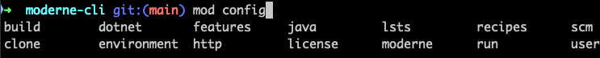

import ReactPlayer from 'react-player';
import Tabs from '@theme/Tabs';
import TabItem from '@theme/TabItem';

# Getting started with the Moderne CLI

The Moderne CLI is a command line tool that complements the Moderne Platform and Moderne DX, enabling you to build [Lossless Semantic Tree](../../../administrator-documentation/moderne-platform/references/lossless-semantic-trees.md) (LST) artifacts across many repositories and run recipes against all of them from your local machine. It also provides substantial benefits for creating and testing your own recipes.

To ensure you can use the Moderne CLI successfully, in this guide, we will walk you through everything you need to get started – from installation, to configuration, to examples demonstrating how to use it.

:::note
The examples in this guide use the latest staging version of the Moderne CLI.
:::

## Installation and configuration

Choose the installation path that matches your setup:

<Tabs groupId="moderne-edition" queryString="edition">
<TabItem value="standard" label="Standard Edition" default>

> These instructions apply to Standard Edition customers and users of the public [app.moderne.io](https://app.moderne.io/marketplace) instance.

#### Step 1: Download the CLI

1. Go to [app.moderne.io](https://app.moderne.io/) and sign in.
2. Click on `Help` in the bottom left-hand corner and select the version of the CLI you want to download (Stable or Staging). In general, you should use _staging_ when working with the CLI locally, and you should use _stable_ for crucial mass-ingest process runs.
3. Either press the download button for your appropriate OS, or select the installation method in the provided table. We recommend using HomeBrew or Chocolatey if you have access to either.


4. If you chose to install the CLI without a package manager, you'll need to save it somewhere that your terminal can access. This could involve updating your `PATH` to point to a specific location – or this could involve putting it in a directory that's already on your `PATH` (such as a `/user/bin` directory).
   * Remember to refresh any open terminals if you modify the `PATH`.

If everything was configured correctly, you should be able to type `mod` into your terminal and see a list of commands:

<details>

<summary>mod command results</summary>

```bash
➜ mod

Moderne CLI 3.48.5

Usage:

mod [-h] [--version] [COMMAND]

Description:

Automated code remediation.

Options:

  -h, --help      Display this help message.
      --version   Display version info.
Commands:

  afterburner          (INCUBATING) Indexes built LSTs to accelerate recipe
                         execution.
  audit                (INCUBATING) Perform an audit of recent activity.
  batch                Add batch changes to the Moderne platform.
  build                Generates LST artifacts for one or more repositories.
  clean                Clean build and run artifacts produced by the CLI.
  config               Global configuration options that are required by some
                         CLI commands.
  devcenter            Generate DevCenter dashboards.
  exec                 Execute an arbitrary shell command recursively on
                         selected repository roots.
  generate-completion  Generate bash/zsh completion script for mod.
  git                  Multi-repository git operations.
  log                  Manages a log aggregate.
  list                 Lists the repositories that can be built and published.
  monitor              (INCUBATING) Launches an HTTP server used to monitor the
                         CLI.
  publish              Publishes the LST artifacts for one or more projects.
  run                  Runs an OpenRewrite recipe locally on pre-built LSTs.
  run-history          Get information about the most recent recipe runs. This
                         will be transitioning to mod audit runs list
                         eventually. A deprecation notice will be added here
                         when we suggest adopting the alternative.
  study                Produces studies from OpenRewrite recipe data tables
                         locally.
```

</details>

#### Step 2: (Optional) Set up auto-completion in your terminal (Unix terminals only)

The Moderne CLI offers a command which generates a completion script that can be used to set up auto-completion in your terminal. After initializing this script, you can type `mod config` and press tab and then your terminal will offer suggestions for the sub-commands or parameters:



To configure this for the terminal you're using, please enter the following command in your terminal:

```bash
source <(mod generate-completion)
```

Or, if you want to configure auto-completion so that it works for _every_ terminal instance you make, please update your `~/.zshrc` or `~/.bashrc` file and add this command to the bottom of it:

```bash
# The next line enables shell command completion for mod
source <(mod generate-completion)
```

#### Step 3: Connect the CLI to Moderne

Connecting the CLI to Moderne is necessary to:

* Quickly sync the recipe catalog from Moderne to your local machine
* Download pre-built LSTs from Moderne so you can quickly run recipes locally
* Receive organizational information, so you can clone/build/run groups of repositories more easily

To set up this connection, you'll first need to receive an access token from us to use in your CLI. After you receive it, you should run the following command:

```bash
mod config moderne edit https://app.moderne.io --token mat-YOUR_TOKEN_HERE
```

If everything worked, you should see a `MOD SUCCEEDED` message


#### Step 4: Install recipes

With the Moderne connection established, you can download recipes to your local machine by running the following command:

```bash
mod config recipes moderne sync
```

:::info
Occasionally, a few of the recipes may fail to sync properly and return the message `! Failed to install`. If the majority of the recipes installed successfully, however, you will see the `MOD PARTIALLY SUCCEEDED` message when the command completes, and you can still continue on without a problem for the purposes of this tutorial.
::: 

This will grab _all_ of the recipes from the tenant you specified in `mod config` – so please expect this command to take a few minutes to download the recipes.

</TabItem>
<TabItem value="enterprise" label="Enterprise Edition">

> If your organization is paying for the Enterprise Edition of Moderne and you have a private Moderne instance (e.g., `https://yourcompany.moderne.io`), please follow these instructions.

#### Step 1: Download the CLI

1. Go to your private tenant URL (e.g., `https://yourcompany.moderne.io`) and sign in.
2. Click on `Help` in the bottom left-hand corner and select the version of the CLI you want to download (Stable or Staging). In general, you should use _staging_ when working with the CLI locally, and you should use _stable_ for crucial mass-ingest process runs.
3. Either press the download button for your appropriate OS, or select the installation method in the provided table. We recommend using HomeBrew or Chocolatey if you have access to either.


4. If you chose to install the CLI without a package manager, you'll need to save it somewhere that your terminal can access. This could involve updating your `PATH` to point to a specific location – or this could involve putting it in a directory that's already on your `PATH` (such as a `/user/bin` directory).
   * Remember to refresh any open terminals if you modify the `PATH`.

If everything was configured correctly, you should be able to type `mod` into your terminal and see a list of commands:

<details>

<summary>mod command results</summary>

```bash
➜ mod

Moderne CLI 3.48.5

Usage:

mod [-h] [--version] [COMMAND]

Description:

Automated code remediation.

Options:

  -h, --help      Display this help message.
      --version   Display version info.
Commands:

  afterburner          (INCUBATING) Indexes built LSTs to accelerate recipe
                         execution.
  audit                (INCUBATING) Perform an audit of recent activity.
  batch                Add batch changes to the Moderne platform.
  build                Generates LST artifacts for one or more repositories.
  clean                Clean build and run artifacts produced by the CLI.
  config               Global configuration options that are required by some
                         CLI commands.
  devcenter            Generate DevCenter dashboards.
  exec                 Execute an arbitrary shell command recursively on
                         selected repository roots.
  generate-completion  Generate bash/zsh completion script for mod.
  git                  Multi-repository git operations.
  log                  Manages a log aggregate.
  list                 Lists the repositories that can be built and published.
  monitor              (INCUBATING) Launches an HTTP server used to monitor the
                         CLI.
  publish              Publishes the LST artifacts for one or more projects.
  run                  Runs an OpenRewrite recipe locally on pre-built LSTs.
  run-history          Get information about the most recent recipe runs. This
                         will be transitioning to mod audit runs list
                         eventually. A deprecation notice will be added here
                         when we suggest adopting the alternative.
  study                Produces studies from OpenRewrite recipe data tables
                         locally.
```

</details>

#### Step 2: (Optional) Set up auto-completion in your terminal (Unix terminals only)

The Moderne CLI offers a command which generates a completion script that can be used to set up auto-completion in your terminal. After initializing this script, you can type `mod config` and press tab and then your terminal will offer suggestions for the sub-commands or parameters:


To configure this for the terminal you're using, please enter the following command in your terminal:

```bash
source <(mod generate-completion)
```

Or, if you want to configure auto-completion so that it works for _every_ terminal instance you make, please update your `~/.zshrc` or `~/.bashrc` file and add this command to the bottom of it:

```bash
# The next line enables shell command completion for mod
source <(mod generate-completion)
```

#### Step 3: Connect the CLI to your tenant

Connecting the CLI to your Moderne tenant is necessary to:

* Quickly sync the recipe catalog from your tenant to your local machine
* Download pre-built LSTs from your tenant so you can quickly run recipes locally
* Receive organizational information specific to your company, so you can clone/build/run groups of repositories more easily

To set up this connection, you'll first need to create an access token for the CLI to use:

1. Navigate to `https://yourcompany.moderne.io/settings/access-token` (replace `yourcompany` with your tenant name)
2. Enter a human-readable name for the token (e.g., cli-token)
3. Press `Generate`
4. Copy the `install on your workstation` command and paste it into your command line. This command should look something like:

```bash
mod config moderne edit https://yourcompany.moderne.io --token mat-YOUR_TOKEN_HERE
```

5. If everything worked, you should see a `MOD SUCCEEDED` message


#### Step 4: Install recipes

With the Moderne connection established, you can download recipes to your local machine by running the following command:

```bash
mod config recipes moderne sync
```

:::info
Occasionally, a few of the recipes may fail to sync properly and return the message `! Failed to install`. If the majority of the recipes installed successfully, however, you will see the `MOD PARTIALLY SUCCEEDED` message when the command completes, and you can still continue on without a problem for the purposes of this tutorial.
::: 

This will grab _all_ of the recipes from your tenant – so please expect this command to take a few minutes to download the recipes.

</TabItem>
<TabItem value="dx" label="Moderne DX">

> If your organization is paying for Moderne DX and you need to set up the CLI in an air-gapped or a restricted environment, please follow the instructions in our [installing and configuring the CLI for DX users guide](./dx-cli-install.md).
</TabItem>
</Tabs>

## Connecting to internal tools

If you have an internal artifact repository for hosting LSTs or recipes, please follow along with our [configuring the CLI to work with internal tools guide](./cli-internal-tools.md).

## Using the CLI

With installation and configuration complete, you're ready to use the CLI. This section will guide you through common workflows and commands.

:::tip
For a hands-on tutorial using public repositories, check out our [Moderne CLI workshop](./moderne-cli-workshop.md).
:::

:::warning
The Moderne CLI was not designed to run multiple commands simultaneously. Please only execute one command at a time.
:::

### Setting up your workspace

The most common (and **recommended**) way of using the Moderne CLI is to run recipes against pre-built LSTs that you download to your machine. For this path, you'll want to create a directory that you can clone the LSTs and code to:

```bash
mkdir /path/to/your/moderne/workspace
cd /path/to/your/moderne/workspace
```

It's also possible to run recipes on code you have already checked out on your machine – in which case you'll want to `cd` into that directory and then [build the LSTs](#building-lsts):

```bash
cd /path/to/your/repos
mod build .
```

### Syncing Moderne organizations

> _If you already have repositories you want to work with checked out locally, skip to the [building LSTs section](#building-lsts)._

Rather than needing to manually clone every repository you want to run a recipe against, Moderne offers the ability to download LSTs and code for pre-defined groups of repositories.

<Tabs groupId="moderne-edition" queryString="edition">
<TabItem value="standard" label="Standard Edition" default>

#### Viewing available organizations

To see what organizations you have access to in `app.moderne.io`, run the following command:

```bash
mod config moderne organizations show
```

<details>
<summary>You should see something like this:</summary>

```bash
Moderne CLI 3.48.5

⏺ Retrieving the configured organizations

  ALL (12345)
    Default (11)
    JetBrains (170)
    Moderne (116)
      Moderne - Public (8)
      Moderne AI (8)
      Moderne SaaS (26)
        Moderne Libraries (10)
        Moderne Microservices (15)
        Moderne UI (1)
      Recipes (28)
      Smoke test (6)
    Open Source (48316)
      AirBnB (19)
      Alibaba (363)
      Amazon (95)
      Android (129)
      Antlr (10)
      Atlassian (1)
      BNY (3)
      C# (459)
      Cloud Foundry (7)
      DataStax (124)
      Eclipse Foundation (295)
        Eclipse Platform (7)
      Elastic Search (35)
      Facebook (19)
      FasterXML (48)
      FINOS (29)
      Forks (34)
      Google (764)
      Gradle (61)
      Gradle Plugins (46)
      Green Button Alliance (3)
      ...
```

</details>

#### Downloading LSTs and code

Once you've decided what organization you want to clone, you can download the LSTs and code to your machine by running the following command:

```bash
mod git sync moderne /path/to/your/workspace "<organization-name>" --with-sources
```

Make sure to replace the path and organization with the one you want. If you don't want to download the code and just want to download the LSTs, you can remove the `--with-sources` flag.

:::warning
If you need to enter an SSH passphrase to clone repositories, please see our [SSH keys with passphrases guide](../how-to-guides/ssh-key.md) before continuing.
:::

</TabItem>
<TabItem value="enterprise" label="Enterprise Edition">

#### Viewing available organizations

To see what organizations you have access to in your Moderne tenant, run the following command:

```bash
mod config moderne organizations show
```

<details>
<summary>You should see something that looks similar to this (it will have your organizations instead):</summary>

```bash
Moderne CLI 3.48.5

⏺ Retrieving the configured organizations

  ALL (12345)
    Default (11)
    JetBrains (170)
    Moderne (116)
      Moderne - Public (8)
      Moderne AI (8)
      Moderne SaaS (26)
        Moderne Libraries (10)
        Moderne Microservices (15)
        Moderne UI (1)
      Recipes (28)
      Smoke test (6)
    Open Source (48316)
      AirBnB (19)
      Alibaba (363)
      Amazon (95)
      Android (129)
      Antlr (10)
      Atlassian (1)
      BNY (3)
      C# (459)
      Cloud Foundry (7)
      DataStax (124)
      Eclipse Foundation (295)
        Eclipse Platform (7)
      Elastic Search (35)
      Facebook (19)
      FasterXML (48)
      FINOS (29)
      Forks (34)
      Google (764)
      Gradle (61)
      Gradle Plugins (46)
      Green Button Alliance (3)
      ...
```

</details>

#### Downloading LSTs and code

Once you've decided what organization you want to clone, you can download the LSTs and code to your machine by running the following command:

```bash
mod git sync moderne /path/to/your/workspace "<organization-name>" --with-sources
```

Make sure to replace the path and organization with the one you want. If you don't want to download the code and just want to download the LSTs, you can remove the `--with-sources` flag.

:::warning
If you need to enter an SSH passphrase to clone repositories, please see our [SSH keys with passphrases guide](../how-to-guides/ssh-key.md) before continuing.
:::

</TabItem>
<TabItem value="dx" label="Moderne DX">

#### Working with organizations in DX

For Moderne DX customers, organizations are defined in [your organization's repos.csv file](../references/repos-csv.md) (or in a `repos-lock.csv` file shared with you). It's up to your team to figure out the best way to distribute this file. That being said, we'd recommend having your [mass ingest pipeline](../../../administrator-documentation/moderne-dx/how-to-guides/mass-ingest-and-run-dx.md) publish this CSV to S3 (or something similar) so people can easily download this file to their machines.

Once you have the CSV downloaded, you can either clone all of the repositories in that file and then `cd` into the organization (a specific directory) you care about – or you can filter the CSV file down to just the ones you care about and then clone those.

In either case, the command you should run is:

```bash
mod git sync csv /path/to/your/workspace repos.csv --with-sources
```

If you don't want to download the code and just want to download the LSTs, you can remove the `--with-sources` flag.
</TabItem>
</Tabs>

### Building LSTs

If you need to build the LSTs locally rather than downloading them, you can run the following command:

```bash
mod build /path/to/your/workspace
```

:::info
If a project fails to build, it might require additional configuration. See [mod config build](../cli-reference.md#mod-config-build) for customization options. If an LST doesn't build, running a recipe will just skip that project rather than error on it.
:::

### Running recipes {#running}

Once you have the LSTs downloaded or built, you can then run recipes against them.

#### Basic recipe execution

To run a recipe against all repositories in a specific directory:

```bash
mod run /path/to/your/workspace --recipe <RecipeName>

## For example:
mod run /path/to/your/workspace --recipe DependencyVulnerabilityCheck
```

:::tip
If multiple recipes have similar names, you'll be prompted to select the specific one you want. You can avoid this by using the fully qualified recipe name such as in the following example:

```bash
mod run . --recipe org.openrewrite.java.dependencies.DependencyVulnerabilityCheck
```
:::

#### Running recipes with parameters

Some recipes accept parameters to customize their behavior:

```bash
mod run /path/to/your/workspace --recipe <RecipeName> -P<parameterName>=<value>

## For example:
mod run . --recipe FindMethods -PmethodPattern="java.util.List add(..)"
```

#### Examining results

To learn more about what changed, you can command/ctrl click on the `Fix results` link in the output.

### Working with data tables

Many recipes produce [data tables](../../moderne-platform/getting-started/data-tables.md) on top of changing the code. Think of data tables as spreadsheets that recipes create to show you patterns and insights they discovered while analyzing your code.

#### Viewing available data tables

After running a recipe, the CLI will suggest data tables you can examine such as in the following example:

```bash
⏺ What to do next
  > Run mod study to examine the following data tables produced by this recipe:
    > mod study . --last-recipe-run --data-table VulnerabilityReport
    > mod study . --last-recipe-run --data-table MavenMetadataFailures
    > mod study . --last-recipe-run --data-table RecipeRunStats
    > mod study . --last-recipe-run --data-table SourcesFileResults
```

#### Generating data tables

To generate a data table from the last recipe run, you can copy one of the commands listed after a recipe run. It should look something like this:

```bash
mod study /path/to/your/workspace --last-recipe-run --data-table <TableName>
```

This command will generate a CSV file that you can then analyze.

#### Customizing output format

You can use the Moderne CLI to output other types of data based on your needs. For instance, you may want it to create a markdown file or a JSON file instead. Below are some examples of how you can change the output format:

**Export specific columns as JSON:**

```bash
mod study . --last-recipe-run --data-table <TableName> --json <column1>,<column2>
```

**Use templates for custom formatting:**

````bash
mod study . --last-recipe-run --data-table MethodCalls --json sourceFile,method --template '{{"# Search results\n\n"}}{{range .}}{{"* "}}{{.sourceFile}}{{"\n```\n"}}{{.method}}{{"\n```\n"}}{{end}}' > methods.md
````

This flexibility allows you to create custom reports tailored to your organization's needs.

### Committing changes and creating PRs

After running recipes, you'll typically want to review, test, and commit the changes. The CLI provides commands to help manage these changes across multiple repositories.

#### Creating branches

After running a recipe, the changes exist only as patches (so if you `cd` into any of the repos, you would see no changes). While you _could_ apply the patches to the branches you have checked out, it's generally preferable to make changes inside of a new branch and then submit a PR for said branch:

```bash
mod git checkout /path/to/your/workspace -b <branch-name> --last-recipe-run
```

This creates a new branch in each repository that has changes from the recipe run.

#### Applying changes

To apply the recipe changes to your repositories, run the following command:

```bash
mod git apply /path/to/your/workspace --last-recipe-run
```

After applying changes, you can navigate to individual repositories and run `git status` to see the uncommitted changes. This is a good time to run tests and verify the changes work as expected.

#### Staging and committing changes

Once you've tested the changes and decided you want to commit them, you'll need to run the following command to stage the changes for commit:

```bash
mod git add /path/to/your/workspace --last-recipe-run
```

Then you can commit the changes:

```bash
mod git commit /path/to/your/workspace -m "<your commit message>" --last-recipe-run
```

:::warning
GPG signing is not currently supported by the `mod git commit` command. If you use GPG signing, you'll need to disable it temporarily or manually commit the changes in each repository.
:::

#### Creating pull requests

After committing changes, you can push them and create pull requests:

**Push changes to remote:**

```bash
mod git push /path/to/your/workspace --last-recipe-run
```

**If needed, you can also specify an upstream branch:**

```bash
mod git push /path/to/your/workspace --last-recipe-run --set-upstream <branch-name>
```

**You can also create PRs using the GitHub CLI:**

```bash
mod exec . --last-recipe-run -- gh pr create --title "<PR title>"
```

For more options, see the [CLI reference documentation](../cli-reference.md#mod-git-push).

## Additional information

If you want to learn more about the Moderne CLI, we'd encourage you to check out the following docs:

* [Layered configuration in the CLI](../how-to-guides/layer-config-cli.md)
* [JDK selection and configuration](../how-to-guides/jdk-selection-and-config.md)
* [Using the Moderne IntelliJ plugin with the CLI](../../moderne-ide-integration/how-to-guides/moderne-plugin-install.md)

Or watch the following videos:

<ReactPlayer className="reactPlayer" url='https://www.youtube.com/watch?v=ZHXqYhaB71k' controls="true" />


<ReactPlayer className="reactPlayer" url='https://www.youtube.com/watch?v=zHlVg9H_JRo' controls="true" />


<ReactPlayer className="reactPlayer" url='https://www.youtube.com/watch?v=cs-6FJ_mtro' controls="true" />


## Differences between the Moderne CLI and the OpenRewrite build plugins

The OpenRewrite build plugins are designed to run a _single recipe_ on a _single repository_ at a time. When you run a recipe using these plugins, a new LST is produced regardless of whether or not the code for that repository has changed. This LST is temporarily stored in memory and used by the recipe before being discarded at the end of the recipe run. For large projects, this can be problematic as the entire LST _must_ fit in memory for the recipe to work.

In contrast, the Moderne CLI is designed for scale. You can run recipes against multiple repositories at once and the LST does not need to fit into memory. This is because the Moderne CLI uses proprietary code to build the LST up in parts and then serializes/writes it to the disk (as part of the `mod build` command). Likewise, the `mod run` command will read this LST from the disk in pieces as it runs recipes rather than building the LST every time.

When running the Moderne CLI commands for the first time, you might notice that running a single recipe on a single repository is slower than the OpenRewrite build plugins. This is due to the fact that the OpenRewrite build plugins do not serialize the LST and write it to disk.

However, if you wanted to run more recipes against the same LST, you would see that the Moderne CLI drastically increases in speed compared to the OpenRewrite build plugins as the Moderne CLI can read the pre-built LST and execute recipes against it rather than having to build it again each time. Furthermore, if you wanted to, you could use the Moderne CLI to run a recipe against many repositories at once – which the OpenRewrite build plugins can't do.
