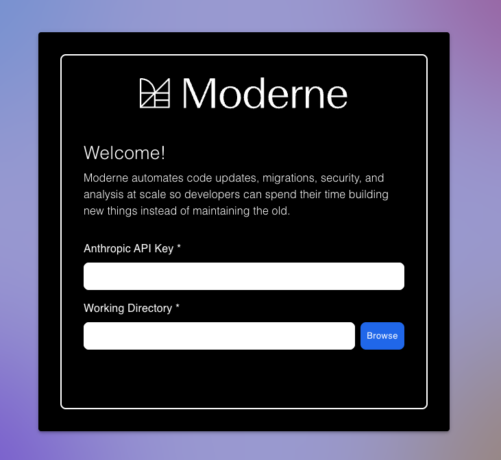
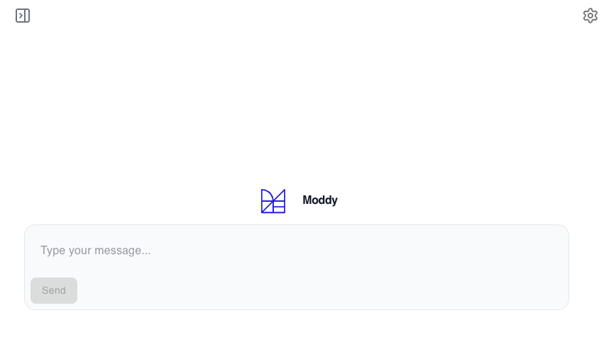
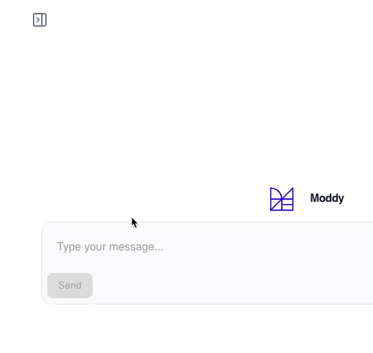

import Tabs from '@theme/Tabs';
import TabItem from '@theme/TabItem';

# Getting started with Moddy Desktop

Moddy is a multi-repo AI agent that combines natural language with the accuracy and scalability of Moderne and OpenRewrite. With it, you can analyze and modify large and complex codebases. For instance, you could ask it questions like, "How do I use Apache Commons?" or "Help me upgrade to Spring Boot 3.5," and it would search for the appropriate OpenRewrite recipes and then execute them for you.

In this guide, we'll walk you through everything you need to know about Moddy Desktop – from installation instructions to architecture design.

## Installation

We support installing Moddy Desktop via Homebrew (MacOS) or Chocolatey (Windows):

<Tabs>
<TabItem value="homebrew" label="Homebrew (MacOS)">

```bash
brew install --cask moderneinc/moderne/moddy-desktop
```

</TabItem>

<TabItem value="chocolatey" label="Chocolatey (Windows)">

```bash
choco install moddy-desktop
```
</TabItem>
</Tabs>

## Using Moddy Desktop

### Initial configuration

When you first launch Moddy, you will be prompted to fill in an Anthropic API key and to provide a working directory. The working directory should be the directory that contains all of the repositories you wish to ask questions about or run recipes against. You can change this after the fact as desired.

<figure>
  
  <figcaption>_The initialization screen in Moddy Desktop._</figcaption>
</figure>

### Components

Once you've configured a key and working directory, you will be taken to a page where you can ask a question or provide Moddy instructions:

<figure>
  
  <figcaption></figcaption>
</figure>

#### Thread history

In the top-left corner, you will see an expansion icon. When clicked, this will let you see all previous conversations (if any exist). You can click on one to continue that conversation or you can delete them if you decide you no longer want them to exist.

<figure>
  
  <figcaption></figcaption>
</figure>

#### Settings

In the top-right corner, you will see a settings icon. When clicked, this will allow you to change the API key, select a different working directory, or point to a different location for the Moderne CLI.

<figure>
  
  <figcaption></figcaption>
</figure>

## How data flows

The AI model is chosen by the customer. All traffic to the model is routed via an on-prem agent (not to be confused with an AI agent). The deployment is BYOM and any generative model is supported.

<figure>
  
  <figcaption>_The flow of data from you to the LLM to an OpenRewrite recipe._</figcaption>
</figure>

<figure>
  
  <figcaption>_What an air-gapped environment might look like._</figcaption>
</figure>

## Frequently asked questions

### What models do you use and how are they trained?

Moderne doesn't train or fine-tune its own models. Instead, we leverage approved third-party models from vendors or OSS. We employe a bring-your-own-model (BYOM) configuration. All traffic to models is routed from an on-prem Moderne agent (not to be confused with an AI agent).

### What is your licensing model for third party data used in Moddy Desktop?

Moderne doesn't use any third party data. We don't have access to customer data and we don't train models on customer data. The model is controlled via a system prompt to only answer questions about the code by leveraging Moderne recipe/tools.

The recipes and tools are governed by the [Moderne Proprietary License](https://docs.moderne.io/licensing/overview/), the [Moderne Source Available License](https://docs.moderne.io/licensing/moderne-source-available-license/), and the [Apache License Version 2.0](https://docs.openrewrite.org/licensing/openrewrite-licensing#apache-license-version-20).
