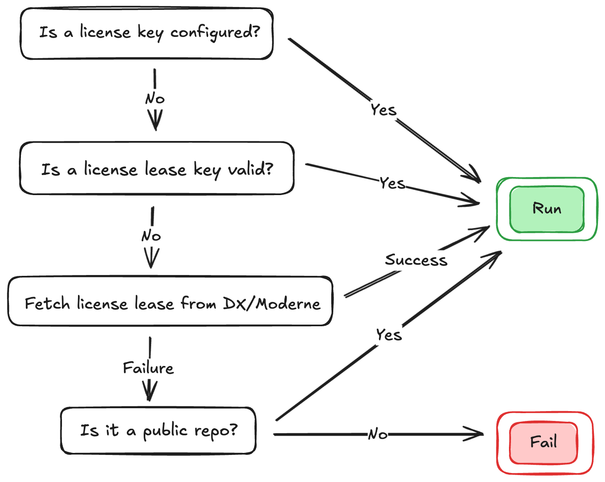

# Moderne CLI license

In order to **run recipes against private** repositories you will need to ensure that the Moderne CLI is configured with a license. If you are using the CLI to run recipes against _public_ repositories, you do not need to worry about a license. The only thing you will need to do in that instance is authenticate with [app.moderne.io](https://app.moderne.io) and create a [Moderne token](../../moderne-platform/references/moderne-tokens.md).

In this doc, we will walk through everything you need to know about the Moderne CLI license – from how to get one to how to configure one to all the details about how data flows through the systems.

## How to receive a license key

If you are a single-tenant Moderne customer, you don't need to configure a license as it will be automatically configured when you connect the CLI to Moderne.

If you are a Moderne DX or multi-tenant Moderne customer, you may contact [support@moderne.io](mailto:support@moderne.io) to request a license key and then jump to the [How to configure a license key section](#how-to-configure-a-license-key).

If you are not a Moderne customer, but still want to use the Moderne IDE plugin, please fill out our [try the Moderne IDE plugin signup form](https://www.moderne.io/moderne-ide-plugin-signup) and we will coordinate with you.

## License leases

Beginning with CLI and DX v3.30.0, license keys no longer need to be installed directly in the CLI. Instead, license leases are requested from a DX or single-tenant Moderne instance prior to running a recipe. To generate leases, DX instances must be configured with a valid license key. Leases are valid for 3 days which allows for the running of recipes when not connected to DX or Moderne.

## How to configure a license key

### Moderne DX customers

:::info
To service license leases, a valid license must be installed on the DX instance.
:::

A license lease will be automatically fetched by the CLI prior to running a recipe. To explicitly refresh a license lease, run the following CLI command:

```bash
mod config license moderne sync
```

### Multi-tenant Moderne customers

Please run the following CLI command:

```bash
mod config license edit <license-you-were-provided>
```

## License check flow

The following diagram shows the flow of what checks will happen when you attempt to run a recipe with the CLI:

<figure>
  
  <figcaption></figcaption>
</figure>

:::info
Some important details about the license check:

* The license check **does NOT make any call home requests to Moderne** (the public key packaged inside of the CLI is enough to verify the integrity of the signature).
* Verification of the Moderne tenant configuration only makes a call to the Moderne tenant. If you are using DX, this is a call to inside of your private network. If you are using the Moderne Platform, this is a call to your isolated tenant (and not Moderne as a whole).
* If you have configured a license key, no network calls will ever be made to an SCM vendor, such as GitHub, to check to see if a repository is public.
:::
