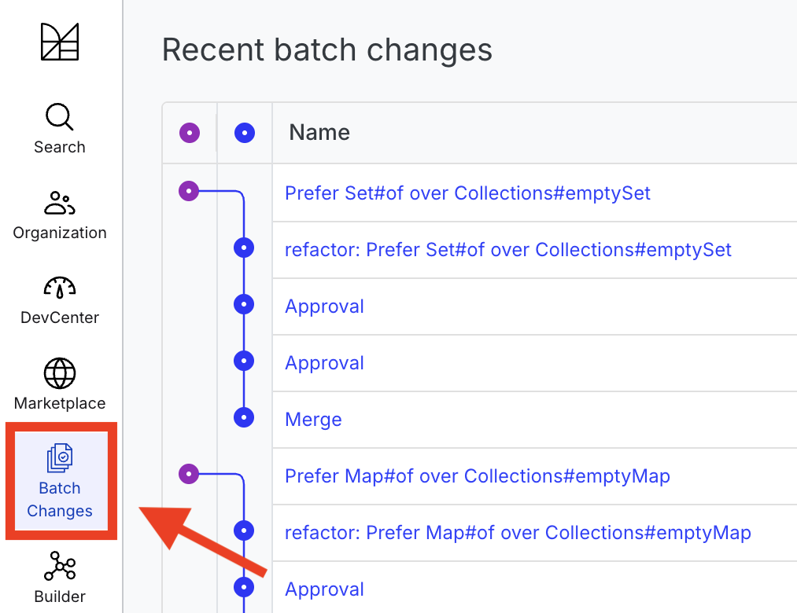
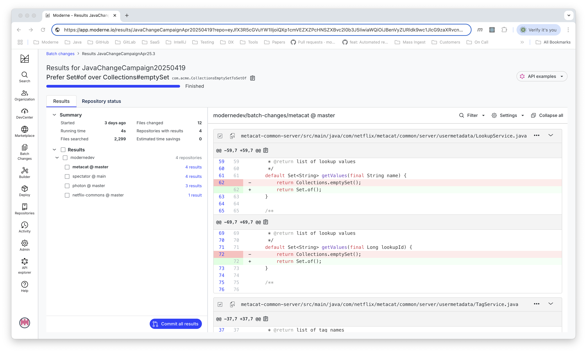

# How to publish batch change results to the Moderne platform

The `mod batch publish` command allows users to add repository changes created using ad hoc scripts or third-party tools to the Moderne platform. For example, the following commands first leverage `mod exec` to execute a simple `sed` script on a list of repositories and then runs `mod batch publish` to upload the change results to Moderne:

```bash
mod exec . -- find . -name '*.java' -exec sed -i '' 's/Collections.emptySet()/Set.of()/g' {} ';'
mod batch publish . --recipe com.acme.CollectionsEmptySetToSetOf --recipe-name "Prefer Set#of over Collections#emptySet" --recipe-description "Migrate uses of java.util.Collections#emptySet to Java 9's java.util.Set#of" --recipe-run ChangeCampaign20250419 -- git diff
```

After uploading the results, users can navigate to the batch changes activity page by clicking on **Batch Changes** in the Moderne UI's sidebar.

<figure>
  
  <figcaption>_Batch changes activity view_</figcaption>
</figure>

Clicking on a batch change run will display the run's results page. From there, users can view diffs and issue pull requests using the same workflows available for Moderne recipe run results.

<figure>
  
  <figcaption>_Batch changes results_</figcaption>
</figure>
