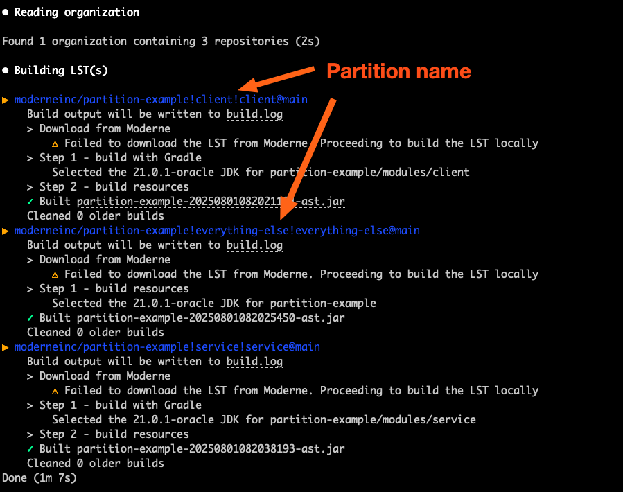
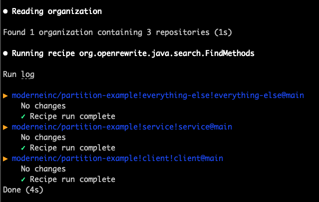

# Build partitions

Partitions allow for splitting a large repository into multiple LSTs. They are designed for large monorepos for which building an LST could trigger tens of thousands of build steps and take hours to days to run. In these scenarios, we are able to divide the repository into multiple named partitions which each define their own set of [build steps](./build-steps.md).

Please see our [example repository](https://github.com/moderneinc/partition-example) for a complete example of how to set up partitions.

## Defining build partitions

To add partitions, add or edit the `.moderne/moderne.yml` in the root of the repository:

```yaml
build:
  partitions:
    - name: service
      steps:
        - type: gradle
          inclusion: |-
            modules/service/**
        - type: resource
          inclusion: |-
            modules/service/**
    - name: client
      steps:
        - type: gradle
          inclusion: |-
            modules/client/**
        - type: resource
          inclusion: |-
            modules/client/**
    - name: everything-else
      steps:
        - type: resource
          inclusion: |-
            *
            !modules/**
```

## The effect of partitions when building

When performing a `mod build`, notice that the Moderne CLI still selects one repository (i.e. there is only one Git root), but there are separate entries in the output for each partition. The partition name is appended to the repository's path with a `!`.

<figure>
  
  <figcaption>_`mod build` on a repository with two defined partitions_</figcaption>
</figure>

## Running recipes on partitions

When executing a recipe with `mod run`, you will similarly see a separate entry for each partition:

```bash
mod run . --recipe org.openrewrite.java.search.FindMethods \
  -P "methodPattern=java.io.PrintStream#println(java.lang.String)"
```

<figure>
  
  <figcaption>_`mod run` on a partitioned repository_</figcaption>
</figure>

## Frequently asked questions

### Is there a way to see what's happening when we run `mod build`?

Please see the `build.log` file

### Can you run recipes on individual partitions?

You can comment out the partitions you don't want to run on in your `moderne.yml` file. This is mainly useful for troubleshooting and shouldn't be something you commonly do.
