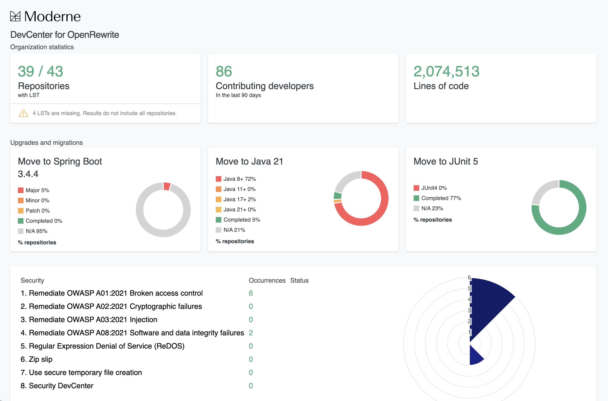

# How to configure the Moderne CLI DevCenter

The Moderne DevCenter provides you with high-level details about the state of all of your repositories. Using it, you can track the progress of upgrades, migrations, and security vulnerabilities. You may be aware of [this feature in the Moderne Platform](../../moderne-platform/getting-started/dev-center.md) - but did you know that you can generate a DevCenter locally via the CLI?

In this guide, we'll walk you through how to do that.

## Prerequisities

This guide assumes that you have already [installed and configured the CLI](../getting-started/cli-intro.md#installation-and-configuration).

## Step 1: Checkout the repositories you want to build a DevCenter for

The first thing you'll need to do is come up with the list of repositories that you want to build a DevCenter for. Once you have that list, please ensure they are cloned to a shared directory locally. For instance, this might look like:

```bash
devcenter-demo
├── repo1
├── repo2
└── repo3
```

:::tip
You may find it useful to start by only cloning a small subset of your repositories locally so that you can test, build, and iterate quickly. Once you've confirmed everything is working as you want, you can then add more repositories as desired.
:::

We'd recommend using the [mod git clone command](../cli-reference.md#mod-git-clone) to create this shared directory. With it, you can clone repositories from a CSV file, a JSON file, or from an existing organization (if your company has set up an Organizations service).

## Step 2: Build the LSTs

With the repositories cloned, you now need to build them so that the DevCenter can be produced:

```bash
mod build devcenter-demo
```

## Step 3: Define your DevCenter

Once all of your repositories are built, it's now time to figure out what your DevCenter will look like. This is done by adding an `organization.yml` file to your `.moderne` directory that should exist inside of your shared directory:

```bash
devcenter-demo
├── .moderne
│   ├── organization.yml
├── repo1
├── repo2
└── repo3
```

This file will determine what is displayed in your DevCenter. Maybe you want to track if your repositories are you using Java 21 – or maybe you care more about security vulnerabilities.

In either case, you'll want to define those pieces inside of this `organization.yml` file.

For simplicity, we'll provide an example DevCenter file for you to copy below. However, feel free to [edit it to meet your needs](../../../administrator-documentation/moderne-dx/how-to-guides/devcenter-yaml.md)

<details>

<summary>Example `organizations.yml` file:</summary>

```yaml
name: Default
devCenterConfiguration:
  version: 1
  upgradesAndMigrations:
    - title: Spring Boot 3
      measures:
        - name: Major
          recipe:
            id: org.openrewrite.java.dependencies.DependencyInsight
            options:
              - name: groupIdPattern
                value: org.springframework.boot
              - name: artifactIdPattern
                value: spring-boot-starter
              - name: version
                value: 1-2.999
        - name: Minor
          recipe:
            id: org.openrewrite.java.dependencies.DependencyInsight
            options:
              - name: groupIdPattern
                value: org.springframework.boot
              - name: artifactIdPattern
                value: spring-boot-starter
              - name: version
                value: 3-3.2
        - name: Patch
          recipe:
            id: org.openrewrite.java.dependencies.DependencyInsight
            options:
              - name: groupIdPattern
                value: org.springframework.boot
              - name: artifactIdPattern
                value: spring-boot-starter
              - name: version
                value: 3.3.0
    - title: Java 21
      measures:
        - name: Java 8+
          recipe:
            id: org.openrewrite.java.search.HasMinimumJavaVersion
            options:
              - name: version
                value: 8-10
        - name: Java 11+
          recipe:
            id: org.openrewrite.java.search.HasMinimumJavaVersion
            options:
              - name: version
                value: 11-16
        - name: Java 17+
          recipe:
            id: org.openrewrite.java.search.HasMinimumJavaVersion
            options:
              - name: version
                value: 17-20
    - title: JUnit 5
      measures:
        - name: JUnit 4
          recipe:
            id: org.openrewrite.java.search.FindAnnotations
            options:
              - name: annotationPattern
                value: '@org.junit.Test'
  security:
    name: Security
    measures:
      - recipe:
          id: org.openrewrite.java.security.OwaspA01
          options: []
      - recipe:
          id: org.openrewrite.java.security.OwaspA02
          options: []
      - recipe:
          id: org.openrewrite.java.security.OwaspA03
          options: []
      - recipe:
          id: org.openrewrite.java.security.OwaspA05
          options: []
      - recipe:
          id: org.openrewrite.java.security.OwaspA06
          options: []
      - recipe:
          id: org.openrewrite.java.security.OwaspA08
          options: []
      - recipe:
          id: org.openrewrite.java.security.RegularExpressionDenialOfService
          options: []
      - recipe:
          id: org.openrewrite.java.security.secrets.FindSecrets
          options: []
      - recipe:
          id: org.openrewrite.java.security.ZipSlip
          options: []
      - recipe:
          id: org.openrewrite.java.security.SecureTempFileCreation
          options: []
```

</details>

## Step 4: Generate your DevCenter

Now that you've configured your DevCenter, you can generate it locally by running the following command inside of your shared directory:

```bash
mod devcenter run .
```

This will take a significant amount of time to run depending on the number of repositories you have and how many recipes you've defined in your DevCenter.

At the end of it, you should see something like:

```bash
> Generating DevCenter

Created DevCenter XLSX at /Users/mikesol/cli-test/./devcenter.xlsx
Created DevCenter HTML at /Users/mikesol/cli-test/./devcenter.html (2s)

MOD SUCCEEDED in (1h 3m 16s)
```

Open up the HTML file to see your DevCenter:

<figure>
  
  <figcaption>_An example of what a locally generated DevCenter looks like_</figcaption>
</figure>

## Next steps

Once you've arrived at a DevCenter that you like, consider sharing it with your team. If you have an Organization service set up, you can even define this inside of that service so that everyone has this DevCenter by default when they `mod git clone` that organization.