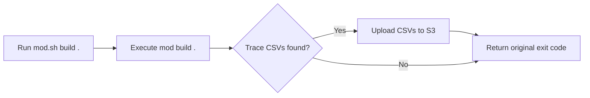

# Exporting CLI telemetry to Amazon S3

When the Moderne CLI runs across hundreds or thousands of repositories, it generates detailed telemetry about every sync, build, and run operation. While this data is available locally as CSV files, getting it into a centralized, queryable store is what makes it useful at an organizational level.

A lightweight wrapper script can automatically upload these trace CSV files to Amazon S3 after every CLI command, using Hive-style partitioning so the data is immediately queryable by any columnar query engine.

The examples in this guide use Amazon S3 and AWS Athena, but the exported CSV files and Hive partition layout are compatible with any BI system that reads from object storage — including Snowflake, Databricks, and Google BigQuery. This guide covers setting up the wrapper script, configuring S3 export, and optionally querying with Athena.

## Prerequisites

Before you begin, make sure you have the following:

* Familiarity with [how CLI telemetry works](./cli-telemetry.md) — specifically the trace CSV files and the `$MODERNE_HOME/cli/trace` directory
* The [AWS CLI](https://docs.aws.amazon.com/cli/latest/userguide/getting-started-install.html) installed and configured with credentials
* An S3 bucket dedicated to telemetry storage
* An IAM policy granting `s3:PutObject` on the target bucket

If you plan to query the data with Athena, you will also need:

* AWS Athena access
* AWS Glue Catalog permissions to create databases and tables

## How it works

Instead of calling `mod` directly, you call a wrapper script (`mod.sh`) that handles telemetry export transparently:



The wrapper calls the real `mod` command and captures its exit code. After the command completes, the CLI will have written trace CSV files to its local trace directory. The wrapper finds those files and uploads each one to S3 with Hive-style partitioning. The original exit code is always returned — if the telemetry upload fails for any reason, it does not affect your CLI workflow.

## Setting up the wrapper script

### Configuring environment variables

The wrapper script reads its configuration from a `modsh.env` file. The following environment variables control its behavior:

| Variable | Default | Description |
|----------|---------|-------------|
| `BI_ENDPOINT` | *(none)* | S3 bucket URI (e.g., `s3://my-telemetry-bucket`). |
| `BI_ORG` | *(none)* | Organization name used as the first Hive partition key. |
| `MODERNE_CLI_WRAPPER_CONFIG` | `modsh.env` next to script | Path to the configuration file. |
| `MODERNE_CLI_HOME` | `$HOME/.moderne/cli` | CLI home directory. |
| `MODERNE_CLI_TELEMETRY_DIR` | `$MODERNE_CLI_HOME/trace` | Directory where the CLI writes trace CSV files. |

Create a `modsh.env` file with your S3 bucket and organization name:

```bash title="modsh.env"
# S3 destination for telemetry publishing
BI_ENDPOINT=s3://my-company-cli-telemetry

# Organization identifier used for Hive-style partitioning
BI_ORG=my-company
```

### Installing the wrapper

1. Create the `mod.sh` file with the following content:

```bash title="mod.sh"
#!/usr/bin/env bash
set -euo pipefail

# Resolve the directory where this script lives
SCRIPT_DIR="$(cd "$(dirname "${BASH_SOURCE[0]}")" && pwd)"

# Load configuration
MODERNE_CLI_WRAPPER_CONFIG="${MODERNE_CLI_WRAPPER_CONFIG:-$SCRIPT_DIR/modsh.env}"
if [[ -f "$MODERNE_CLI_WRAPPER_CONFIG" ]]; then
    # shellcheck source=/dev/null
    source "$MODERNE_CLI_WRAPPER_CONFIG"
fi

# CLI paths
MODERNE_CLI_HOME="${MODERNE_CLI_HOME:-$HOME/.moderne/cli}"
MODERNE_CLI_TELEMETRY_DIR="${MODERNE_CLI_TELEMETRY_DIR:-$MODERNE_CLI_HOME/trace}"
MOD_JAR="${MOD_JAR:-$SCRIPT_DIR/mod.jar}"

# Map CLI commands to their trace directory names
get_trace_directory() {
    case "$1" in
        build)    echo "build" ;;
        publish)  echo "publish" ;;
        git)
            # "mod git clone" maps to the "sync" trace directory
            if [[ "${2:-}" == "clone" ]]; then
                echo "sync"
            else
                echo "${2:-git}"
            fi
            ;;
        *)        echo "$1" ;;
    esac
}

# Upload CSV files to S3 with Hive-style partitioning
publish_telemetry_s3() {
    local command_name="$1"

    # Skip if telemetry endpoint is not configured
    if [[ -z "${BI_ENDPOINT:-}" ]]; then
        return 0
    fi

    if [[ -z "${BI_ORG:-}" ]]; then
        echo "[telemetry] Warning: BI_ORG is not set. Skipping telemetry upload." >&2
        return 0
    fi

    if ! command -v aws &> /dev/null; then
        echo "[telemetry] Error: AWS CLI not found. Skipping telemetry upload." >&2
        return 0
    fi

    local search_dir="$MODERNE_CLI_TELEMETRY_DIR/$command_name"
    if [[ ! -d "$search_dir" ]]; then
        return 0
    fi

    # Build the S3 path with Hive-style partitioning
    local year month day
    year="$(date +%Y)"
    month="$(date +%m)"
    day="$(date +%d)"

    local s3_prefix="${BI_ENDPOINT}/org=${BI_ORG}/type=${command_name}/year=${year}/month=${month}/day=${day}"

    # Upload each CSV file
    while IFS= read -r -d '' csv_file; do
        local filename
        filename="$(basename "$csv_file")"
        echo "[telemetry] Uploading $filename to S3..." >&2
        if aws s3 cp "$csv_file" "$s3_prefix/$filename" --quiet 2>/dev/null; then
            echo "[telemetry] Uploaded: $filename" >&2
        else
            echo "[telemetry] Warning: Failed to upload $filename" >&2
        fi
    done < <(find "$search_dir" -name "*.csv" -type f -print0 2>/dev/null)
}

# Main execution
main() {
    local command_name="${1:-}"
    local subcommand="${2:-}"
    local trace_dir
    trace_dir="$(get_trace_directory "$command_name" "$subcommand")"

    # Execute the Moderne CLI
    local cli_exit_code=0
    if [[ -f "$MOD_JAR" ]]; then
        java -jar "$MOD_JAR" "$@" || cli_exit_code=$?
    elif command -v mod &> /dev/null; then
        mod "$@" || cli_exit_code=$?
    else
        echo "Error: Moderne CLI not found." >&2
        echo "Set MOD_JAR to the path of your mod.jar, or ensure mod is on your PATH." >&2
        exit 1
    fi

    # Publish telemetry after CLI execution
    publish_telemetry_s3 "$trace_dir" || true

    exit $cli_exit_code
}

main "$@"
```

2. Make the script executable:

```bash
chmod +x mod.sh
```

3. Place the `modsh.env` file in the same directory as `mod.sh`, or set `MODERNE_CLI_WRAPPER_CONFIG` to point to it.

4. Use `mod.sh` in place of `mod` for all CLI commands:

```bash
./mod.sh build .
./mod.sh git sync .
./mod.sh run . --recipe org.openrewrite.java.OrderImports
```

:::tip
You can alias `mod` to your `mod.sh` wrapper in your shell profile to make the transition seamless:

```bash
alias mod='/path/to/mod.sh'
```
:::

## Understanding the S3 path structure

The wrapper uploads each CSV file to an S3 path that follows Hive-style partitioning:

```
s3://{bucket}/org={org}/type={type}/year={YYYY}/month={MM}/day={DD}/{filename}.csv
```

Each partition key serves a specific purpose:

| Partition key | Source | Example | Purpose |
|---------------|--------|---------|---------|
| `org` | `BI_ORG` environment variable | `my-company` | Isolates data by organization. |
| `type` | CLI command name | `build`, `sync`, `publish` | Separates command types for targeted queries. |
| `year` | Date at upload time | `2026` | Enables time-range filtering. |
| `month` | Date at upload time | `02` | Enables time-range filtering. |
| `day` | Date at upload time | `24` | Enables time-range filtering. |

For example, a build trace uploaded on February 24, 2026 for the `my-company` organization would land at:

```
s3://my-company-cli-telemetry/org=my-company/type=build/year=2026/month=02/day=24/trace.csv
```

:::tip
The partition keys shown here are a starting point. If you need finer-grained time slicing — for instance, partitioning by hour for high-volume environments — you can add additional keys like `hour` to both the S3 path in the wrapper script and the table's partition projection configuration.
:::

:::note
The `mod git clone` command maps to the `sync` trace directory, so its telemetry is uploaded under `type=sync`. All other commands map directly by name.
:::

## Verifying the setup

After installing the wrapper, run a CLI command and confirm the CSV files appear in S3:

```bash
# Run a build through the wrapper
./mod.sh build .

# Check that telemetry was uploaded
aws s3 ls s3://my-company-cli-telemetry/ --recursive
```

You should see output similar to:

```
2026-02-24 10:15:32       4521 org=my-company/type=build/year=2026/month=02/day=24/trace.csv
```

## Querying telemetry with AWS Athena

:::info
This section is optional. If you use a different BI tool, you can point it at your S3 bucket directly. The Hive-style partition layout is a widely supported standard compatible with most columnar query engines.
:::

Once your telemetry data is flowing to S3, you can use AWS Athena to run SQL queries against it without loading the data into a database. Athena reads the CSV files directly from S3.

### Creating the Glue database and table

First, create a Glue database to hold the table definition:

```sql
CREATE DATABASE IF NOT EXISTS moderne_bi
LOCATION 's3://my-company-cli-telemetry/';
```

Then create an external table that maps to your CSV data. The table uses the OpenCSV SerDe to parse the CSV files and defines all columns as `string` type — you can cast to other types at query time.

<details>

<summary>Full CREATE TABLE statement (37 columns + 5 partition keys)</summary>

```sql
CREATE EXTERNAL TABLE IF NOT EXISTS moderne_bi.traces (
    origin                          string,
    path                            string,
    branch                          string,
    developer                       string,
    syncoutcome                     string,
    synccloneuri                    string,
    synclstdownloaduri              string,
    syncstarttime                   string,
    syncendtime                     string,
    syncchangeset                   string,
    syncelapsedtimems               string,
    buildoutcome                    string,
    buildstarttime                  string,
    buildendtime                    string,
    buildid                         string,
    builddependencyresolutiontimems string,
    buildchangeset                  string,
    buildmavenversion               string,
    buildgradleversion              string,
    buildbazelversion               string,
    builddotnetversion              string,
    buildpythonversion              string,
    buildnodeversion                string,
    buildosname                     string,
    buildosversion                  string,
    buildoseol                      string,
    buildgitautocrlf                string,
    buildgiteol                     string,
    buildsourcefilecount            string,
    buildlinecount                  string,
    buildparseerrorcount            string,
    buildweight                     string,
    buildmaxweight                  string,
    buildmaxweightsourcefile        string,
    buildcliversion                 string,
    buildelapsedtimems              string,
    organization                    string
)
PARTITIONED BY (
    org     string,
    type    string,
    year    string,
    month   string,
    day     string
)
ROW FORMAT SERDE 'org.apache.hadoop.hive.serde2.OpenCSVSerde'
WITH SERDEPROPERTIES (
    'separatorChar' = ',',
    'quoteChar'     = '"',
    'escapeChar'    = '\\'
)
STORED AS TEXTFILE
LOCATION 's3://my-company-cli-telemetry/'
TBLPROPERTIES (
    'skip.header.line.count'        = '1',
    'projection.enabled'            = 'true',
    'projection.org.type'           = 'injected',
    'projection.type.type'          = 'injected',
    'projection.year.type'          = 'integer',
    'projection.year.range'         = '2026,2099',
    'projection.month.type'         = 'integer',
    'projection.month.range'        = '1,12',
    'projection.month.digits'       = '2',
    'projection.day.type'           = 'integer',
    'projection.day.range'          = '1,31',
    'projection.day.digits'         = '2',
    'storage.location.template'     = 's3://my-company-cli-telemetry/org=${org}/type=${type}/year=${year}/month=${month}/day=${day}/'
);
```

</details>

### Enabling partition projection

The `CREATE TABLE` statement above includes `TBLPROPERTIES` that enable [Athena partition projection](https://docs.aws.amazon.com/athena/latest/ug/partition-projection.html). This means Athena automatically discovers new partitions as data arrives — you do not need to run `MSCK REPAIR TABLE` or manually add partitions each day.

There are two types of projected partitions in this table:

* **Injected partitions** (`org`, `type`) — these must appear in the `WHERE` clause of every query. Athena does not enumerate their values; instead, it uses the values you specify to construct the S3 path.
* **Range partitions** (`year`, `month`, `day`) — Athena automatically generates all valid combinations within the defined ranges. You can filter on these to limit the amount of data scanned.

### Setting up an Athena workgroup

We recommend creating a dedicated Athena workgroup for telemetry queries. This allows you to set a query result location and enforce scan limits to control costs:

* **Query result location**: `s3://my-company-cli-telemetry/athena-results/`
* **Per-query scan limit**: 100 GB (adjust based on your data volume)

You can create a workgroup through the [Athena console](https://console.aws.amazon.com/athena/home#/workgroups) or with the AWS CLI:

```bash
aws athena create-work-group \
    --name cli-telemetry \
    --configuration '{
        "ResultConfiguration": {
            "OutputLocation": "s3://my-company-cli-telemetry/athena-results/"
        },
        "EnforceWorkGroupConfiguration": true,
        "BytesScannedCutoffPerQuery": 107374182400
    }'
```

### Example queries

The following queries demonstrate common ways to analyze your CLI telemetry. Each query must include `org` and `type` in the `WHERE` clause because those partitions use injected projection.

**Listing traces for a specific day:**

```sql
SELECT origin, path, branch,
       syncoutcome, CAST(syncelapsedtimems AS bigint) AS sync_ms,
       buildoutcome, CAST(buildelapsedtimems AS bigint) AS build_ms
FROM moderne_bi.traces
WHERE org = 'my-company'
  AND type = 'build'
  AND year = '2026'
  AND month = '02'
  AND day = '24'
ORDER BY build_ms DESC;
```

**Build success rates:**

```sql
SELECT buildoutcome, COUNT(*) AS total
FROM moderne_bi.traces
WHERE org = 'my-company'
  AND type = 'build'
  AND year = '2026'
  AND month = '02'
  AND day = '24'
GROUP BY buildoutcome
ORDER BY total DESC;
```

**Slowest builds (top 25):**

```sql
SELECT path, origin,
       CAST(buildelapsedtimems AS bigint) AS build_ms,
       CAST(buildsourcefilecount AS bigint) AS source_files,
       CAST(buildlinecount AS bigint) AS lines
FROM moderne_bi.traces
WHERE org = 'my-company'
  AND type = 'build'
  AND year = '2026'
  AND month = '02'
  AND day = '24'
  AND buildoutcome = 'Succeeded'
ORDER BY build_ms DESC
LIMIT 25;
```

**Repository count by organization:**

```sql
SELECT organization, COUNT(DISTINCT path) AS repo_count
FROM moderne_bi.traces
WHERE org = 'my-company'
  AND type = 'build'
  AND year = '2026'
  AND month = '02'
  AND day = '24'
GROUP BY organization
ORDER BY repo_count DESC;
```

## Troubleshooting

**CSV files are not appearing in S3:**

* Verify that `BI_ENDPOINT` and `BI_ORG` are set in your `modsh.env` file
* Confirm the AWS CLI is installed and configured with valid credentials
* Check that your IAM policy grants `s3:PutObject` on the target bucket
* Ensure the CLI is generating trace files — look for CSV files in `$MODERNE_CLI_TELEMETRY_DIR`

**Athena queries return zero rows:**

* Confirm that your `storage.location.template` in `TBLPROPERTIES` matches the actual S3 path structure
* Verify that your `WHERE` clause includes both `org` and `type` (required by injected partition projection)
* Check that the `year`, `month`, and `day` values match partitions that contain data

**Telemetry upload failures do not cause errors:**

This is by design. The wrapper script treats telemetry publishing as non-blocking — if the upload fails, the original CLI exit code is still returned. Check the wrapper's stderr output for `[telemetry]` messages to diagnose upload issues.
