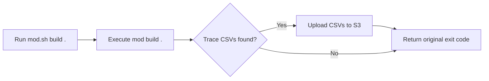

# Exporting CLI telemetry to Amazon S3

The Moderne CLI [generates telemetry data](./cli-telemetry.md) for every sync, build, and run operation. While you could manually read the resulting trace CSV files from your local directories, it is much better to upload them into a centralized, queryable storage system.

In this guide, we'll walk you through how to set up a wrapper script that automatically uploads all of your telemetry files to S3 after every CLI command.

:::tip
While the examples in this guide use Amazon S3 and AWS Athena, the CSV files and Hive partition layout are compatible with any BI system that reads from object storage (e.g., Snowflake, Databricks, and Google BigQuery).
:::

## Prerequisites

This guide assumes that you have:

* Read the [Measuring CLI usage guide](./cli-telemetry.md)
* The [AWS CLI](https://docs.aws.amazon.com/cli/latest/userguide/getting-started-install.html) installed and configured with credentials
* An S3 bucket for storing telemetry data
* An IAM policy granting `s3:PutObject` on the target bucket

If you plan to query the data with Athena, you will also need:

* AWS Athena access
* AWS Glue Catalog permissions to create databases and tables

## The wrapper script approach

The simplest way to automate telemetry uploads is to wrap the `mod` command. Rather than changing how the CLI itself works, you create a small shell script that calls `mod` as usual and then uploads any new trace CSV files to S3 before returning. Your workflow stays exactly the same — you just call `mod.sh` instead of `mod`:



The upload runs after every command and won't interfere with your workflow. If it fails for any reason, the original exit code is still returned.

## Setting up the wrapper script

To get started, you’ll need two files: the wrapper script itself (`mod.sh`) and a small configuration file (`modsh.env`) that tells it where to upload your telemetry.

### Creating the wrapper

Create a `mod.sh` file that looks like:

<details>
<summary>mod.sh</summary>

```bash title="mod.sh"
#!/usr/bin/env bash
set -euo pipefail

# Resolve the directory where this script lives
SCRIPT_DIR="$(cd "$(dirname "${BASH_SOURCE[0]}")" && pwd)"

# Load configuration
MODERNE_CLI_WRAPPER_CONFIG="${MODERNE_CLI_WRAPPER_CONFIG:-$SCRIPT_DIR/modsh.env}"
if [[ -f "$MODERNE_CLI_WRAPPER_CONFIG" ]]; then
    # shellcheck source=/dev/null
    source "$MODERNE_CLI_WRAPPER_CONFIG"
fi

# CLI paths
MODERNE_CLI_HOME="${MODERNE_CLI_HOME:-$HOME/.moderne/cli}"
MODERNE_CLI_TELEMETRY_DIR="${MODERNE_CLI_TELEMETRY_DIR:-$MODERNE_CLI_HOME/trace}"
MOD_JAR="${MOD_JAR:-$SCRIPT_DIR/mod.jar}"

# Map CLI commands to their trace directory names
get_trace_directory() {
    case "$1" in
        build)    echo "build" ;;
        publish)  echo "publish" ;;
        git)
            # The deprecated "mod git clone" still writes to the "sync" trace directory
            if [[ "${2:-}" == "clone" ]]; then
                echo "sync"
            else
                echo "${2:-git}"
            fi
            ;;
        *)        echo "$1" ;;
    esac
}

# Upload CSV files to S3 with Hive-style partitioning
publish_telemetry_s3() {
    local command_name="$1"

    # Skip if telemetry endpoint is not configured
    if [[ -z "${BI_ENDPOINT:-}" ]]; then
        return 0
    fi

    if [[ -z "${BI_ORG:-}" ]]; then
        echo "[telemetry] Warning: BI_ORG is not set. Skipping telemetry upload." >&2
        return 0
    fi

    if ! command -v aws &> /dev/null; then
        echo "[telemetry] Error: AWS CLI not found. Skipping telemetry upload." >&2
        return 0
    fi

    local search_dir="$MODERNE_CLI_TELEMETRY_DIR/$command_name"
    if [[ ! -d "$search_dir" ]]; then
        return 0
    fi

    # Build the S3 path with Hive-style partitioning
    local year month day
    year="$(date +%Y)"
    month="$(date +%m)"
    day="$(date +%d)"

    local s3_prefix="${BI_ENDPOINT}/org=${BI_ORG}/type=${command_name}/year=${year}/month=${month}/day=${day}"

    # Upload each CSV file
    while IFS= read -r -d '' csv_file; do
        local filename
        filename="$(basename "$csv_file")"
        echo "[telemetry] Uploading $filename to S3..." >&2
        if aws s3 cp "$csv_file" "$s3_prefix/$filename" --quiet 2>/dev/null; then
            echo "[telemetry] Uploaded: $filename" >&2
        else
            echo "[telemetry] Warning: Failed to upload $filename" >&2
        fi
    done < <(find "$search_dir" -name "*.csv" -type f -print0 2>/dev/null)
}

# Main execution
main() {
    local command_name="${1:-}"
    local subcommand="${2:-}"
    local trace_dir
    trace_dir="$(get_trace_directory "$command_name" "$subcommand")"

    # Execute the Moderne CLI
    local cli_exit_code=0
    if [[ -f "$MOD_JAR" ]]; then
        java -jar "$MOD_JAR" "$@" || cli_exit_code=$?
    elif command -v mod &> /dev/null; then
        mod "$@" || cli_exit_code=$?
    else
        echo "Error: Moderne CLI not found." >&2
        echo "Set MOD_JAR to the path of your mod.jar, or ensure mod is on your PATH." >&2
        exit 1
    fi

    # Publish telemetry after CLI execution
    publish_telemetry_s3 "$trace_dir" || true

    exit $cli_exit_code
}

main "$@"
```

</details>

Then make it executable:

```bash
chmod +x mod.sh
```

### Configuring environment variables

The wrapper script reads from a `modsh.env` file in the same directory. Create one with your S3 bucket and organization name:

```bash title="modsh.env"
# S3 destination for telemetry publishing
BI_ENDPOINT=s3://my-company-cli-telemetry

# Organization identifier used for Hive-style partitioning
BI_ORG=my-company
```

Those two variables are all you need to get started. That being said, there are other variables you can configure based on your needs:

| Variable                     | Default                    | Description                                             |
|------------------------------|----------------------------|---------------------------------------------------------|
| `BI_ENDPOINT`                | *(none)*                   | S3 bucket URI (e.g., `s3://my-telemetry-bucket`).       |
| `BI_ORG`                     | *(none)*                   | Organization name used as the first Hive partition key. |
| `MODERNE_CLI_WRAPPER_CONFIG` | `modsh.env` next to script | Path to the configuration file.                         |
| `MODERNE_CLI_HOME`           | `$HOME/.moderne/cli`       | CLI home directory.                                     |
| `MODERNE_CLI_TELEMETRY_DIR`  | `$MODERNE_CLI_HOME/trace`  | Directory where the CLI writes trace CSV files.         |

### Running commands through the wrapper

Use `mod.sh` in place of `mod` for all CLI commands:

```bash
./mod.sh build .
./mod.sh git sync .
./mod.sh run . --recipe org.openrewrite.java.OrderImports
```

:::tip
You can alias `mod` to your `mod.sh` wrapper in your shell profile to make the transition seamless:

```bash
alias mod='/path/to/mod.sh'
```
:::

## Understanding the S3 path structure

The wrapper uploads each CSV file to an S3 path that follows Hive-style partitioning:

```
s3://{bucket}/org={org}/type={type}/year={YYYY}/month={MM}/day={DD}/{filename}.csv
```

Here’s what each key means:

| Partition key          | Source                        | Example                    | Purpose                                       |
|------------------------|-------------------------------|----------------------------|-----------------------------------------------|
| `org`                  | `BI_ORG` environment variable | `my-company`               | Isolates data by organization.                |
| `type`                 | CLI command name              | `build`, `sync`, `publish` | Separates command types for targeted queries. |
| `year`, `month`, `day` | Date at upload time           | `2026`, `02`, `24`               | Date-based filtering.                         |

For example, a build trace uploaded on February 24, 2026 for the `my-company` organization would land at:

```
s3://my-company-cli-telemetry/org=my-company/type=build/year=2026/month=02/day=24/trace.csv
```

:::tip
You can add additional partition keys (like `hour`) to the wrapper script and table definition if you need finer-grained time slicing.
:::

## Verifying the setup

After creating the wrapper, run a CLI command and confirm the CSV files appear in S3:

```bash
# Run a build through the wrapper
./mod.sh build .

# Check that telemetry was uploaded
aws s3 ls s3://my-company-cli-telemetry/ --recursive
```

You should see output similar to:

```
2026-02-24 10:15:32       4521 org=my-company/type=build/year=2026/month=02/day=24/trace.csv
```

## Querying telemetry with AWS Athena

:::info
This section is optional. If you use a different BI tool, you can point it directly at your S3 bucket.
:::

Once your telemetry data is flowing to S3, you can use AWS Athena to run SQL queries against it without loading the data into a database. Athena reads the CSV files directly from S3.

### Creating the Glue database and table

First, create a Glue database to hold the table definition:

```sql
CREATE DATABASE IF NOT EXISTS moderne_bi
LOCATION 's3://my-company-cli-telemetry/';
```

Next, create an external table that tells Athena how to read your CSV files. All columns are defined as strings, but many of them contain numeric data like elapsed time or file counts. You can cast these to the appropriate types in your queries to enable sorting, filtering, and aggregation.

The table properties include [partition projection](https://docs.aws.amazon.com/athena/latest/ug/partition-projection.html), so Athena automatically discovers new partitions as data arrives. You don't need to run `MSCK REPAIR TABLE` or manually add partitions each day.

:::info
The `org` and `type` partitions are _injected_, which means you must include them in the `WHERE` clause of every query. The `year`, `month`, and `day` partitions are range-based and optional but recommended to limit the amount of data scanned.
:::

<details>

<summary>Full CREATE TABLE statement (37 columns + 5 partition keys)</summary>

```sql
CREATE EXTERNAL TABLE IF NOT EXISTS moderne_bi.traces (
    origin                          string,
    path                            string,
    branch                          string,
    developer                       string,
    syncoutcome                     string,
    synccloneuri                    string,
    synclstdownloaduri              string,
    syncstarttime                   string,
    syncendtime                     string,
    syncchangeset                   string,
    syncelapsedtimems               string,
    buildoutcome                    string,
    buildstarttime                  string,
    buildendtime                    string,
    buildid                         string,
    builddependencyresolutiontimems string,
    buildchangeset                  string,
    buildmavenversion               string,
    buildgradleversion              string,
    buildbazelversion               string,
    builddotnetversion              string,
    buildpythonversion              string,
    buildnodeversion                string,
    buildosname                     string,
    buildosversion                  string,
    buildoseol                      string,
    buildgitautocrlf                string,
    buildgiteol                     string,
    buildsourcefilecount            string,
    buildlinecount                  string,
    buildparseerrorcount            string,
    buildweight                     string,
    buildmaxweight                  string,
    buildmaxweightsourcefile        string,
    buildcliversion                 string,
    buildelapsedtimems              string,
    organization                    string
)
PARTITIONED BY (
    org     string,
    type    string,
    year    string,
    month   string,
    day     string
)
ROW FORMAT SERDE 'org.apache.hadoop.hive.serde2.OpenCSVSerde'
WITH SERDEPROPERTIES (
    'separatorChar' = ',',
    'quoteChar'     = '"',
    'escapeChar'    = '\\'
)
STORED AS TEXTFILE
LOCATION 's3://my-company-cli-telemetry/'
TBLPROPERTIES (
    'skip.header.line.count'        = '1',
    'projection.enabled'            = 'true',
    'projection.org.type'           = 'injected',
    'projection.type.type'          = 'injected',
    'projection.year.type'          = 'integer',
    'projection.year.range'         = '2026,2099',
    'projection.month.type'         = 'integer',
    'projection.month.range'        = '1,12',
    'projection.month.digits'       = '2',
    'projection.day.type'           = 'integer',
    'projection.day.range'          = '1,31',
    'projection.day.digits'         = '2',
    'storage.location.template'     = 's3://my-company-cli-telemetry/org=${org}/type=${type}/year=${year}/month=${month}/day=${day}/'
);
```

</details>

### Setting up an Athena workgroup

Athena requires a location to store query results. Creating a dedicated workgroup keeps telemetry query results organized and lets you set a scan limit to control costs.

You can create one through the [Athena console](https://console.aws.amazon.com/athena/home#/workgroups) or with the AWS CLI:

```bash
aws athena create-work-group \
    --name cli-telemetry \
    --configuration '{
        "ResultConfiguration": {
            "OutputLocation": "s3://my-company-cli-telemetry/athena-results/"
        },
        "EnforceWorkGroupConfiguration": true,
        "BytesScannedCutoffPerQuery": 107374182400
    }'
```

:::note
The example above stores Athena results in the same bucket under `athena-results/`. This prefix is outside the partition structure, so it won't interfere with your telemetry data. The scan limit is set to 100 GB per query — adjust this based on your data volume.
:::

### Example queries

The following queries demonstrate common ways to analyze your CLI telemetry. Each query must include `org` and `type` in the `WHERE` clause because those partitions use injected projection.

**Listing all build traces for a specific day:**

```sql
SELECT origin, path, branch,
       syncoutcome, CAST(syncelapsedtimems AS bigint) AS sync_ms,
       buildoutcome, CAST(buildelapsedtimems AS bigint) AS build_ms
FROM moderne_bi.traces
WHERE org = 'my-company'
  AND type = 'build'
  AND year = '2026'
  AND month = '02'
  AND day = '24'
ORDER BY build_ms DESC;
```

**Build success rates for the past month:**

This is useful for spotting trends in build reliability over time.

```sql
SELECT buildoutcome, COUNT(*) AS total
FROM moderne_bi.traces
WHERE org = 'my-company'
  AND type = 'build'
  AND year = '2026'
  AND month = '02'
GROUP BY buildoutcome
ORDER BY total DESC;
```

**Slowest builds (top 25):**

Helps identify repositories that take the longest to build, which may need attention.

```sql
SELECT path, origin,
       CAST(buildelapsedtimems AS bigint) AS build_ms,
       CAST(buildsourcefilecount AS bigint) AS source_files,
       CAST(buildlinecount AS bigint) AS lines
FROM moderne_bi.traces
WHERE org = 'my-company'
  AND type = 'build'
  AND year = '2026'
  AND month = '02'
  AND day = '24'
  AND buildoutcome = 'Succeeded'
ORDER BY build_ms DESC
LIMIT 25;
```

**Repository count by organization:**

Useful if your `BI_ORG` partition covers multiple internal organizations.

```sql
SELECT organization, COUNT(DISTINCT path) AS repo_count
FROM moderne_bi.traces
WHERE org = 'my-company'
  AND type = 'build'
  AND year = '2026'
  AND month = '02'
  AND day = '24'
GROUP BY organization
ORDER BY repo_count DESC;
```

## Troubleshooting

**CSV files are not appearing in S3:**

* Verify that `BI_ENDPOINT` and `BI_ORG` are set in your `modsh.env` file
* Confirm the AWS CLI is installed and configured with valid credentials
* Check that your IAM policy grants `s3:PutObject` on the target bucket
* Ensure the CLI is generating trace files — look for CSV files in `$MODERNE_CLI_TELEMETRY_DIR`

**Athena queries return zero rows:**

* Confirm that your `storage.location.template` in `TBLPROPERTIES` matches the actual S3 path structure
* Verify that your `WHERE` clause includes both `org` and `type` (required by injected partition projection)
* Check that the `year`, `month`, and `day` values match partitions that contain data

**Telemetry upload failures do not cause errors:**

This is by design. The wrapper script treats telemetry publishing as non-blocking — if the upload fails, the original CLI exit code is still returned. Check the wrapper's stderr output for `[telemetry]` messages to diagnose upload issues.
