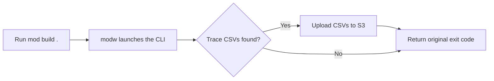

import Tabs from '@theme/Tabs';
import TabItem from '@theme/TabItem';

# Exporting CLI telemetry to Amazon S3

The Moderne CLI [generates telemetry data](./cli-telemetry.md) for build, run, and git operations. While you could read the resulting trace CSV files locally, uploading them to a centralized, queryable storage system is far more practical.

This guide covers the recommended way to do that: customizing the Moderne CLI wrapper (`modw`, or `modw.cmd` on Windows) so it uploads trace CSV files to S3 after each command that produces telemetry. The example here writes the same partition layout that Moderne's platform replication produces, so once your data is in S3 you query it exactly like replicated tenant data. See [Querying and BI](../../../administrator-documentation/moderne-platform/how-to-guides/configuring-telemetry-exports/querying-and-bi.md).

:::info
**Who needs this guide**

If your CLI is signed in to a Moderne SaaS v2 tenant, the CLI already pushes its telemetry to your tenant, automatically when it refreshes its license lease, or on demand with `mod telemetry publish`. From there, you can configure Moderne to replicate a continuous copy of your tenant's telemetry into a bucket or storage account you own. See [Configuring telemetry exports and reports](../../../administrator-documentation/moderne-platform/how-to-guides/configuring-telemetry-exports/overview.md), with setup guides for [AWS](../../../administrator-documentation/moderne-platform/how-to-guides/configuring-telemetry-exports/aws-replication.md) and [Azure](../../../administrator-documentation/moderne-platform/how-to-guides/configuring-telemetry-exports/azure-replication.md). If that covers your needs, you don't need the approach below.

This guide is for:

* **Moderne DX customers** and CLI-only deployments not connected to a Moderne tenant, which don't have the platform-native replication path.
* Anyone who wants to publish CLI telemetry directly from the CLI to a destination they control (their own object storage, a BI endpoint, or anywhere else) in addition to (or instead of) the platform replication. This guide uses AWS S3 as the worked example; the same wrapper customization can target any destination.

In either case, this is a one-time setup for a platform or admin team, done on behalf of the people who consume the telemetry. The CLI users generating the telemetry don't publish anything themselves; they keep running `mod` as usual.
:::

:::tip
While this guide uses Amazon S3 as the worked example, the CSV files and Hive partition layout are compatible with any object store and any BI system that reads from it (e.g., Snowflake, Databricks, and Google BigQuery). The [Querying and BI](../../../administrator-documentation/moderne-platform/how-to-guides/configuring-telemetry-exports/querying-and-bi.md) guide covers those engines.
:::

## Prerequisites

This guide assumes that you have:

* Read the [Measuring CLI usage guide](./cli-telemetry.md)
* Read the [CLI wrapper and version management guide](./cli-wrapper.md)
* The [AWS CLI](https://docs.aws.amazon.com/cli/latest/userguide/getting-started-install.html) installed and configured with credentials
* An S3 bucket for storing telemetry data
* An IAM policy granting `s3:PutObject` on the target bucket

Querying the data (with AWS Athena or another engine) is covered separately in [Querying and BI](../../../administrator-documentation/moderne-platform/how-to-guides/configuring-telemetry-exports/querying-and-bi.md), which lists the prerequisites for each engine.

## Customizing the CLI wrapper

The supported entry point for the CLI is the [`modw` wrapper script](./cli-wrapper.md) (`modw.cmd` on Windows). The `mod` command is a symlink to it. The recommended approach is for your central platform team to customize the wrapper itself and distribute it to your CLI users, the same way large organizations manage a customized Maven or Gradle wrapper.

The wrapper ends by launching the CLI. You add a small step that runs after the CLI returns and publishes any new trace CSV files. This guide uploads them to S3, but the same hook can POST them to a BI endpoint, copy them to a network share, or do whatever your BI setup needs. CLI users keep using `mod` exactly as before; there's no separate command or alias to learn:


```mermaid
flowchart LR
    A["Run mod build ."] --> B["modw launches the CLI"]
    B --> C{"Trace CSVs found?"}
    C -->|Yes| D["Upload CSVs to S3"] --> E["Return original exit code"]
    C -->|No| E
```

The upload won't interfere with your workflow. If it fails for any reason, the original exit code is still returned. For commands that don't produce trace data, the wrapper simply runs the CLI and returns.

<details>
<summary>Commands that produce trace data</summary>

* `mod build`
* `mod run`
* `mod exec`
* `mod git sync`
* `mod git apply`
* `mod git add`
* `mod git commit`
* `mod git push`
* `mod git checkout`

</details>

:::note
The wrapper (`modw` and `modw.cmd`) ships as part of the CLI distribution, so an upgrade that changes the wrapper scripts replaces your customized copy. Keep your customized wrapper in source control and re-apply it after upgrading. The scripts change rarely, so this is infrequent, and [pinning the CLI version](./cli-wrapper.md#controlling-auto-updates) puts you in control of when it can happen at all.
:::

### Adding telemetry publishing to the wrapper

The wrapper ships in two forms: `modw` (a POSIX `sh` script for macOS and Linux) and `modw.cmd` (a batch script for Windows). Customize whichever your users run.

Below is the customization Moderne uses, in both forms. The shape is the same in each: a telemetry helper near the top, and a replacement for the final CLI-launch line so the wrapper captures the exit code, publishes telemetry, and exits with that code. Read it as a starting point rather than a prescription. The helper is where your own upload, POST, or copy goes, and the S3 calls in it are the part you are most likely to replace.

<Tabs groupId="cli-install-os" queryString="os">
<TabItem value="linux-macos" label="Linux / macOS" default>

This example makes two changes to the `modw` script.

First, it adds configuration and helper functions near the top, right after the block that sets `MODERNE_CLI_HOME`, `BIN_DIR`, and `DIST_DIR`:

```sh
# --- Telemetry publishing to S3 (central customization) ---
# Where the CLI writes aggregate trace CSV files.
MODERNE_CLI_TELEMETRY_DIR="${MODERNE_CLI_TELEMETRY_DIR:-$MODERNE_CLI_HOME/trace}"

# Optional config file for the S3 destination (BI_ENDPOINT, BI_ORG).
MODERNE_TELEMETRY_CONFIG="${MODERNE_TELEMETRY_CONFIG:-$MODERNE_CLI_HOME/telemetry.env}"
if [ -f "$MODERNE_TELEMETRY_CONFIG" ]; then
    # shellcheck source=/dev/null
    . "$MODERNE_TELEMETRY_CONFIG"
fi

# Map a CLI command to the trace subdirectory it writes to.
get_trace_directory() {
    case "$1" in
        build) echo "build" ;;
        git)
            # The deprecated "mod git clone" still writes to the "sync" directory.
            if [ "${2:-}" = "clone" ]; then
                echo "sync"
            else
                echo "${2:-git}"
            fi
            ;;
        *) echo "$1" ;;
    esac
}

# Upload new trace CSV files to S3 with Hive-style partitioning.
publish_telemetry_s3() {
    # Skip unless an S3 destination is configured.
    [ -n "${BI_ENDPOINT:-}" ] || return 0
    if [ -z "${BI_ORG:-}" ]; then
        echo "[telemetry] BI_ORG is not set; skipping telemetry upload." >&2
        return 0
    fi
    if ! command -v aws >/dev/null 2>&1; then
        echo "[telemetry] AWS CLI not found; skipping telemetry upload." >&2
        return 0
    fi

    trace_dir="$(get_trace_directory "${1:-}" "${2:-}")"
    search_dir="$MODERNE_CLI_TELEMETRY_DIR/$trace_dir"
    [ -d "$search_dir" ] || return 0

    # Build the S3 path with Hive-style partitioning.
    year="$(date +%Y)"
    month="$(date +%m)"
    day="$(date +%d)"
    s3_prefix="$BI_ENDPOINT/tenant=$BI_ORG/source=cli/type=$trace_dir/year=$year/month=$month/day=$day"

    # Upload each CSV file.
    find "$search_dir" -name '*.csv' -type f 2>/dev/null | while IFS= read -r csv_file; do
        filename="$(basename "$csv_file")"
        echo "[telemetry] Uploading $filename to S3..." >&2
        if aws s3 cp "$csv_file" "$s3_prefix/$filename" --quiet 2>/dev/null; then
            echo "[telemetry] Uploaded: $filename" >&2
        else
            echo "[telemetry] Warning: failed to upload $filename" >&2
        fi
    done
}
```

Second, it replaces the final line of the script, which launches the CLI with `exec`:

```sh
exec "$JAVA_CMD" $JVM_ARGS $SSL_ARGS $MCP_HEAP_ARG $MODERNE_OPTS -Dmod.command.name="$SCRIPT_NAME" -Dmod.script.path="$SCRIPT_PATH" -Dmod.jar="$MOD_JAR" $MOD_SOURCE_ARG -cp "$MOD_JAR:$CLASSPATH" io.moderne.cli.commands.Mod "$@"
```

The replacement captures the CLI's exit code, publishes telemetry, and then exits with that code:

```sh
CLI_EXIT_CODE=0
"$JAVA_CMD" $JVM_ARGS $SSL_ARGS $MCP_HEAP_ARG $MODERNE_OPTS -Dmod.command.name="$SCRIPT_NAME" -Dmod.script.path="$SCRIPT_PATH" -Dmod.jar="$MOD_JAR" $MOD_SOURCE_ARG -cp "$MOD_JAR:$CLASSPATH" io.moderne.cli.commands.Mod "$@" || CLI_EXIT_CODE=$?

# Publish telemetry after the CLI runs, then exit with the CLI's original code.
publish_telemetry_s3 "$@" || true
exit "$CLI_EXIT_CODE"
```

Removing `exec` is the key change: `exec` replaces the wrapper process with the JVM, which would leave no opportunity to publish telemetry afterward. Running the JVM normally lets the wrapper regain control, upload the trace files, and exit with the CLI's original status.

:::note
`modw` is a POSIX `sh` script, so the additions above use POSIX syntax rather than Bash-specific features (such as `[[ ... ]]` or arrays).
:::

</TabItem>
<TabItem value="windows" label="Windows">

This example makes three changes to the `modw.cmd` script.

First, it loads the telemetry configuration near the top, right after the line that sets `DIST_DIR`:

```bat
rem --- Telemetry publishing to S3 (central customization) ---
if not defined MODERNE_CLI_TELEMETRY_DIR set "MODERNE_CLI_TELEMETRY_DIR=%MODERNE_CLI_HOME%\trace"
if not defined MODERNE_TELEMETRY_CONFIG set "MODERNE_TELEMETRY_CONFIG=%MODERNE_CLI_HOME%\telemetry.env"
if exist "%MODERNE_TELEMETRY_CONFIG%" (
    for /f "usebackq eol=# tokens=1,* delims==" %%k in ("%MODERNE_TELEMETRY_CONFIG%") do set "%%k=%%l"
)
```

Second, it replaces the two lines that launch the CLI and exit. They sit at the end of the main flow, just above the `rem === Subroutines ===` section rather than at the very bottom of the file:

```bat
"%JAVA_CMD%" %JVM_ARGS% %SSL_ARGS% !MCP_HEAP_ARG! %MODERNE_OPTS% -Dmod.command.name=%SCRIPT_NAME% -Dmod.jar="%MOD_JAR%" %MOD_SOURCE_ARG% -cp "%MOD_JAR%;%CLASSPATH%" io.moderne.cli.commands.Mod %_MOD_ARGS_%
exit /b %errorlevel%
```

The replacement captures the exit code, publishes telemetry, and then exits with that code:

```bat
"%JAVA_CMD%" %JVM_ARGS% %SSL_ARGS% !MCP_HEAP_ARG! %MODERNE_OPTS% -Dmod.command.name=%SCRIPT_NAME% -Dmod.jar="%MOD_JAR%" %MOD_SOURCE_ARG% -cp "%MOD_JAR%;%CLASSPATH%" io.moderne.cli.commands.Mod %_MOD_ARGS_%
set "CLI_EXIT_CODE=%errorlevel%"

rem Publish telemetry after the CLI runs, then exit with the CLI's original code.
call :publish_telemetry_s3
exit /b %CLI_EXIT_CODE%
```

Third, it adds a `:publish_telemetry_s3` subroutine to the `rem === Subroutines ===` section at the bottom of the script:

```bat
:publish_telemetry_s3
rem Skip unless an S3 destination is configured.
if not defined BI_ENDPOINT exit /b 0
if not defined BI_ORG (
    echo [telemetry] BI_ORG is not set; skipping telemetry upload.>&2
    exit /b 0
)
where aws >nul 2>&1
if errorlevel 1 (
    echo [telemetry] AWS CLI not found; skipping telemetry upload.>&2
    exit /b 0
)

rem Map the CLI command to the trace subdirectory it writes to.
set "CMD=" & set "SUB="
for /f "tokens=1,2" %%a in ("%_MOD_ARGS_%") do (
    set "CMD=%%a"
    set "SUB=%%b"
)
if not defined CMD exit /b 0
set "TRACE_DIR=!CMD!"
if /i "!CMD!"=="git" (
    rem The deprecated "mod git clone" still writes to the "sync" directory.
    if /i "!SUB!"=="clone" (set "TRACE_DIR=sync") else (set "TRACE_DIR=!SUB!")
)

set "SEARCH_DIR=%MODERNE_CLI_TELEMETRY_DIR%\!TRACE_DIR!"
if not exist "!SEARCH_DIR!" exit /b 0

rem Build the S3 path with Hive-style partitioning (PowerShell avoids %DATE% locale issues).
for /f "usebackq tokens=1-3" %%a in (`powershell -NoProfile -Command "(Get-Date).ToString('yyyy MM dd')"`) do (
    set "YEAR=%%a"
    set "MONTH=%%b"
    set "DAY=%%c"
)
set "S3_PREFIX=%BI_ENDPOINT%/tenant=%BI_ORG%/source=cli/type=!TRACE_DIR!/year=!YEAR!/month=!MONTH!/day=!DAY!"

for /r "!SEARCH_DIR!" %%f in (*.csv) do (
    echo [telemetry] Uploading %%~nxf to S3...>&2
    aws s3 cp "%%f" "!S3_PREFIX!/%%~nxf" --quiet >nul 2>&1
    if errorlevel 1 (echo [telemetry] Warning: failed to upload %%~nxf>&2) else (echo [telemetry] Uploaded: %%~nxf>&2)
)
exit /b 0
```

:::note
`modw.cmd` already runs under `setlocal enabledelayedexpansion`, so the `!VAR!` delayed-expansion syntax above works as-is. The subroutine must go among the other `:label` routines at the end of the file: a `call`ed routine placed after the script's final `exit /b` is reached only via `call`, never by falling through.
:::

</TabItem>
</Tabs>

### Configuring the S3 destination

The helper reads its S3 destination from a `telemetry.env` file in your CLI home directory (`~/.moderne/cli/telemetry.env` by default). Create one with your bucket and organization name:

```bash title="telemetry.env"
# S3 destination for telemetry publishing
BI_ENDPOINT=s3://my-company-cli-telemetry

# Organization identifier; fills the tenant partition key, mirroring replicated data
BI_ORG=my-company
```

Those two variables are all you need to get started. That being said, there are other variables you can set (in the config file or the environment) based on your needs:

| Variable                    | Default                        | Description                                             |
|-----------------------------|--------------------------------|---------------------------------------------------------|
| `BI_ENDPOINT`               | *(none)*                       | S3 bucket URI (e.g., `s3://my-telemetry-bucket`).       |
| `BI_ORG`                    | *(none)*                       | Organization identifier written as the `tenant` partition key.  |
| `MODERNE_TELEMETRY_CONFIG`  | `telemetry.env` in CLI home    | Path to the configuration file.                         |
| `MODERNE_CLI_HOME`          | `$HOME/.moderne/cli`           | CLI home directory.                                     |
| `MODERNE_CLI_TELEMETRY_DIR` | `$MODERNE_CLI_HOME/trace`      | Directory where the CLI writes trace CSV files.         |

### Running commands

Because the customization lives inside `modw`, CLI users keep using `mod` exactly as before; no separate command or alias is required:

```bash
mod build .
mod git sync .
mod run . --recipe org.openrewrite.java.OrderImports
```

## Understanding the S3 path structure

The helper above uploads each CSV file to an S3 path that follows Hive-style partitioning. This is the same layout that Moderne's platform replication produces, which is why the [Querying and BI](../../../administrator-documentation/moderne-platform/how-to-guides/configuring-telemetry-exports/querying-and-bi.md) tables and queries apply unchanged:

```
s3://{bucket}/tenant={tenant}/source=cli/type={type}/year={YYYY}/month={MM}/day={DD}/{filename}.csv
```

Here’s what each key means:

| Partition key          | Source                        | Example                    | Purpose                                       |
|------------------------|-------------------------------|----------------------------|-----------------------------------------------|
| `tenant`               | `BI_ORG` environment variable | `my-company`               | Isolates data by organization.                |
| `source`               | Fixed value `cli`             | `cli`                      | Marks the data as CLI-generated, matching the `source` dimension in replicated data (which also carries `saas`). |
| `type`                 | CLI command name              | `build`, `sync`, `publish` | Separates command types for targeted queries. |
| `year`, `month`, `day` | Date at upload time           | `2026`, `02`, `24`         | Date-based filtering.                         |

For example, a build trace uploaded on February 24, 2026 for the `my-company` organization would land at:

```
s3://my-company-cli-telemetry/tenant=my-company/source=cli/type=build/year=2026/month=02/day=24/trace.csv
```

:::tip
This layout is a choice, not a requirement. You own the wrapper, so you can add partition keys (like `hour`) for finer-grained time slicing, or restructure the path entirely. Just remember that the table definitions in [Querying and BI](../../../administrator-documentation/moderne-platform/how-to-guides/configuring-telemetry-exports/querying-and-bi.md) assume the layout shown above, so adjust their partition keys and `storage.location.template` to match whatever you upload.
:::

## Verifying the setup

After customizing the wrapper, run a CLI command and confirm the CSV files appear in S3:

```bash
# Run a build through the customized wrapper
mod build .

# Check that telemetry was uploaded
aws s3 ls s3://my-company-cli-telemetry/ --recursive
```

You should see output similar to:

```
2026-02-24 10:15:32       4521 tenant=my-company/source=cli/type=build/year=2026/month=02/day=24/trace.csv
```

## Querying the data

As long as you kept the path structure from the example above, your uploads use the same `tenant`/`source`/`type`/`year`/`month`/`day` layout that Moderne's platform replication produces, so your self-published data queries exactly like replicated tenant data. Follow [Querying and BI](../../../administrator-documentation/moderne-platform/how-to-guides/configuring-telemetry-exports/querying-and-bi.md) for the full AWS Athena walkthrough (registering the schema, setting up a workgroup, and example queries), notes for other engines such as Snowflake, BigQuery, Databricks, and Fabric, and the [moderne-bi-templates](https://github.com/moderneinc/moderne-bi-templates) starter pack of table definitions and dashboards.

Your data carries only `source=cli` rows (replicated tenants also carry `source=saas` from the web UI), so any query that filters on `source` still works. Keep `source='cli'` for CLI-only reporting, or drop the filter to include everything present.

## Troubleshooting

**CSV files are not appearing in S3:**

* Verify that `BI_ENDPOINT` and `BI_ORG` are set in your `telemetry.env` file
* Confirm the AWS CLI is installed and configured with valid credentials
* Check that your IAM policy grants `s3:PutObject` on the target bucket
* Ensure the CLI is generating trace files: look for CSV files in `$MODERNE_CLI_TELEMETRY_DIR`

**Telemetry upload failures do not cause errors:**

This is by design. The customized wrapper treats telemetry publishing as non-blocking. If the upload fails, the original CLI exit code is still returned. Check the wrapper's stderr output for `[telemetry]` messages to diagnose upload issues.

**Telemetry stopped publishing after a CLI upgrade:**

An upgrade changed the wrapper scripts and replaced your customized copy. Re-apply your changes, or re-distribute your customized wrapper, and consider [pinning the CLI version](./cli-wrapper.md#controlling-auto-updates) so upgrades land when you choose.
