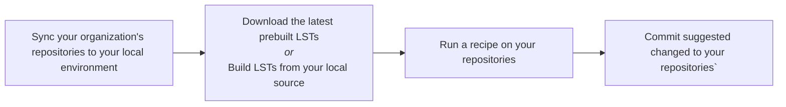

# Understanding CLI usage across your organization

The Moderne CLI allows you to perform platform multi-repository activities in your local environment - activities like loading prebuilt LSTs, building new LSTs, running recipes across organizations, visualizing results, and pushing suggested changes back into your SCM. When you and other developers work with your codebase using the CLI, it can become harder to know who's using the tool, what activity has been most useful, and identify issues that are making it hard for developers to get value from recipes.

To help you gather this information, the Moderne CLI automatically generates telemetry data as you run through various workflows. This telemetry is captured in JSON and CSV files that record detailed information about builds, recipe executions, and git operations. These files can help you better understand activities driven by the Moderne CLI locally, and you can collect and analyze them in a central location to monitor the decentralized usage of the CLI across your organization.

## Overview

The general workflow for using the Moderne CLI looks like the following:



At each of these steps, the CLI captures telemetry and useful metadata about the result of the command being run. 

Telemetry files are automatically created in the `.moderne` directory whenever you run commands like `mod build`, `mod run`, or `mod git apply/commit/push`.

## Repository-level telemetry with the `trace.json` file

When you run a Moderne CLI command across a directory containing one or more repositories, it will capture telemetry specific to each repository in that repository directory's `.moderne/<command>/trace.json` file. For the `sync` command, this JSON file looks like the following:

```json
{
  "clone": {
    "success": true,
    "cloneUri": "https://github.com/company/repository",
    "startTime": "2025-09-29T14:17:31.477727-04:00",
    "endTime": "2025-09-29T14:17:35.101962-04:00",
    "log": "file:///.../.moderne/sync/sync.log",
    "changeset": "452d7ca8902e7338e999290eebad9062c342915f",
    "elapsedTimeMs": 3624
  },
  "org": "ALL/Company/Team",
  "repository": {
    "origin": "github.com",
    "path": "company/repository",
    "branch": "main",
    "partition": null
  }
}
```

For subsequent commands in the overall workflow, the JSON fields from prior stages in the workflow are included as well. This allows you to trace failures back to their source throughout the process.

<details>

<summary>Example of a `trace.json` for a recipe run</summary>

```json
{
  "run": {
    "outcome": "Succeeded",
    "startTime": "2025-10-02T14:37:20.68234-04:00",
    "endTime": "2025-10-02T14:37:34.715203-04:00",
    "log": "file:///Users/matt/workspaces/app.moderne.io/Default/awslabs/aws-saas-boost/.moderne/run/20251002143646-F5Tor/run.log",
    "id": "20251002143646-F5Tor",
    "unlicensedAttempt": false,
    "streaming": false,
    "recipeId": "org.openrewrite.maven.DependencyVersionsToPropertiesDefault",
    "recipeInstanceName": "Extract dependency versions to properties with default naming",
    "recipeOptions": {},
    "recipeArtifact": "org.openrewrite.maven:maven-properties-recipes:0.1.0-SNAPSHOT",
    "estimatedEffortTimeSavingsMs": 13200000,
    "dependencyResolutionTimeMs": 0,
    "filesWithFixResults": 44,
    "filesWithSearchResults": 44,
    "filesWithErrors": 0,
    "filesSearched": 799,
    "dataTables": 2,
    "elapsedTimeMs": 14033
  },
  "build": {
    "outcome": "Succeeded",
    "startTime": "2025-10-02T14:47:51.472025Z",
    "endTime": "2025-10-02T14:48:43.610105Z",
    "log": "file:///.../.moderne/build/20251002104715-wvwCu/build.log",
    "id": "20251002104715-wvwCu",
    "changeset": "452d7ca8902e7338e999290eebad9062c342915f",
    "dependencyResolutionTimeMs": 516560,
    "mavenVersion": "3.9.10",
    "gradleVersion": null,
    "bazelVersion": null,
    "dotnetVersion": null,
    "pythonVersion": null,
    "nodeVersion": null,
    "sourceFileCount": 799,
    "lineCount": 147205,
    "parseErrorCount": 25,
    "weight": 640108,
    "maxWeight": 65828,
    "maxWeightSourceFile": "client/web/yarn.lock",
    "elapsedTimeMs": 52138
  },
  "clone": {
    "outcome": null,
    "cloneUri": "https://github.com/company/repository",
    "startTime": "2025-09-29T14:17:31.477727-04:00",
    "endTime": "2025-09-29T14:17:35.101962-04:00",
    "log": "file:///.../.moderne/sync/sync.log",
    "changeset": "452d7ca8902e7338e999290eebad9062c342915f",
    "elapsedTimeMs": 3624
  },
  "org": "ALL/Company/Team",
  "repository": {
    "origin": "github.com",
    "path": "company/repository",
    "branch": "main",
    "partition": null
  }
}
```
Notice that the `trace.json` for a run command includes the telemetry for the clone and build that this recipe was run against.

</details>

### `trace.json` schema

The following tables show the fields included in the `trace.json` for each phase.

#### Repository and organization metadata

Every `trace.json` file includes metadata about the repository and organization used to uniquely attribute actions to a specific repository whether locally or within the Moderne platform.

| Field | Type | Description |
|-------|------|-------------|
| `org` | string | Organizational hierarchy (e.g., "ALL/Default") |
| `repository.origin` | string | Source control platform (e.g., "github.com") |
| `repository.path` | string | Repository path (e.g., "apache/maven-doxia") |
| `repository.branch` | string | Branch name (e.g., "master", "main") |
| `repository.partition` | string/null | Repository partition if applicable, null otherwise |

#### Common metadata

All phases contain the following metadata for that specific command's run:

| Field | Type | Description |
|-------|------|-------------|
| `outcome` | string | Build outcome (e.g., "Succeeded", "Failed") |
| `startTime` | string | ISO 8601 timestamp when the build started |
| `endTime` | string | ISO 8601 timestamp when the build completed |
| `log` | string | File URI to the log file for the output of this specific command run |
| `elapsedTimeMs` | number | Duration of the build operation in milliseconds |

Additionally, all phases _except clone_ can be run multiple times on the same repository, and these will include a unique identifier so that you can trace later phases back to telemetry for an earlier phase:

| Field | Type | Description |
|-------|------|-------------|
| `id` | string | Unique identifier for this build |

#### Clone phase fields

When a repository has been cloned with `mod git sync`, it will include the following fields inside a `clone` block:

| Field | Type | Description |
|-------|------|-------------|
| `success` | boolean | Whether the clone operation succeeded |
| `cloneUri` | string | The URI used to clone the repository |
| `changeset` | string | The git commit SHA that was checked out |

#### Build phase fields

When an LST has been built for a repository with `mod build`, it will include the following fields inside a `build` block:

| Field | Type | Description |
|-------|------|-------------|
| `changeset` | string | The git commit SHA that was built |
| `dependencyResolutionTimeMs` | number | Time spent resolving dependencies in milliseconds |
| `mavenVersion` | string/null | Maven version if Maven project, null otherwise |
| `gradleVersion` | string/null | Gradle version if Gradle project, null otherwise |
| `bazelVersion` | string/null | Bazel version if Bazel project, null otherwise |
| `dotnetVersion` | string/null | .NET version if .NET project, null otherwise |
| `pythonVersion` | string/null | Python version if Python project, null otherwise |
| `nodeVersion` | string/null | Node version if Node project, null otherwise |
| `sourceFileCount` | number | Total number of source files parsed |
| `lineCount` | number | Total lines of code across all source files |
| `parseErrorCount` | number | Number of files that failed to parse |
| `weight` | number | Combined weight of all source files |
| `maxWeight` | number | Weight of the largest source file |
| `maxWeightSourceFile` | string | Path to the largest source file |

#### Run phase fields

When a recipe has been run against a repository with `mod run`, it will include the following fields inside a `run` block:

| Field | Type | Description |
|-------|------|-------------|
| `unlicensedAttempt` | boolean | Whether this was run without a license |
| `streaming` | boolean | Whether streaming mode was used |
| `recipeId` | string | Fully qualified ID of the recipe that was run |
| `recipeInstanceName` | string | Human-readable name of the recipe |
| `recipeOptions` | object | Map of recipe options/parameters used |
| `recipeArtifact` | string | Maven coordinates of the recipe artifact |
| `estimatedEffortTimeSavingsMs` | number | Estimated developer time saved in milliseconds |
| `dependencyResolutionTimeMs` | number | Time spent resolving dependencies in milliseconds |
| `filesWithFixResults` | number | Number of files with changes applied |
| `filesWithSearchResults` | number | Number of files matching search criteria |
| `filesWithErrors` | number | Number of files that encountered errors |
| `filesSearched` | number | Total number of files searched |
| `dataTables` | number | Number of data tables generated |

#### Apply phase fields

When you apply the suggested changes from a recipe to your local repository with `mod git apply`, it will include the common metadata fields inside a `apply` block. There are currently no additional telemetry fields for this command.

#### Commit phase fields

When you use the Moderne CLI to commit suggested changes to your local repository with `mod git commit`, it will include the following fields inside a `commit` block:

| Field | Type | Description |
|-------|------|-------------|
| `branch` | string | The branch into which these changes were committed |

#### Push phase fields

When you push changes from your local repository to a remote with `mod git push`, it will include the following fields inside a `push` block:

| Field | Type | Description |
|-------|------|-------------|
| `remoteBranch` | string | The remote branch into which changes are pushed |
| `setUpstream` | boolean | True if you set a specific upstream during this push, false otherwise |

## Organization-level telemetry in the `trace.csv` file

The Moderne CLI is built to operate against many repositories at the same time. While it produces repository-specific telemetry files in JSON format, it will also collect all of this data from all impacted repositories for a particular command and put that information into a `trace.csv` file located in `.moderne/<command>` directory where you ran the command. This CSV file contains the same data held in each JSON file, with each row representing a repository and each field represented as a column.

This aggregate `trace.csv` is also copied into your user's `$MODERNE_HOME/cli/trace` folder to make it easy to examine and share all telemetry across runs in a single location regardless of the directories/repositories you've analyzed. This centralized set of CSV files _do not_ include the `log` fields that point to specific execution log files - these files only exist in your local runtime environment and these paths aren't useful to share outside of your machine.

## Analyzing results locally

As part of a mass-ingestion process that prebuilds LSTs for many repositories, you often find some repositories that are configured with unqiue build requirements that cause `mod build` to fail. The Moderne CLI contains a built-in analytics dashboard for visualizing and understanding LST build results.

<figure>
  
  <figcaption>_Build telemetry dashboard view_</figcaption>
</figure>

This allows you to see common metadata from the build command's telemetry and click into individual repositories to see their build logs along with some suggestions to get your LST building successfully.

## Collecting results in a central location

Many organizations have centralized observability and business intelligence (BI) tools that they use to collect and radiate information across teams. This function becomes increasingly important as organizations enable individual developers and teams to use the Moderne CLI to improve their codebases. The decentralized nature of a local CLI tool makes it hard to see which parts of your organization are getting value from specific recipes or having trouble. The Moderne CLI automatically collects the aggregated organization-level telemetry CSV files into your home directory so that you can process these, whether you do publish them with  every CLI command or on a regular cadence as a scheduled job.

There are many different potential shapes and implementations for a BI system to process and report on the key metadata captured in this telemetry, and your organization will know how best to transform and analyze this data. To do this, we recommend that you wrap the Moderne CLI in your own script that runs and pre- and post-processing steps around passing through commands to the underlying Moderne CLI.

A simple `mod.sh` wrapper script might look like the following:

```bash
# Main execution
main() {
    # Extract the first command argument (e.g., "build" from "mod.sh build .")
    local command_name="$1"
    
    if [[ -f "$MOD_JAR" ]]; then
      # Execute the Moderne CLI jar with provided arguments
      java -jar "$MOD_JAR" "$@"
      CLI_EXIT_CODE=$?
    elif command -v mod &> /dev/null; then
      # Execute the Moderne CLI binary
      mod "$@"
      CLI_EXIT_CODE=$?
    else
      echo -e "Error: Moderne CLI not found at $MOD_JAR" >&2
      echo "Please set the correct path to the Moderne CLI JAR file" >&2
      exit 1
    fi
    
    # Add a newline after mod output
    echo >&2
    
    # TODO: Run any post-processing work here now that the Moderne CLI command is completed
    
    # Exit with the same code as the CLI
    exit $CLI_EXIT_CODE
}

# Run main function
main "$@"
```

<details>

<summary>Example of a `mod.sh` that publishes telemetry to an API endpoint</summary>

```bash
# Function to publish telemetry data
publish_telemetry() {
    local command_name="$1"
    
    # Skip if no command name provided
    if [[ -z "$command_name" ]]; then
        return 0
    fi
    
    if [[ ! -d "$TELEMETRY_DIR" ]]; then
        return 0
    fi
    
    # Look for CSV files under the command subdirectory
    local search_dir="$TELEMETRY_DIR/$command_name"
    if [[ ! -d "$search_dir" ]]; then
        return 0
    fi
    
    # Find all CSV files in the search directory and subdirectories recursively
    # Using find for compatibility with older bash versions (macOS default is 3.2)
    CSV_FILES=()
    while IFS= read -r -d '' file; do
        CSV_FILES+=("$file")
    done < <(find "$search_dir" -name "*.csv" -type f -print0 2>/dev/null)
    
    if [[ ${#CSV_FILES[@]} -eq 0 ]]; then
        return 0
    fi
    
    echo "Publishing telemetry data to $BI_ENDPOINT..." >&2
    
    for csv_file in "${CSV_FILES[@]}"; do
        if [[ -f "$csv_file" ]]; then
            parent_dir="$(dirname "$csv_file")"
            # Get relative path from current directory
            relative_path="${csv_file#$(pwd)/}"
            echo "Processing: $relative_path" >&2
            # Only attempt to publish if endpoint is configured
            if [[ -n "$BI_ENDPOINT" ]]; then
                # Build curl command with optional parameters
                CURL_CMD=(curl -X POST -H "Content-Type: text/csv" --data-binary "@$csv_file")
                
                # Add basic authentication if configured
                if [[ -n "$BI_AUTH_USER" && -n "$BI_AUTH_PASS" ]]; then
                    CURL_CMD+=(--user "$BI_AUTH_USER:$BI_AUTH_PASS")
                fi
                
                # Add proxy configuration if configured
                # Determine which proxy to use based on endpoint URL
                PROXY_URL=""
                if [[ "$BI_ENDPOINT" == https://* && -n "$HTTPS_PROXY" ]]; then
                    PROXY_URL="$HTTPS_PROXY"
                elif [[ -n "$HTTP_PROXY" ]]; then
                    PROXY_URL="$HTTP_PROXY"
                fi
                
                if [[ -n "$PROXY_URL" ]]; then
                    CURL_CMD+=(--proxy "$PROXY_URL")
                    
                    # Add proxy authentication if configured
                    if [[ -n "$PROXY_USER" && -n "$PROXY_PASS" ]]; then
                        CURL_CMD+=(--proxy-user "$PROXY_USER:$PROXY_PASS")
                    fi
                fi
                
                # Add endpoint and common options
                CURL_CMD+=("$BI_ENDPOINT" --silent --fail --show-error)
                
                # Execute curl command
                ERROR_MSG=$("${CURL_CMD[@]}" 2>&1)
                
                if [[ $? -eq 0 ]]; then
                    # Delete parent directory on successful post (e.g., 20250822153915-gemmm/)
                    rm -rf "$parent_dir"
                    echo -e "${GREEN}[OK] Published: $relative_path${NC}" >&2
                else
                    echo -e "${YELLOW}[WARN] Failed to publish: $relative_path${NC}" >&2
                    echo -e "${YELLOW}       Error: $ERROR_MSG${NC}" >&2
                fi
            else
                echo -e "${YELLOW}Note: Telemetry endpoint not configured. Skipping: $relative_path${NC}" >&2
            fi
        fi
    done
}

# Main execution
main() {
    # Extract the first command argument (e.g., "build" from "mod.sh build .")
    local command_name="$1"
    
    if [[ -f "$MOD_JAR" ]]; then
      # Execute the Moderne CLI jar with provided arguments
      java -jar "$MOD_JAR" "$@"
      CLI_EXIT_CODE=$?
    elif command -v mod &> /dev/null; then
      # Execute the Moderne CLI binary
      mod "$@"
      CLI_EXIT_CODE=$?
    else
      echo -e "Error: Moderne CLI not found at $MOD_JAR" >&2
      echo "Please set the correct path to the Moderne CLI JAR file" >&2
      exit 1
    fi
    
    # Add a newline after mod output
    echo >&2
    
    # Publish telemetry data after CLI execution, passing the command name
    publish_telemetry "$command_name"
    
    # Exit with the same code as the CLI
    exit $CLI_EXIT_CODE
}

# Run main function
main "$@"
```

</details>

For a flexible example wrapper script that you can fork and extend for your own use cases, see the [moderne-cli-wrapper](https://github.com/moderneinc/moderne-cli-wrapper) repository. This example allows you to add pre- and post-command hooks as well as additional commands to help your teams make use of the Moderne CLI within your organization.