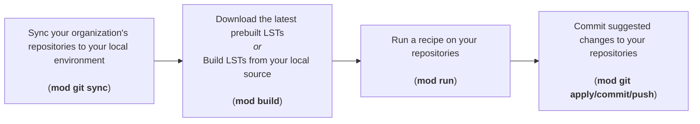
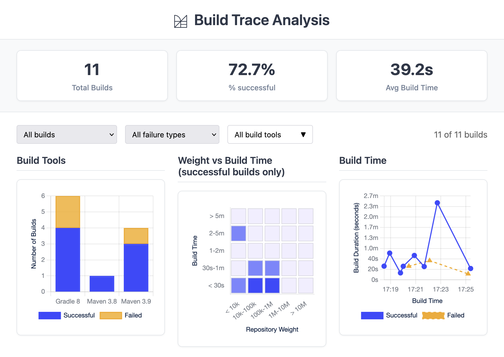

# Understanding CLI usage across your organization

As developers across your organization adopt the Moderne CLI, understanding usage patterns becomes critical for maximizing value. Without visibility into who's using the tool, which recipes are being run and committed, and where developers encounter friction, you can't identify adoption gaps, measure impact, or provide targeted support.

To help you gather this information, the Moderne CLI automatically generates telemetry in JSON and CSV files, capturing details about builds, recipe runs, and git operations. You can then analyze these files locally or aggregate them centrally to monitor CLI usage across your organization.

In this guide, we'll walk you through how these telemetry files work and how you can collect and analyze them.

## How telemetry is generated

The Moderne CLI generates telemetry files whenever you run commands (e.g., `mod build`, `mod run`, etc.). These files will be created in the `.moderne` directory in each repository.

Here's a typical workflow where each step will generate telemetry data:



## Repository-level telemetry

When you run a CLI command, telemetry is captured in each repository's `.moderne/<command>/trace.json` file. 

For the `sync` command, this file looks like:

```json
{
  "clone": {
    "success": true,
    "cloneUri": "https://github.com/company/repository",
    "startTime": "2025-09-29T14:17:31.477727-04:00",
    "endTime": "2025-09-29T14:17:35.101962-04:00",
    "log": "file:///.../.moderne/sync/sync.log",
    "changeset": "452d7ca8902e7338e999290eebad9062c342915f",
    "elapsedTimeMs": 3624
  },
  "org": "ALL/Company/Team",
  "repository": {
    "origin": "github.com",
    "path": "company/repository",
    "branch": "main",
    "partition": null
  }
}
```

As you run subsequent commands, each `trace.json` file will include telemetry from the previous steps. This lets you trace failures back to their source.

<details>

<summary>Example of a `trace.json` for a recipe run</summary>

```json
{
  "run": {
    "outcome": "Succeeded",
    "startTime": "2025-10-02T14:37:20.68234-04:00",
    "endTime": "2025-10-02T14:37:34.715203-04:00",
    "log": "file:///Users/matt/workspaces/app.moderne.io/Default/awslabs/aws-saas-boost/.moderne/run/20251002143646-F5Tor/run.log",
    "id": "20251002143646-F5Tor",
    "unlicensedAttempt": false,
    "streaming": false,
    "recipeId": "org.openrewrite.maven.DependencyVersionsToPropertiesDefault",
    "recipeInstanceName": "Extract dependency versions to properties with default naming",
    "recipeOptions": {},
    "recipeArtifact": "org.openrewrite.maven:maven-properties-recipes:0.1.0-SNAPSHOT",
    "estimatedEffortTimeSavingsMs": 13200000,
    "dependencyResolutionTimeMs": 0,
    "filesWithFixResults": 44,
    "filesWithSearchResults": 44,
    "filesWithErrors": 0,
    "filesSearched": 799,
    "dataTables": 2,
    "elapsedTimeMs": 14033
  },
  "build": {
    "outcome": "Succeeded",
    "startTime": "2025-10-02T14:47:51.472025Z",
    "endTime": "2025-10-02T14:48:43.610105Z",
    "log": "file:///.../.moderne/build/20251002104715-wvwCu/build.log",
    "id": "20251002104715-wvwCu",
    "changeset": "452d7ca8902e7338e999290eebad9062c342915f",
    "dependencyResolutionTimeMs": 516560,
    "mavenVersion": "3.9.10",
    "gradleVersion": null,
    "bazelVersion": null,
    "dotnetVersion": null,
    "pythonVersion": null,
    "nodeVersion": null,
    "sourceFileCount": 799,
    "lineCount": 147205,
    "parseErrorCount": 25,
    "weight": 640108,
    "maxWeight": 65828,
    "maxWeightSourceFile": "client/web/yarn.lock",
    "elapsedTimeMs": 52138
  },
  "clone": {
    "outcome": null,
    "cloneUri": "https://github.com/company/repository",
    "startTime": "2025-09-29T14:17:31.477727-04:00",
    "endTime": "2025-09-29T14:17:35.101962-04:00",
    "log": "file:///.../.moderne/sync/sync.log",
    "changeset": "452d7ca8902e7338e999290eebad9062c342915f",
    "elapsedTimeMs": 3624
  },
  "org": "ALL/Company/Team",
  "repository": {
    "origin": "github.com",
    "path": "company/repository",
    "branch": "main",
    "partition": null
  }
}
```

:::note
The `run` command's `trace.json` includes telemetry for the `clone` and `build` blocks from earlier steps.
:::

</details>

### `trace.json` schema

The following tables describe the `trace.json` schema, including metadata common to all commands and fields specific to each command type:

#### Repository and organization metadata

Every `trace.json` file includes repository and organization metadata to identify where actions occurred.

| Field                  | Type        | Description                                        |
|------------------------|-------------|----------------------------------------------------|
| `org`                  | string      | Organizational hierarchy (e.g., `ALL/Default`)     |
| `repository.origin`    | string      | Source control platform (e.g., `github.com`)       |
| `repository.path`      | string      | Repository path (e.g., `apache/maven-doxia`)       |
| `repository.branch`    | string      | Branch name (e.g., `master`, `main`)               |
| `repository.partition` | string/null | Repository partition if applicable, null otherwise |

#### Common metadata

All commands contain the following metadata for that specific command's run:

| Field           | Type   | Description                                                          |
|-----------------|--------|----------------------------------------------------------------------|
| `outcome`       | string | Command outcome (e.g., `Succeeded`, `Failed`)                        |
| `startTime`     | string | ISO 8601 timestamp when the command started                          |
| `endTime`       | string | ISO 8601 timestamp when the command completed                        |
| `log`           | string | File URI to the log file for the output of this specific command run |
| `elapsedTimeMs` | number | Duration of the command in milliseconds                              |

All commands except `mod git sync` include a unique identifier for tracking multiple runs:

| Field | Type   | Description                            |
|-------|--------|----------------------------------------|
| `id`  | string | Unique identifier for this command run |

#### Clone command fields

When you sync repositories with `mod git sync`, a `clone` block is created with these fields:

| Field       | Type    | Description                             |
|-------------|---------|-----------------------------------------|
| `success`   | boolean | Whether the clone operation succeeded   |
| `cloneUri`  | string  | The URI used to clone the repository    |
| `changeset` | string  | The git commit SHA that was checked out |

#### Build command fields

When you build LSTs with `mod build`, a `build` block is created with these fields:

| Field                        | Type        | Description                                       |
|------------------------------|-------------|---------------------------------------------------|
| `changeset`                  | string      | The git commit SHA that was built                 |
| `dependencyResolutionTimeMs` | number      | Time spent resolving dependencies in milliseconds |
| `mavenVersion`               | string/null | Maven version if Maven project, null otherwise    |
| `gradleVersion`              | string/null | Gradle version if Gradle project, null otherwise  |
| `bazelVersion`               | string/null | Bazel version if Bazel project, null otherwise    |
| `dotnetVersion`              | string/null | .NET version if .NET project, null otherwise      |
| `pythonVersion`              | string/null | Python version if Python project, null otherwise  |
| `nodeVersion`                | string/null | Node version if Node project, null otherwise      |
| `sourceFileCount`            | number      | Total number of source files parsed               |
| `lineCount`                  | number      | Total lines of code across all source files       |
| `parseErrorCount`            | number      | Number of files that failed to parse              |
| `weight`                     | number      | Combined weight of all source files               |
| `maxWeight`                  | number      | Weight of the largest source file                 |
| `maxWeightSourceFile`        | string      | Path to the largest source file                   |

#### Run command fields

When you run recipes with `mod run`, a `run` block is created with these fields:

| Field                          | Type    | Description                                       |
|--------------------------------|---------|---------------------------------------------------|
| `unlicensedAttempt`            | boolean | Whether this was run without a license            |
| `streaming`                    | boolean | Whether streaming mode was used                   |
| `recipeId`                     | string  | Fully qualified ID of the recipe that was run     |
| `recipeInstanceName`           | string  | Human-readable name of the recipe                 |
| `recipeOptions`                | object  | Map of recipe options/parameters used             |
| `recipeArtifact`               | string  | Maven coordinates of the recipe artifact          |
| `estimatedEffortTimeSavingsMs` | number  | Estimated developer time saved in milliseconds    |
| `dependencyResolutionTimeMs`   | number  | Time spent resolving dependencies in milliseconds |
| `filesWithFixResults`          | number  | Number of files with changes applied              |
| `filesWithSearchResults`       | number  | Number of files matching search criteria          |
| `filesWithErrors`              | number  | Number of files that encountered errors           |
| `filesSearched`                | number  | Total number of files searched                    |
| `dataTables`                   | number  | Number of data tables generated                   |

#### Apply command fields

When you apply changes with `mod git apply`, an `apply` block is created with the common metadata fields. There are currently no additional telemetry fields for this command.

#### Commit command fields

When you commit changes with `mod git commit`, a `commit` block is created with these fields:

| Field    | Type   | Description                                        |
|----------|--------|----------------------------------------------------|
| `branch` | string | The branch into which these changes were committed |

#### Push command fields

When you push changes with `mod git push`, a `push` block is created with these fields:

| Field          | Type    | Description                                                           |
|----------------|---------|-----------------------------------------------------------------------|
| `remoteBranch` | string  | The remote branch into which changes are pushed                       |
| `setUpstream`  | boolean | True if you set a specific upstream during this push, false otherwise |

## Organization-level telemetry

The Moderne CLI is designed to operate against many repositories simultaneously. Because of this, in addition to creating repository-specific `trace.json` files, it generates an aggregate `trace.csv` file in the `.moderne/<command>` directory. This CSV contains the same data as the individual JSON files, with each row representing a repository and each column representing a field.

This CSV is also copied to `$MODERNE_HOME/cli/trace`, making it easy to examine and share telemetry across all runs in a centralized location:

```
Per-Repository Files:          Aggregate File:
repo1/.moderne/build/trace.json ─┐
repo2/.moderne/build/trace.json ─┼─> .moderne/build/trace.csv ─> $MODERNE_HOME/cli/trace/
repo3/.moderne/build/trace.json ─┘
```

Note that these centralized CSV files **do not** include `log` field paths, as those are specific to your local environment.

## Analyzing results locally

When building LSTs for many repositories, some may fail due to unique build requirements. The Moderne CLI includes a built-in analytics dashboard for visualizing build failures. Launch it with:

```bash
mod trace builds analyze . --last-build
```

<figure>
  
  <figcaption>_Build telemetry dashboard view_</figcaption>
</figure>

The dashboard displays build metadata and lets you drill into individual repositories to view logs and troubleshooting suggestions.

## Collecting results in a central location

Many organizations use centralized observability and business intelligence (BI) tools to monitor developer workflows and measure productivity initiatives. The Moderne CLI's telemetry is designed to integrate seamlessly with these systems.

As mentioned earlier, the CLI automatically aggregates CSV files to the `$MODERNE_HOME/cli/trace` directory. These files are ready to be ingested by your existing BI tools - allowing you to track CLI usage, recipe adoption, and impact across your entire organization.

You can publish these files with every command run, or you can collect them on a scheduled cadence.

### Wrapping the CLI to publish telemetry

Due to the fact every organization's BI system is different, we strongly recommend that you wrap the Moderne CLI in a script that handles telemetry publishing and any necessary data transformation.

A wrapper script allows you to:

* Run pre- and post-processing steps
* Publish telemetry to your BI endpoint
* Transform data to match your system's requirements

Here's a basic wrapper script template:

```bash title="mod.sh"
# Main execution
main() {
    # Extract the first command argument (e.g., "build" from "mod.sh build .")
    local command_name="$1"
    
    if [[ -f "$MOD_JAR" ]]; then
      # Execute the Moderne CLI jar with provided arguments
      java -jar "$MOD_JAR" "$@"
      CLI_EXIT_CODE=$?
    elif command -v mod &> /dev/null; then
      # Execute the Moderne CLI binary
      mod "$@"
      CLI_EXIT_CODE=$?
    else
      echo -e "Error: Moderne CLI not found at $MOD_JAR" >&2
      echo "Please set the correct path to the Moderne CLI JAR file" >&2
      exit 1
    fi
    
    # Add a newline after mod output
    echo >&2
    
    # TODO: Run any post-processing work here now that the Moderne CLI command is completed
    
    # Exit with the same code as the CLI
    exit $CLI_EXIT_CODE
}

# Run main function
main "$@"
```

<details>

<summary>Example of a `mod.sh` that publishes telemetry to an API endpoint</summary>

```bash title="mod.sh"
# Function to publish telemetry data
publish_telemetry() {
    local command_name="$1"
    
    # Skip if no command name provided
    if [[ -z "$command_name" ]]; then
        return 0
    fi
    
    if [[ ! -d "$TELEMETRY_DIR" ]]; then
        return 0
    fi
    
    # Look for CSV files under the command subdirectory
    local search_dir="$TELEMETRY_DIR/$command_name"
    if [[ ! -d "$search_dir" ]]; then
        return 0
    fi
    
    # Find all CSV files in the search directory and subdirectories recursively
    # Using find for compatibility with older bash versions (macOS default is 3.2)
    CSV_FILES=()
    while IFS= read -r -d '' file; do
        CSV_FILES+=("$file")
    done < <(find "$search_dir" -name "*.csv" -type f -print0 2>/dev/null)
    
    if [[ ${#CSV_FILES[@]} -eq 0 ]]; then
        return 0
    fi
    
    echo "Publishing telemetry data to $BI_ENDPOINT..." >&2
    
    for csv_file in "${CSV_FILES[@]}"; do
        if [[ -f "$csv_file" ]]; then
            parent_dir="$(dirname "$csv_file")"
            # Get relative path from current directory
            relative_path="${csv_file#$(pwd)/}"
            echo "Processing: $relative_path" >&2
            # Only attempt to publish if endpoint is configured
            if [[ -n "$BI_ENDPOINT" ]]; then
                # Build curl command with optional parameters
                CURL_CMD=(curl -X POST -H "Content-Type: text/csv" --data-binary "@$csv_file")
                
                # Add basic authentication if configured
                if [[ -n "$BI_AUTH_USER" && -n "$BI_AUTH_PASS" ]]; then
                    CURL_CMD+=(--user "$BI_AUTH_USER:$BI_AUTH_PASS")
                fi
                
                # Add proxy configuration if configured
                # Determine which proxy to use based on endpoint URL
                PROXY_URL=""
                if [[ "$BI_ENDPOINT" == https://* && -n "$HTTPS_PROXY" ]]; then
                    PROXY_URL="$HTTPS_PROXY"
                elif [[ -n "$HTTP_PROXY" ]]; then
                    PROXY_URL="$HTTP_PROXY"
                fi
                
                if [[ -n "$PROXY_URL" ]]; then
                    CURL_CMD+=(--proxy "$PROXY_URL")
                    
                    # Add proxy authentication if configured
                    if [[ -n "$PROXY_USER" && -n "$PROXY_PASS" ]]; then
                        CURL_CMD+=(--proxy-user "$PROXY_USER:$PROXY_PASS")
                    fi
                fi
                
                # Add endpoint and common options
                CURL_CMD+=("$BI_ENDPOINT" --silent --fail --show-error)
                
                # Execute curl command
                ERROR_MSG=$("${CURL_CMD[@]}" 2>&1)
                
                if [[ $? -eq 0 ]]; then
                    # Delete parent directory on successful post (e.g., 20250822153915-gemmm/)
                    rm -rf "$parent_dir"
                    echo -e "${GREEN}[OK] Published: $relative_path${NC}" >&2
                else
                    echo -e "${YELLOW}[WARN] Failed to publish: $relative_path${NC}" >&2
                    echo -e "${YELLOW}       Error: $ERROR_MSG${NC}" >&2
                fi
            else
                echo -e "${YELLOW}Note: Telemetry endpoint not configured. Skipping: $relative_path${NC}" >&2
            fi
        fi
    done
}

# Main execution
main() {
    # Extract the first command argument (e.g., "build" from "mod.sh build .")
    local command_name="$1"
    
    if [[ -f "$MOD_JAR" ]]; then
      # Execute the Moderne CLI jar with provided arguments
      java -jar "$MOD_JAR" "$@"
      CLI_EXIT_CODE=$?
    elif command -v mod &> /dev/null; then
      # Execute the Moderne CLI binary
      mod "$@"
      CLI_EXIT_CODE=$?
    else
      echo -e "Error: Moderne CLI not found at $MOD_JAR" >&2
      echo "Please set the correct path to the Moderne CLI JAR file" >&2
      exit 1
    fi
    
    # Add a newline after mod output
    echo >&2
    
    # Publish telemetry data after CLI execution, passing the command name
    publish_telemetry "$command_name"
    
    # Exit with the same code as the CLI
    exit $CLI_EXIT_CODE
}

# Run main function
main "$@"
```

</details>

For a complete example with additional features, see the [moderne-cli-wrapper](https://github.com/moderneinc/moderne-cli-wrapper) repository. It includes pre- and post-command hooks and custom commands for your organization.

### Valuable metrics to monitor

Here are some key metrics that have proven valuable across many organizations, including Moderne itself. Note that this is not an exhaustive list - your organization may have additional metrics specific to your initiatives:

**Build Metrics:**

* Build success rate
* Build duration over time
* Builds by tool
* Builds over time
* Weight vs build time

**Run Metrics:**

* Total recipes run
* Recipe run success rate
* Top recipes executed
* Recipe runs over time
* Total potential time saved by recipe, user, and teams

**Commit Metrics:**

* Top recipes committed
* Top users/teams committing recipe results
* Top users/teams running recipes but _not_ committing results
* Most valuable recipes (Total time saved for recipes that end up in a commit)
* Time from first run of a recipe to first commit on a repository