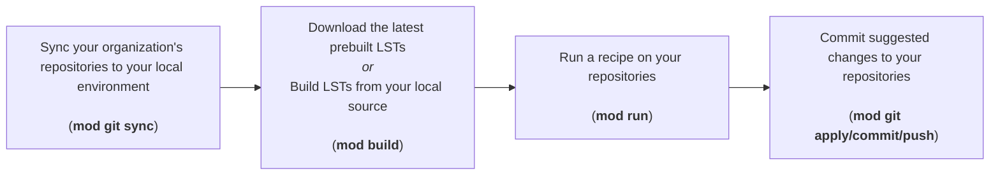

# Understanding CLI usage across your organization

As developers across your organization adopt the Moderne CLI, understanding usage patterns becomes critical for maximizing value. Without visibility into who's using the tool, which recipes are being run and committed, and where developers encounter friction, you can't identify adoption gaps, measure impact, or provide targeted support.

To help you gather this information, the Moderne CLI automatically generates telemetry in JSON and CSV files, capturing details about builds, recipe runs, and git operations. You can then analyze these files locally or aggregate them centrally to monitor CLI usage across your organization.

In this guide, we'll walk you through how these telemetry files work and how you can collect and analyze them.

## How telemetry is generated

The Moderne CLI generates telemetry files whenever you run commands (e.g., `mod build`, `mod run`, etc.). These files will be created in the `.moderne` directory in each repository.

Here's a typical workflow where each step will generate telemetry data:


```mermaid
flowchart LR
  sync["`Sync your organization's repositories to your local environment<br/><br/>(**mod git sync**)`"]
  build["`Download the latest prebuilt LSTs<br/>_or_<br/>Build LSTs from your local source<br/><br/>(**mod build**)`"]
  run["`Run a recipe on your repositories<br/><br/>(**mod run**)`"]
  commit["`Commit suggested changes to your repositories<br/><br/>(**mod git apply/commit/push**)`"]
  sync --> build
  build --> run
  run --> commit
```

## Repository-level telemetry

When you run a CLI command, telemetry is captured in each repository's `.moderne/<command>/trace.json` file. 

For the `sync` command, this file looks like:

```json
{
  "clone": {
    "success": true,
    "cloneUri": "https://github.com/company/repository",
    "startTime": "2025-09-29T14:17:31.477727-04:00",
    "endTime": "2025-09-29T14:17:35.101962-04:00",
    "log": "file:///.../.moderne/sync/sync.log",
    "changeset": "452d7ca8902e7338e999290eebad9062c342915f",
    "elapsedTimeMs": 3624
  },
  "org": "ALL/Company/Team",
  "repository": {
    "origin": "github.com",
    "path": "company/repository",
    "branch": "main",
    "partition": null
  }
}
```

As you run subsequent commands, each `trace.json` file will include telemetry from the previous steps. This lets you trace failures back to their source.

<details>

<summary>Example of a `trace.json` for a recipe run</summary>

```json
{
  "run": {
    "outcome": "Succeeded",
    "startTime": "2025-10-02T14:37:20.68234-04:00",
    "endTime": "2025-10-02T14:37:34.715203-04:00",
    "log": "file:///Users/matt/workspaces/app.moderne.io/Default/awslabs/aws-saas-boost/.moderne/run/20251002143646-F5Tor/run.log",
    "id": "20251002143646-F5Tor",
    "unlicensedAttempt": false,
    "streaming": false,
    "recipeId": "org.openrewrite.maven.DependencyVersionsToPropertiesDefault",
    "recipeInstanceName": "Extract dependency versions to properties with default naming",
    "recipeOptions": {},
    "recipeArtifact": "org.openrewrite.maven:maven-properties-recipes:0.1.0-SNAPSHOT",
    "estimatedEffortTimeSavingsMs": 13200000,
    "dependencyResolutionTimeMs": 0,
    "pomCacheHitRate": 0.919,
    "resolvedPomCacheHitRate": 1.0,
    "filesWithFixResults": 44,
    "filesWithSearchResults": 44,
    "filesWithErrors": 0,
    "filesSearched": 799,
    "dataTables": 2,
    "thread": "ForkJoinPool.commonPool-worker-10",
    "elapsedTimeMs": 14033
  },
  "build": {
    "outcome": "Succeeded",
    "startTime": "2025-10-02T14:47:51.472025Z",
    "endTime": "2025-10-02T14:48:43.610105Z",
    "log": "file:///.../.moderne/build/20251002104715-wvwCu/build.log",
    "id": "20251002104715-wvwCu",
    "changeset": "452d7ca8902e7338e999290eebad9062c342915f",
    "dependencyResolutionTimeMs": 516560,
    "mavenVersion": "3.9.10",
    "gradleVersion": null,
    "bazelVersion": null,
    "dotnetVersion": null,
    "pythonVersion": null,
    "nodeVersion": null,
    "sourceFileCount": 799,
    "lineCount": 147205,
    "parseErrorCount": 25,
    "weight": 640108,
    "maxWeight": 65828,
    "maxWeightSourceFile": "client/web/yarn.lock",
    "elapsedTimeMs": 52138
  },
  "clone": {
    "outcome": null,
    "cloneUri": "https://github.com/company/repository",
    "startTime": "2025-09-29T14:17:31.477727-04:00",
    "endTime": "2025-09-29T14:17:35.101962-04:00",
    "log": "file:///.../.moderne/sync/sync.log",
    "changeset": "452d7ca8902e7338e999290eebad9062c342915f",
    "elapsedTimeMs": 3624
  },
  "org": "ALL/Company/Team",
  "repository": {
    "origin": "github.com",
    "path": "company/repository",
    "branch": "main",
    "partition": null
  }
}
```

:::note
The `run` command's `trace.json` includes telemetry for the `clone` and `build` blocks from earlier steps.
:::

</details>

### `trace.json` schema

The following tables describe the `trace.json` schema, including metadata common to all commands and fields specific to each command type. For the equivalent reference of the ingested CSV format (along with ready-made BI table definitions and report templates), see the [moderne-bi-templates](https://github.com/moderneinc/moderne-bi-templates) repository and its [trace.csv data dictionary](https://github.com/moderneinc/moderne-bi-templates/blob/main/data-dictionary/trace-csv.md).

#### Repository and organization metadata

Every `trace.json` file includes repository and organization metadata to identify where actions occurred:

| Field                  | Type        | Description                                        |
|------------------------|-------------|----------------------------------------------------|
| `org`                  | string      | Organizational hierarchy (e.g., `ALL/Default`)     |
| `repository.origin`    | string      | Source control platform (e.g., `github.com`)       |
| `repository.path`      | string      | Repository path (e.g., `apache/maven-doxia`)       |
| `repository.branch`    | string      | Branch name (e.g., `master`, `main`)               |
| `repository.partition` | string/null | Repository partition if applicable, null otherwise |

#### Common metadata

All commands contain the following metadata for that specific command's run:

| Field           | Type   | Description                                                          |
|-----------------|--------|----------------------------------------------------------------------|
| `outcome`       | string | Command outcome (e.g., `Succeeded`, `Failed`)                        |
| `startTime`     | string | ISO 8601 timestamp when the command started                          |
| `endTime`       | string | ISO 8601 timestamp when the command completed                        |
| `log`           | string | File URI to the log file for the output of this specific command run |
| `elapsedTimeMs` | number | Duration of the command in milliseconds                              |

All commands except `mod git sync` include a unique identifier for tracking multiple runs:

| Field | Type   | Description                            |
|-------|--------|----------------------------------------|
| `id`  | string | Unique identifier for this command run |

#### Clone command fields

When you sync repositories with `mod git sync`, a `clone` block is created with these fields:

| Field       | Type    | Description                             |
|-------------|---------|-----------------------------------------|
| `success`   | boolean | Whether the clone operation succeeded   |
| `cloneUri`  | string  | The URI used to clone the repository    |
| `changeset` | string  | The git commit SHA that was checked out |

#### Build command fields

When you build LSTs with `mod build`, a `build` block is created with these fields:

| Field                        | Type        | Description                                       |
|------------------------------|-------------|---------------------------------------------------|
| `changeset`                  | string      | The git commit SHA that was built                 |
| `dependencyResolutionTimeMs` | number      | Time spent resolving dependencies in milliseconds |
| `mavenVersion`               | string/null | Maven version if Maven project, null otherwise    |
| `gradleVersion`              | string/null | Gradle version if Gradle project, null otherwise  |
| `bazelVersion`               | string/null | Bazel version if Bazel project, null otherwise    |
| `dotnetVersion`              | string/null | .NET version if .NET project, null otherwise      |
| `pythonVersion`              | string/null | Python version if Python project, null otherwise  |
| `nodeVersion`                | string/null | Node version if Node project, null otherwise      |
| `sourceFileCount`            | number      | Total number of source files parsed               |
| `lineCount`                  | number      | Total lines of code across all source files       |
| `parseErrorCount`            | number      | Number of files that failed to parse              |
| `weight`                     | number      | Combined weight of all source files               |
| `maxWeight`                  | number      | Weight of the largest source file                 |
| `maxWeightSourceFile`        | string      | Path to the largest source file                   |

#### Run command fields

When you run recipes with `mod run`, a `run` block is created with these fields:

| Field                          | Type    | Description                                       |
|--------------------------------|---------|---------------------------------------------------|
| `unlicensedAttempt`            | boolean | Whether this was run without a license            |
| `streaming`                    | boolean | Whether streaming mode was used                   |
| `recipeId`                     | string  | Fully qualified ID of the recipe that was run     |
| `recipeInstanceName`           | string  | Human-readable name of the recipe                 |
| `recipeOptions`                | object  | Map of recipe options/parameters used             |
| `recipeArtifact`               | string  | Maven coordinates of the recipe artifact          |
| `estimatedEffortTimeSavingsMs` | number  | Estimated developer time saved in milliseconds    |
| `dependencyResolutionTimeMs`   | number  | Time spent resolving dependencies in milliseconds |
| `pomCacheHitRate`              | number  | Cache hit rate for POM file resolution            |
| `resolvedPomCacheHitRate`      | number  | Cache hit rate for resolved POM lookups           |
| `filesWithFixResults`          | number  | Number of files with changes applied              |
| `filesWithSearchResults`       | number  | Number of files matching search criteria          |
| `filesWithErrors`              | number  | Number of files that encountered errors           |
| `filesSearched`                | number  | Total number of files searched                    |
| `dataTables`                   | number  | Number of data tables generated                   |
| `thread`                       | string  | JVM thread that executed the recipe run           |

#### Apply command fields

When you apply changes with `mod git apply`, an `apply` block is created with the common metadata fields. There are currently no additional telemetry fields for this command.

#### Commit command fields

When you commit changes with `mod git commit`, a `commit` block is created with these fields:

| Field    | Type   | Description                                        |
|----------|--------|----------------------------------------------------|
| `branch` | string | The branch into which these changes were committed |

#### Push command fields

When you push changes with `mod git push`, a `push` block is created with these fields:

| Field          | Type    | Description                                                           |
|----------------|---------|-----------------------------------------------------------------------|
| `remoteBranch` | string  | The remote branch into which changes are pushed                       |
| `setUpstream`  | boolean | True if you set a specific upstream during this push, false otherwise |

### MCP tool-call telemetry

The MCP server (`mod mcp`) emits telemetry differently from the commands above. Instead of writing a `trace.json`, it appends **one CSV row per MCP tool call** directly to the telemetry queue at `~/.moderne/cli/trace/mcp/`. Each row uses the `mcp` command type (`type=mcp`) and carries an `mcp` block with these fields:

| Field           | Type   | Description                                                                                         |
|-----------------|--------|-----------------------------------------------------------------------------------------------------|
| `outcome`       | string | Tool-call outcome (e.g., `Succeeded`, `Failed`)                                                     |
| `startTime`     | string | ISO 8601 timestamp when the tool call started                                                       |
| `endTime`       | string | ISO 8601 timestamp when the tool call completed                                                     |
| `sessionId`     | string | The `mod mcp` session identifier, so all rows from one session correlate                            |
| `toolName`      | string | The MCP tool that was invoked (e.g., `run_recipe`, `find_types`)                                    |
| `recipeId`      | string | Fully qualified recipe ID for recipe-oriented tools; empty for tools that take a query instead      |
| `matchCount`    | number | Number of matches the tool produced                                                                 |
| `changeCount`   | number | Number of changes the tool produced                                                                 |
| `runId`         | string | Identifier of the underlying recipe run, when the tool triggered one                                |
| `resultBytes`   | number | Size of the tool result in bytes                                                                    |
| `arguments`     | string | Truncated (~120 character) summary of the tool arguments. No full arguments or secrets are recorded |
| `elapsedTimeMs` | number | Duration of the tool call in milliseconds                                                           |

In the aggregate CSV these become the `mcp`-prefixed columns (`mcpOutcome`, `mcpStartTime`, `mcpEndTime`, `mcpSessionId`, `mcpToolName`, `mcpRecipeId`, `mcpMatchCount`, `mcpChangeCount`, `mcpRunId`, `mcpResultBytes`, `mcpArguments`, `mcpElapsedTimeMs`), alongside the standard `origin`, `path`, `branch`, `developer`, and `organization` columns.

:::note
MCP telemetry is always-on and CSV-only: each tool call is appended straight to the `~/.moderne/cli/trace/mcp/` queue and is never written to a `trace.json`. For a CLI signed in to a tenant, these rows flush on the CLI's normal auto-push (when it refreshes its license lease) or with `mod telemetry publish`, the same as other command telemetry.
:::

## Organization-level telemetry

The Moderne CLI is designed to operate against many repositories simultaneously. Because of this, in addition to creating repository-specific `trace.json` files, it generates an aggregate `trace.csv` file in the `.moderne/<command>` directory, with each row representing a repository and each column representing a field.

This CSV (not the `trace.json` files) is what gets ingested by BI tools and pushed to your Moderne tenant. It carries the same data as the JSON plus a few extra columns, with some fields flattened or omitted, as detailed below.

It is also copied to `$MODERNE_HOME/cli/trace`, making it easy to examine and share telemetry across all runs in a centralized location:

```
Per-Repository Files:          Aggregate File:
repo1/.moderne/build/trace.json ─┐
repo2/.moderne/build/trace.json ─┼─> .moderne/build/trace.csv ─> $MODERNE_HOME/cli/trace/
repo3/.moderne/build/trace.json ─┘
```

### How the CSV columns differ from `trace.json`

The CSV adds columns that don't exist in the JSON:

| Column      | When      | Source                  | Description                                                                                                                                                                                                              |
|-------------|-----------|-------------------------|--------------------------------------------------------------------------------------------------------------------------------------------------------------------------------------------------------------------------|
| `developer` | Always    | Local git configuration | The git email of the developer who ran the command (`git config user.email`), or empty if it cannot be determined. It appears as the fourth common column, after `origin`, `path`, and `branch`.                         |
| `tag.<key>` | On demand | `--trace-tag key=value` | One column per tag you supply on the command (e.g., `--trace-tag team=payments` adds a `tag.team` column). Repeat the option to add multiple tags. Useful for slicing telemetry by CI pipeline, team, or migration wave. |

The CSV also reshapes or omits some JSON fields:

* **Flattened and renamed (same data):** the nested `repository.origin`, `repository.path`, and `repository.branch` become top-level `origin`, `path`, and `branch` columns; the top-level `org` field becomes the `organization` column; and each command stage's nested fields become prefixed columns (e.g., `run.outcome` becomes `runOutcome`, and each stage adds a `<stage>ElapsedTimeMs` column).
* **Omitted:** `repository.partition` is not written to the CSV.
* **Omitted in centralized copies:** the `log` field paths are stripped from the CSV files copied to `$MODERNE_HOME/cli/trace`, as those paths are specific to your local environment.

## Collecting results in a central location

Many organizations use centralized observability and business intelligence (BI) tools to monitor developer workflows and measure productivity initiatives. The Moderne CLI's telemetry is designed to integrate seamlessly with these systems.

Several options below rely on a customized *wrapper*, meaning your own copy of the [`modw` script](./cli-wrapper.md) that every `mod` command already runs through. Your platform team extends it to publish telemetry to a destination you control.

Where your telemetry ends up, and whether you have to do anything to route it into BI, depends on how your CLI is deployed:

| Scenario                                           | Source        | Where telemetry lands                                                                                                                 | Publish it yourself?           | Does Moderne receive it?                                                                                                                                           | How you get it into BI                                                                                                                                                  |
|----------------------------------------------------|---------------|---------------------------------------------------------------------------------------------------------------------------------------|--------------------------------|--------------------------------------------------------------------------------------------------------------------------------------------------------------------|-------------------------------------------------------------------------------------------------------------------------------------------------------------------------|
| Platform / web UI                                  | `saas`        | Moderne's managed bucket under your tenant prefix, uploaded server-side by the recipe workers                                         | No (server-side)               | Yes                                                                                                                                                                | Moderne replicates it into a bucket you own                                                                                                                             |
| CLI signed in to a tenant (happy path)             | `cli` / `mcp` | Queued locally, then auto-pushed to Moderne's bucket through the tenant gateway on license-lease refresh (or `mod telemetry publish`) | No                             | Yes                                                                                                                                                                | Replication alongside the `saas` data; a wrapper can *also* publish to a destination you control                                                                        |
| CLI not signed in, but your org is a SaaS customer | `cli` / `mcp` | Queued locally; nothing reaches the gateway while disconnected                                                                        | No                             | Not while disconnected. Once you're signed in, it flushes on the next license-lease refresh as above (but a short-lived host can spin down before it ever flushes) | Replication once the queue flushes; use a wrapper to your own destination if the host may stay disconnected or spin down first (for example, ephemeral mass-ingest VMs) |
| Moderne DX or air-gapped (no tenant)               | `cli` / `mcp` | Local only; there is no gateway or Moderne bucket to push to                                                                          | Yes. Nothing pushes it for you | No, by design (no tenant to flush to, and replication does not run)                                                                                                | You publish it yourself, typically by customizing the wrapper, and hold the complete picture                                                                            |

A signed-in CLI's auto-push happens when it refreshes its license lease (at most once every three days). To flush queued telemetry on demand (for example, from CI, or right before pulling a report), run `mod telemetry publish`.

:::info
If your CLI is signed in to a Moderne SaaS v2 tenant, Moderne can replicate your telemetry into a bucket or storage account you own. See [Configuring telemetry exports and reports](../../../administrator-documentation/moderne-platform/how-to-guides/configuring-telemetry-exports/overview.md) ([AWS](../../../administrator-documentation/moderne-platform/how-to-guides/configuring-telemetry-exports/aws-replication.md), [Azure](../../../administrator-documentation/moderne-platform/how-to-guides/configuring-telemetry-exports/azure-replication.md)). The self-publishing wrapper covered below is for Moderne DX customers, CLI-only deployments not connected to a tenant, or anyone who *also* wants telemetry in a destination they control.
:::

The aggregate CSV files in `$MODERNE_HOME/cli/trace` are the ones that feed your BI tools. You can publish them after every command, or collect them on a schedule.

### Publishing telemetry with a custom wrapper

The recommended way to publish telemetry is to customize the CLI wrapper itself: the [`modw` script](./cli-wrapper.md) (`modw.cmd` on Windows), the supported entry point that `mod` symlinks to. Your central platform team maintains the customized wrapper and distributes it to your CLI users, the same way large organizations manage a customized Maven or Gradle wrapper, so users keep using a single `mod` command.

Customizing the wrapper lets you:

* Run pre- and post-processing steps
* Publish telemetry to a destination you control: object storage, an HTTP/BI endpoint, or anywhere else
* Transform data to match your system's requirements

The wrapper launches the CLI as its final step, so you publish telemetry by capturing the CLI's exit code, uploading the aggregate CSV files, and exiting with that code. For the complete worked example (the `modw` and `modw.cmd` edits, configuration, how CLI upgrades affect the customized wrapper, and an AWS S3 upload example), see [Exporting CLI telemetry to Amazon S3](./cli-telemetry-s3-export.md). If you keep that example's path structure, the data lands in the same layout as replicated tenant data, so you query it with the shared [Querying and BI](../../../administrator-documentation/moderne-platform/how-to-guides/configuring-telemetry-exports/querying-and-bi.md) guide.

### Valuable metrics to monitor

Here are some key metrics that have proven valuable across many organizations, including Moderne itself. Note that this is not an exhaustive list - your organization may have additional metrics specific to your initiatives:

**Build Metrics:**

* Build success rate
* Build duration over time
* Builds by tool
* Builds over time
* Weight vs build time

**Run Metrics:**

* Total recipes run
* Recipe run success rate
* Top recipes executed
* Recipe runs over time
* Total potential time saved by recipe, user, and teams

**Commit Metrics:**

* Top recipes committed
* Top users/teams committing recipe results
* Top users/teams running recipes but _not_ committing results
* Most valuable recipes (Total time saved for recipes that end up in a commit)
* Time from first run of a recipe to first commit on a repository