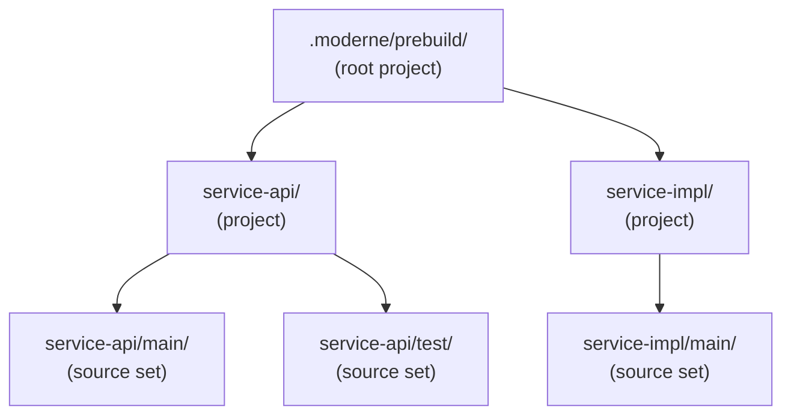
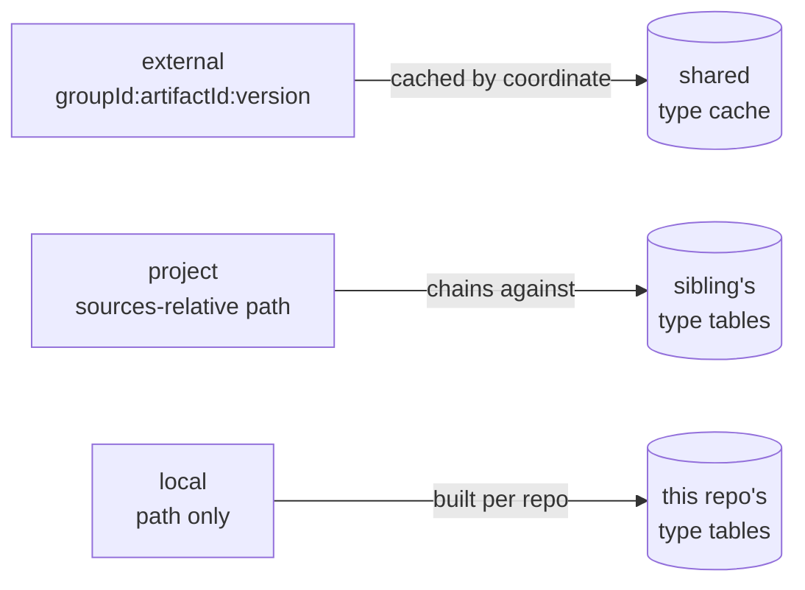

# Authoring a prebuild for a custom JVM build tool

The Moderne CLI natively supports Maven, Gradle, Bazel, and sbt. That being said, many companies have repositories that are built by other tools - such as a homegrown system that wraps `javac` with its own dependency resolution, or an internal tool that nobody outside your company has ever run.

The CLI can still parse these repositories with full type attribution. To do so, you'll need to create a *prebuild*: a set of descriptor files, placed under `.moderne/prebuild/`, that lay out your source sets and the dependencies they are compiled against. The CLI reads those files and parses your source into a [Lossless Semantic Tree (LST)](../../recipes/authoring-recipes/concepts/lossless-semantic-trees.md), the same way it would for a build tool it supports natively.

In this guide, you will learn what a prebuild is, how to author the descriptor files, and what each field means once the CLI reads it.

## How prebuild works

Building a repository happens in two stages: a discovery stage and a parsing stage.

In the discovery stage, the CLI works out the repository's structure: its projects, subprojects, source sets, and the classpath each source set compiled against. It records that structure as a directory tree under `.moderne/prebuild/`. This recorded structure **is the prebuild**: a set of JSON descriptors in two file shapes, rather than a single `prebuild.json` file.

In the parsing stage, `mod build` reads that tree and parses the sources into LST artifacts that mirror it, without re-running the build tool.

The two stages are split because discovery is the expensive one. Invoking the build tool forks a JVM, resolves a dependency graph, and runs compilation tasks. But its result depends only on the build files, so as long as those haven't changed, the tree from an earlier run stays valid. Recording it on disk lets later builds reuse it and go straight to parsing.

That separation is what makes custom build tools possible. Once the tree exists, `mod build` doesn't care how it got there. So if your build tool isn't one the CLI supports, you can produce the tree yourself and the CLI will parse your repository with full type attribution, exactly as it would a Maven project.

## What a custom-tool prebuild gives you

A hand-authored prebuild gets you correct Java (and optionally Kotlin) parsing, real type attribution from the classpath you supply, and the generic JVM [markers](../../recipes/authoring-recipes/concepts/markers.md) every source set carries: `JavaVersion`, `JavaProject`, and `BuildTool`.

What it doesn't get you are the tool-specific markers like `MavenResolutionResult` and `GradleProject`. Only the native tool steps emit those, because only they ran the tool. Recipes that read those markers won't fire on your repositories. Recipes that read a tool's configuration files directly still work, since those files are in the LST like any other source.

## How the CLI picks up your prebuild tree

`mod build` picks up your prebuild tree with no configuration on your part. The default pipeline includes a generic JVM step that runs whenever the prebuild tree holds a source-set descriptor (a `jvm-sourceset.json` file) and no native build tool (Maven, Gradle, sbt, or Bazel) claimed the repository. A repository built only by your custom tool meets both conditions, so when you write the tree, `mod build` will parse it.

When a repository does contain a recognized build tool, that tool's own step already walks the whole tree, hand-authored descriptors included, and the generic step stands down so nothing is parsed twice.

:::info
You don't need to edit `moderne.yml` or configure a [build step](./build-steps.md). Picking up a hand-authored tree is part of the CLI's default pipeline as of version 4.3.9.
:::

## The shape of the prebuild tree

The prebuild tree root is `<repo>/.moderne/prebuild/`, and its layout mirrors the LST output's `sources/<project>/<sourceSet>/` nesting. Two kinds of directories live in it:

* A *project* directory holds an optional `jvm-project.json` file and contains child directories. The tree root is itself the root project.
* A *source-set* directory holds a `jvm-sourceset.json` file.

Each directory's name becomes the name of the project or source set on disk - so a source set you want to appear as `main` lives in a directory called `main`. Nesting follows the filesystem, so a module's source sets are subdirectories of the module.

A single-module repository's tree is shallow:

```
.moderne/prebuild/
  jvm-project.json
  main/
    jvm-sourceset.json
  test/
    jvm-sourceset.json
```

A multi-module repository nests a project directory per module under the root:

```
.moderne/prebuild/
  jvm-project.json              # root project
  service-api/
    jvm-project.json
    main/jvm-sourceset.json
    test/jvm-sourceset.json
  service-impl/
    jvm-project.json
    main/jvm-sourceset.json
    test/jvm-sourceset.json
```



*The prebuild tree mirrors the LST output: project directories nest, and each source-set directory carries a `jvm-sourceset.json` file that the build phase parses into a source set.*

## The `jvm-project.json` file

The project descriptor is small, and you can skip it entirely: a directory with no `jvm-project.json` file is still a project with default values. When you do include it, it carries a display name and a build-tool reference.

```json
{
  "projectName" : "com.acme:service-api",
  "buildTool" : {
    "type" : "Maven",
    "version" : "3.9.6"
  }
}
```

`projectName` becomes the name on the `JavaProject` marker, and `buildTool` becomes the `BuildTool` marker. The `type` is matched against the tools the marker knows (`Gradle`, `Maven`, `Bazel`, and `ModerneCli`); anything else, including your tool's real name, falls back to `ModerneCli`.

Use that fallback rather than borrowing `Maven`. It's the accurate label for a tool the CLI doesn't run, and it keeps recipes that branch on build tool from mistaking your repositories for Maven ones.

## The `jvm-sourceset.json` file

The source-set descriptor is where the real information lives, and it's the file you'll spend the most time on. Here's one for a `main` source set with two dependencies:

```json
{
  "name" : "main",
  "sources" : [ "service-api/src/main/java" ],
  "resources" : [ "service-api/src/main/resources" ],
  "classpath" : [ {
    "@type" : "external",
    "path" : "/home/build/.acme/cache/guava-33.0.0-jre.jar",
    "groupId" : "com.google.guava",
    "artifactId" : "guava",
    "version" : "33.0.0-jre"
  }, {
    "@type" : "local",
    "path" : "/home/build/acme/vendor/internal-tooling.jar"
  } ],
  "languageLevel" : {
    "source" : "17",
    "target" : "17"
  },
  "javaRuntime" : {
    "version" : "17.0.9",
    "vendor" : "Azul Systems, Inc.",
    "home" : "/usr/lib/jvm/zulu-17"
  }
}
```

What each field means:

* `name`: the source set's name. Make it match the directory name.
* `sources`: the files and directories to parse. List a directory and the CLI walks it recursively. It prunes git-ignored entries (though it keeps tracked files that happen to match a `.gitignore` rule) and de-duplicates overlapping entries, so listing both `src` and `src/main/java` is harmless. [Source vs. classpath paths](#source-vs-classpath-paths) explains what these paths are relative to.
* `resources`: non-source files to carry into the LST as resources, under the same [path rules](#source-vs-classpath-paths).
* `classpath`: the dependencies these sources compiled against. The [classpath section](#the-classpath-three-kinds-of-dependency) covers it in detail.
* `languageLevel`: the `--source` and `--target` the compiler used, which become the source and target on the `JavaVersion` marker. Optional; each value defaults to the runtime version when omitted.
* `javaRuntime`: the JDK that compiled this source set, described in [the JDK section](#the-jdk) below.
* `kotlin`: include this object (even empty, as `{}`) to have the CLI build a Kotlin parser for the set alongside the Java one. Its `languageVersion` and `apiVersion` fields are informational today.

:::warning
Include `sources`, `resources`, and `classpath` explicitly, as arrays, even when one is empty. The CLI won't fill in a missing field, so leaving out `classpath` is an error rather than an empty classpath.
:::

A few of these fields need more than a line; the sections below cover paths, the classpath, and the JDK in turn.

### Source vs. classpath paths

Paths in a descriptor are resolved in one of two ways, depending on the field.

**Source and resource paths are relative to the repository root**, not to the descriptor's own directory. The `main` descriptor for `service-api` lives at `.moderne/prebuild/service-api/main/jvm-sourceset.json`, but its `sources` entry is `service-api/src/main/java`, the path you'd type from the repository root.

**Classpath dependency paths point at the actual file on disk**, wherever it lives: your dependency cache, a build output directory, or a vendored jar. These sit outside the repository, so they're normally absolute.

Mixing up the two is the most common mistake when hand-authoring a descriptor, and classpath paths are the ones that fail quietly:

:::warning
The CLI passes classpath paths to the parser unchanged and silently drops any that don't exist. A mistyped jar path won't fail the build; it just leaves those types unattributed. Because of that, it's important that you confirm the paths resolve.
:::

### The classpath: three kinds of dependency

Take the most care with the classpath, because it's what gives a recipe its type information. Whether `org.springframework...` resolves to a real type or stays an unattributed name comes down to whether you put the right jar on it.

Every entry carries an `@type` field that names its kind, and the three kinds differ in how the CLI turns them into type information.

#### External dependencies

An *external* dependency is a resolved library with coordinates: an `@type` of `external`, a `groupId`, `artifactId`, and `version`, and the `path` to its jar.

```json
{
  "@type" : "external",
  "path" : "/home/build/.acme/cache/guava-33.0.0-jre.jar",
  "groupId" : "com.google.guava",
  "artifactId" : "guava",
  "version" : "33.0.0-jre"
}
```

The CLI builds a type table keyed by those coordinates and caches it per machine, so every repository in the organization that depends on the same coordinate and version reuses it. The library's types are decoded once and shared from then on, which makes external the cheapest kind at scale. Use it for anything with real coordinates. Your build tool already knows those for the third-party libraries it resolved.

#### Project dependencies

A *project* dependency is a sibling source set in the same repository, referenced by its path under `sources/`.

```json
{
  "@type" : "project",
  "path" : "/home/build/acme/service-api/build/classes",
  "projectPath" : "service-api/main"
}
```

Rather than rebuild a table from a jar, the CLI chains the consuming source set to the sibling's own type tables, so the sibling's types are decoded once and shared by both sets. This works only when `projectPath` is a plain relative path under `sources/`: not a Gradle coordinate like `:service-api`, not an absolute path, and with no `..`. Anything else falls back to ingesting the jar. Use it for in-repo module dependencies you want shared.

#### Local dependencies

A *local* dependency is a classpath entry with no coordinates at all: an output directory, a vendored jar, anything you can't name.

```json
{
  "@type" : "local",
  "path" : "/home/build/acme/vendor/internal-tooling.jar"
}
```

Its type table is built locally and isn't shared across repositories. Use it as the fallback when coordinates aren't available.



*The three dependency kinds and where their type tables come from. External coordinates are the only kind the organization-wide cache can share.*

In practice you'll use `external` for the third-party libraries your resolver produced and `local` for output directories and uncoordinated jars, reaching for `project` when you have intra-repo module dependencies you want shared. Attaching real coordinates pays off at scale: an `external` entry is decoded once for the whole organization, while the same jar listed as `local` is rebuilt in every repository that uses it.

### The JDK

`javaRuntime.home` pins the JDK the CLI reads the standard library from. The CLI makes sure that JDK's type tables exist before parsing the set, so `java.lang.String` and the rest resolve to their canonical entries instead of being ingested as your own code. Omit `home` and the CLI falls back to the JDK it's running on, which is fine when they match and wrong when they don't. Pin it whenever your sources compiled against a different JDK than the one running `mod build`.

`javaRuntime.version` selects which JDK type tables the set's types resolve against. Give the major version of the runtime that compiled the sources, not the language level: a set compiled with `--source 8` on JDK 17 still gets version 17, because JDK 17 is the boot classpath the parser sees. The CLI normalizes the version strings you're likely to have (`1.8`, `17`, `21.0.4+7-LTS`) down to the major component, so pass through whatever your tool reports.

:::info
Pinning `home` and `version` doesn't remove the need for the JDK itself. They describe a compilation that already happened, and a matching JDK still has to be installed on the machine for those types to resolve.
:::

## A worked example

Suppose your `acme-service` repository is built by a homegrown tool, with one module, a `main` and a `test` source set, a handful of resolved third-party jars, and its own compiled output on the test classpath. Your producer (the script or tool you write to generate the prebuild) runs the build tool, reads its model, and writes:

```
acme-service/.moderne/prebuild/
  jvm-project.json
  main/jvm-sourceset.json
  test/jvm-sourceset.json
```

The `jvm-project.json` file names the module and records the tool, with `type` left as `ModerneCli`. The `main/jvm-sourceset.json` file lists `src/main/java` and the compile-time jars as `external` entries. The `test/jvm-sourceset.json` file lists `src/test/java`, the test dependencies, and the `main` set's output directory, either as a `local` entry or, to share the types, as a `project` dependency with a `projectPath` of `main`.

With the tree in place, build the repository as usual:

```bash
mod build acme-service
```

For a quick structural check, look at the build manifest. The CLI writes a `manifest.csv` file under `.moderne/build/<DATE_TIME_HASH>/` that lists each file in the LST and how it was parsed. Your Java sources should show up as `J.CompilationUnit`, not `Quark`. (A `Quark` records that a file exists without parsing its contents, which is what you get when a source set isn't recognized.)

The real test is type attribution. Run a type-aware recipe and check that it finds what it should:

```bash
mod run acme-service \
  --recipe=org.openrewrite.java.search.FindTypes \
  -P fullyQualifiedTypeName=com.google.common.collect.ImmutableList
```

Hits mean the Guava jar on your classpath resolved into types the recipe could match. Getting zero hits on a type you know is used points to a classpath problem: a jar path that didn't exist and was dropped, or a dependency you emitted as `local` when it needed coordinates. Since dropped entries are silent, a recipe run like this is the fastest way to catch them.

## Limitations to plan around

You own the tree's freshness. The generic JVM step doesn't regenerate it, so when a build file changes, your producer has to re-emit the affected descriptors. The per-directory layout lets you re-emit just the module that changed rather than the whole tree, which is worth wiring into your producer's own up-to-date check.

The markers you get are the generic three. A recipe that needs `MavenResolutionResult` to reason about a dependency graph, or `GradleProject` to read a Gradle model, has nothing to read on a custom-tool LST. If such a recipe matters to you, raise it with the Moderne team; it isn't something the prebuild format can close.

## Summary

A custom build tool joins the CLI by writing files, not code.

* **The tree is the contract.** `.moderne/prebuild/` holds a directory per project and source set, and each source-set directory carries a `jvm-sourceset.json` file naming its sources, resources, and classpath. Write the tree in that shape and the generic JVM step parses it like any other build's output.
* **Coordinates make types shareable.** An `external` dependency is decoded once per machine and reused across the organization; a `local` one is rebuilt per repository. Attach real coordinates wherever your resolver has them.
* **Paths have two frames.** Source and resource paths are relative to the repository root; classpath paths are absolute locations on disk. Missing classpath entries are dropped without an error, so verify them with a recipe run.
* **Describe the compilation that happened.** The runtime version and classpath you record have to match the build that produced the bytecode, because the CLI is reconstructing that compilation's type universe rather than inventing a new one.

## Next steps

* [Configuring build steps](./build-steps.md) explains the default pipeline your prebuild tree plugs into.
* The [`mod prebuild`](../cli-reference.md#mod-prebuild) and [`mod build`](../cli-reference.md#mod-build) command references cover the commands that populate and consume the tree.
