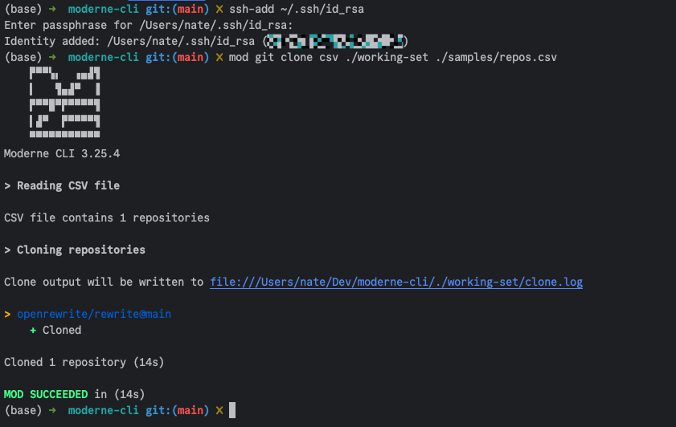
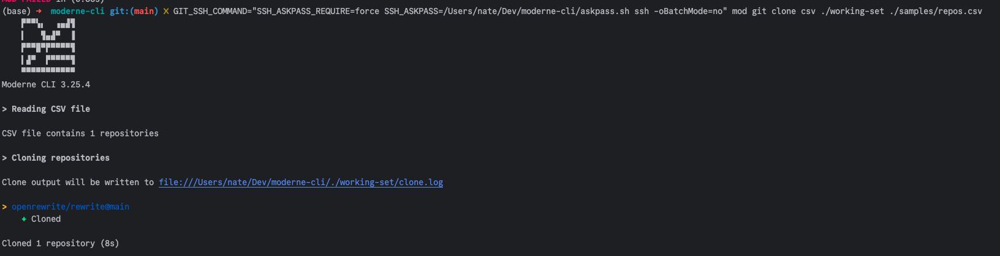

# SSH keys with passphrases

If you need to enter an SSH passphrase when you clone repositories, please follow the below instructions so that the Moderne CLI will work correctly for you.

## Option 1: Manually run `ssh-add` before you clone

If you authenticate with your SSH key in your terminal, the key will be added to the authentication agent and the mod commands should work as expected afterwards:

```bash
ssh-add ~/.ssh/id_rsa
```

<figure>
  
  <figcaption>_Running `ssh-add` prior to `mod git clone`_</figcaption>
</figure>

## Option 2: Create an executable script that will echo your SSH passphrase

This script should look like:

```bash
#!/bin/bash

echo "YOUR_PASSWORD_HERE"
```

When you go to run your `mod` commands, you would then need to provide the following `GIT_SSH_COMMAND` environment variable (make sure to replace `/PATH/TO/SCRIPT/` with the actual path to your script):

```bash
GIT_SSH_COMMAND="SSH_ASKPASS_REQUIRE=force SSH_ASKPASS=/PATH/TO/SCRIPT/ssh_askpass.sh ssh"
```

Here is what this looks like in practice:

<figure>
  
  <figcaption>_Using an environment variable with a custom script_</figcaption>
</figure>

To make this easier, you could create an alias that wraps this environment variable and the mod command such as in the following bash alias:

```bash
alias m='GIT_SSH_COMMAND="SSH_ASKPASS_REQUIRE=force SSH_ASKPASS=/PATH/TO/SCRIPT/ssh_askpass.sh ssh" mod'
```

You could then run commands like:

```bash
m git clone csv ./working-set ./samples/repos.csv
```