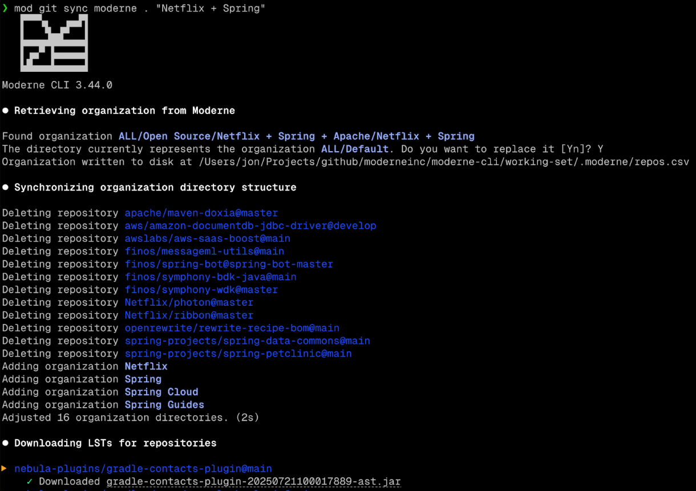
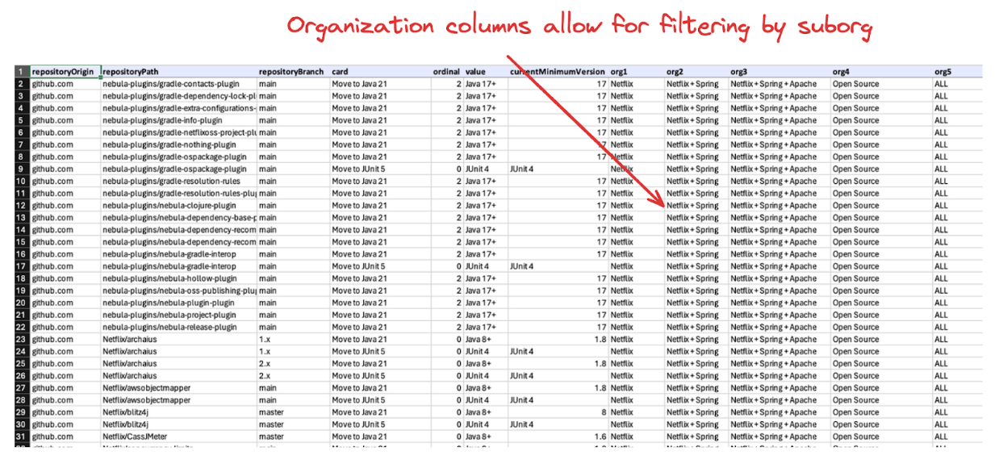
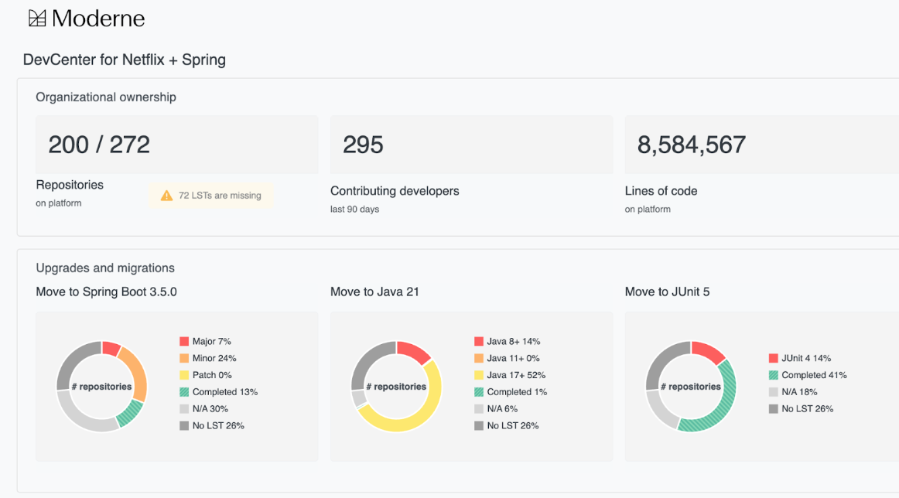

import Zoom from 'react-medium-image-zoom';
import 'react-medium-image-zoom/dist/styles.css';

# Moderne CLI 3.46.0 changes

Moderne CLI 3.46.0 introduces full support for **organizational structures**, matching how repositories have been organized in the Moderne Platform. This document covers what's changed, why we made these changes, and how they affect your workflow.

While adding organizational support is a major feature enhancement, the existing command structure has been intentionally left unchanged. Instead of introducing new commands or changing existing syntax, familiar commands like `mod run`, `mod study`, and `mod devcenter` simply gain new organizational awareness. They work exactly as before on individual repositories, but now also understand and operate on organizational hierarchies.

**Your current scripts and workflows will continue to work without modification.**

## Background

<figure>
  <Zoom>
    
  </Zoom>
  <figcaption></figcaption>
</figure>

The Moderne CLI started as a tool to run recipes on individual repositories without requiring build file modifications. It worked with any build system – Maven, Gradle, or others – providing a consistent interface for code transformation.

At that time, we focused on single repositories because multi-repository CLI tools didn't exist. The idea of operating on hundreds of repositories from the command line was unexplored territory.

By version 3, the CLI's scope increased to become a multi-repository, multiple-build tool. This brought its capabilities into rough alignment with the Moderne SaaS which was always multi-repository.

The Moderne SaaS itself grew to include a hierarchical organization structure. With 3.44.0, this organization structure comes to the Moderne CLI as well.

## Representing organization structure on disk

With the latest CLI changes, your organizational structure is now represented as folders on disk. Each organization and sub-organization gets its own directory, with repositories organized inside them. This creates an intuitive hierarchy that mirrors your actual team structure.

Commands like `mod devcenter`, `mod study`, and `mod run` understand this hierarchy. You can run them from a parent directory to operate on an entire organization, or you can `cd` into a sub-directory to focus on a specific team. The CLI's recursive behavior remains the same – it just now preserves organizational boundaries instead of flattening everything into one folder.

## `mod git sync`

`mod git sync` aligns your local directory structure with what's defined in [your repos.csv file](./repos-csv.md). This potentially destructive command will create, move, and delete directories as needed to match the specified organization structure. Since it modifies your filesystem, always verify you're in the correct directory before running it.

<figure>
  
  <figcaption></figcaption>
</figure>

### Downloading LSTs

`mod git sync` will also now download Lossless Semantic Trees (LSTs) to each directory by default rather than source code. This is because many tools and operations only need LSTs to function (e.g., Moddy Desktop, impact analysis, and AI tooling integrations) and we wanted it to be easier and quicker to get started.

To pull the latest LSTs in a directory that has been previously created, simply run `mod git sync` again.

:::info
In earlier iterations of the CLI, downloading LSTs from Moderne was a two-step operation that involved a `mod git clone` and a `mod build`. In the special case where a repository was cloned as "metadata-only", the only way for it to successfully build was to download an LST from Moderne. `mod build` still retains the ability to download LSTs. We think that’s still useful. There are no plans to change this.
:::

### Understanding the `.moderne` folder

<figure>
  <Zoom>
    
  </Zoom>
  <figcaption></figcaption>
</figure>

Each folder representing an organization will also get a `.moderne` folder. The `.moderne` folder will hold a `repos-lock.csv` file. In the case of a multilevel organization, the `repos-lock.csv` file for sub-organizations will always be a _strict subset_ of the `repos-lock.csv` file in its parent organization. Repositories will also get a `.moderne` folder that has a `repos-lock.csv` file. In most cases, this will only have a single row representing the repository. When a repository has multiple partitions configured, there will be a row for each partition in the `repos-lock.csv` file for that repository.

The `repos-lock.csv` is designed to hold the effective state of repositories as they become known. This includes not only the clone URI and branch but also the parsed origin/path/branch tuple, the changeset when an LST exists in Moderne, the published URI where the LST exists in the artifact repository, and a series of columns representing the organization hierarchy. This is analogous to the relationship between `package.json` and `package-lock.json` in the npm ecosystem.

While your original `repos.csv` that was used to perform ingestion only needed a clone URI at a minimum, by the time we fetch an effective `repos.csv` from Moderne, all the other columns will have been filled out.

### `mod git sync csv`

The `mod git sync csv` command will take your `repos.csv` file and materialize the state for it on disk. The `repos.csv` file could be as simple as a clone URI – or it could be complex and include organization columns, publish URIs, and other optional columns.

For a `repos.csv` file in its simplest form that only has a clone URI, this will create a flat directory structure of the repositories listed and clone the default branch for each repository. The directory structure is flat because no organizational structure has been specified. No LSTs will be synced because the `publishUri` column was not provided.

If you then add organization structure to that CSV and sync again, the directory structure will be created for the organizations, and repositories will be sorted into the correct organization directory. At this point, you can use `cd` to move up and down organization structures and perform operations on them.

### `mod git sync moderne`

`mod git sync` works similarly but starts with a request to an endpoint in either the Moderne SaaS or DX microservice to fetch the effective `repos.csv` for an organization. It saves that `repos.csv` to the `.moderne` directory and then delegates to `mod git sync csv`.

<figure>
  <Zoom>
    
  </Zoom>
  <figcaption></figcaption>
</figure>

### To include the `--with-sources` flag or not

Source code cloning is now **opt-in** via the `--with-sources` flag. By default, `mod git sync` only creates the directory structure and downloads LSTs, which is sufficient for most analysis and recipe operations. This significantly reduces sync time, especially for large organizations.

If you later need source code (for example, to commit changes), you can run `mod git sync` again with the `--with-sources` flag. The source code will be added to your existing structure without disturbing the LSTs.

If you've previously cloned without this option, and then do a subsequent `mod git sync` with `--with-sources`, the source code will be overlaid on the directory structure. So you can always start by syncing an org, running a recipe, and viewing the patch files and changes. If you decide that you want to act on it through committing, just do a `mod git sync <csv/moderne> --with-sources`. And then you can run `mod git apply`, etc. You don't have to decide up front that you're going to commit.

## Multi-organization commands

Starting out with `mod run`, you won't notice much difference. The command's options have not changed and will still operate recursively on directories, locating repository folders, and executing the recipe on every repository it finds. With the organization directory structure in place, you can `cd` up or down a directory to effectively change the scope of a recipe run, which is useful when developing and testing new recipes.

The output still shows an entry for each repository, irrespective of which organization it was in. We make no attempt to represent organization hierarchy in the step-by-step output.

`mod study` also still operates recursively on directories. But rather than producing just one output, it will now produce an output for each sub-organization that it finds.

<figure>
  <Zoom>
    
  </Zoom>
  <figcaption></figcaption>
</figure>

Each of the "Data table" links represents a data table at a different organization level. You can expect that the "Netflix" data table will always be a subset of the "Netflix + Spring" data table.

<figure>
  
  <figcaption></figcaption>
</figure>

A related change in `mod study` involves adding the org columns as the last columns in every data table that is produced by the CLI. BI tools consuming data tables will now have the added richness of understanding the impact at an organizational level. If there is no organization (such as when you're just running on a list of repositories on disk somewhere), the organization column will simply be absent.

At this point, the pattern is probably clear, but `mod devcenter` has also been enhanced to produce a DevCenter for every sub-organization.

`mod devcenter` delegates to `mod study` to produce the data tables for "security issues" and "upgrades and migrations" cards. It then uses these data tables to produce the DevCenter for every org.

<figure>
  <Zoom>
    
  </Zoom>
  <figcaption></figcaption>
</figure>

<figure>
  
  <figcaption></figcaption>
</figure>

## Output styling

The CLI now detects terminal capabilities and adjusts its output accordingly. Modern terminals get full Unicode characters, extended colors, and clickable links (OSC-8). Older terminals receive clean, readable output without these enhancements. The CLI automatically chooses the appropriate format based on what your terminal supports.

Earlier iterations we only distinguished between ANSI and non-ANSI capable terminals. Now we also distinguish between those terminals that support rendering extended UTF-8 characters and colors beyond the basic 256 color palette.

Separately, we also detect terminals that support OSC-8 links, which leads to shorter, more readable output when supported.

## Parallel by default

Parallel processing is now enabled by default for all supported commands. As we continue to evolve towards using the CLI as a fundamental component in AI workflows, speed is important. That's why we're making this change now.  

You can still make a parallel supporting command operate sequentially by passing the option `--parallel=1`. The value represents the number of concurrent operations permitted, so 1 effectively makes the command operate sequentially.

Explicitly passing the `--parallel` option with no value is still supported and has no effect since the command will run in parallel by default.

## Workflows

Here are some common workflows that demonstrate these new features:

### Initial workshop mass ingest

Start with a simple `repos.csv` containing just repository URLs (`cloneUri`). From there, consider adding organization columns to help organize repositories by team or function – though this can be done later if needed.

Perform a `mod git sync csv --with-sources` followed by `mod build` and then `mod publish`.

`mod build` will modify the `repos-lock.csv` to include the branch and changeset columns and `mod publish` will add the publishUri that it publishes to in the artifact repository. At this point, you have a `repos-lock.csv` for each organization that's shareable to other engineers. Another engineer could `mod git sync csv . repos-lock.csv` (even without `--with-sources`) and this would download the LSTs that you just published.

### Working in an existing directory with code

Existing repository directories work without modification. The CLI treats them as a single flat organization. Running `mod build` and `mod publish` creates the necessary `.moderne` metadata, allowing other developers to replicate your setup. You can adopt the organizational structure later when it fits your workflow.

## What happened to `mod git clone`, etc?

The commands `mod git clone csv` and `mod git clone moderne` are deprecated in favor of `mod git sync csv` and `mod git sync moderne`. The old commands still work but show a deprecation warning. "Sync" better reflects that these commands now handle both LSTs and source code, not just repository cloning.

Existing scripts using the old commands will continue to function since the new behavior is a superset of the old functionality.

Note that a `mod git clone csv` with a CSV that contains no publishUri will not sync LSTs. You can still use the command with no difference in operating characteristics by simply supplying it a `repos.csv` that doesn't have a publishUri column. Since this column wasn't officially part of the `repos.csv` format prior to 3.44.0, any existing workflows will not have had it anyway.

### What happens to `mod git clone/sync moderne` when there is no LST?

If LSTs aren't available, the `.moderne` folder is still created with repository and branch information, noting the missing LST. With `--with-sources`, the source code is cloned at the latest commit, allowing work to continue while LSTs are being generated.

### What `repos.csv` do I need to provide to agent/DX?

For agent or DX configurations, include both repository URL and branch in your `repos.csv`. If you don't know the default branches, run mass-ingest first – it produces an effective `repos.csv` with all branch information filled in, which can then be used for agent configuration.
