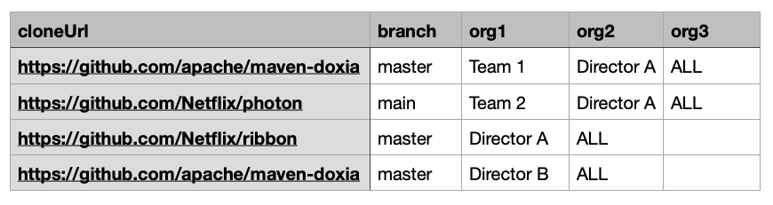
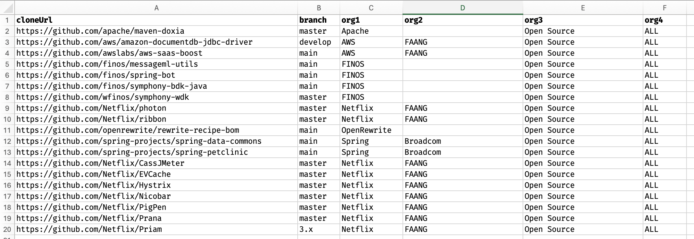

import Tabs from '@theme/Tabs';
import TabItem from '@theme/TabItem';

# Creating a repos.csv file

The `repos.csv` file is a central configuration file that defines your repositories and their organizational structure. This file is commonly used for:

1. **Mass ingestion** - Where you create this file and then use it to build LSTs for all of your repositories and publish them to your artifact repository
2. **Moderne Platform org hierarchy** - Where you provide this file to the Moderne agent that is then used to create organizations in the platform
3. **Moderne DX org hierarchy** - Where you provide this file to Moderne DX to create an organizational hierarchy there
4. **Local operations** - Where you provide the CLI with this file so you can clone repositories or their LSTs to your local machine for things like recipe running or creating a `repos-lock.csv` file to share with others

This doc will provide you with everything you need to know about creating and using this file.

:::tip
After creating your `repos.csv` file and running initial setup commands, the Moderne CLI will generate a [`repos-lock.csv` file](../how-to-guides/repos-lock-csv.md) that captures the exact state of your repositories. This lock file can be shared with team members to ensure everyone has an identical setup.
:::

## Supported columns

| Column name       | Required | Description                                                                                                                                                                                                                                                                                                                                       |
|-------------------|----------|---------------------------------------------------------------------------------------------------------------------------------------------------------------------------------------------------------------------------------------------------------------------------------------------------------------------------------------------------|
| cloneUrl          | `true`   | The URL of the repository that should be ingested. <br /><br />Example: `git@github.com:google/guava.git` or `https://github.com/openrewrite/rewrite`                                                                                                                                                                                             |
| branch            | `true`   | The branch of the repository that should be checked out.<br /><br />Example: `main`                                                                                                                                                                                                                                                               |
| origin            | `true`   | The host domain of the repository including any context root used by the server.<br /><br />Example: `github.com`, `gitlab.com`, `bitbucket.org`, `mycompany.com/bitbucket`                                                                                                                                                                       |
| path              | `true`   | The organization and repository name portion of the clone URL. This is typically the remainder of the cloneUrl after `origin` minus any leading symbols and trailing `.git`. For SCP-style URLs (like `git@github.com:moderneinc/moderne-docs`), the path is typically the portion after the `:`. <br /><br />Example: `moderne-inc/moderne-docs`, `openrewrite/rewrite`, `businessunit/teamA/subteamB/app` |
| alternateCloneUrl | `false`  | If the `cloneUrl` doesn't work, then we will attempt to clone from this URL. This is commonly filled out if you want to provide both an HTTP link and an SSH link for a repository. Multiple columns with this name are supported for organizations that have additional clone URLs.                                                              |
| changeset         | `false`  | If provided, this will check out the repository at this specific commit SHA. <br /><br />Example: `aa5f25ac0031`                                                                                                                                                                                                                                  |
| gradleArgs        | `false`  | Build arguments that are added to the end of the Gradle command line when building LSTs.<br /><br />Example: `-Dmyprop=myvalue`                                                                                                                                                                                                                   |
| java              | `false`  | Configures the JDK to use during LST generation.<br /><br />Example: `17` or `17-tem` or `17.0.6-tem`                                                                                                                                                                                                                                             |
| jvmopts           | `false`  | JVM options added to tools building LSTs. Must be configured before you can run the build command if non-standard VM options are required.<br /><br />Example: `-Xmx4G`                                                                                                                                                                           |
| mavenArgs         | `false`  | Build arguments are added to the end of the Maven command line when building LSTs.<br /><br />Example: `-Pfast`                                                                                                                                                                                                                                   |
| org*              | `false`  | If you want to configure an organizational hierarchy, you can provide one or more organization columns. Each column will specify an organization the repository should be part of. The column name should be `org` plus a number such as: `org1,org2,org3`. There is no limit for how many orgs you can define.<br /><br />Example: `openrewrite` |

### Understanding origin and path values

The Moderne Platform uses a combination of `origin`, `path`, and `branch` to uniquely identify a specific repository. In general, all repositories coming from the same SCM server should have the same `origin` – whereas the `path` and `branch` will differ. The combination of `origin`, `path`, and `branch` must uniquely identify each row in your `repos.csv`.

Different SCM providers format their clone URLs differently, making it impossible to automatically extract the correct `origin` and `path` values. You might also be running your SCM behind a reverse proxy or context root – which would further complicate this. Because of that, we require that you explicitly provide all of these values for each row. 

Below you can find examples of what origin/path typically looks like for common SCM providers:

#### GitHub

| Protocol | Clone URL Pattern                     | Origin       | Path           |
|----------|---------------------------------------|--------------|----------------|
| HTTPS    | `https://github.com/{org}/{repo}.git` | `github.com` | `{org}/{repo}` |
| SSH      | `git@github.com:{org}/{repo}.git`     | `github.com` | `{org}/{repo}` |

#### GitLab

| Protocol | Clone URL Pattern                        | Origin       | Path              |
|----------|------------------------------------------|--------------|-------------------|
| HTTPS    | `https://gitlab.com/{groups}/{repo}.git` | `gitlab.com` | `{groups}/{repo}` |
| SSH      | `git@gitlab.com:{groups}/{repo}.git`     | `gitlab.com` | `{groups}/{repo}` |

* GitLab allows deeply nested folders to organize repositories. The `path` field must include the complete hierarchy of all group and subgroup folders. For example, if your repository is organized as `groupa/groupb/groupc/repo`, the entire path including all intermediate groups must be specified in the `path` field.

#### Bitbucket Cloud

| Protocol | Clone URL Pattern                        | Origin          | Path           |
|----------|------------------------------------------|-----------------|----------------|
| HTTPS    | `https://bitbucket.org/{org}/{repo}.git` | `bitbucket.org` | `{org}/{repo}` |
| SSH      | `git@bitbucket.org:{org}/{repo}.git`     | `bitbucket.org` | `{org}/{repo}` |

#### Bitbucket Data Center

| Protocol | Clone URL Pattern                               | Origin             | Path           |
|----------|-------------------------------------------------|--------------------|----------------|
| HTTPS    | `https://{host}/bitbucket/scm/{org}/{repo}.git` | `{host}/bitbucket` | `{org}/{repo}` |
| SSH      | `ssh://{host}:7999/bitbucket/{org}/{repo}.git`  | `{host}/bitbucket` | `{org}/{repo}` |

* As a self-hosted option, Bitbucket Data Center is often deployed with a context root (e.g., the `/bitbucket` in the above examples). This context root should be included as part of the `origin` field, not the `path` field.
* HTTPS clone URLs for Bitbucket Data Center include `/scm/` between the host/context and the project/repo path. This `/scm/` segment is part of Bitbucket's URL structure but must be excluded from the `path` field.
* SSH clone URLs for Bitbucket Data Center use the `ssh://` protocol prefix and typically run on port 7999 (the default port). Neither the protocol (`ssh://`) nor the port number (`:7999`) should be included in the `origin` or `path` fields.

#### Azure DevOps

| Protocol | Clone URL Pattern                                   | Origin          | Path                     |
|----------|-----------------------------------------------------|-----------------|--------------------------|
| HTTPS    | `https://dev.azure.com/{org}/{project}/_git/{repo}` | `dev.azure.com` | `{org}/{project}/{repo}` |
| SSH      | `git@ssh.dev.azure.com:v3/{org}/{project}/{repo}`   | `dev.azure.com` | `{org}/{project}/{repo}` |

* Azure DevOps inserts `/_git/` into HTTPS clone URLs to distinguish git repositories from other project resources. This `/_git/` segment must be excluded from the `path` field.
* SSH clone URLs use a different host (`ssh.dev.azure.com` instead of `dev.azure.com`) and include `:v3/` as a version identifier. Despite the different host in the SSH URL, the `origin` should still be `dev.azure.com` for consistency across both protocols. The `:v3/` version identifier must be excluded from the `path` field.

#### On-premises SCM providers

| Protocol | Clone URL Pattern                                   | Origin          | Path                     |
|----------|-----------------------------------------------------|-----------------|--------------------------|
| HTTPS    | `https://{host}/{context}/{org}/{repo}` | `{host}` | `{org}/{repo}` |
| SSH      | `git@{host}:{org}/{repo}` or `ssh://{host}:{port}/{org}/{repo}`   | `{host}` | `{org}/{repo}` |

For self-hosted providers such as GitHub Enterprise, Self-Managed GitLab, or Bitbucket Data Center or providers behind a custom domain, you'll need to identify any context root and include that in the `origin` and not the `path`. Depending on the SCM provider, you may need to alter the host or path in similar ways as noted above to remove provider-specific parts of the URL.

### Using `alternateCloneUrl` to support multiple protocols

You can provide both `cloneUrl` and `alternateCloneUrl` to support both your primary protocol (HTTPS or SSH) and a secondary protocol for maximum flexibility. In situations where your organization allows read access over one protocol but only allows commits through a different protocol, this enables the Moderne Platform to present a single repository while correctly supporting both workflows. This also allows matching when an LST is built manually from a git repository cloned with the secondary URL.

If the `cloneUrl` and `alternateCloneUrl` differ in their domain (as is the case with Azure DevOps above), you should set `origin` based on the HTTPS URL (since origins are used to build URLs for SCM API calls such as creating PRs) in a consistent way across HTTPS and SSH repositories for that SCM provider so that Moderne can successfully identify the repository in both cases. The origin should always be the root of the service on HTTP(S) but without the protocol and can most easily be inferred from the HTTP(S) clone URL.

## Generating this file

To kick-start a `repos.csv` file, we recommend using "[repo fetchers](https://github.com/moderneinc/repository-fetchers)". Repo fetchers are scripts that generate a CSV file of all of your repositories by making API calls to your source code manager.

## Defining an organizational hierarchy

Org hierarchy is best explained with an example. Consider an organization that consists of two teams and two directors:

```
All
├── Director A
|       └── Team 1
|       └── Team 2
├── Director B

```

The following CSV file would represent this organizational structure:

```bash showLineNumbers
cloneUrl,branch,org1,org2,org3
"https://github.com/apache/maven-doxia","master","Team 1","Director A","ALL"
"https://github.com/Netflix/photon","main","Team 2","Director A","ALL"
"https://github.com/Netflix/ribbon","master","Director A","ALL"
"https://github.com/apache/maven-doxia","master","Director B","ALL"
```

In the above file, we define 5 organizations (ALL, Director A, Director B, Team 1, and Team 2) and 3 repositories. Notice that one repository can be defined multiple times if you want two distinct organizations to have access to it.

Also note that organizations on the left are children of organizations on the right. For instance, `Team 1` is a child of `Director A` which is a child of `ALL`.

:::tip
Comma-separated files (CSV) are best manipulated using a dedicated editor such as Microsoft Excel, Google Sheets, or Apple Numbers. Here is what the above CSV would look like on Apple Numbers:

<figure>
  
  <figcaption></figcaption>
</figure>
:::

## Formatting details

* A single row may not have more columns than what is defined in the first row.
* A single repository may be associated with multiple organizations by being referenced in multiple rows. In the above example, `maven-doxia` is associated with both `Director B` and `Team 1`.
* You can add empty orgs to the beginning, middle, or end of a row to make them line up as desired (although you don't need to).
* You can choose to surround elements with quotes or not depending on your preference – just keep in mind general CSV formatting rules.
* You can order columns in any way.

<figure>
  
  <figcaption>_An example demonstrating various orgs lining up with blanks in between_.</figcaption>
</figure>
