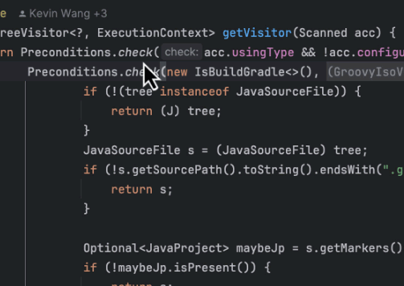
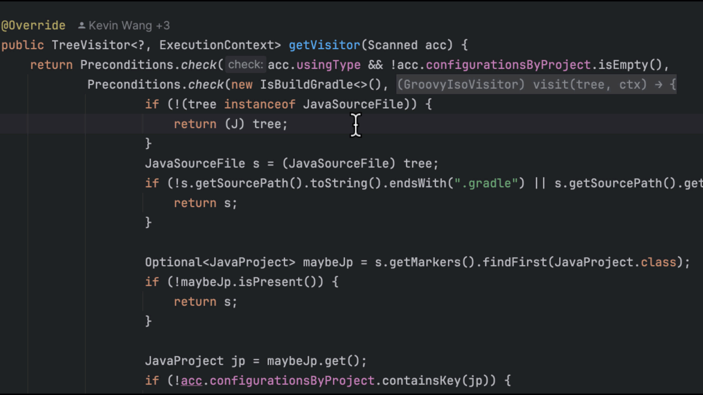

# How to create recipes

When planning large-scale code changes, it's a good idea to begin by creating a recipe that identifies all of the potential edit sites. Doing so gives you a full impact analysis of what you're about to do, before you actually do it. Taking the time to find all of these locations is especially important because real-world code is complex and nuanced. Without a proper accounting of this nuance, writing a _transformation_ recipe will not be as accurate as you'd wish.

The Moderne plugin helps simplify this process by providing you with an easy way to create a search recipe for any piece of your code.

In this short guide, we'll walk through everything you need to know to get started with recipe creation using the Moderne plugin.

## Ways to create recipes

To begin, find some API that you're interested in searching for. Then right-click on one of its usages and either:

* Click on `Find Usages on All Repos` and then click on `Create Recipe` (selecting the [type of recipe that you want to create](#types-of-recipes-you-can-create)). This will create a _search_ recipe based on the API you specified.

<figure>
  
</figure>

* Click on `Refactor`, select `Create OpenRewrite Recipe...`, and then click on `Create Recipe` (selecting the [type of recipe you want to create](#types-of-recipes-you-can-create)). This will create a _refactor_ recipe based on the API you specified. Please note that IntelliJ IDEA offers a keyboard shortcut for the `Create OpenRewrite Recipe...` menu (it defaults to alt + command + 9 on a Mac).



## Types of recipes you can create

The Moderne plugin allows you to create two types of recipes: [Refaster recipes](https://docs.openrewrite.org/authoring-recipes/refaster-recipes) and [Imperative visitor-based recipes](https://docs.openrewrite.org/authoring-recipes/types-of-recipes#imperative-recipes).

Refaster recipes are better if you're doing a straightforward replacement (such as converting `StringUtils.equals(..)` to `Objects.equals(..)`). For everything else, you should create an Imperative recipe.

<details>

<summary>Refaster recipe example</summary>

```java
package org.openrewrite.gradle;

import org.openrewrite.TreeVisitor;
import org.openrewrite.Preconditions;
import com.google.errorprone.refaster.annotation.AfterTemplate;
import com.google.errorprone.refaster.annotation.BeforeTemplate;
import org.openrewrite.java.template.RecipeDescriptor;

@RecipeDescriptor(
        name = "My recipe name",
        description = "A full sentence description."
)
class MyRecipe9 {
    @BeforeTemplate
    TreeVisitor before(Preconditions p, boolean check, TreeVisitor v) {
        return p.check(check, v);
    }
    
    @AfterTemplate
    TreeVisitor after(Preconditions p, boolean check, TreeVisitor v) {
        // TODO what do you want it to be after?
        return null;
    }
}
```

</details>

<details>

<summary>Visitor recipe example</summary>

```java
package org.openrewrite.gradle;

import org.openrewrite.ExecutionContext;
import org.openrewrite.Preconditions;
import org.openrewrite.Recipe;
import org.openrewrite.TreeVisitor;
import org.openrewrite.internal.lang.NonNullApi;
import org.openrewrite.java.JavaIsoVisitor;
import org.openrewrite.java.MethodMatcher;
import org.openrewrite.java.search.UsesMethod;
import org.openrewrite.java.tree.J;
import org.openrewrite.marker.SearchResult;

@NonNullApi
class MyRecipe10 extends Recipe {

    @Override
    public String getDisplayName() {
        return "My recipe";
    }

    @Override
    public String getDescription() {
        return "This is a description of what the recipe does.";
    }

    @Override
    public TreeVisitor<?, ExecutionContext> getVisitor() {
        MethodMatcher matcher = new MethodMatcher("org.openrewrite.Preconditions#check(boolean,org.openrewrite.TreeVisitor)");
        return Preconditions.check(new UsesMethod<>(matcher), new JavaIsoVisitor<>() {
            @Override
            public J.MethodInvocation visitMethodInvocation(J.MethodInvocation method, ExecutionContext ctx) {
                if (matcher.matches(method)) {
                    // TODO do something other than just mark the method as found?
                    return SearchResult.found(method);
                }
                return super.visitMethodInvocation(method, ctx);
            }
        });
    }
}
```

</details>

For more information on recipe development, check out the [OpenRewrite authoring recipes docs](https://docs.openrewrite.org/authoring-recipes).
