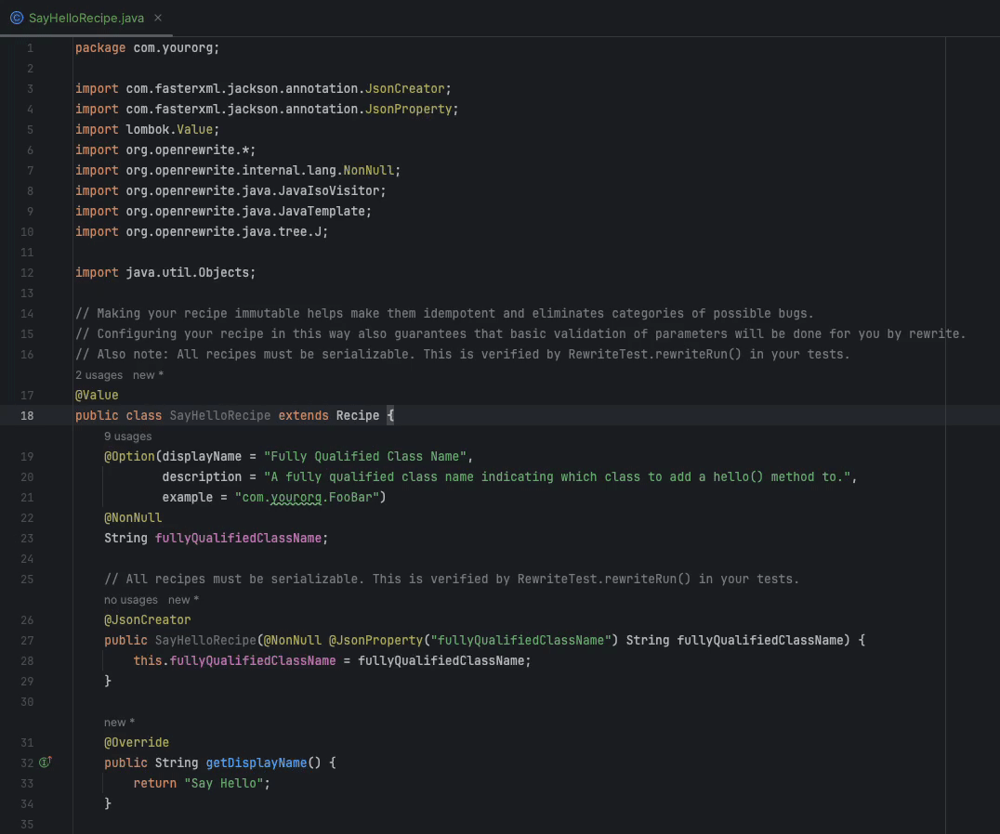
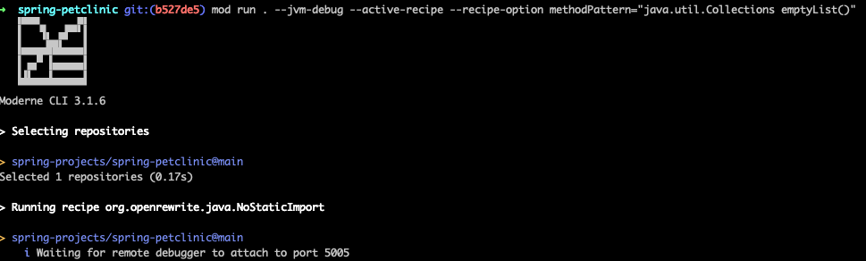
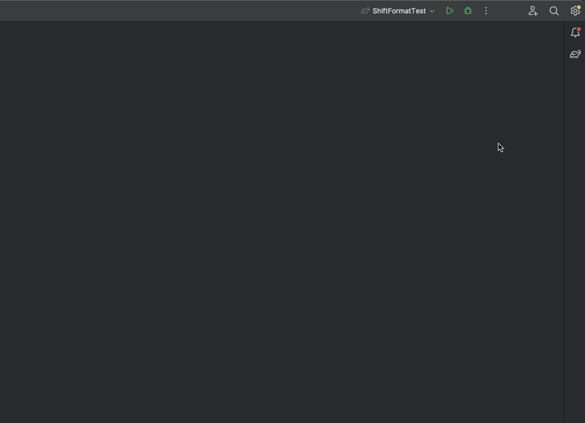
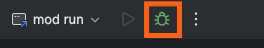

# How to debug a recipe using the Moderne plugin

One key benefit of the Moderne IDE plugin is the ability to quickly debug recipes against real code. You can set breakpoints in your IDE and have those be hit when you run a recipe in the Moderne CLI – so you can know exactly what is happening in the recipe.

In this short guide, we'll walk you through everything you need to know to do this.

## Prerequisites

Please ensure that [you've installed and configured the Moderne IDE plugin](./moderne-plugin-install.md).

## Step 1: Set the active recipe

Open the recipe you wish to debug in IntelliJ IDEA. From there, right-click on the class name. You should see an option to set the active recipe:

<figure>
  
  <figcaption></figcaption>
</figure>

:::info
Behind the scenes, when you click on `Set Active Recipe`, an active recipe file will be created at: `~/.moderne/cli/active.recipe`.
:::

## Step 2: Build LSTs

In order to test a recipe, you will need to run it on a project that has been built with the [Moderne CLI](../../moderne-cli/getting-started/cli-intro.md).

Open up your terminal and navigate to the directory you wish to build (said directory could contain one or more repositories you wish to generate LSTs for). Then run the command:

```bash
mod build .
```

## Step 3: Run the active recipe to confirm it was configured correctly

With the LSTs built and the active recipe specified, make sure that the correct recipe is being run by running the following command:

```bash
mod run . --active-recipe
```

You should see that the recipe you specified in your IDE is the one that is run in your terminal.

## Step 4: Debug your recipe

1. In IntelliJ IDEA, set one or more breakpoints
2. Go to your terminal and run the command `mod run . --jvm-debug --active-recipe`. The CLI will wait for a debugger to be attached to run the recipe.
    * **Note**: Depending on the recipe you may need to provide _additional parameters_ in the run command such as `--recipe-option methodPattern="java.util.Collections emptyList()"`. This will depend on what the recipe itself requires to run. Some recipes may require no params, whereas others may require many.

<figure>
  
  <figcaption>_Debugger attaching_</figcaption>
</figure>

3. Open up your IDE and create a new debug run configuration. You can do this by clicking on the vertical triple dots in the top-right corner, selecting `Edit...`, and then adding a new `Remote JVM Debug`:

<figure>
  
  <figcaption>_Adding Remote JVM Debugger_</figcaption>
</figure>

4. Once you've created the debugger, launch it by clicking on the bug icon in the top-right corner of your screen:

<figure>
  
  <figcaption>_Debug icon_</figcaption>
</figure>

5. Your recipe should then begin to run in your terminal - pausing at the breakpoints to allow you to debug. Victory!