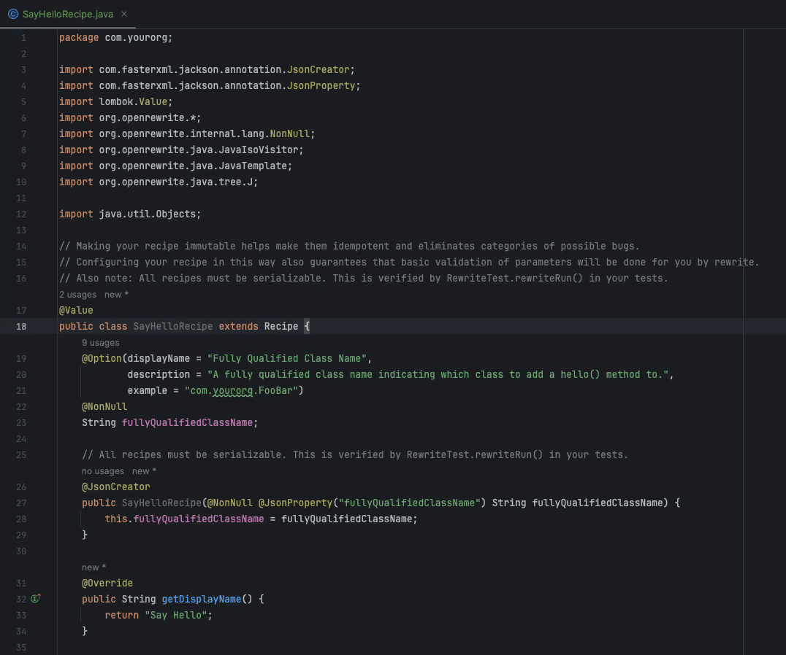
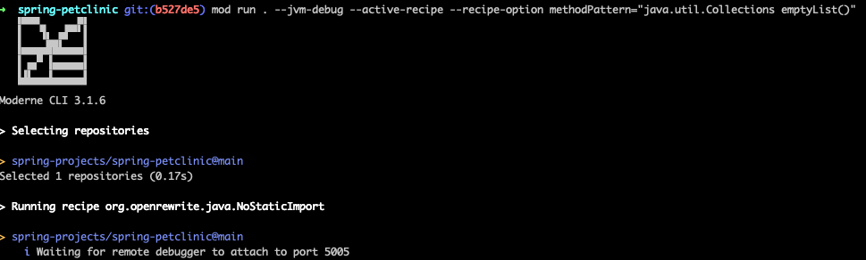
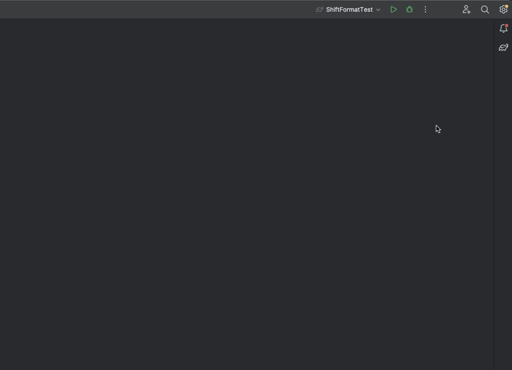
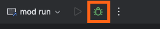

# How to debug a recipe using the Moderne plugin

One key benefit of the Moderne IDE plugin is the ability to quickly debug recipes against real code. You can set breakpoints in your IDE and have those be hit when you run a recipe in the Moderne CLI – so you can know exactly what is happening in the recipe.

In this short guide, we'll walk you through everything you need to know to do this.

## Prerequisites

Please ensure that [you've installed and configured the Moderne IDE plugin](./moderne-plugin-install.md).

:::tip
The Moderne plugin is a convenience layer, not a requirement. If you don't use IntelliJ IDEA – or you'd rather not install the plugin – you can drive this entire workflow from the Moderne CLI instead. See [Debugging without the Moderne plugin](#debugging-without-the-moderne-plugin) below.
:::

## Step 1: Set the active recipe

Open the recipe you wish to debug in IntelliJ IDEA. From there, right-click on the class name. You should see an option to set the active recipe:

<figure>
  
  <figcaption></figcaption>
</figure>

:::info
Behind the scenes, when you click on `Set Active Recipe`, an active recipe file will be created at: `~/.moderne/cli/active.recipe`.
:::

## Step 2: Build LSTs

In order to test a recipe, you will need to run it on a project that has been built with the [Moderne CLI](../../moderne-cli/getting-started/cli-intro.md).

Open up your terminal and navigate to the directory you wish to build (said directory could contain one or more repositories you wish to generate LSTs for). Then run the command:

```bash
mod build .
```

## Step 3: Run the active recipe to confirm it was configured correctly

With the LSTs built and the active recipe specified, make sure that the correct recipe is being run by running the following command:

```bash
mod run . --active-recipe
```

You should see that the recipe you specified in your IDE is the one that is run in your terminal.

## Step 4: Debug your recipe

1. In IntelliJ IDEA, set one or more breakpoints
2. Go to your terminal and run the command `modw --debug run . --active-recipe`. The CLI will suspend on startup and wait for a debugger to be attached before running the recipe. By default, it listens on port 5005. You can specify a custom port with `modw --debug=PORT run . --active-recipe`.
    * **Note**: Depending on the recipe you may need to provide _additional parameters_ in the run command such as `--recipe-option methodPattern="java.util.Collections emptyList()"`. This will depend on what the recipe itself requires to run. Some recipes may require no params, whereas others may require many.

<figure>
  
  <figcaption>_Debugger attaching_</figcaption>
</figure>

3. Open up your IDE and create a new debug run configuration. You can do this by clicking on the vertical triple dots in the top-right corner, selecting `Edit...`, and then adding a new `Remote JVM Debug`:

<figure>
  
  <figcaption>_Adding Remote JVM Debugger_</figcaption>
</figure>

4. Once you've created the debugger, launch it by clicking on the bug icon in the top-right corner of your screen:

<figure>
  
  <figcaption>_Debug icon_</figcaption>
</figure>

5. Your recipe should then begin to run in your terminal - pausing at the breakpoints to allow you to debug. Victory!

## Debugging without the Moderne plugin

The Moderne IntelliJ plugin only automates two of the steps above: it sets the active recipe for you (Step 1) and wires up the remote debugger (Step 4). Both are plain CLI mechanisms underneath, so you can debug recipes from any editor – VS Code, Eclipse, Vim, and so on – without installing the plugin at all.

### Set the active recipe from the CLI

Instead of right-clicking the class in IntelliJ, point the CLI at your recipe source file:

```bash
mod config recipes active set src/main/java/com/example/MyRecipe.java
```

This detects whether the project uses Gradle or Maven, extracts the classpath, and writes the same `~/.moderne/cli/active.recipe` file that `Set Active Recipe` produces. It accepts `.java`, `.yml`, and `.yaml` files, and takes a `--recipe` option to select a specific recipe from a multi-document YAML file or a nested Java class.

Confirm what's configured with:

```bash
mod config recipes active show
```

From here, building LSTs (Step 2) and running the active recipe to confirm it (Step 3) are exactly the same – `mod build .` and `mod run . --active-recipe` don't depend on the plugin.

### Attach a debugger from any IDE

Run the recipe with the wrapper's `--debug` flag, just as in Step 4:

```bash
modw --debug run . --active-recipe
```

The CLI suspends on startup and waits for a debugger on port 5005 (use `modw --debug=PORT run . --active-recipe` for a custom port). This is a standard JDWP attach, so any JDWP-capable debugger works:

* **IntelliJ IDEA** (no Moderne plugin needed) – create a **Remote JVM Debug** configuration pointing at host `localhost` and port `5005`, then start it.
* **VS Code** – add a `Java: Attach` launch configuration targeting port `5005`.
* **Eclipse, `jdb`, or any other JDWP client** – attach to `localhost:5005`.

Set your breakpoints in the recipe source before attaching. Once the debugger connects, the suspended CLI resumes and stops at your breakpoints.

To iterate, edit the recipe, rebuild it, and re-run the `modw --debug run . --active-recipe` command. The active recipe persists in `~/.moderne/cli/active.recipe`, so you only need to re-run `mod config recipes active set` if the recipe or its classpath changes.

The table below maps each plugin action to its plugin-free CLI equivalent:

| Plugin action | Plugin-free CLI equivalent |
| ------------- | -------------------------- |
| Select the active recipe | `mod config recipes active set <recipeFile>` |
| Inspect the active recipe | `mod config recipes active show` |
| Run the active recipe | `mod run . --active-recipe` |
| Launch with a debugger attached | `modw --debug run . --active-recipe` |
| Attach the debugger | Any IDE's **Remote JVM Debug** to `localhost:5005` |
