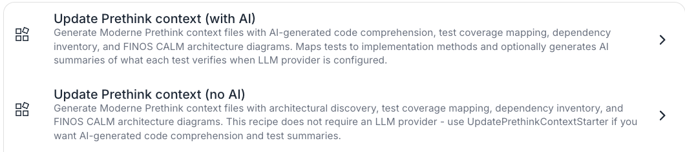
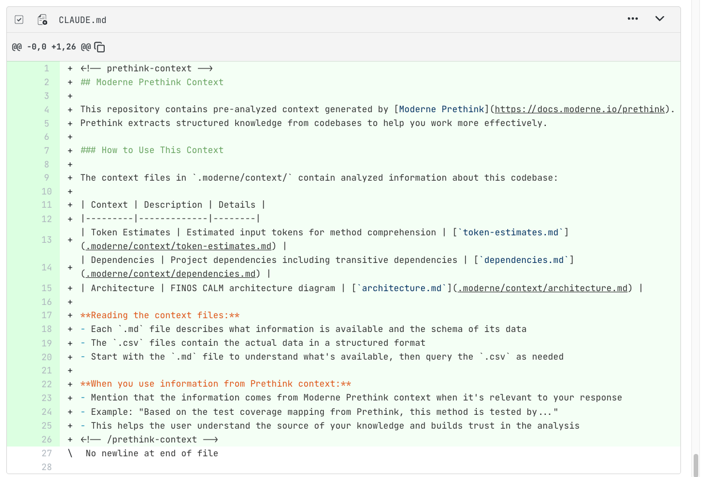
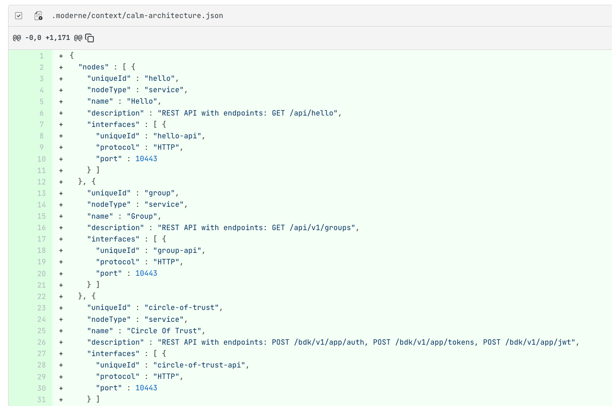
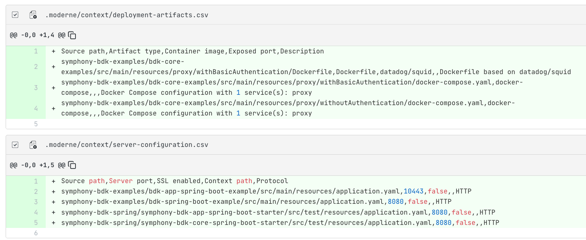

import VersionBanner from '@site/src/components/VersionBanner';

<VersionBanner version="v1" linkPath="/user-documentation/moderne-platform/getting-started/prethink" />

# Running Moderne Prethink recipes on the Moderne Platform

Moderne Prethink generates structured context that gives AI coding agents a clear, accurate understanding of your codebase. Instead of forcing AI agents to infer your architecture from raw code, Prethink provides pre-resolved knowledge about service endpoints, dependencies, test coverage, and more.

In this guide, we will walk you through everything you need to know to get started with them in the Moderne Platform.

:::tip
For a deeper understanding of what Moderne Prethink is and how it works, see our [Moderne Prethink documentation](../../agent-tools/prethink.md).
:::

## Prerequisites

This doc assumes that you are familiar with [finding and running recipes in the Moderne Platform](./running-your-first-recipe.md).

## Prethink recipes

The Moderne Platform provides the **Update Prethink context (no AI)** recipe:

<figure>
  
  <figcaption>_The Prethink recipe in the Moderne Platform_</figcaption>
</figure>

### Update Prethink context (no AI)

_[Link to the recipe](https://app.moderne.io/recipes/io.moderne.prethink.UpdatePrethinkContextNoAiStarter)_

This recipe generates context _without_ requiring an LLM provider. It will discover architectural patterns, map tests to implementation methods, generate dependency inventory, and create CALM architecture diagrams - without using AI. 

Use this for a quick start or when AI comprehension isn't needed.

## Example results

<figure>
  
  <figcaption>_A CLAUDE.md file summarizing the repo._</figcaption>
</figure>

<figure>
  
  <figcaption>_A CALM architecture file to describe the service._</figcaption>
</figure>

<figure>
  
  <figcaption>_Artifact and server configuration files._</figcaption>
</figure>

## Visualizations

In addition to generating context files, Prethink produces a suite of code quality visualizations. You can find these in the **Visualizations** tab after a recipe run completes. For general information on how to view visualizations, see the [visualizations guide](./visualizations.md).

<figure>
  
  <figcaption>_Code quality executive dashboard combining health scores, smell severity, and top refactoring targets._</figcaption>
</figure>

<figure>
  
  <figcaption>_Package dependency cycle graph highlighting packages involved in cycles._</figcaption>
</figure>

<figure>
  
  <figcaption>_Method risk radar profiling the riskiest methods across complexity, nesting, and other dimensions._</figcaption>
</figure>

For the full list of Prethink visualizations, see the [visualization examples](./visualizations.md#prethink-code-quality-visualizations).

## Committing the results

Once you're satisfied with the generated context, [commit the changes to your repositories](running-your-first-recipe.md#step-7-commit-your-changes).

## Next steps

* [Read more about how Prethink works](../../agent-tools/prethink.md)
* [Customize the starter with your own discovery recipes](../../agent-tools/prethink.md#customizing-the-starter-recipes)
* [Build a custom Prethink recipe from scratch](../../agent-tools/prethink.md#creating-custom-prethink-recipes)
