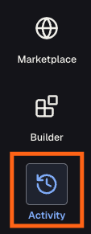
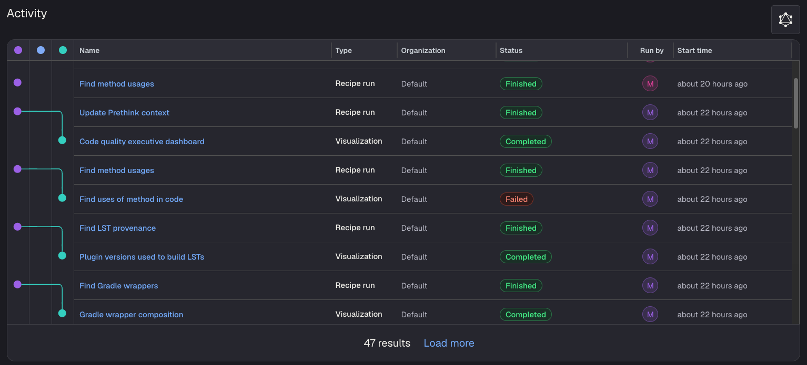
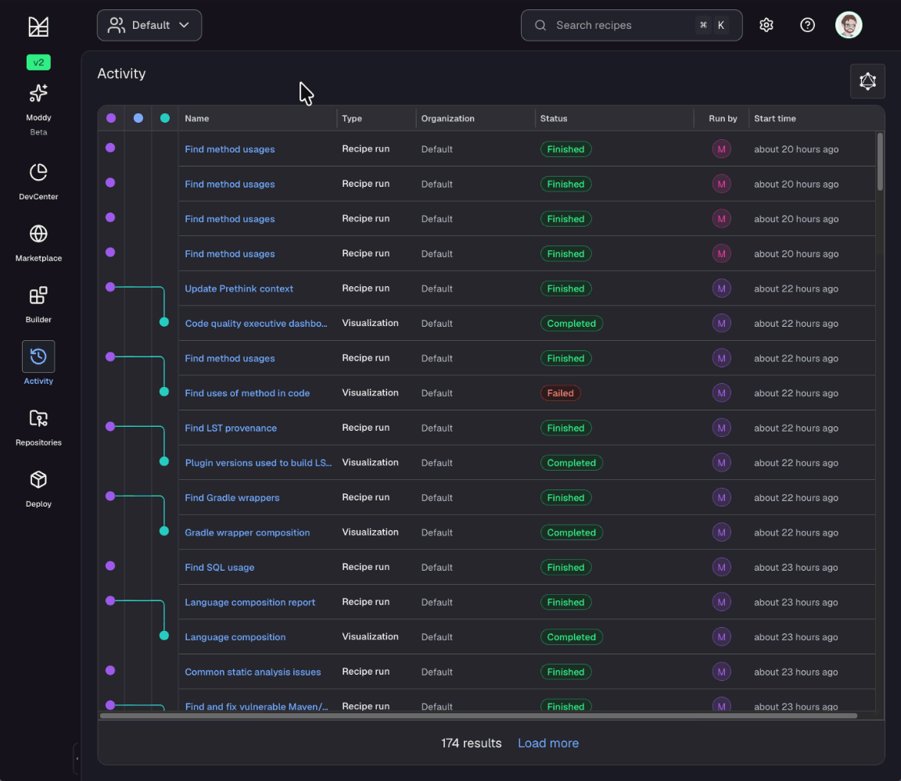
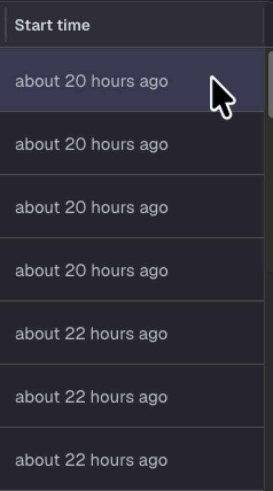
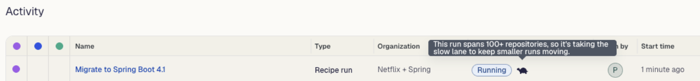

import ReactPlayer from '@site/src/components/VideoPlayer';
import VersionBanner from '@site/src/components/VersionBanner';

<VersionBanner version="v2" linkPath="/user-documentation/moderne-platform-v1/getting-started/activity-view" />

# Using the activity view

As you run recipes, commit code, and examine visualizations, you might find it beneficial to get a higher level picture of what's happened in a specific organization. Did you commit that one recipe run? Has someone else already run a visualization you wanted? Maybe someone has run a recipe you've never heard of before, and you want to learn more about it for yourself. All of these can be answered with the Moderne activity view.

In this guide, we'll help you navigate to the activity view, and we'll make sure you understand each part of the page.

<ReactPlayer className="reactPlayer" url='https://www.youtube.com/watch?v=0v3fMELfa-8' controls="true" />

## Accessing the activity view

From the left-hand navigation bar, click on `Activity`:

<figure>
  
  <figcaption></figcaption>
</figure>

That will take you to the [activity view](https://app.moderne.io/recent-activity) for the **organization you have selected**.

<figure>
  
  <figcaption></figcaption>
</figure>

:::info
If your organizations are hierarchical (meaning that one organization contains 1 or more sub-organizations), you will see all of the repositories in both the selected organization and its sub-organizations.
:::

## Parts of the activity view

### Navigate to the recipe, commit, or visualization

If you want to get more information about a recipe, commit, or a visualization, you can click on the activity name. That will redirect you to the specific recipe run, commit, or visualization, so you can see the results for yourself:

<figure>
  
  <figcaption></figcaption>
</figure>

### More detailed time tracking

If you want more specific times for when things happened rather than "about 2 hours ago" or "1 day ago", you can click on any of the times in the `Start time` column to cycle through various date time formats:

<figure style={{maxWidth: '300px', margin: '0 auto'}}>
  
</figure>

### Slow lane indicator

Recipe runs are queued, and runs against organizations with more than 100 repositories take a slower queue so that smaller runs aren't stuck behind them. When a run takes that queue, a slow lane indicator appears next to its status in the `Status` column. Hover over it to see why the run was placed there:

<figure>
  
  <figcaption>_A slow lane run, with the tooltip explaining why it's queued behind smaller runs._</figcaption>
</figure>

The indicator is informational. You don't pick a lane, and a slow lane run isn't limited in any way beyond when it starts.
