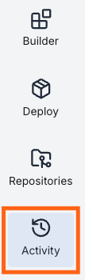
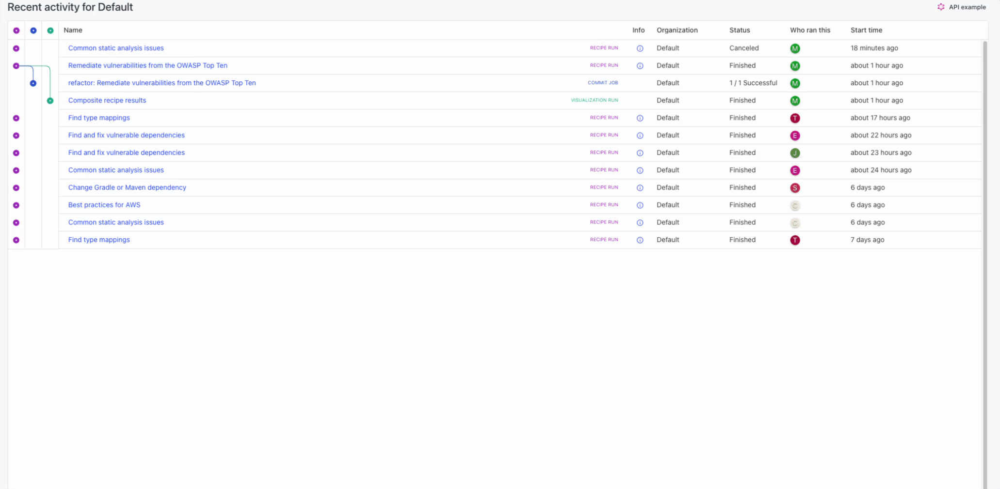

import ReactPlayer from 'react-player';

# Using the activity view

As you run recipes, commit code, and examine visualizations, you might find it beneficial to get a higher level picture of what's happened in a specific organization. Did you commit that one recipe run? Has someone else already run a visualization you wanted? Maybe someone has run a recipe you've never heard of before, and you want to learn more about it for yourself. All of these can be answered with the Moderne activity view.

In this guide, we'll help you navigate to the activity view, and we'll make sure you understand each part of the page.

<ReactPlayer className="reactPlayer" url='https://www.youtube.com/watch?v=0v3fMELfa-8' controls="true" />

## Accessing the activity view

From the left-hand navigation bar, click on `Activity`:

<figure>
  
</figure>

That will take you to the [activity view](https://app.moderne.io/recent-activity) for the **organization you have selected**.

:::info
If your organizations are hierarchical (meaning that one organization contains 1 or more sub-organizations), you will see all of the repositories in both the selected organization and its sub-organizations.
:::

## Parts of the activity view

### Highlight recipes, commits, or visualizations

In the top-left hand corner of the activity view, there are three circles you can click on. The first circle represents recipes, the second circle represents commits, and the last represents visualizations. You can click on the circles to highlight the rows that match your selection:

### Navigate to the recipe, commit, or visualization

If you want to get more information about a recipe, commit, or a visualization, you can click on the activity name. That will redirect you to the specific recipe run, commit, or visualization, so you can see the results for yourself:

### Recipe information

If you want to see what recipe was run, get a link to said recipe, or see what options the recipe was run with, you can mouse over the information icon. A modal will pop up with more details and a link will be provided for you to navigate to the recipe:

### More detailed time tracking

If you want more specific times for when things happened rather than "about 2 hours ago" or "1 day ago", you can click on any of the times in the `Start time` column to cycle through various date time formats:

<figure>
  
</figure>
