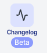
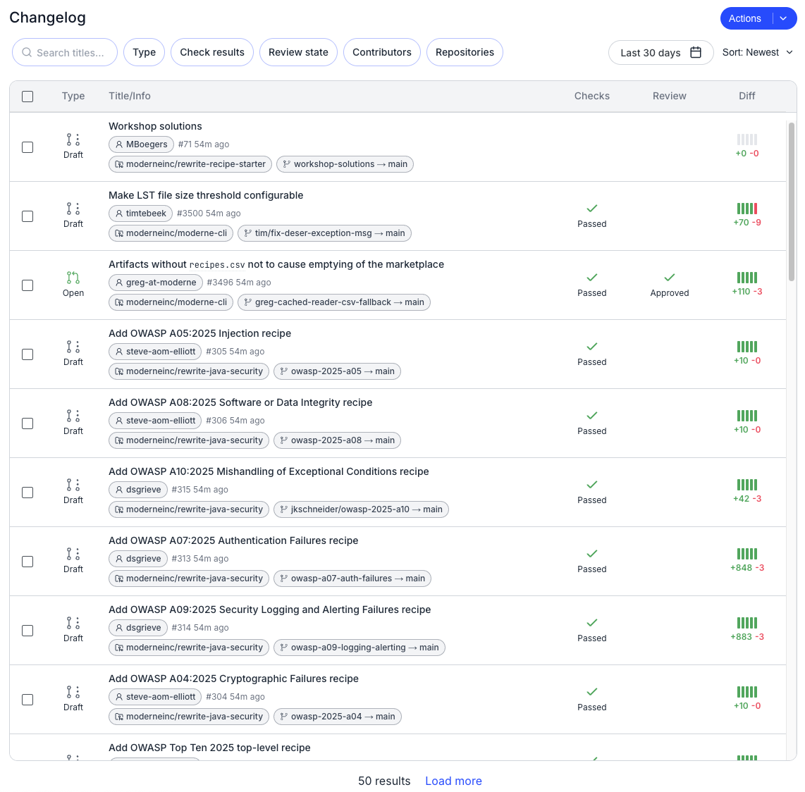
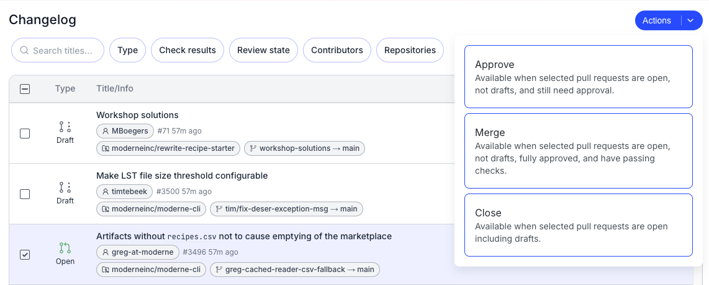

# Getting started with the Moderne Changelog

The Moderne Changelog is a unified view of commits and pull requests across all of the repositories in your organization. Regardless of how many source code management providers or instances your code is spread across, the Changelog brings all of that activity into a single, filterable table. It answers the question: "What changed recently across my organization, and what's the status of those changes?"

Let's walk through how it works.

## Navigating to the Changelog

To access the Changelog, click on the **Changelog** link in the left navigation bar. Note that the Changelog is scoped to your [current organization](./running-your-first-recipe#step-3-optional-select-what-repositories-to-run-the-recipe-against). 

<figure>
  
  <figcaption>_Changelog navigation link_</figcaption>
</figure>

## The Changelog table

The Changelog displays a table of recent commits and pull requests across all repositories in your selected organization. Each row represents a single commit or pull request:

<figure>
  
  <figcaption>_Example Changelog view_</figcaption>
</figure>

The Changelog contains the following columns:

* **Type**: An icon indicating whether the entry is a pull request (and its state) or a commit.
* **Title/Info**: The title of the pull request or commit message, along with the author, timestamp, and target branch.
* **Check results**: The CI build status (e.g., pending, success, failure).
* **Review state**: Whether the pull request needs approval, has been approved, or has changes requested.
* **Contributors**: The users who contributed to the pull request or commit.
* **Repositories**: Which repository the change belongs to.

## Filtering

You can narrow down the Changelog to find exactly what you're looking for. A text search bar at the top lets you search across titles. Below that, you can filter by:

* **Type**: Open, Draft, Closed, or Merged pull requests.
* **Check results**: Pending, Success, Failure, In progress, Not required, or Skipped.
* **Review state**: Needs approval, Approved, Changes requested, or Not required.
* **Contributors**: Filter by specific authors or reviewers.
* **Repositories**: Scope to one or more repositories.

You can also adjust the date range and sort order. Filters and sort state are persisted in the URL, so you can share and bookmark specific views.

## Bulk PR actions

When you have multiple pull requests that need the same action, you can select them using the checkboxes and then use the **Actions** dropdown to act on them in bulk. The available actions update based on the current state of the selected pull requests:

<figure>
  
  <figcaption>_Bulk PR actions_</figcaption>
</figure>

* **Approve**: Available when selected pull requests are open, not drafts, and still need approval.
* **Merge**: Available when selected pull requests are open, not drafts, fully approved, and have passing checks.
* **Close**: Available when selected pull requests are open, including drafts.

This lets you coordinate large-scale changes without navigating to each repository individually.
