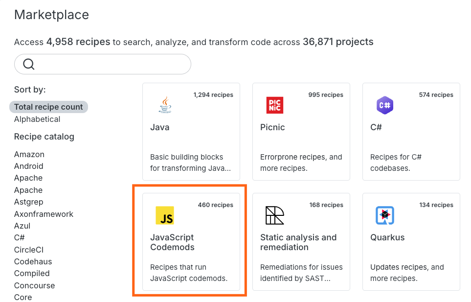
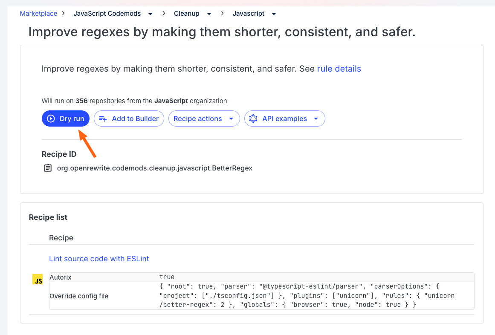

import ReactPlayer from 'react-player';

# JavaScript codemods scaled with Moderne

JavaScript codemods are scripts that you can use to rewrite or refactor code. With them, you can do some amazing things – such as migrating your project to the latest version of a library, standardizing styles, or even refactoring code to make it more readable.

Unfortunately, codemods are designed to run on only a single repository. If you're at a company that has hundreds or thousands of JavaScript repositories, it would be extremely tedious to try and run a single codemod against them all – let alone a group of them.

Fortunately, Moderne has recently added support for codemods. With Moderne, you can quickly run many codemods across all of your repositories in only a few minutes.

In this short getting started guide, we will walk through where you can find the Moderne codemods, and we will demonstrate a real-world situation where you might use them at scale.

<ReactPlayer className="reactPlayer" url='https://www.youtube.com/watch?v=lXVPwW30fFk' controls="true" />

## Where codemods are located

You can find all of the Moderne codemods in the [Moderne marketplace](https://app.moderne.io/marketplace) under the [JavaScript Codemods section](https://app.moderne.io/marketplace/org.openrewrite.codemods):

## Real-world example

Regular expressions are one of the more dangerous areas of code. It can be very difficult for even experienced developers to craft complex ones. If done incorrectly, you are also susceptible to [regular expression attacks](https://owasp.org/www-community/attacks/Regular_expression_Denial_of_Service_-_ReDoS).

To help combat this, the open source community has created a [better regex codemod](https://github.com/sindresorhus/eslint-plugin-unicorn/blob/main/docs/rules/better-regex.md) that you can run against your code to find and fix common regular expression mistakes and make them more readable.

Using this [codemod in Moderne](https://app.moderne.io/recipes/org.openrewrite.codemods.cleanup.javascript.BetterRegex), you can run this codemod against all of your repositories at once. You can do this once, fix all of the code that fails in all of your repositories, and then add this as an enforceable check that runs before any code is merged to ensure safety going forward. By doing it this way, you don't break the flow of any teams using this code.

<figure>
  
  <figcaption>_The codemod to fix regular expressions_</figcaption>
</figure>

<figure>
  
  <figcaption>_List of results from running the codemod against the popular JavaScript repositories_</figcaption>
</figure>

<figure>
  
  <figcaption>_Example regex changes the codemod makes_</figcaption>
</figure>