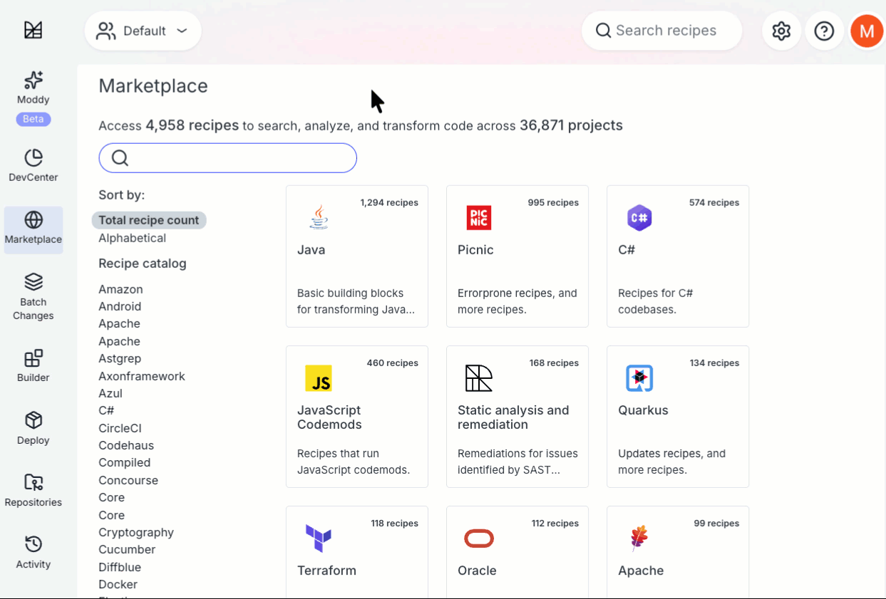
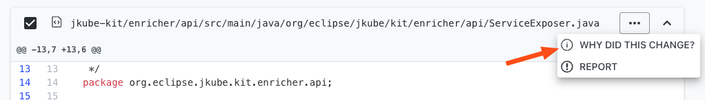

# Enhancing code quality through static analysis remediations

Every programming language has a vast number of conventions and rules that make up "ideal" code. While some of these conventions are stylistic, others can help prevent significant bugs like a `NullPointerException`. Unfortunately, even for the most experienced developers, it's extremely difficult to keep track of these rules and follow them diligently in code. And, even if they do, trying to ensure that other developers follow those same conventions can be like parents trying to tell their kids to clean up their rooms.

Over the years, a variety of static analysis tools have been created to try and help, but these tools do not actually _fix_ your code. Rather, they rely on developers to manually change every line that they warn about. If a new convention is standardized, this can easily result in thousands of lines that need to be changed across a vast number of repositories.

Fortunately, Moderne can help with this tricky problem. Thanks to a [comprehensive Lossless Semantic Tree](../../../administrator-documentation/moderne-platform/references/lossless-semantic-trees.md), Moderne can find _and_ fix static analysis and stylistic issues. Furthermore, for each change made, you can learn _why_ it was changed so that you and your team can write better code in the future. Instead of having to constantly remind your team to clean up the code, you can automate it!

To help you get a better understanding of how Moderne can help improve your code quality, this guide will:

* [Walk you through running a recipe that fixes common static analysis issues](#fixing-common-static-analysis-issues)
* [Show you how to learn what is wrong with the code](#learning-whats-wrong-with-the-code)

## Fixing common static analysis issues

Moderne's [common static analysis recipe](https://app.moderne.io/recipes/org.openrewrite.staticanalysis.CommonStaticAnalysis) looks for and fixes over 50 different types of issues in your code, all of which you can easily enable or disable to meet your needs.

To get to this recipe:

* Ensure that you are at the [recipe marketplace](https://app.moderne.io/marketplace).
* Type in `common static` into the search bar and select the first recipe. Then press `See details` to be taken to the [CommonStaticAnalysis recipe page](https://app.moderne.io/recipes/org.openrewrite.staticanalysis.CommonStaticAnalysis):

<figure>
  
  <figcaption></figcaption>
</figure>

### Running the recipe

The bottom half of the page lists all of the recipes that will be run as part of this analysis. You can click on any of the recipes to get more information about that specific recipe or to just run that one.

<figure>
  
  <figcaption></figcaption>
</figure>

When you're ready to run the recipe, press the `Dry Run` button at the top of your screen. You will then be redirected to a page that looks like this:

:::info
As the code in the SaaS is constantly changing, your results will more than likely be different.
:::

<figure>
  
  <figcaption></figcaption>
</figure>

By default, changes will be displayed on the right hand of your screen for the selected repository. You can click on any of the other repositories to look at their suggested changes and learn more about why the code is being changed. Some of these changes can be rather complex, such as changing anonymous inner classes that contain only one method into lambdas:

<figure>
  
  <figcaption></figcaption>
</figure>

### Learning what's wrong with the code

If you want to learn more about _why_ the code is changing, you can press the three dots (`...`) in the top right-hand corner of any file and select `Why did this change?`:

<figure>
  
  <figcaption></figcaption>
</figure>

This will display a list of all of the recipes that affected the selected file along with a sentence or two describing the rule in more detail:

<figure>
  
  <figcaption></figcaption>
</figure>

You can then click on the rule itself to be taken to a page where you can get more information about it or run just that recipe.
