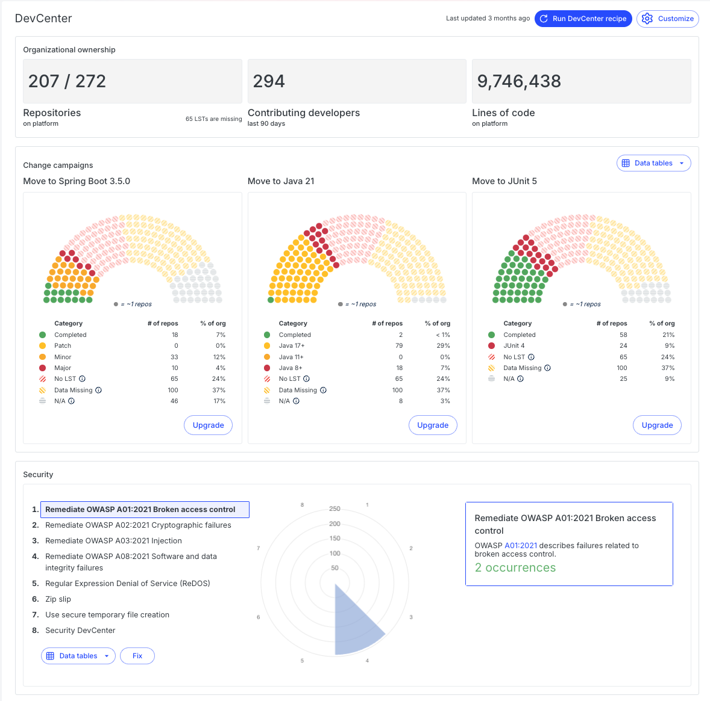
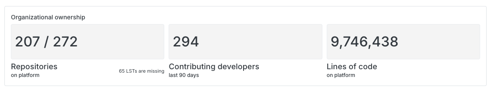
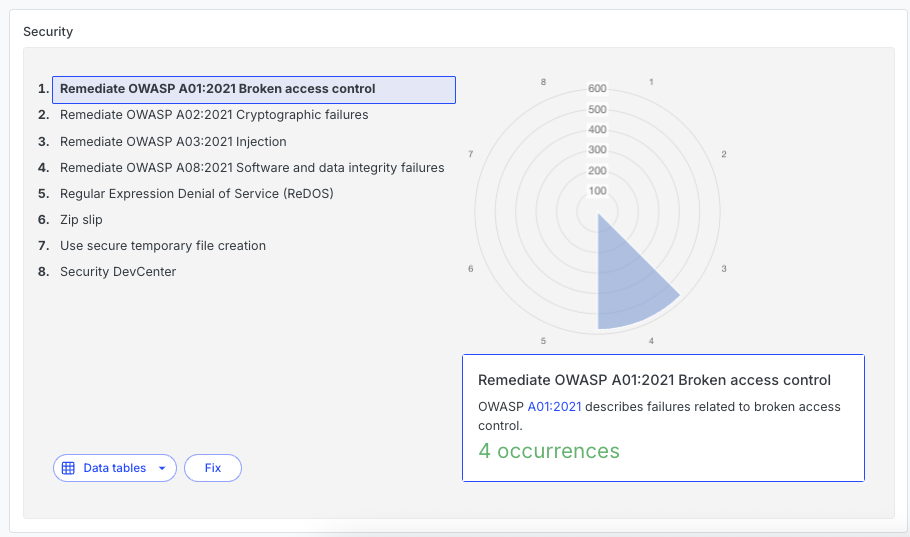

import ReactPlayer from 'react-player';

# Getting started with the Moderne DevCenter

The Moderne DevCenter is the mission-control dashboard of the Moderne Platform. It provides you with high-level details about the state of all of your repositories. Using it, you can track the progress of upgrades, migrations, and security vulnerabilities.

In this getting started guide, we will walk you through each component of the Moderne DevCenter and explain how you might use that knowledge.

<ReactPlayer className="reactPlayer" url='https://www.youtube.com/watch?v=KRXDMGt7DRE' controls="true" />

## Navigating to the DevCenter

DevCenters are created for specific organizations. Not all organizations will have a DevCenter. You can check if a specific organization has a DevCenter by selecting the organization you want to use and then clicking on the `DevCenter` link in the left navigation bar.

<figure>
  
  <figcaption>_DevCenter navigation link_</figcaption>
</figure>

If the organization has a DevCenter, will see a page like this:

<figure style={{maxWidth: '600px', margin: '0 auto'}}>
  
  <figcaption>_Example DevCenter_</figcaption>
</figure>

## Components of the DevCenter

### Organizational ownership

The organization ownership section gives you a high-level view of your organization. It tells you how many repositories the organization is composed of, how many developers have contributed any amount of code to those repositories in the last 90 days, and how many lines of code have been ingested into the Moderne Platform. It will also let you know if any LSTs are missing in your artifact repository.

<figure>
  
  <figcaption>_Example organizational ownership section_</figcaption>
</figure>

### Upgrades and migrations

The upgrades and migration section is useful for tracking how your organization is doing at keeping your code up-to-date with the latest versions. These cards are configured by the organizational administrator and specifically chosen to align with that organization's needs.

You can press the `Upgrade` button on each card to run a recipe that will attempt to get the repositories to the specified version. If the recipe has been recently run and the results are still valid, you will be taken to the latest results rather than needing to wait for the recipe to run again.

<figure>
  
  <figcaption>_Example upgrades and migration cards_</figcaption>
</figure>

### Security

The security section lets you quickly see what security issues your company has or hasn't resolved. It also allows you to quickly run security recipes against your repositories to either try and fix the issues or gather more data about them.

As with the other components, the security issues are configured by the organizational administrator.

You can press `fix` to run a particular security recipe. If one of these recipes has been run recently, you will be taken to that directly to save time.

<figure>
  
  <figcaption>_Example security card_</figcaption>
</figure>
