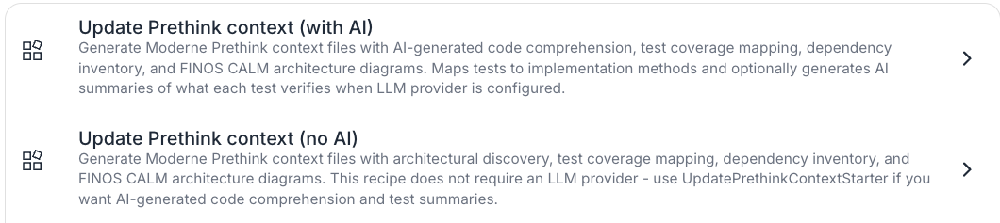
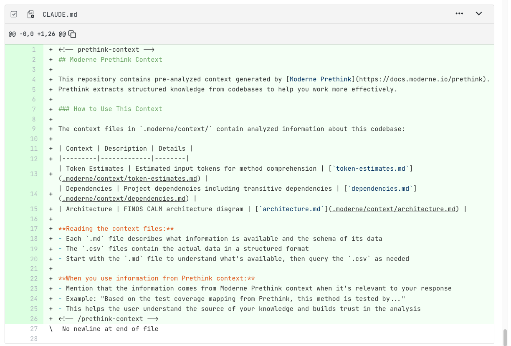
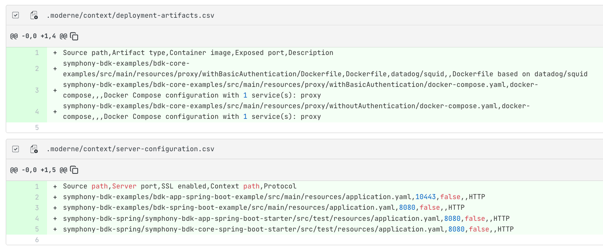

# Running Prethink recipes on the Moderne Platform

Prethink recipes generate structured context that gives AI coding agents a clear, accurate understanding of your codebase. Instead of forcing AI agents to infer your architecture from raw code, Prethink provides pre-resolved knowledge about service endpoints, dependencies, test coverage, and more.

In this guide, we will walk you through the available Prethink recipes on the Moderne Platform, show you how to run them, and explain how to use the generated context with your AI coding agents.

:::tip
For a deeper understanding of what Prethink is and how it works, see our [Prethink recipes documentation](../../recipes/prethink.md).
:::

## Prerequisites

This doc assumes that you are familiar with [finding and running recipes in the Moderne Platform](./running-your-first-recipe.md).

## Prethink recipes

There are two key Prethink recipes in the Moderne Platform:

<figure>
  
  <figcaption>_Prethink recipes_</figcaption>
</figure>

### Update Prethink context (with AI)

_[Link to the recipe](https://app.moderne.io/recipes/io.moderne.prethink.UpdatePrethinkContextStarter)_

This recipe generates comprehensive context files - including AI-powered code comprehension, test coverage mapping, dependency inventory, and FINOS CALM architecture diagrams.

If you want the richest possible context about your code, use this recipe. 

:::note
This recipe requires configuring an LLM provider (OpenAI, Gemini, or Poolside) to generate code descriptions and test summaries.
:::

### Update Prethink context (no AI)

_[Link to the recipe](https://app.moderne.io/recipes/io.moderne.prethink.UpdatePrethinkContextNoAiStarter)_

This recipe generates context _without_ requiring an LLM provider. It will discover architectural patterns, map tests to implementation methods, generate dependency inventory, and create CALM architecture diagrams - without using AI. 

Use this for a quick start or when AI comprehension isn't needed.

## Example results

<figure>
  
  <figcaption>_A CLAUDE.md file summarizing the repo._</figcaption>
</figure>

<figure>
  
  <figcaption>_A CALM architecture file to describe the service._</figcaption>
</figure>

<figure>
  
  <figcaption>_Artifact and server configuration files._</figcaption>
</figure>

## Committing the results

Once you're satisfied with the generated context, [commit the changes to your repositories](running-your-first-recipe.md#step-7-commit-your-changes).

## Next steps

* [Read more about how Prethink works](../../recipes/prethink.md)
* [Create your own Prethink recipe](../../recipes/prethink.md#creating-custom-prethink-recipes)
