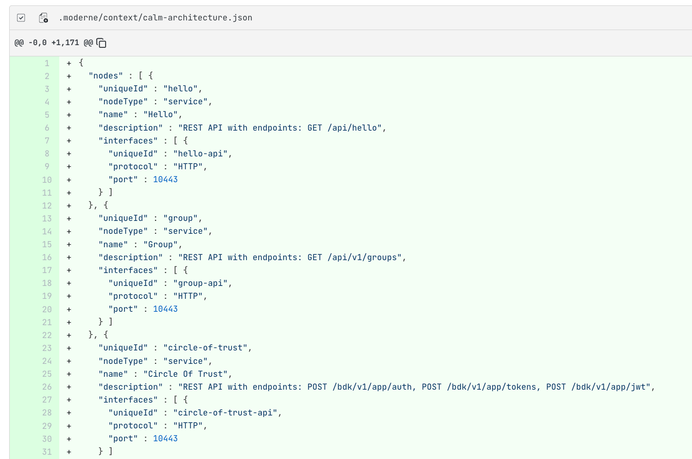
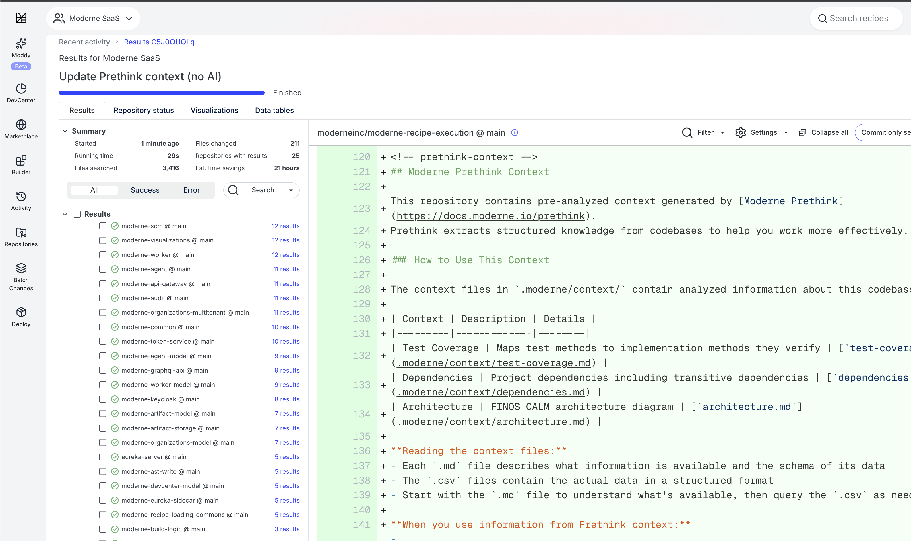

# Getting started with Moderne Prethink

Moderne Prethink is a structured knowledge layer that gives AI agents a clear, accurate understanding of your entire codebase. It gives AI agents a clear picture of your architecture, dependencies, vulnerabilities, and migration goals - so they don't have to piece it together themselves.

## Why Prethink matters

AI coding agents like Claude Code, Cursor, and GitHub Copilot are powerful, but they struggle with the expansiveness of enterprise codebases. Common problems include:

* **They can't see your entire codebase**: Token limits prevent comprehensive understanding
* **They eat up token budgets quickly**: Re-describing code structure on every interaction is expensive
* **They still need to be checked**: Without semantic context, agents infer and hallucinate

These aren't necessarily faults of the models themselves. They're data problems. When working with vast enterprise codebases, AI models don't have the semantic context needed to be comprehensive, accurate, and efficient.

## What Prethink provides

Moderne Prethink delivers pre-resolved, verified knowledge that AI agents can reason over directly:

* **Architectural patterns**: Service endpoints, database connections, external service calls, and messaging patterns
* **Resolved dependency graphs**: Complete dependency trees, including transitive dependencies
* **Known vulnerabilities**: Security issues identified across your repositories
* **Declared migration targets**: Your organization's upgrade and modernization goals
* **Deterministic recipes**: Structured transformations that can be applied reliably

With Prethink:

* Code structure is documented, not guessed
* Relationships between services are already mapped
* Your goals and constraints are part of the context
* AI reasons over facts instead of reconstructing them

This means AI agents work faster, cost less, and deliver more accurate results at scale.

## How Prethink works

Prethink is delivered as a set of OpenRewrite recipes that generate multi-repo, trusted context for AI agents. When you run Prethink recipes against your codebase, they produce structured outputs that capture context, including:

* **Code data tables**: Deep insights only discoverable using Moderne's Lossless Semantic Tree (LST) code model
* **Dependency inventory**: Complete picture of libraries including transitive dependencies
* **Knowledge graph** (optional): System-level map of how components, dependencies, and behaviors connect
* **CALM-formatted artifacts**: Architecture diagrams with nodes and relationships that can be visualized with [CALM](https://calm.finos.org/)-compatible tools

These outputs can be continuously updated as your codebase evolves by re-running Prethink recipes. This ensures your AI agents always have current, accurate context.

## Prethink recipe modules

Prethink is distributed as two complementary recipe modules:

### `org.openrewrite.recipe:rewrite-prethink`

The open-source foundation that provides the building blocks for generating Prethink context:

* **ExportContext**: Exports data tables as CSV files to your repository
* **UpdateAgentConfig**: Updates AI agent configuration files with context references
* **UpdatePrethinkContext**: Orchestrates context generation from pre-populated data tables
* **CALM architecture generation**: Produces [CALM](https://calm.finos.org/)-formatted architecture diagrams

This module provides the infrastructure but expects you to supply your own recipes for discovering CALM entities and producing the context you want to save. 

**Use this when you have custom frameworks or want full control over what context is generated.**

### `io.moderne.recipe:rewrite-prethink`

The batteries-included module that provides out-of-the-box discovery for common frameworks:

* **Service endpoint discovery**: Spring MVC, JAX-RS, Micronaut, Quarkus
* **Database connection discovery**: JPA, Spring Data, JDBC
* **External service call discovery**: RestTemplate, WebClient, Feign, Apache HttpClient
* **Messaging pattern discovery**: Kafka, RabbitMQ, JMS, Spring Cloud Stream
* **Security configuration discovery**: Spring Security, CORS, OAuth2
* **LLM integrations**: Code comprehension at the method and class level, test summary generation

**Use this module when you want ready-to-run recipes that work with standard Java frameworks without additional configuration.**

## Components of Prethink

### Context export

The context export component saves structured data tables as files in your repository. This allows any AI agent to access resolved knowledge about your codebase without needing to parse and understand the code itself.

Each exported context file is accompanied by a markdown file that describes what the data contains and how to interpret it. This helps AI agents understand the schema and meaning of the data without additional prompting.

<figure>
  
  <figcaption>_A markdown file describing the CALM architecture context_</figcaption>
</figure>

### Code comprehension

The optional code comprehension component uses Moderne's LST analysis combined with your bring-your-own LLM to build a knowledge graph. This graph captures how software components, dependencies, and behaviors relate at a system level.

### Architecture visualization

Prethink can export architecture information in CALM format, providing nodes and relationships that describe your system's structure. These can be visualized with CALM-compatible tools or consumed directly by AI agents for architectural reasoning.

<figure>
  
  <figcaption>_A generated CALM architecture diagram showing services and their relationships_</figcaption>
</figure>

## How agents discover Prethink context

When Prethink runs, it updates the agent configuration files in your repository (such as `CLAUDE.md`, `.cursorrules`, or `.github/copilot-instructions.md`) to point AI agents to the generated context. This enables progressive discovery where agents first learn about the available context and, then, they can read the relevant files as needed.

<figure>
  
  <figcaption>_An updated CLAUDE.md file pointing agents to Prethink context_</figcaption>
</figure>

The agent configuration includes a table of available context types with descriptions and file paths, along with instructions on how to use the context effectively. This means agents can immediately start reasoning over pre-resolved facts about your codebase.

## Additional documentation

To start using Prethink, check out the following docs:

* [Creating a Prethink recipe](../../../administrator-documentation/moderne-platform/how-to-guides/creating-a-prethink-recipe.md) for administrators who want to configure Prethink for their organization
* [Running Prethink with the CLI](../../moderne-cli/how-to-guides/cli-prethink.md) for developers who want to run Prethink locally
